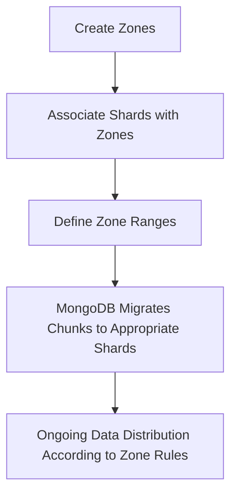

# MongoDB Zone Sharding

## Introduction

MongoDB Zone Sharding is an advanced sharding feature that gives you precise control over how data is distributed across your sharded cluster. While standard sharding automatically distributes data across shards, zone sharding allows you to define rules for where specific chunks of data should reside.

This feature is particularly useful when you want to:

- Isolate data by geographic region for compliance or latency reasons
- Utilize different hardware for different types of data
- Optimize query performance by placing frequently accessed data on more powerful hardware
- Implement tiered storage strategies based on data age or importance

In this tutorial, we'll explore how zone sharding works, how to set it up, and examine practical use cases where it can significantly improve your MongoDB deployment.

## Prerequisites

Before diving into zone sharding, you should:

- Understand basic MongoDB sharding concepts
- Have a working sharded cluster setup
- Have admin privileges on your MongoDB deployment

## Understanding Zone Sharding Concepts

Zone sharding introduces several key concepts:

### Zones

A zone is a named group of shards in your cluster. You can associate ranges of shard key values with specific zones, instructing MongoDB to keep documents with those shard key values on the shards within that zone.

### Zone Range

A zone range defines the span of shard key values that should be stored in a particular zone. When you define a zone range, you're telling MongoDB to keep all chunks with shard key values in that range within the specified zone.

### Shard-to-Zone Association

This refers to the mapping between shards and zones. A single shard can belong to multiple zones, and multiple shards can be assigned to a single zone.

## How Zone Sharding Works

Let's look at the zone sharding process at a high level:



MongoDB's balancer respects zone assignments when moving chunks between shards, ensuring that chunks are only migrated to shards within their assigned zone.

## Setting Up Zone Sharding

Let's walk through the process of implementing zone sharding on a MongoDB cluster.

### Step 1: Connect to mongos

Start by connecting to your `mongos` instance, the query router for your sharded cluster:

```javascript
mongosh "mongodb://mongos-host:27017"
```

### Step 2: Create Zones and Associate Shards

First, let's create zones and associate them with specific shards:

```javascript
// Switch to admin database
use admin

// Add shards to zones
sh.addShardToZone("shard0000", "us-east")
sh.addShardToZone("shard0001", "us-east")
sh.addShardToZone("shard0002", "us-west")
sh.addShardToZone("shard0003", "us-west")
sh.addShardToZone("shard0004", "eu-central")
sh.addShardToZone("shard0005", "eu-central")
```

### Step 3: Define Zone Ranges

Next, we'll define the shard key ranges that should be stored in each zone. For example, if we have a collection of customer data sharded by country:

```javascript
// Switch to the database with your sharded collection
use myRetailApp

// Define zone ranges for the customers collection based on country
sh.updateZoneKeyRange(
  "myRetailApp.customers",  // namespace (database.collection)
  { country: "US", state: "NY" },    // min key value (inclusive)
  { country: "US", state: "PA" },    // max key value (exclusive)
  "us-east"                 // zone name
)

sh.updateZoneKeyRange(
  "myRetailApp.customers",
  { country: "US", state: "PA" },
  { country: "US", state: { $maxKey: 1 } },
  "us-west"
)

sh.updateZoneKeyRange(
  "myRetailApp.customers",
  { country: "DE" },
  { country: "FR" },
  "eu-central"
)
```

### Step 4: Verify Zone Configuration

After setting up your zones, it's good practice to verify the configuration:

```javascript
// Check all zone ranges
use config
db.tags.find()

// Sample output:
// { "_id" : { "ns" : "myRetailApp.customers", "min" : { "country" : "US", "state" : "NY" } }, "ns" : "myRetailApp.customers", "min" : { "country" : "US", "state" : "NY" }, "max" : { "country" : "US", "state" : "PA" }, "tag" : "us-east" }
// { "_id" : { "ns" : "myRetailApp.customers", "min" : { "country" : "US", "state" : "PA" } }, "ns" : "myRetailApp.customers", "min" : { "country" : "US", "state" : "PA" }, "max" : { "country" : "US", "state" : { "$maxKey" : 1 } }, "tag" : "us-west" }
// { "_id" : { "ns" : "myRetailApp.customers", "min" : { "country" : "DE" } }, "ns" : "myRetailApp.customers", "min" : { "country" : "DE" }, "max" : { "country" : "FR" }, "tag" : "eu-central" }

// Check shard to zone associations
db.shards.find({}, {_id: 1, tags: 1})

// Sample output:
// { "_id" : "shard0000", "tags" : [ "us-east" ] }
// { "_id" : "shard0001", "tags" : [ "us-east" ] }
// { "_id" : "shard0002", "tags" : [ "us-west" ] }
// { "_id" : "shard0003", "tags" : [ "us-west" ] }
// { "_id" : "shard0004", "tags" : [ "eu-central" ] }
// { "_id" : "shard0005", "tags" : [ "eu-central" ] }
```

## Practical Examples of Zone Sharding

Let's explore some real-world applications of zone sharding.

### Example 1: Geographic Data Distribution for Compliance

Many industries have regulatory requirements to store data in specific geographic regions. Zone sharding can help achieve this:

```javascript
// Create zones for different geographical regions
sh.addShardToZone("shard0000", "europe")
sh.addShardToZone("shard0001", "europe")
sh.addShardToZone("shard0002", "north-america")
sh.addShardToZone("shard0003", "north-america")
sh.addShardToZone("shard0004", "asia-pacific")
sh.addShardToZone("shard0005", "asia-pacific")

// Configure zone ranges based on user region
sh.updateZoneKeyRange(
  "userapp.personal_data",
  { region: "EU" },
  { region: "EU\uffff" },
  "europe"
)

sh.updateZoneKeyRange(
  "userapp.personal_data",
  { region: "NA" },
  { region: "NA\uffff" },
  "north-america"
)

sh.updateZoneKeyRange(
  "userapp.personal_data",
  { region: "AP" },
  { region: "AP\uffff" },
  "asia-pacific"
)
```

In this example, personal data for European users stays on European shards, North American user data stays on North American shards, and so on.

### Example 2: Tiered Storage Based on Data Age

Organizations often want to keep recent, frequently-accessed data on faster storage while moving older data to slower, cheaper storage:

```javascript
// Create zones for different storage tiers
sh.addShardToZone("shard0000", "hot")  // Fast SSDs
sh.addShardToZone("shard0001", "hot")
sh.addShardToZone("shard0002", "warm") // Regular drives
sh.addShardToZone("shard0003", "warm")
sh.addShardToZone("shard0004", "cold") // Archive storage
sh.addShardToZone("shard0005", "cold")

// Assuming the collection is sharded on a timestamp field
const currentDate = new Date();
const threeMonthsAgo = new Date(currentDate.setMonth(currentDate.getMonth() - 3));
const oneYearAgo = new Date(currentDate.setFullYear(currentDate.getFullYear() - 1));

// Configure zone ranges based on document age
sh.updateZoneKeyRange(
  "logs.access_logs",
  { timestamp: threeMonthsAgo },
  { timestamp: { $maxKey: 1 } },
  "hot"
)

sh.updateZoneKeyRange(
  "logs.access_logs",
  { timestamp: oneYearAgo },
  { timestamp: threeMonthsAgo },
  "warm"
)

sh.updateZoneKeyRange(
  "logs.access_logs",
  { timestamp: { $minKey: 1 } },
  { timestamp: oneYearAgo },
  "cold"
)
```

This configuration ensures that recent logs are stored on the fastest storage, while older logs are automatically migrated to slower, more cost-effective storage tiers.

### Example 3: Query Optimization for E-Commerce

An e-commerce platform might want to optimize for faster access to active product data:

```javascript
// Create zones for different product categories
sh.addShardToZone("shard0000", "high-traffic")  // More powerful hardware 
sh.addShardToZone("shard0001", "high-traffic")
sh.addShardToZone("shard0002", "standard")
sh.addShardToZone("shard0003", "standard")

// Route high-volume product categories to high-performance shards
sh.updateZoneKeyRange(
  "ecommerce.products",
  { category: "electronics" },
  { category: "electronics\uffff" },
  "high-traffic"
)

sh.updateZoneKeyRange(
  "ecommerce.products",
  { category: "fashion" },
  { category: "fashion\uffff" },
  "high-traffic"
)

// Other product categories go to standard shards
sh.updateZoneKeyRange(
  "ecommerce.products",
  { category: { $minKey: 1 } },
  { category: "electronics" },
  "standard"
)

sh.updateZoneKeyRange(
  "ecommerce.products",
  { category: "fashion\uffff" },
  { category: { $maxKey: 1 } },
  "standard"
)
```

This ensures that high-traffic product categories are served from more powerful hardware, improving customer experience.

## Best Practices for Zone Sharding

When implementing zone sharding, keep these best practices in mind:

1. **Choose an appropriate shard key**: The shard key must align with your zone strategy. For geographic zoning, your key should include location data.

2. **Plan your zones carefully**: Once you've defined zones and started distributing data, major changes can be disruptive.

3. **Monitor data distribution**: Use the `sh.status()` command regularly to ensure data is distributed as expected.

4. **Consider zone capacity**: Make sure each zone has sufficient storage and processing power for its assigned data.

5. **Balance zone sizes**: Try to distribute workloads evenly across zones to prevent hotspots.

6. **Avoid too many small zones**: Each zone adds management overhead, so use them judiciously.

## Common Issues and Troubleshooting

### Chunks Not Moving to the Right Zone

If chunks aren't migrating to their assigned zones:

```javascript
// Check if the balancer is running
sh.getBalancerState()

// If not running, start it
sh.startBalancer()

// Check for any stuck migrations
use config
db.migrations.find()

// Check current chunk distribution
sh.status()
```

### Performance Issues After Zone Implementation

If you notice performance degradation after implementing zones:

1. Check if any zones are overloaded
2. Review your shard key design
3. Monitor chunk distribution and migration frequency
4. Ensure hardware allocation matches workload requirements in each zone

## Summary

Zone sharding is a powerful MongoDB feature that gives you fine-grained control over data distribution in a sharded cluster. By strategically defining zones and assigning data ranges to them, you can:

- Implement data locality for geographical compliance
- Optimize performance by placing hot data on faster hardware
- Create tiered storage systems based on data importance or access patterns
- Isolate workloads for better resource utilization

While zone sharding requires careful planning, it provides tremendous flexibility in managing large-scale MongoDB deployments and can significantly improve application performance and operational efficiency.

## Additional Resources

- [MongoDB Official Documentation on Zones](https://www.mongodb.com/docs/manual/core/zone-sharding/)
- [Sharded Cluster Administration Documentation](https://www.mongodb.com/docs/manual/administration/sharded-clusters/)
- [MongoDB University courses on Sharding](https://learn.mongodb.com/)

## Exercises

1. Set up a test sharded cluster with three shards and implement zones based on a date field, with one zone for recent data and another for historical data.

2. Design a zone sharding strategy for a global social media application that needs to comply with different data privacy regulations in different regions.

3. Create a zone sharding plan for an IoT application that collects sensor data from different types of devices, with some generating more critical data than others.

4. Implement a migration strategy to move from a non-zoned sharded cluster to one with geographic zones with minimal downtime.