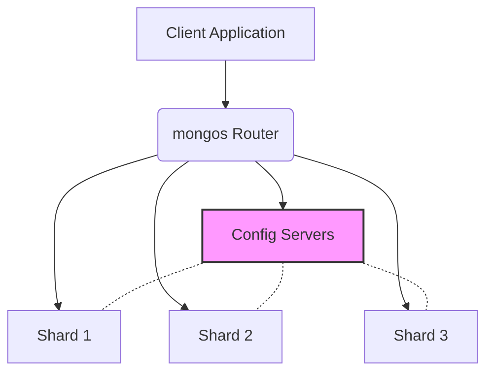

# MongoDB Config Servers

In a MongoDB sharded cluster, config servers play a critical role by storing metadata and configuration settings. This guide will explain what config servers are, why they're essential, and how to work with them effectively.

## Introduction to Config Servers

Config servers are specialized MongoDB instances that store the metadata for a sharded cluster. This metadata includes:

- Mapping of sharded data to specific shards
- State and configuration information for all servers in the cluster
- Authentication configuration when using authentication
- Cluster-wide settings

Think of config servers as the "brain" of your sharded MongoDB deployment. They don't store the actual data but maintain critical information about where data lives and how the cluster is organized.



## Evolution of Config Server Deployments

MongoDB's config server deployment model has evolved over time:

### Pre-MongoDB 3.4: SCCC Configuration

In versions before 3.4, config servers ran as three separate MongoDB instances in a deployment known as SCCC (Sync Cluster Config Servers):

- Required exactly three config servers
- Used two-phase commits to ensure consistency
- Limited redundancy and failover capabilities

### MongoDB 3.4+: CSRS Configuration

Starting with MongoDB 3.4, config servers must be deployed as a replica set, known as CSRS (Config Server Replica Set):

- Can have any odd number of members (typically 3)
- Provides high availability and automatic failover
- Uses the same replication mechanisms as regular MongoDB replica sets
- Allows for maintenance operations without downtime

## Setting Up Config Servers

Let's walk through how to set up a config server replica set:

### Step 1: Create directories for each config server

```bash
mkdir -p /data/configdb1 /data/configdb2 /data/configdb3
```

### Step 2: Start the config servers

Start each config server with the `--configsvr` parameter:

```bash
mongod --configsvr --replSet configRS --port 27019 --dbpath /data/configdb1

mongod --configsvr --replSet configRS --port 27020 --dbpath /data/configdb2

mongod --configsvr --replSet configRS --port 27021 --dbpath /data/configdb3
```

### Step 3: Initiate the replica set

Connect to one of the config servers:

```bash
mongosh --port 27019
```

And initiate the replica set:

```javascript
rs.initiate({
  _id: "configRS",
  configsvr: true,
  members: [
    { _id: 0, host: "localhost:27019" },
    { _id: 1, host: "localhost:27020" },
    { _id: 2, host: "localhost:27021" }
  ]
})
```

Expected output:
```
{
  "ok": 1,
  "operationTime": Timestamp(1618304862, 1),
  "$clusterTime": {
    "clusterTime": Timestamp(1618304862, 1),
    "signature": {
      "hash": BinData(0, "AAAAAAAAAAAAAAAAAAAAAAAAAAA="),
      "keyId": NumberLong(0)
    }
  }
}
```

## Config Server Data and Collections

The config servers store their metadata in a database called `config`. Some key collections in this database include:

### `config.databases`

Contains information about each database in the cluster:

```javascript
db.getSiblingDB("config").databases.find().pretty()
```

Example output:
```json
{
  "_id": "example",
  "primary": "shard01",
  "partitioned": true,
  "version": {
    "uuid": ObjectId("6046e4c5dd71c083c8ff0977"),
    "timestamp": Timestamp(1615291588, 1),
    "lastMod": 1
  }
}
```

### `config.collections`

Contains information about sharded collections:

```javascript
db.getSiblingDB("config").collections.find().pretty()
```

Example output:
```json
{
  "_id": "example.products",
  "uuid": UUID("d3e20781-32c7-4e45-ba80-87faded6156b"),
  "key": { "product_id": 1 },
  "unique": false,
  "lastmodEpoch": ObjectId("6046e4c5dd71c083c8ff0977"),
  "lastmod": ISODate("2021-03-09T13:46:28.265Z"),
  "distributional": false
}
```

### `config.chunks`

Contains information about the data chunks and their distribution:

```javascript
db.getSiblingDB("config").chunks.find().limit(1).pretty()
```

Example output:
```json
{
  "_id": ObjectId("6046e4c5dd71c083c8ff0978"),
  "ns": "example.products",
  "min": { "product_id": MinKey },
  "max": { "product_id": 50 },
  "shard": "shard01",
  "history": [
    {
      "validTime": Timestamp(1615291588, 2),
      "shard": "shard01"
    }
  ]
}
```

## Configuration Server Best Practices

When working with config servers, follow these best practices to ensure reliability:

### Hardware Recommendations

Config servers have specific hardware requirements:

- Dedicated hosts for production environments
- Fast, reliable storage (preferably SSDs)
- At least 8GB RAM for most deployments
- Stable network connectivity between all nodes

### Backup Strategy

Always back up your config server data:

```bash
mongodump --host configRS/localhost:27019 --db config --out /backup/configdb_$(date +"%Y%m%d")
```

### Security Considerations

Secure your config servers as they contain critical cluster metadata:

```bash
mongod --configsvr --replSet configRS --port 27019 --dbpath /data/configdb1 \
  --keyFile /path/to/keyfile \
  --auth \
  --bind_ip localhost,192.168.1.100
```

## Maintaining Config Servers

### Checking Config Server Status

You can check the status of your config server replica set:

```javascript
rs.status()
```

Expected output:
```json
{
  "set": "configRS",
  "date": ISODate("2023-10-26T15:30:45.123Z"),
  "myState": 1,
  "term": 5,
  "configsvr": true,
  "members": [
    {
      "_id": 0,
      "name": "localhost:27019",
      "health": 1,
      "state": 1,
      "stateStr": "PRIMARY",
      "uptime": 13245,
      "optime": {
        "ts": Timestamp(1698337845, 1),
        "t": 5
      },
      "optimeDate": ISODate("2023-10-26T15:30:45.000Z"),
      "lastHeartbeat": ISODate("2023-10-26T15:30:44.123Z"),
      "lastHeartbeatRecv": ISODate("2023-10-26T15:30:43.789Z"),
      "pingMs": 0,
      "electionTime": Timestamp(1698324600, 1),
      "electionDate": ISODate("2023-10-26T11:50:00.000Z")
    },
    // ... other members
  ]
}
```

### Upgrading Config Server Version

To upgrade a config server replica set:

1. Upgrade the secondary members first:

```bash
# Stop the secondary config server
mongod --shutdown --dbpath /data/configdb2

# Start with new version
/new/path/to/mongod --configsvr --replSet configRS --port 27020 --dbpath /data/configdb2
```

2. Step down the primary and upgrade it:

```javascript
// Connect to primary and step down
rs.stepDown()
```

3. Then upgrade the former primary following the same steps as the secondaries.

## Real-World Example: Setting up a Sharded Cluster with Config Servers

Let's walk through a complete example of setting up a small sharded cluster with config servers:

### 1. Start Config Servers

```bash
# Start three config server instances
mongod --configsvr --replSet configRS --port 27019 --dbpath /data/configdb1 --logpath /data/configdb1/mongod.log --fork
mongod --configsvr --replSet configRS --port 27020 --dbpath /data/configdb2 --logpath /data/configdb2/mongod.log --fork
mongod --configsvr --replSet configRS --port 27021 --dbpath /data/configdb3 --logpath /data/configdb3/mongod.log --fork
```

### 2. Initiate the Config Server Replica Set

```javascript
// Connect to one of the config servers
mongosh --port 27019

// Initiate the replica set
rs.initiate({
  _id: "configRS",
  configsvr: true,
  members: [
    { _id: 0, host: "localhost:27019" },
    { _id: 1, host: "localhost:27020" },
    { _id: 2, host: "localhost:27021" }
  ]
})
```

### 3. Set up Shard Replica Sets

```bash
# Start shard 1 servers
mongod --shardsvr --replSet shard1RS --port 27001 --dbpath /data/shard1a --logpath /data/shard1a/mongod.log --fork
mongod --shardsvr --replSet shard1RS --port 27002 --dbpath /data/shard1b --logpath /data/shard1b/mongod.log --fork
mongod --shardsvr --replSet shard1RS --port 27003 --dbpath /data/shard1c --logpath /data/shard1c/mongod.log --fork

# Start shard 2 servers
mongod --shardsvr --replSet shard2RS --port 27004 --dbpath /data/shard2a --logpath /data/shard2a/mongod.log --fork
mongod --shardsvr --replSet shard2RS --port 27005 --dbpath /data/shard2b --logpath /data/shard2b/mongod.log --fork
mongod --shardsvr --replSet shard2RS --port 27006 --dbpath /data/shard2c --logpath /data/shard2c/mongod.log --fork
```

### 4. Initialize Shard Replica Sets

```javascript
// For shard 1
mongosh --port 27001
rs.initiate({
  _id: "shard1RS",
  members: [
    { _id: 0, host: "localhost:27001" },
    { _id: 1, host: "localhost:27002" },
    { _id: 2, host: "localhost:27003" }
  ]
})

// For shard 2
mongosh --port 27004
rs.initiate({
  _id: "shard2RS",
  members: [
    { _id: 0, host: "localhost:27004" },
    { _id: 1, host: "localhost:27005" },
    { _id: 2, host: "localhost:27006" }
  ]
})
```

### 5. Start the mongos Router

Notice how we specify the config server replica set:

```bash
mongos --configdb configRS/localhost:27019,localhost:27020,localhost:27021 --port 27017 --logpath /data/mongos.log --fork
```

### 6. Add Shards to the Cluster

```javascript
// Connect to mongos
mongosh --port 27017

// Add the shards
sh.addShard("shard1RS/localhost:27001,localhost:27002,localhost:27003")
sh.addShard("shard2RS/localhost:27004,localhost:27005,localhost:27006")
```

### 7. Enable Sharding for a Database and Collection

```javascript
// Enable sharding for the 'store' database
sh.enableSharding("store")

// Create an index on the field you want to shard by
db.products.createIndex({ product_id: 1 })

// Shard the collection
sh.shardCollection("store.products", { product_id: 1 })
```

## Monitoring Config Servers

### Check Cluster Status

```javascript
// Connect to mongos
mongosh --port 27017

// Get cluster status
sh.status()
```

Expected output:
```
--- Sharding Status --- 
  sharding version: {
    "_id" : 1,
    "minCompatibleVersion" : 5,
    "currentVersion" : 6,
    "clusterId" : ObjectId("6046e4c5dd71c083c8ff0976")
  }
  shards:
    {  "_id" : "shard1RS",  "host" : "shard1RS/localhost:27001,localhost:27002,localhost:27003",  "state" : 1 }
    {  "_id" : "shard2RS",  "host" : "shard2RS/localhost:27004,localhost:27005,localhost:27006",  "state" : 1 }
  active mongoses:
    "5.0.0" : 1
  autosplit:
    Currently enabled: yes
  balancer:
    Currently enabled: yes
    Currently running: no
  databases:
    {  "_id" : "store",  "primary" : "shard1RS",  "partitioned" : true,  "version" : {  "uuid" : UUID("2114cbd3-eeb9-4268-95b7-c99865a5b914"), "lastMod" : 1 } }
      store.products
        shard key: { "product_id" : 1 }
        chunks:
          shard1RS     1
          shard2RS     1
        too many chunks to print, use verbose if you want to force print
```

### View Config Database Contents

```javascript
// Connect to mongos
mongosh --port 27017

// Switch to config database
use config

// List collections in the config database
show collections

// Examine the shards collection
db.shards.find().pretty()

// Examine the databases collection
db.databases.find().pretty()

// Examine the chunks collection
db.chunks.find().limit(5).pretty()
```

## Troubleshooting Config Servers

### Config Server Not Available

If a config server is down, you may see errors like:

```
MongoServerError: Config server configRS/localhost:27019,localhost:27020,localhost:27021 is not available
```

Resolution steps:
1. Check if config servers are running:
   ```bash
   ps aux | grep configsvr
   ```

2. Check network connectivity:
   ```bash
   ping localhost
   ```

3. Check replica set status by connecting to a functioning member:
   ```javascript
   mongosh --port 27020
   rs.status()
   ```

### Config Data Inconsistency

If you suspect config data inconsistency:

```javascript
// Connect to mongos
mongosh --port 27017

// Force refresh of cluster metadata
db.adminCommand({flushRouterConfig: 1})
```

## Summary

Config servers are a vital component of MongoDB's sharding architecture:

- They store metadata about the sharded cluster's state
- Modern deployments use a replica set (CSRS) for high availability
- They contain critical information about chunk distribution
- Proper maintenance and backups are essential

In a MongoDB sharded cluster, config servers work together with the mongos routers and shard servers to provide a distributed database solution that can scale horizontally while maintaining high availability.

## Additional Resources

- [MongoDB Official Documentation on Config Servers](https://www.mongodb.com/docs/manual/core/sharded-cluster-config-servers/)
- [MongoDB University: M103 - Basic Cluster Administration](https://learn.mongodb.com/)
- [Backup and Restore Sharded Clusters](https://www.mongodb.com/docs/manual/tutorial/backup-sharded-cluster-with-filesystem-snapshots/)

## Practice Exercises

1. Set up a config server replica set with three nodes on your local machine.
2. Write a shell script to back up the config database daily.
3. Simulate a config server failure and practice the recovery process.
4. Write a monitoring script that checks the health of your config server replica set.
5. Examine the contents of the config database and document what collections exist and their purpose.