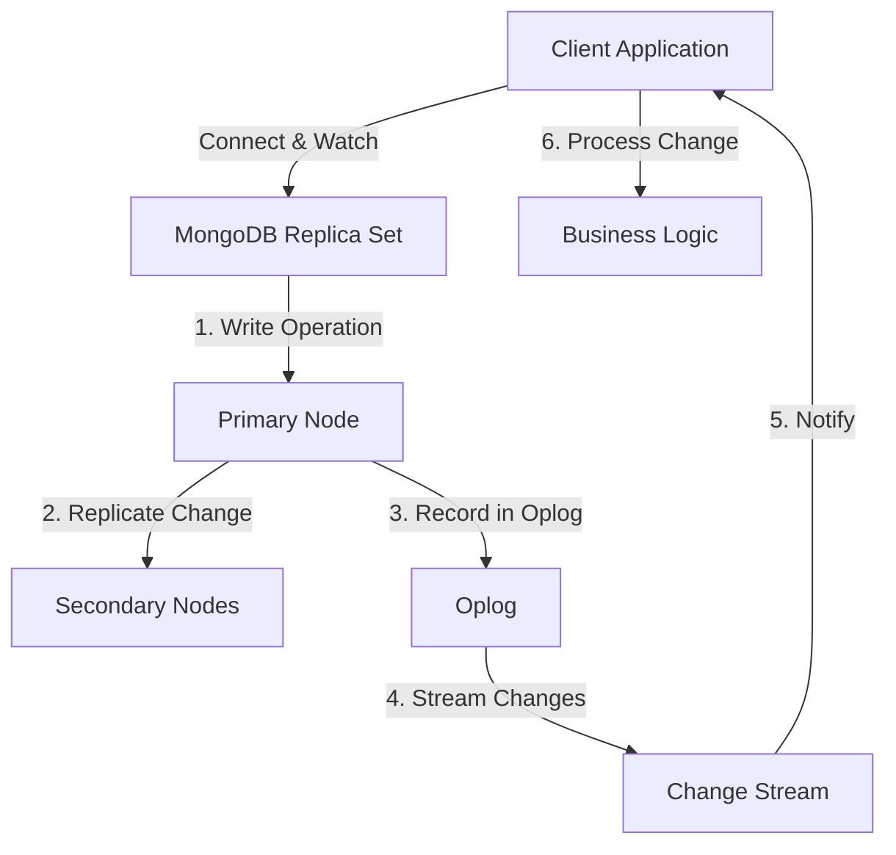

# MongoDB Change Streams Introduction

## What are Change Streams?

MongoDB Change Streams provide a way to watch for changes in your database in real-time. Introduced in MongoDB 3.6, this feature allows applications to subscribe to all data changes on a collection, database, or deployment, and immediately react to those changes.

Change Streams utilize MongoDB's replication capabilities to track modifications to data. When data changes in a MongoDB replica set or sharded cluster, these changes are recorded in the oplog (operations log), which Change Streams can access and stream to your application.

## Why Use Change Streams?

Change Streams solve several common challenges in modern application architecture:

- **Real-time updates**: Keep your application synchronized with database changes without polling
- **Event-driven architecture**: Build reactive systems that respond to data changes automatically
- **Data synchronization**: Keep multiple systems in sync by propagating changes
- **Audit trails**: Track all modifications to sensitive data
- **Cache invalidation**: Know exactly when to update your application caches

## Prerequisites for Using Change Streams

Before you can use Change Streams, your MongoDB deployment must meet these requirements:

1. MongoDB version 3.6 or later
2. A replica set or sharded cluster configuration (Change Streams are not available on standalone instances)
3. Replication enabled with majority read concern

## Basic Change Stream Syntax

Here's the basic pattern for creating and using a Change Stream:

```javascript
// Connect to MongoDB
const { MongoClient } = require('mongodb');
const client = new MongoClient('mongodb://localhost:27017');
await client.connect();

// Get reference to a collection
const collection = client.db('myDatabase').collection('myCollection');

// Create a change stream
const changeStream = collection.watch();

// Set up a listener for change events
changeStream.on('change', (change) => {
  console.log('Change detected:', change);
  
  // Process the change event here
});

// Keep the connection open to continue receiving events
// When you're done, close the change stream
// changeStream.close();
```

## Anatomy of a Change Event

When a change occurs, MongoDB delivers a change event document that contains information about the modification. Here's an example of an insert operation change event:

```javascript
{
  _id: { /* Change stream ID */ },
  operationType: 'insert',
  fullDocument: {
    _id: ObjectId('60a2da3fc6c8b1a161c9f014'),
    name: 'John Doe',
    email: 'john@example.com',
    createdAt: ISODate('2021-05-17T15:32:31.145Z')
  },
  ns: {
    db: 'myDatabase',
    coll: 'myCollection'
  },
  documentKey: {
    _id: ObjectId('60a2da3fc6c8b1a161c9f014')
  }
}
```

### Common Fields in Change Events

- **_id**: A unique identifier for the change event
- **operationType**: The type of operation (insert, update, replace, delete, etc.)
- **fullDocument**: The complete document (for insert operations or with certain options)
- **ns**: Namespace information (database and collection names)
- **documentKey**: The document identifier (usually the _id)
- **updateDescription**: For update operations, contains the modified fields and their new values

## Types of Operations Tracked

Change Streams can notify you about these types of operations:

- `insert`: When a new document is added
- `update`: When an existing document is modified
- `replace`: When a document is completely replaced
- `delete`: When a document is removed
- `drop`: When a collection is dropped
- `rename`: When a collection is renamed
- `dropDatabase`: When a database is dropped
- `invalidate`: When the change stream becomes invalid

## Filtering Change Events

You can focus on specific types of changes using pipeline stages:

```javascript
// Only capture inserts and updates
const pipeline = [
  { $match: { 
    operationType: { $in: ['insert', 'update'] } 
  }}
];

const changeStream = collection.watch(pipeline);
```

You can also filter based on the content of the documents:

```javascript
// Only capture changes to documents with status="active"
const pipeline = [
  { $match: { 
    $or: [
      { 'fullDocument.status': 'active' },
      { 'updateDescription.updatedFields.status': 'active' }
    ]
  }}
];

const changeStream = collection.watch(pipeline);
```

## Real-world Example: Chat Application

Let's look at how Change Streams could power a real-time chat application:

```javascript
const { MongoClient } = require('mongodb');

async function startChatListener() {
  try {
    // Connect to MongoDB
    const client = new MongoClient('mongodb://localhost:27017');
    await client.connect();
    console.log('Connected to MongoDB');
    
    const chatCollection = client.db('chatApp').collection('messages');
    
    // Create a change stream to watch for new messages
    const changeStream = chatCollection.watch([
      { $match: { operationType: 'insert' } } // Only watch for new messages
    ]);
    
    console.log('Chat listener started. Waiting for new messages...');
    
    // Set up change stream event handler
    changeStream.on('change', (change) => {
      const message = change.fullDocument;
      
      console.log(`New message in ${message.roomId}:`);
      console.log(`${message.sender}: ${message.text}`);
      console.log(`Sent at: ${message.timestamp}`);
      
      // Here you would:
      // 1. Notify connected clients about the new message
      // 2. Update UI for users in the chat room
      // 3. Send push notifications if needed
    });
    
    // Error handling
    changeStream.on('error', (error) => {
      console.error('Change stream error:', error);
    });
    
    // Return the change stream so it can be closed later if needed
    return changeStream;
    
  } catch (error) {
    console.error('Failed to start chat listener:', error);
  }
}

// In a real app, you would call this function when your server starts
startChatListener();
```

## Resume Tokens: Handling Disconnections

Change Streams provide a resume token with each event, allowing your application to resume watching from where it left off if the connection is interrupted:

```javascript
let resumeToken;

const changeStream = collection.watch();
changeStream.on('change', (change) => {
  // Store the latest resume token
  resumeToken = change._id;
  
  // Process the change...
  console.log(change);
});

// If the connection is lost and you need to reconnect:
function reconnect() {
  if (resumeToken) {
    // Resume from where we left off
    const newChangeStream = collection.watch([], {
      resumeAfter: resumeToken
    });
    
    // Set up handlers again...
    newChangeStream.on('change', (change) => {
      // ...
    });
  }
}
```

## Change Streams Scope

You can create Change Streams at different levels:

1. **Collection level**: Watch changes to a specific collection
   ```javascript
   const changeStream = collection.watch();
   ```

2. **Database level**: Watch changes to all collections in a database
   ```javascript
   const changeStream = db.watch();
   ```

3. **Deployment level**: Watch changes to all collections in all databases
   ```javascript
   const changeStream = client.watch();
   ```

## Change Stream Options

When creating a Change Stream, you can configure it with several options:

```javascript
const options = {
  fullDocument: 'updateLookup', // Include the full updated document in update events
  maxAwaitTimeMS: 30000, // Maximum time the server waits for new changes
  batchSize: 10, // Number of documents to return per batch
  startAfter: resumeToken, // Resume token to start after
  resumeAfter: resumeToken // Alternative resume option
};

const changeStream = collection.watch(pipeline, options);
```

The `fullDocument` option is particularly useful when handling updates, as it allows you to see the complete updated document rather than just the changed fields.

## Flow Diagram of Change Streams

Here's a visual representation of how Change Streams work:



## Common Use Cases

### 1. Notifications System

```javascript
// Watch for new notifications
const notificationStream = notificationsCollection.watch([
  { $match: { operationType: 'insert' } }
]);

notificationStream.on('change', (change) => {
  const notification = change.fullDocument;
  
  // Send to the appropriate user via websocket
  if (connectedUsers[notification.userId]) {
    connectedUsers[notification.userId].emit('notification', notification);
  }
});
```

### 2. Analytics Tracking

```javascript
// Watch for user activity
const activityStream = userActivityCollection.watch();

activityStream.on('change', (change) => {
  if (change.operationType === 'insert') {
    // New activity - update analytics in real-time
    updateUserAnalytics(change.fullDocument);
  }
});
```

### 3. Cache Invalidation

```javascript
// Watch for product updates
const productStream = productsCollection.watch();

productStream.on('change', (change) => {
  if (['insert', 'update', 'replace', 'delete'].includes(change.operationType)) {
    // Clear cache for this product
    cache.invalidate(`product:${change.documentKey._id}`);
  }
});
```

## Best Practices

1. **Error Handling**: Always implement proper error handling for your Change Streams
2. **Resume Capability**: Store resume tokens to handle disconnections gracefully
3. **Resource Management**: Close Change Streams when they're no longer needed
4. **Monitoring**: Set up monitoring for long-running Change Streams
5. **Pipeline Optimization**: Keep your aggregation pipeline stages simple and focused
6. **Connection Management**: Use a connection pool for multiple Change Streams

## Limitations

- Change Streams require a replica set or sharded cluster
- Some operations might not trigger change events (e.g., internal system operations)
- Change events for multi-document transactions are only available in MongoDB 4.0+
- Change Streams have a limited retention period based on your oplog size

## Summary

MongoDB Change Streams provide a powerful mechanism for building reactive, event-driven applications that respond to database changes in real-time. They eliminate the need for polling and enable sophisticated scenarios like real-time notifications, data synchronization, and cache invalidation.

Key takeaways:
- Change Streams allow applications to watch for database changes in real-time
- They work by leveraging MongoDB's replication functionality
- You can filter changes to focus on specific operations or document contents
- Resume tokens enable continuity across disconnections
- Change Streams can be applied at collection, database, or deployment level

## Additional Resources

- Practice creating a simple notification system using Change Streams
- Build a real-time dashboard that updates based on database changes
- Implement a caching layer that automatically invalidates entries when the source data changes
- Explore using Change Streams with the MongoDB Atlas service
- Learn about combining Change Streams with serverless functions for event processing

## Exercise

Create a simple application that:
1. Connects to a MongoDB replica set
2. Sets up a Change Stream on a collection
3. Inserts, updates, and deletes documents to see the different change events
4. Processes and logs the specific fields in each type of change event
5. Implements proper error handling and resume functionality

This exercise will help you understand the practical aspects of working with Change Streams and prepare you for implementing them in your own applications.