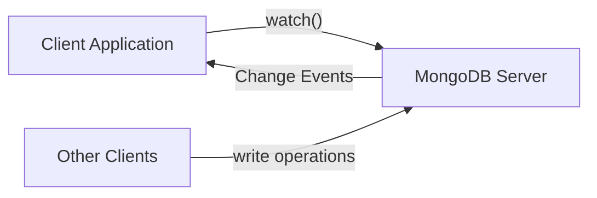

# MongoDB Watch Method

MongoDB's watch method is a powerful feature that enables real-time monitoring of changes to your data. This capability, built on MongoDB's change streams functionality, allows your applications to react immediately to changes in your database without constant polling.

## Introduction to the Watch Method

The `watch()` method in MongoDB creates a change stream that notifies your application about specific operations that occur in your collections, databases, or even across your entire deployment. It's like having a dedicated observer that informs you whenever data changes occur.

Change streams were introduced in MongoDB 3.6 and have become an essential tool for building reactive applications that need to respond to data changes in real-time.

## How the Watch Method Works

At its core, the `watch()` method leverages MongoDB's replication mechanism. It reads from the operation log (oplog) of a replica set or sharded cluster to track and report changes.



When a client calls the `watch()` method, MongoDB establishes a connection that will stream change events back to the client as they occur. This connection remains open until explicitly closed or an error occurs.

## Basic Syntax

You can use the `watch()` method at three different levels:

1. Collection level
2. Database level
3. Deployment level (client level)

### Collection-Level Watch

```javascript
const changeStream = collection.watch([pipeline], options);
```

### Database-Level Watch

```javascript
const changeStream = db.watch([pipeline], options);
```

### Deployment-Level Watch

```javascript
const changeStream = client.watch([pipeline], options);
```

## Parameters

- **pipeline** (optional): An array of aggregation pipeline stages to filter or transform the change events.
- **options** (optional): Configuration options for the change stream.

## Basic Example: Watching a Collection

Let's start with a simple example that watches for changes on a collection:

```javascript
const { MongoClient } = require('mongodb');

async function watchCollection() {
  const client = new MongoClient('mongodb://localhost:27017');
  
  try {
    await client.connect();
    const db = client.db('myDatabase');
    const collection = db.collection('users');
    
    // Create a change stream
    const changeStream = collection.watch();
    
    // Set up a listener for change events
    changeStream.on('change', (change) => {
      console.log('Change detected:', change);
    });
    
    console.log('Watching for changes...');
    
    // Keep the script running
    // In a real application, you would manage this differently
    // await new Promise(() => {});
    
  } catch (error) {
    console.error('Error:', error);
  }
}

watchCollection();
```

Then in another MongoDB shell session, you can make changes to trigger events:

```javascript
// Insert a document
db.users.insertOne({ name: "John", email: "john@example.com" });

// Update a document
db.users.updateOne({ name: "John" }, { $set: { email: "john.doe@example.com" } });

// Delete a document
db.users.deleteOne({ name: "John" });
```

### Example Output

When the above operations are executed, your change stream would output something like:

```javascript
Change detected: {
  _id: { _data: '826....' },
  operationType: 'insert',
  fullDocument: { _id: ObjectId("..."), name: 'John', email: 'john@example.com' },
  ns: { db: 'myDatabase', coll: 'users' },
  documentKey: { _id: ObjectId("...") }
}

Change detected: {
  _id: { _data: '826....' },
  operationType: 'update',
  ns: { db: 'myDatabase', coll: 'users' },
  documentKey: { _id: ObjectId("...") },
  updateDescription: {
    updatedFields: { email: 'john.doe@example.com' },
    removedFields: []
  }
}

Change detected: {
  _id: { _data: '826....' },
  operationType: 'delete',
  ns: { db: 'myDatabase', coll: 'users' },
  documentKey: { _id: ObjectId("...") }
}
```

## Operation Types

The `watch()` method can detect different types of operations:

- `insert`: A new document was inserted
- `update`: A document was updated
- `replace`: A document was replaced
- `delete`: A document was deleted
- `drop`: The collection was dropped
- `rename`: The collection was renamed
- `dropDatabase`: The database was dropped
- `invalidate`: The change stream was invalidated

## Filtering Change Events

You can filter the changes you want to track by providing an aggregation pipeline to the `watch()` method:

```javascript
// Only watch for insert operations
const changeStream = collection.watch([
  { $match: { 'operationType': 'insert' } }
]);

// Only watch for updates to specific fields
const changeStream = collection.watch([
  { 
    $match: { 
      'operationType': 'update',
      'updateDescription.updatedFields.email': { $exists: true }
    } 
  }
]);
```

## Resuming a Change Stream

One powerful feature of change streams is the ability to resume watching from where you left off if the connection is interrupted:

```javascript
const { MongoClient } = require('mongodb');

async function resumableWatch() {
  const client = new MongoClient('mongodb://localhost:27017');
  
  try {
    await client.connect();
    const collection = client.db('myDatabase').collection('users');
    
    let resumeToken = null;
    
    while (true) {
      try {
        // Create a change stream, possibly resuming from a token
        const options = resumeToken ? { resumeAfter: resumeToken } : {};
        const changeStream = collection.watch([], options);
        
        // Process changes and store the resume token
        for await (const change of changeStream) {
          console.log('Change detected:', change);
          resumeToken = change._id;
          
          // Process the change...
        }
      } catch (error) {
        console.error('Error in change stream, will try to resume...', error);
        // Wait before trying to resume
        await new Promise(resolve => setTimeout(resolve, 1000));
      }
    }
  } catch (error) {
    console.error('Fatal error:', error);
  }
}

resumableWatch();
```

## Real-World Application Example: Chat Notification System

Let's build a simple notification system for a chat application using the `watch()` method:

```javascript
const { MongoClient } = require('mongodb');

class ChatNotificationService {
  constructor() {
    this.client = new MongoClient('mongodb://localhost:27017');
    this.db = null;
    this.messagesCollection = null;
    this.changeStream = null;
    this.subscribers = new Map();
  }
  
  async connect() {
    await this.client.connect();
    this.db = this.client.db('chatApp');
    this.messagesCollection = this.db.collection('messages');
    
    // Start watching for new messages
    this.startWatching();
    console.log('Chat notification service started');
  }
  
  startWatching() {
    // Watch only for new messages
    this.changeStream = this.messagesCollection.watch([
      { $match: { 'operationType': 'insert' } }
    ]);
    
    this.changeStream.on('change', (change) => {
      const message = change.fullDocument;
      
      // Notify all subscribers for this chat room
      if (this.subscribers.has(message.roomId)) {
        const subscribers = this.subscribers.get(message.roomId);
        subscribers.forEach(callback => {
          callback(message);
        });
      }
    });
    
    this.changeStream.on('error', (error) => {
      console.error('Change stream error:', error);
      // Attempt to restart the stream after a delay
      setTimeout(() => this.startWatching(), 5000);
    });
  }
  
  // Subscribe to notifications for a specific chat room
  subscribeToRoom(roomId, callback) {
    if (!this.subscribers.has(roomId)) {
      this.subscribers.set(roomId, new Set());
    }
    
    this.subscribers.get(roomId).add(callback);
    
    // Return unsubscribe function
    return () => {
      const roomSubscribers = this.subscribers.get(roomId);
      if (roomSubscribers) {
        roomSubscribers.delete(callback);
        if (roomSubscribers.size === 0) {
          this.subscribers.delete(roomId);
        }
      }
    };
  }
  
  async close() {
    if (this.changeStream) {
      await this.changeStream.close();
    }
    await this.client.close();
    console.log('Chat notification service stopped');
  }
}

// Usage example
async function runChatApp() {
  const notificationService = new ChatNotificationService();
  await notificationService.connect();
  
  // Subscribe to room notifications
  const unsubscribe = notificationService.subscribeToRoom('room123', (message) => {
    console.log(`New message in room ${message.roomId} from ${message.sender}: ${message.text}`);
    // Update UI, send push notification, etc.
  });
  
  // Simulate sending messages (in a real app, this would be done by users)
  const sendMessage = async (text, sender, roomId) => {
    const messagesCollection = notificationService.db.collection('messages');
    await messagesCollection.insertOne({
      text,
      sender,
      roomId,
      timestamp: new Date()
    });
  };
  
  // Send some test messages
  await sendMessage('Hello everyone!', 'Alice', 'room123');
  await sendMessage('Hi Alice!', 'Bob', 'room123');
  await sendMessage('This message is in another room', 'Charlie', 'room456');
  
  // Eventually unsubscribe and close
  // unsubscribe();
  // await notificationService.close();
}

// Run the example
// runChatApp().catch(console.error);
```

## Advanced Use Cases

### Full Document Lookup on Updates

By default, update events only include the changes made, not the full updated document. You can request the full document by using the `fullDocument` option:

```javascript
const changeStream = collection.watch([], { 
  fullDocument: 'updateLookup' 
});
```

### Pre and Post Images

MongoDB 6.0+ offers the ability to access both the document before and after an update operation:

```javascript
// First, enable pre and post images for the collection
await db.createCollection('users', {
  changeStreamPreAndPostImages: { enabled: true }
});

// Then use the fullDocumentBeforeChange option
const changeStream = collection.watch([], {
  fullDocument: 'updateLookup',
  fullDocumentBeforeChange: 'required'
});
```

### Watching Multiple Collections

To watch multiple specific collections, you can use database-level or deployment-level watch with a filter:

```javascript
// Watch only changes to the 'users' and 'products' collections
const changeStream = db.watch([
  { $match: { 'ns.coll': { $in: ['users', 'products'] } } }
]);
```

## Best Practices

1. **Handle Disconnections**: Always implement robust error handling and resumability.
2. **Limit Pipeline Complexity**: Complex aggregation pipelines can impact performance.
3. **Consider Security**: Make sure your change stream only exposes data that users are authorized to see.
4. **Use Try/Catch/Finally**: Always properly close change streams when they're no longer needed.
5. **Process Events Asynchronously**: Don't block the change stream with long-running operations.

## Limitations

- Change streams require a replica set or sharded cluster configuration.
- They only capture data modifications, not read operations.
- There's a limited retention period for the oplog, so very old changes can't be retrieved.
- Some complex update operations might not capture all details of the changes.

## Summary

The MongoDB `watch()` method provides a powerful way to build reactive applications that respond to database changes in real-time. By leveraging change streams, you can create notification systems, maintain caches, synchronize data between services, trigger workflows, and build real-time dashboards.

The key advantages of using `watch()` over polling strategies include:

- Reduced latency: changes are detected immediately
- Lower resource usage: no need for constant queries
- Guaranteed delivery: no changes are missed
- Resumability: can recover from temporary disconnections

As you build more advanced applications, MongoDB's change streams can be a critical tool for implementing real-time features efficiently.

## Additional Resources and Exercises

### Further Reading
- MongoDB Documentation: [Change Streams](https://docs.mongodb.com/manual/changeStreams/)
- Change Streams Production Readiness Checklist
- MongoDB University courses on reactive programming

### Exercises

1. **Basic Change Stream**: Create a change stream that logs all operations on a collection to the console.

2. **Filtered Notifications**: Implement a change stream that only notifies about price changes in a products collection.

3. **Resumable Stream**: Build a robust change stream consumer that can handle disconnections and resume from the last processed event.

4. **Change Stream Pipeline**: Create a change stream that transforms the events before processing them (e.g., flatten the structure, rename fields).

5. **Advanced Application**: Implement a cache invalidation system that uses change streams to keep a Redis cache in sync with MongoDB data.