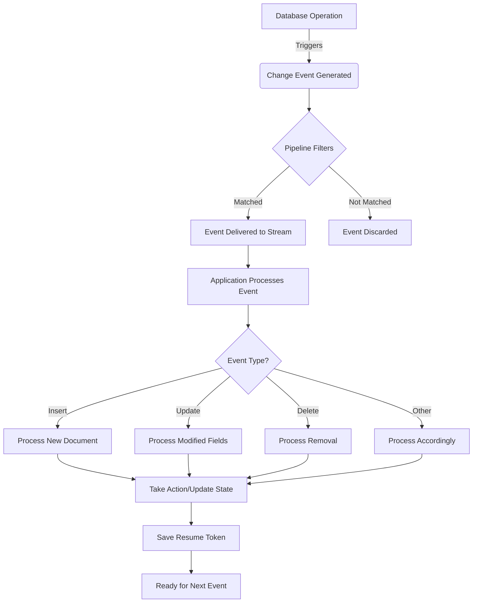

# MongoDB Event Processing

## Introduction

Event processing in MongoDB refers to the practice of capturing, analyzing, and responding to data changes in real-time using Change Streams. This capability transforms MongoDB from a traditional data store into a reactive system that can trigger actions based on database events.

In this tutorial, we'll explore how to effectively process events from MongoDB Change Streams and implement practical event-driven patterns in your applications.

## Understanding Event Types in Change Streams

Change Streams emit different types of events based on the database operations that occur. Before we dive into processing these events, let's understand the common event types:

| Operation Type | Description |
|---------------|-------------|
| `insert` | A new document was added to the collection |
| `update` | An existing document was modified |
| `replace` | An existing document was replaced |
| `delete` | A document was removed from the collection |
| `invalidate` | The change stream was invalidated and needs to be recreated |
| `drop` | The collection was dropped |
| `rename` | The collection was renamed |
| `dropDatabase` | The database was dropped |

## Basic Event Processing with Change Streams

Let's start with a basic example of connecting to a MongoDB Change Stream and processing events:

```javascript
const { MongoClient } = require('mongodb');

async function processChangeEvents() {
  const client = new MongoClient('mongodb://localhost:27017');
  
  try {
    await client.connect();
    console.log('Connected to MongoDB');
    
    const db = client.db('inventory');
    const collection = db.collection('products');
    
    // Create a change stream
    const changeStream = collection.watch();
    
    // Process change events
    changeStream.on('change', (change) => {
      console.log('Detected change:');
      console.log(`Operation type: ${change.operationType}`);
      
      switch(change.operationType) {
        case 'insert':
          console.log(`New product inserted: ${JSON.stringify(change.fullDocument)}`);
          break;
        case 'update':
          console.log(`Product updated: ID ${change.documentKey._id}`);
          console.log(`Fields changed: ${JSON.stringify(change.updateDescription.updatedFields)}`);
          break;
        case 'delete':
          console.log(`Product deleted: ID ${change.documentKey._id}`);
          break;
        default:
          console.log(`Other operation occurred: ${change.operationType}`);
      }
    });
    
    console.log('Watching for changes...');
    
    // Keep the application running
    // In production, you would handle this differently
    await new Promise((resolve) => setTimeout(resolve, 60 * 60 * 1000)); // 1 hour
    
  } catch (error) {
    console.error('Error occurred:', error);
  } finally {
    await client.close();
  }
}

processChangeEvents().catch(console.error);
```

Now, if we perform operations in another session:

```javascript
// In a different session or script
const { MongoClient } = require('mongodb');

async function performOperations() {
  const client = new MongoClient('mongodb://localhost:27017');
  
  try {
    await client.connect();
    const collection = client.db('inventory').collection('products');
    
    // Insert a document
    const insertResult = await collection.insertOne({
      name: 'Wireless Headphones',
      price: 79.99,
      stock: 25,
      category: 'Electronics'
    });
    console.log(`Inserted document with ID: ${insertResult.insertedId}`);
    
    // Update the document
    await collection.updateOne(
      { _id: insertResult.insertedId },
      { $set: { price: 69.99, stock: 30 } }
    );
    console.log('Updated document');
    
    // Delete the document
    await collection.deleteOne({ _id: insertResult.insertedId });
    console.log('Deleted document');
    
  } finally {
    await client.close();
  }
}

performOperations().catch(console.error);
```

The change stream would output something like:

```
Connected to MongoDB
Watching for changes...
Detected change:
Operation type: insert
New product inserted: {"_id":"64a7b2c5d3e2a1f4b5c6d7e8","name":"Wireless Headphones","price":79.99,"stock":25,"category":"Electronics"}
Detected change:
Operation type: update
Product updated: ID 64a7b2c5d3e2a1f4b5c6d7e8
Fields changed: {"price":69.99,"stock":30}
Detected change:
Operation type: delete
Product deleted: ID 64a7b2c5d3e2a1f4b5c6d7e8
```

## Filtering Events with Pipeline Stages

One of the most powerful features of Change Streams is the ability to filter events using an aggregation pipeline. This helps reduce the number of events your application needs to process, improving efficiency.

```javascript
// Creating a filtered change stream that only watches for price changes
const priceChangeStream = collection.watch([
  {
    $match: {
      $and: [
        { 'updateDescription.updatedFields.price': { $exists: true } },
        { 'operationType': 'update' }
      ]
    }
  }
]);

priceChangeStream.on('change', (change) => {
  const oldPrice = change.updateDescription.updatedFields.price;
  console.log(`Price changed for product ID ${change.documentKey._id} to ${oldPrice}`);
  
  // Maybe notify price monitoring systems
  notifyPriceMonitoringSystem(change.documentKey._id, oldPrice);
});
```

## Accessing Full Documents After Updates

By default, update events don't include the full updated document, only the changed fields. To access the complete document after an update, use the `fullDocument` option:

```javascript
const changeStreamOptions = {
  fullDocument: 'updateLookup'
};

const changeStream = collection.watch([], changeStreamOptions);

changeStream.on('change', (change) => {
  if (change.operationType === 'update') {
    console.log('Updated document (complete):');
    console.log(JSON.stringify(change.fullDocument));
    
    // Now you have access to the complete document after the update
    const currentStock = change.fullDocument.stock;
    if (currentStock < 10) {
      console.log(`Low stock alert for ${change.fullDocument.name}!`);
    }
  }
});
```

## Resuming Change Streams After Disconnection

In production applications, you'll need to handle disconnections and resume the change stream from where it left off:

```javascript
async function createResumeableChangeStream() {
  const client = new MongoClient('mongodb://localhost:27017');
  await client.connect();
  const collection = client.db('inventory').collection('products');
  
  // Store the resume token in a persistent store
  let resumeToken = loadSavedResumeToken() || null;
  
  let changeStream;
  
  try {
    const options = resumeToken ? { resumeAfter: resumeToken } : {};
    changeStream = collection.watch([], options);
    
    changeStream.on('change', (change) => {
      // Process the change
      console.log(`Processing: ${change.operationType}`);
      
      // Update our resume token after processing
      resumeToken = change._id;
      saveResumeToken(resumeToken);
    });
    
    changeStream.on('error', async (error) => {
      console.error('Error in change stream:', error);
      
      // Close and recreate the change stream
      if (changeStream) {
        await changeStream.close();
      }
      
      // Reconnect after a delay
      setTimeout(() => createResumeableChangeStream(), 5000);
    });
    
  } catch (error) {
    console.error('Failed to create change stream:', error);
    await client.close();
  }
}

function saveResumeToken(token) {
  // Save token to a file, database or other persistent storage
  console.log('Saving resume token:', token);
  // Implementation depends on your application
}

function loadSavedResumeToken() {
  // Load previously saved token
  // Implementation depends on your application
  return null; // Return the saved token or null if none exists
}
```

## Practical Examples of Event Processing

### 1. Implementing a Caching Layer

Change streams can be used to keep a cache in sync with your MongoDB data:

```javascript
const changeStream = collection.watch();

// Initialize cache
const cache = new Map();

// Populate cache initially
const documents = await collection.find({}).toArray();
documents.forEach(doc => {
  cache.set(doc._id.toString(), doc);
});

// Update cache based on change events
changeStream.on('change', (change) => {
  const id = change.documentKey._id.toString();
  
  switch(change.operationType) {
    case 'insert':
    case 'replace':
      cache.set(id, change.fullDocument);
      break;
    case 'update':
      // Update existing cached document with changes
      const cachedDoc = cache.get(id);
      if (cachedDoc) {
        Object.assign(cachedDoc, change.updateDescription.updatedFields);
        // Remove fields that were unset
        if (change.updateDescription.removedFields) {
          change.updateDescription.removedFields.forEach(field => {
            delete cachedDoc[field];
          });
        }
      }
      break;
    case 'delete':
      cache.delete(id);
      break;
  }
  
  console.log(`Cache updated. Current size: ${cache.size} items`);
});
```

### 2. Building an Activity Feed

Change streams can power real-time activity feeds:

```javascript
const activityStream = db.collection('posts').watch();

activityStream.on('change', async (change) => {
  // Create an activity entry based on the change
  let activity = {
    timestamp: new Date(),
    entityId: change.documentKey._id,
    collection: 'posts'
  };
  
  switch(change.operationType) {
    case 'insert':
      activity.type = 'post_created';
      activity.userId = change.fullDocument.authorId;
      activity.content = `New post: "${change.fullDocument.title}"`;
      break;
    case 'update':
      activity.type = 'post_updated';
      // If we have the full document available
      if (change.fullDocument) {
        activity.userId = change.fullDocument.authorId;
        activity.content = `Updated post: "${change.fullDocument.title}"`;
      } else {
        // Otherwise just note which fields changed
        const updatedFields = Object.keys(change.updateDescription.updatedFields);
        activity.content = `Post updated: ${updatedFields.join(', ')}`;
      }
      break;
    case 'delete':
      activity.type = 'post_deleted';
      activity.content = `Post deleted`;
      break;
  }
  
  // Save the activity
  await db.collection('activities').insertOne(activity);
  
  // Notify connected clients (e.g., through WebSockets)
  notifyClients(activity);
});
```

### 3. Event-Driven Microservices

Change streams enable building event-driven architectures:

```javascript
// Order Service monitoring for new orders
const orderStream = db.collection('orders').watch([
  { $match: { 'operationType': 'insert' } }
]);

orderStream.on('change', async (change) => {
  const order = change.fullDocument;
  
  console.log(`Processing new order: ${order._id}`);
  
  // Publish message to other services
  await publishEvent('order.created', {
    orderId: order._id.toString(),
    customerId: order.customerId,
    items: order.items,
    total: order.total
  });
  
  // Different services can subscribe to these events:
  // 1. Inventory service - to update stock levels
  // 2. Shipping service - to prepare shipment
  // 3. Notification service - to send order confirmation
});

function publishEvent(eventName, data) {
  // This could use a message broker like RabbitMQ, Kafka, etc.
  console.log(`Publishing event ${eventName}:`, JSON.stringify(data));
  // Implementation depends on your messaging infrastructure
}
```

## Change Stream Event Processing Lifecycle

Here's a diagram showing the typical lifecycle of change stream event processing:



## Error Handling and Best Practices

Proper error handling is critical for production-ready change stream applications:

```javascript
const changeStream = collection.watch();

// Handle specific errors
changeStream.on('error', (error) => {
  console.error('Change stream error:', error);
  
  // Check for specific error types
  if (error.name === 'MongoNetworkError') {
    console.log('Network error detected, will attempt to reconnect...');
    // Implement reconnection logic
  } else if (error.code === 40573) {
    // The change stream has been invalidated
    console.log('Change stream invalidated, recreating...');
    // Recreate the change stream
  } else {
    // Handle other errors
  }
});

// Best practices:

// 1. Implement backoff strategy for reconnections
let reconnectAttempts = 0;
function reconnectWithBackoff() {
  const baseDelay = 1000; // 1 second
  const maxDelay = 30000; // 30 seconds
  const delay = Math.min(baseDelay * Math.pow(2, reconnectAttempts), maxDelay);
  
  console.log(`Reconnecting in ${delay}ms (attempt ${reconnectAttempts + 1})...`);
  
  setTimeout(() => {
    reconnectAttempts++;
    // Attempt to reconnect
    createChangeStream().catch(error => {
      console.error('Failed to reconnect:', error);
      reconnectWithBackoff();
    });
  }, delay);
}

// 2. Implement a heartbeat mechanism
function setupHeartbeat(changeStream) {
  let lastEventTime = Date.now();
  
  // Check for activity every minute
  const interval = setInterval(() => {
    const now = Date.now();
    const minutesPassed = (now - lastEventTime) / (1000 * 60);
    
    if (minutesPassed > 5) {
      console.log('No events received for 5 minutes. Checking connection...');
      
      // Ping the database to check connection
      client.db('admin').command({ ping: 1 })
        .then(() => console.log('Connection is healthy'))
        .catch(error => {
          console.error('Connection check failed:', error);
          clearInterval(interval);
          changeStream.close()
            .then(() => reconnectWithBackoff())
            .catch(closeError => console.error('Error closing stream:', closeError));
        });
    }
  }, 60000);
  
  // Update the timestamp on each event
  changeStream.on('change', () => {
    lastEventTime = Date.now();
  });
  
  return interval;
}
```

## Summary

MongoDB Change Stream Event Processing provides a powerful mechanism for building reactive applications that respond to data changes in real-time. We've explored:

1. The basics of consuming events from Change Streams
2. Filtering events with aggregation pipelines
3. Accessing full documents after updates
4. Implementing resumable change streams for production reliability
5. Practical applications including caching, activity feeds, and microservices
6. Error handling and best practices

By leveraging these techniques, you can build sophisticated event-driven applications that react immediately to changes in your MongoDB data, enabling real-time features with minimal infrastructure complexity.

## Additional Resources and Exercises

### Resources
- [MongoDB Change Streams Official Documentation](https://www.mongodb.com/docs/manual/changeStreams/)
- [Node.js MongoDB Driver Change Streams API](https://mongodb.github.io/node-mongodb-native/4.0/classes/collection.html#watch)

### Exercises

1. **Basic Event Logger:**
   Create a simple application that connects to a MongoDB collection and logs all change events to a file, formatting them in a human-readable way.

2. **Selective Event Processor:**
   Build a change stream that only processes events for documents matching specific criteria (e.g., only process changes to products in the "Electronics" category).

3. **Two-Way Synchronization:**
   Create two collections and write a program that keeps them synchronized using change streams (changes in either collection should be reflected in the other).

4. **Notification System:**
   Build a small web application that displays real-time notifications whenever data changes occur in a MongoDB collection.

5. **Advanced Event Pipeline:**
   Create a change stream with a complex aggregation pipeline that transforms the events before your application processes them, extracting only the relevant information.