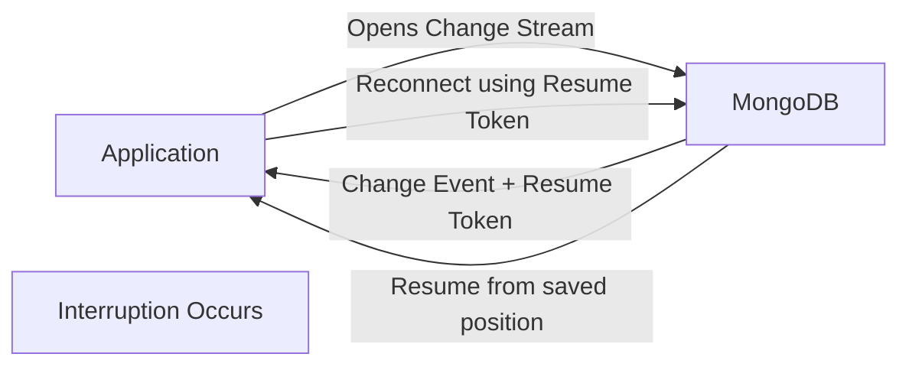

# MongoDB Resumability

In real-world applications, maintaining uninterrupted data monitoring is crucial. When working with MongoDB Change Streams, you may encounter network issues, application crashes, or server maintenance that interrupt your stream. Resumability is a powerful feature that allows your application to continue monitoring changes from where it left off, ensuring you don't miss any important database events.

## What is Resumability in Change Streams?

Resumability refers to the ability to restart a change stream from the point where it was interrupted, rather than starting from the current time and potentially missing events that occurred during the downtime.

MongoDB accomplishes this through a special token called a **resume token**, which acts as a bookmark in the stream of changes.

## How Resume Tokens Work

When you open a change stream, MongoDB provides a resume token with each change event. This token uniquely identifies the position of that event in the oplog (operation log) - MongoDB's internal record of all operations.



## Basic Implementation of Resumability

Let's look at how to implement resumability in a Node.js application:

```javascript
const { MongoClient } = require('mongodb');

async function monitorCollectionWithResumability() {
  const client = new MongoClient('mongodb://localhost:27017');
  
  try {
    await client.connect();
    const db = client.db('sample_database');
    const collection = db.collection('products');
    
    // Store the resume token between application restarts
    let resumeToken = loadSavedResumeToken(); // Custom function to load saved token
    
    // Options for the change stream
    const options = {};
    if (resumeToken) {
      options.resumeAfter = resumeToken;
    }
    
    const changeStream = collection.watch([], options);
    
    changeStream.on('change', (change) => {
      console.log('Detected change:', change);
      
      // Save the resume token after processing each change
      saveResumeToken(change._id); // Custom function to save token
    });
    
    // Handle errors and close events
    changeStream.on('error', (error) => {
      console.error('Change stream error:', error);
      // Implement reconnection logic here
    });
    
    changeStream.on('close', () => {
      console.log('Change stream closed');
      // Implement reconnection logic here
    });
    
  } catch (err) {
    console.error('Error in monitoring:', err);
  }
}

// Example implementations of token storage functions
function saveResumeToken(token) {
  // In a real application, you might store this in a file or database
  fs.writeFileSync('resumeToken.json', JSON.stringify(token));
}

function loadSavedResumeToken() {
  try {
    return JSON.parse(fs.readFileSync('resumeToken.json'));
  } catch (err) {
    return null; // No saved token found
  }
}

monitorCollectionWithResumability();
```

## Resume Options in Change Streams

MongoDB provides several options for resuming a change stream:

### 1. `resumeAfter`

This is the most common option. It resumes the change stream after the provided resume token.

```javascript
const options = { 
  resumeAfter: savedResumeToken 
};
const changeStream = collection.watch([], options);
```

### 2. `startAfter`

Similar to `resumeAfter`, but designed to be used after an invalidate event (when the stream becomes invalid due to certain operations like collection drops).

```javascript
const options = { 
  startAfter: savedResumeToken 
};
const changeStream = collection.watch([], options);
```

### 3. `startAtOperationTime`

Resume the stream at a specific timestamp in the oplog.

```javascript
const options = { 
  startAtOperationTime: Timestamp(1571768862, 1) 
};
const changeStream = collection.watch([], options);
```

## Best Practices for Implementing Resumability

### 1. Safely Store Resume Tokens

Always store resume tokens in a durable location:

```javascript
// Example using a dedicated MongoDB collection for token storage
async function saveResumeToken(token, streamId) {
  await tokenCollection.updateOne(
    { _id: streamId },
    { $set: { token: token, lastUpdated: new Date() } },
    { upsert: true }
  );
}

async function loadResumeToken(streamId) {
  const doc = await tokenCollection.findOne({ _id: streamId });
  return doc ? doc.token : null;
}
```

### 2. Implement Error Handling and Automatic Reconnection

Create a resilient change stream with automatic reconnection:

```javascript
async function createResilientChangeStream(collection, streamId) {
  let attemptReconnect = true;
  
  while (attemptReconnect) {
    try {
      const token = await loadResumeToken(streamId);
      const options = token ? { resumeAfter: token } : {};
      
      const changeStream = collection.watch([], options);
      
      changeStream.on('change', async (change) => {
        try {
          console.log('Change detected:', change);
          // Process the change event
          
          // Save token AFTER successful processing
          await saveResumeToken(change._id, streamId);
        } catch (err) {
          console.error('Error processing change:', err);
        }
      });
      
      // Set up event listeners for the stream
      await new Promise((resolve, reject) => {
        changeStream.on('error', (error) => {
          console.error('Stream error, will reconnect:', error);
          resolve();
        });
        
        // This might be triggered by server maintenance or other events
        changeStream.on('close', () => {
          console.log('Stream closed, will reconnect');
          resolve();
        });
      });
      
      // Small delay before reconnecting to avoid hammering the server
      await new Promise(resolve => setTimeout(resolve, 1000));
      
    } catch (err) {
      console.error('Error in change stream setup:', err);
      await new Promise(resolve => setTimeout(resolve, 5000));
    }
  }
}
```

### 3. Handle Invalidate Events

When certain database operations occur (like collection drops), change streams emit an invalidate event and close. Handle this appropriately:

```javascript
changeStream.on('change', async (change) => {
  if (change.operationType === 'invalidate') {
    console.log('Stream invalidated - collection may have been dropped or renamed');
    // Handle invalidation, perhaps by creating a new stream
    // You'll need to use startAfter instead of resumeAfter
    await createNewStream(change._id);
    return;
  }
  
  // Normal change processing...
});
```

## Real-World Example: E-commerce Inventory Tracking

Let's look at a real-world example of using resumable change streams for tracking inventory changes in an e-commerce application:

```javascript
const { MongoClient } = require('mongodb');
const fs = require('fs').promises;

class InventoryTracker {
  constructor(connectionString, dbName, collectionName) {
    this.client = new MongoClient(connectionString);
    this.dbName = dbName;
    this.collectionName = collectionName;
    this.tokenFilePath = './inventory_token.json';
    this.isRunning = false;
  }
  
  async start() {
    if (this.isRunning) return;
    this.isRunning = true;
    
    try {
      await this.client.connect();
      console.log('Connected to MongoDB');
      
      const db = this.client.db(this.dbName);
      const collection = db.collection(this.collectionName);
      
      await this.monitorInventory(collection);
    } catch (err) {
      console.error('Failed to start inventory tracker:', err);
      this.isRunning = false;
    }
  }
  
  async stop() {
    if (this.changeStream) {
      await this.changeStream.close();
    }
    
    if (this.client) {
      await this.client.close();
    }
    
    this.isRunning = false;
    console.log('Inventory tracker stopped');
  }
  
  async monitorInventory(collection) {
    while (this.isRunning) {
      try {
        // Load the saved resume token
        let resumeToken = null;
        try {
          const tokenData = await fs.readFile(this.tokenFilePath, 'utf8');
          resumeToken = JSON.parse(tokenData);
          console.log('Resuming from saved token');
        } catch (err) {
          console.log('No resume token found, starting from current time');
        }
        
        // Configure the change stream
        const options = resumeToken ? { resumeAfter: resumeToken } : {};
        this.changeStream = collection.watch([
          { $match: { 'operationType': { $in: ['insert', 'update', 'replace'] } } }
        ], options);
        
        // Process inventory changes
        for await (const change of this.changeStream) {
          if (change.operationType === 'insert') {
            await this.handleNewProduct(change.fullDocument);
          } else if (change.operationType === 'update' || change.operationType === 'replace') {
            await this.handleInventoryUpdate(change);
          }
          
          // Save the resume token after successful processing
          await fs.writeFile(this.tokenFilePath, JSON.stringify(change._id));
        }
      } catch (err) {
        console.error('Error in inventory monitor:', err);
        
        // Wait before attempting to reconnect
        await new Promise(resolve => setTimeout(resolve, 5000));
      }
    }
  }
  
  async handleNewProduct(product) {
    console.log(`New product added: ${product.name}, Stock: ${product.stock}`);
    
    // Check if we need to order more inventory
    if (product.stock < product.reorderThreshold) {
      await this.notifyLowInventory(product);
    }
  }
  
  async handleInventoryUpdate(change) {
    // Get the current document state
    const productId = change.documentKey._id;
    const collection = this.client.db(this.dbName).collection(this.collectionName);
    const product = await collection.findOne({ _id: productId });
    
    if (!product) return;
    
    console.log(`Inventory updated for ${product.name}, New stock: ${product.stock}`);
    
    // Check for low inventory conditions
    if (product.stock < product.reorderThreshold) {
      await this.notifyLowInventory(product);
    }
  }
  
  async notifyLowInventory(product) {
    console.log(`🚨 LOW INVENTORY ALERT: ${product.name} (${product.stock} remaining)`);
    // In a real app, you might send an email, SMS, or create a task in your system
  }
}

// Usage example
async function main() {
  const tracker = new InventoryTracker(
    'mongodb://localhost:27017',
    'ecommerce',
    'products'
  );
  
  await tracker.start();
  
  // To handle application shutdown
  process.on('SIGINT', async () => {
    console.log('Shutting down inventory tracker...');
    await tracker.stop();
    process.exit(0);
  });
}

main().catch(console.error);
```

## Understanding Resume Token Expiration

Resume tokens have a limited lifespan based on your MongoDB server's oplog size. If you try to resume a change stream with a token that's too old, you'll receive an error.

To handle this gracefully:

```javascript
try {
  const options = resumeToken ? { resumeAfter: resumeToken } : {};
  const changeStream = collection.watch([], options);
  // ...
} catch (err) {
  if (err.code === 136) { // This is the error code for "resume token not found"
    console.log('Resume token expired, starting from current time');
    const changeStream = collection.watch(); // Start without a token
  } else {
    throw err; // Re-throw other errors
  }
}
```

## Summary

Resumability is a critical feature of MongoDB Change Streams that enables robust, fault-tolerant applications. By properly managing resume tokens, you can ensure your application never misses important database events, even after disconnections or crashes.

Key points to remember:
- Always save resume tokens after processing each change
- Store tokens in a durable location (database, file system)
- Implement proper error handling and reconnection logic
- Handle token expiration gracefully
- Consider using `startAfter` when recovering from invalidate events

With these practices, you can build applications that maintain a continuous view of your data changes, regardless of network issues or system downtime.

## Additional Resources

- [MongoDB Change Streams Documentation](https://www.mongodb.com/docs/manual/changeStreams/)
- [Node.js MongoDB Driver Documentation](https://mongodb.github.io/node-mongodb-native/)

## Exercises

1. Create a simple change stream that saves resume tokens to a file and demonstrates resuming from a stored token.
2. Implement a resilient change stream that handles network disconnections and automatically reconnects.
3. Build a small application that uses change streams to maintain a cache of data that stays in sync with MongoDB, handling interruptions gracefully.
4. Extend the e-commerce example to track inventory across multiple warehouses and send notifications when global inventory falls below thresholds.