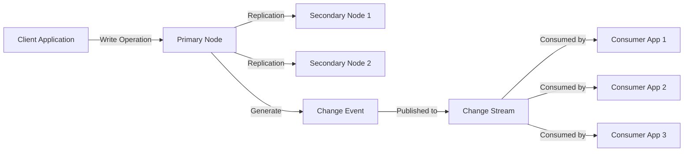

# MongoDB Change Events

## Introduction

MongoDB Change Events are notifications generated when operations occur on a MongoDB collection. These events form the foundation of MongoDB Change Streams, allowing applications to react in real-time to data modifications. Rather than repeatedly polling the database for changes, your application can subscribe to these events and respond immediately when documents are inserted, updated, deleted, or replaced.

Change events provide a powerful mechanism for building reactive applications, microservices that need to stay in sync, audit systems, and real-time analytics platforms. In this guide, we'll explore what change events are, their structure, and how to effectively use them in your applications.

## What are MongoDB Change Events?

Change events are documents that describe modifications to data in a MongoDB database. Each event contains detailed information about:

1. The type of operation performed
2. The affected document(s)
3. When the change occurred
4. Additional metadata about the change

Change events are generated by MongoDB's replication system, which means they are only available in replica set deployments or sharded clusters (not standalone instances).

## Event Types and Structure

MongoDB generates different types of change events corresponding to different database operations:

| Operation Type | Description |
|---------------|-------------|
| `insert` | A new document was added to the collection |
| `update` | An existing document was modified |
| `replace` | An existing document was completely replaced |
| `delete` | A document was removed from the collection |
| `invalidate` | The change stream is no longer valid and must be recreated |
| `drop` | The collection was dropped |
| `rename` | The collection was renamed |
| `dropDatabase` | The database was dropped |

### Anatomy of a Change Event

Let's look at the structure of a typical change event document:

```javascript
{
  _id: <ObjectId>, // A document that serves as the resumeToken
  operationType: <string>, // The type of operation
  fullDocument: <document>, // The full document (for inserts/updates with fullDocument option)
  ns: {
    db: <string>, // Database name
    coll: <string> // Collection name
  },
  documentKey: {
    _id: <value> // Document identifier
  },
  updateDescription: { // Only for update operations
    updatedFields: <document>,
    removedFields: [<string>, ...]
  },
  clusterTime: <Timestamp>, // When the change occurred
  txnNumber: <long>, // Only available for changes in transactions
  lsid: <document> // Only available for changes in transactions
}
```

Let's break down these fields:

- **_id**: A unique identifier for the event that can also be used as a resume token
- **operationType**: Indicates what type of operation triggered the event
- **fullDocument**: Contains the complete document state after the operation (for inserts, or updates with appropriate options)
- **ns**: The namespace (database and collection) where the event occurred
- **documentKey**: The identifier of the document that was changed
- **updateDescription**: For update operations, describes which fields were modified and which were removed
- **clusterTime**: When the change occurred in the MongoDB cluster

## Examples of Change Events

### Insert Event

When a document is inserted into a collection, an event like this is generated:

```javascript
{
  _id: {
    _data: "826465A0BD000000012B022C0100296E5A10044F..."
  },
  operationType: "insert",
  fullDocument: {
    _id: ObjectId("60f8a9d76e1b8f1c9c9bb1d3"),
    name: "John Smith",
    email: "john.smith@example.com",
    createdAt: ISODate("2023-08-12T13:45:11.232Z")
  },
  ns: {
    db: "users_db",
    coll: "profiles"
  },
  documentKey: {
    _id: ObjectId("60f8a9d76e1b8f1c9c9bb1d3")
  },
  clusterTime: Timestamp(1626345900, 1)
}
```

### Update Event

When a document is updated, the event includes details about the changes:

```javascript
{
  _id: {
    _data: "826465A0BE000000012B022C0100296E5A10044F..."
  },
  operationType: "update",
  ns: {
    db: "users_db",
    coll: "profiles"
  },
  documentKey: {
    _id: ObjectId("60f8a9d76e1b8f1c9c9bb1d3")
  },
  updateDescription: {
    updatedFields: {
      email: "john.smith.new@example.com",
      lastModified: ISODate("2023-08-12T14:02:33.157Z")
    },
    removedFields: ["temporaryFlag"]
  },
  clusterTime: Timestamp(1626346953, 1)
}
```

Note that by default, the update event does not include the complete document after the update. If you need the full document, you must specify this when creating the change stream.

### Delete Event

When a document is deleted:

```javascript
{
  _id: {
    _data: "826465A0BF000000012B022C0100296E5A10044F..."
  },
  operationType: "delete",
  ns: {
    db: "users_db",
    coll: "profiles"
  },
  documentKey: {
    _id: ObjectId("60f8a9d76e1b8f1c9c9bb1d3")
  },
  clusterTime: Timestamp(1626347029, 1)
}
```

## Working with Change Events in Your Application

To receive change events in your application, you'll need to create a change stream. Here's a simple example using the MongoDB Node.js driver:

```javascript
const { MongoClient } = require('mongodb');

async function monitorCollectionChanges() {
  const client = new MongoClient('mongodb://localhost:27017');
  
  try {
    await client.connect();
    const database = client.db('users_db');
    const collection = database.collection('profiles');
    
    // Create a change stream
    const changeStream = collection.watch();
    
    // Set up a listener for change events
    changeStream.on('change', (changeEvent) => {
      console.log('Detected change:');
      console.log(JSON.stringify(changeEvent, null, 2));
      
      // Process the event based on operation type
      switch(changeEvent.operationType) {
        case 'insert':
          console.log(`New user created: ${changeEvent.fullDocument.name}`);
          break;
        case 'update':
          console.log(`User updated: ${Object.keys(changeEvent.updateDescription.updatedFields).join(', ')}`);
          break;
        case 'delete':
          console.log(`User deleted with _id: ${changeEvent.documentKey._id}`);
          break;
        default:
          console.log(`Other operation: ${changeEvent.operationType}`);
      }
    });
    
    console.log('Monitoring for changes...');
    
    // The change stream will stay open until closed or an error occurs
  } catch (error) {
    console.error('Error:', error);
  }
}

monitorCollectionChanges();
```

### Getting the Full Document for Update Events

By default, update events don't include the complete document after the update. If you need this information, you can use the `fullDocument` option:

```javascript
const changeStream = collection.watch([], { fullDocument: 'updateLookup' });
```

With this option, MongoDB will fetch the current state of the document and include it in the `fullDocument` field of update events.

## Practical Applications of Change Events

### Real-time Notifications

You can use change events to notify users when data they're interested in changes:

```javascript
// Simplified notification service
async function startNotificationService() {
  const client = new MongoClient('mongodb://localhost:27017');
  await client.connect();
  
  const commentCollection = client.db('blog').collection('comments');
  const changeStream = commentCollection.watch();
  
  changeStream.on('change', async (change) => {
    if (change.operationType === 'insert') {
      const comment = change.fullDocument;
      
      // Find the post author to send notification to
      const postCollection = client.db('blog').collection('posts');
      const post = await postCollection.findOne({ _id: comment.postId });
      
      // Send notification to post author
      await sendNotification({
        userId: post.authorId,
        message: `New comment on your post "${post.title}"`,
        link: `/posts/${post._id}`
      });
    }
  });
}
```

### Cache Invalidation

Change events are perfect for keeping caches in sync with the database:

```javascript
const cache = new Map(); // Simple in-memory cache

async function setupCacheInvalidation() {
  const client = new MongoClient('mongodb://localhost:27017');
  await client.connect();
  
  const productCollection = client.db('ecommerce').collection('products');
  const changeStream = productCollection.watch();
  
  changeStream.on('change', (change) => {
    const productId = change.documentKey._id.toString();
    
    switch(change.operationType) {
      case 'update':
      case 'replace':
        // Invalidate cache for this product
        cache.delete(`product:${productId}`);
        console.log(`Cache invalidated for product ${productId}`);
        break;
      case 'delete':
        // Remove from cache
        cache.delete(`product:${productId}`);
        console.log(`Removed product ${productId} from cache`);
        break;
    }
  });
}
```

### Data Analytics Pipeline

You can feed change events into analytics pipelines to track changes in real-time:

```javascript
async function startAnalyticsPipeline() {
  const client = new MongoClient('mongodb://localhost:27017');
  await client.connect();
  
  const ordersCollection = client.db('ecommerce').collection('orders');
  
  const pipeline = [
    { $match: { 'fullDocument.status': 'completed' } }
  ];
  
  const changeStream = ordersCollection.watch(pipeline, { fullDocument: 'updateLookup' });
  
  changeStream.on('change', async (change) => {
    if (change.operationType === 'insert' || change.operationType === 'update') {
      const order = change.fullDocument;
      
      // Update sales analytics
      await updateDailySales(order.date, order.total);
      
      // Update product inventory counts
      for (const item of order.items) {
        await updateProductSalesMetrics(item.productId, item.quantity);
      }
      
      console.log(`Processed order ${order._id} for analytics`);
    }
  });
}
```

### Change Event Flow Diagram

Here's a high-level view of how change events flow through a MongoDB deployment:



## Best Practices for Working with Change Events

1. **Error handling**: Always implement robust error handling for your change stream consumers, as network issues or other problems can cause disconnections.

2. **Resumability**: Store the last processed event's resume token so you can resume the stream from where you left off after a disconnection.

```javascript
let resumeToken;

const changeStream = collection.watch([], { resumeAfter: resumeToken });
changeStream.on('change', (change) => {
  // Process the change...
  
  // Store the latest resume token
  resumeToken = change._id;
});
```

3. **Filtering**: Use aggregation pipelines to filter events on the server-side to reduce unnecessary data transfer:

```javascript
// Only get insert events for premium customers
const pipeline = [
  { $match: { 
    operationType: 'insert',
    'fullDocument.accountType': 'premium' 
  }}
];
const changeStream = collection.watch(pipeline);
```

4. **Resource management**: Close change streams when they're no longer needed to free up resources:

```javascript
// When you're done with the change stream
await changeStream.close();
```

5. **Deployment considerations**: Change streams require a replica set or sharded cluster; they don't work with standalone MongoDB instances.

## Summary

MongoDB Change Events provide a powerful mechanism for building reactive applications that respond to database changes in real-time. These events contain detailed information about data modifications, including the type of operation, affected documents, and timestamps.

Key points to remember:

- Change events are the foundation of MongoDB Change Streams
- They represent different database operations like insert, update, delete, etc.
- Each event includes metadata about the change and, optionally, the full document
- They enable real-time applications without polling the database
- Change events can be filtered using aggregation pipelines
- They require a replica set or sharded cluster deployment

With change events, you can build sophisticated applications that react instantly to data changes, keeping your services in sync, your caches fresh, and your users informed.

## Additional Resources

- Try implementing a simple notification system using change events
- Build a data synchronization service between MongoDB and another system
- Experiment with different aggregation pipeline filters for change streams
- Implement a resumable change stream consumer with error handling
- Create a simple audit log system using change events

By mastering MongoDB Change Events, you'll have a powerful tool for building modern, reactive applications that can respond to data changes in real-time.