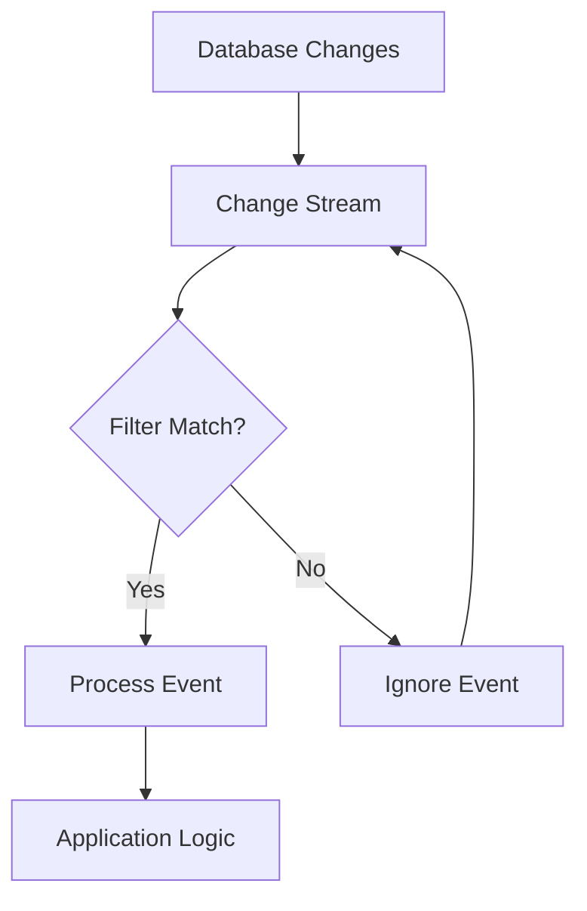

# MongoDB Event Filtering

In the world of real-time applications, getting notified about database changes is powerful, but being notified about *every* change can be overwhelming. MongoDB's change streams provide a way to filter events so your application only processes the changes it cares about. This filtering capability helps optimize performance and simplify your application logic.

## What is Event Filtering in Change Streams?

Event filtering allows you to specify which database events are relevant to your application. Instead of processing every change in a collection, you can define precise criteria for the events you want to track.

Think of it like setting up filters for your email inbox — you don't want to see every email, just the ones that matter to you.

## The `$match` Stage in Change Streams

MongoDB change streams use the aggregation pipeline's `$match` stage to filter events. This powerful mechanism lets you create complex filtering conditions.

### Basic Syntax

Here's how you define a filtered change stream:

```javascript
db.collection.watch([
  {
    $match: {
      // Your filtering criteria goes here
    }
  }
])
```

## Filtering by Operation Type

One of the most common filtering scenarios is to listen for specific operations (inserts, updates, deletes, etc.).

### Example: Listening Only for Insert Operations

```javascript
const changeStream = db.products.watch([
  {
    $match: { 
      operationType: "insert" 
    }
  }
]);

// Process the filtered change stream
changeStream.on('change', (change) => {
  console.log(`New product added: ${change.fullDocument.name}`);
});
```

### Available Operation Types

You can filter on any of the following operation types:

- `insert`: Document insertions
- `update`: Document updates
- `replace`: Document replacements (whole document)
- `delete`: Document deletions
- `drop`: Collection drops
- `rename`: Collection renames
- `dropDatabase`: Database drops
- `invalidate`: Events that invalidate the change stream

### Example: Listening for Multiple Operation Types

```javascript
const changeStream = db.products.watch([
  {
    $match: {
      operationType: { $in: ["insert", "update", "delete"] }
    }
  }
]);
```

## Filtering by Document Fields

You can also filter based on the actual data that was changed. This is particularly useful when you only care about specific documents or field values.

### Example: Filtering Based on Document Content

Let's say we want to monitor only high-value orders (over $1000):

```javascript
const changeStream = db.orders.watch([
  {
    $match: {
      $and: [
        { operationType: "insert" },
        { "fullDocument.totalAmount": { $gt: 1000 } }
      ]
    }
  }
]);

changeStream.on('change', (change) => {
  console.log(`High-value order received: $${change.fullDocument.totalAmount}`);
  console.log(`Customer: ${change.fullDocument.customerName}`);
});
```

### Output:
```
High-value order received: $1299.99
Customer: Jane Smith
```

## Understanding Available Fields for Filtering

When filtering change stream events, you need to know which fields are available to use in your `$match` stage:

### Common Fields in Change Events

| Field | Description | Available For |
|-------|-------------|--------------|
| `operationType` | Type of operation | All operations |
| `ns` | The namespace (database and collection) | All operations |
| `documentKey` | The _id of the document | All operations |
| `fullDocument` | The current document state | insert, update, replace |
| `updateDescription` | The changes made in an update | update operations |

## Advanced Filtering Techniques

### Filtering Updates by Changed Fields

If you want to track only when specific fields are modified, you can use the `updateDescription.updatedFields` path:

```javascript
const changeStream = db.users.watch([
  {
    $match: {
      operationType: "update",
      "updateDescription.updatedFields.email": { $exists: true }
    }
  }
]);

changeStream.on('change', (change) => {
  console.log(`User ${change.documentKey._id} updated their email to: ${change.updateDescription.updatedFields.email}`);
});
```

### Filtering Based on Namespace

You can filter by database or collection when watching at a higher level:

```javascript
// Watch only events in the 'products' collection
const changeStream = db.watch([
  {
    $match: {
      "ns.coll": "products"
    }
  }
]);
```

## Real-World Applications

Let's explore some practical scenarios where event filtering shines:

### Example 1: User Notification System

Imagine you're building a notification system that alerts users when their account status changes:

```javascript
const changeStream = db.accounts.watch([
  {
    $match: {
      operationType: "update",
      "updateDescription.updatedFields.status": { $exists: true }
    }
  }
]);

changeStream.on('change', async (change) => {
  const userId = change.documentKey._id;
  const newStatus = change.updateDescription.updatedFields.status;
  
  // Get user's notification preferences
  const user = await db.users.findOne({ accountId: userId });
  
  if (newStatus === "suspended") {
    await sendUrgentNotification(user.email, 
      "Your account has been suspended. Please contact support.");
  } else if (newStatus === "verified") {
    await sendNotification(user.email,
      "Congratulations! Your account has been verified.");
  }
});
```

### Example 2: Inventory Management

For an e-commerce platform that needs to track when inventory levels fall below thresholds:

```javascript
const changeStream = db.inventory.watch([
  {
    $match: {
      operationType: "update",
      "updateDescription.updatedFields.quantity": { $exists: true },
      "fullDocument.quantity": { $lt: 10 }
    }
  }
]);

changeStream.on('change', async (change) => {
  const productId = change.documentKey._id;
  const currentQuantity = change.fullDocument.quantity;
  
  console.log(`Low inventory alert: Product ${productId} has only ${currentQuantity} units left.`);
  
  // Alert warehouse team
  await createRestockRequest({
    productId,
    currentQuantity,
    requestedBy: "automated-inventory-system"
  });
});
```

## Best Practices for Event Filtering

1. **Be as specific as possible** - The more targeted your filters, the less data your application needs to process.

2. **Consider index support** - Ensure that fields used in your filters are indexed for better performance.

3. **Handle edge cases** - Always include error handling in your change stream code.

4. **Test with realistic data volumes** - Make sure your filtering approach scales with your expected data load.

5. **Monitor resumability** - Complex filters might affect your ability to resume change streams after errors.

## Sample Implementation: User Activity Tracking

Let's build a complete example of a user activity tracking system that uses filtered change streams:

```javascript
const MongoClient = require('mongodb').MongoClient;

async function monitorUserActivity() {
  const client = new MongoClient('mongodb://localhost:27017');
  await client.connect();
  
  const db = client.db('socialApp');
  const usersCollection = db.collection('users');
  
  const pipeline = [
    {
      $match: {
        $or: [
          { operationType: "insert" },  // New user registrations
          { 
            operationType: "update",
            "updateDescription.updatedFields.lastLogin": { $exists: true }  // Track logins
          },
          {
            operationType: "update",
            "updateDescription.updatedFields.profileComplete": true  // Profile completions
          }
        ]
      }
    }
  ];
  
  const changeStream = usersCollection.watch(pipeline);
  
  changeStream.on('change', (change) => {
    switch(change.operationType) {
      case "insert":
        console.log(`New user registered: ${change.fullDocument.username}`);
        recordMetric('user_registration', { userId: change.fullDocument._id });
        break;
        
      case "update":
        if (change.updateDescription.updatedFields.lastLogin) {
          console.log(`User login: ${change.documentKey._id} at ${change.updateDescription.updatedFields.lastLogin}`);
          recordMetric('user_login', { userId: change.documentKey._id });
        }
        
        if (change.updateDescription.updatedFields.profileComplete) {
          console.log(`User ${change.documentKey._id} completed their profile!`);
          scheduleWelcomeEmail(change.documentKey._id);
        }
        break;
    }
  });
  
  changeStream.on('error', (error) => {
    console.error('Change stream error:', error);
    // Implement reconnection logic
  });
  
  console.log('Monitoring user activity...');
}

// Helper functions (implementations not shown)
function recordMetric(name, data) {
  // Record metrics to analytics system
}

function scheduleWelcomeEmail(userId) {
  // Add user to welcome email queue
}

monitorUserActivity().catch(console.error);
```

## Understanding the Flow of Filtered Events

The following diagram shows how event filtering works in a MongoDB change stream:



## Limitations and Considerations

When working with event filtering in change streams, keep these limitations in mind:

1. **Performance Impact**: Complex filters may affect performance, especially with high-volume change streams.

2. **Resume Token Compatibility**: Some filter configurations might affect your ability to resume a change stream after disconnection.

3. **Availability**: Change streams require a replica set or sharded cluster; they don't work on standalone MongoDB instances.

4. **Security Permissions**: Ensure your MongoDB user has the necessary permissions for watching collections.

## Summary

MongoDB's event filtering in change streams provides a powerful way to focus on the database events that matter to your application. By using the `$match` stage of the aggregation pipeline, you can create precise filters based on operation types, document content, or specific field changes.

Effective event filtering helps build more efficient real-time applications by:
- Reducing unnecessary processing of irrelevant events
- Simplifying application logic by pre-filtering at the database level
- Enabling targeted reactions to specific database changes
- Improving overall application performance

Whether you're building user notification systems, inventory management, or user activity tracking, filtered change streams provide a clean, reactive approach to database change detection.

## Additional Resources and Exercises

### Further Learning
- [MongoDB Change Streams Documentation](https://www.mongodb.com/docs/manual/changeStreams/)
- [MongoDB Aggregation Pipeline Documentation](https://www.mongodb.com/docs/manual/core/aggregation-pipeline/)

### Exercises for Practice

1. **Basic Filtering**: Create a change stream that only listens for document deletions in a collection.

2. **Field-Specific Filtering**: Implement a change stream that monitors price changes in a products collection.

3. **Multi-Condition Filter**: Build a change stream that tracks when users change both their email and password in the same update operation.

4. **Integration Challenge**: Create a simple Node.js application that uses filtered change streams to generate different types of notifications based on database changes.

5. **Performance Testing**: Compare the performance of filtered vs. unfiltered change streams with varying volumes of database operations.

By mastering event filtering in MongoDB change streams, you'll be well-equipped to build responsive, efficient, real-time applications that react precisely to the database changes that matter most.