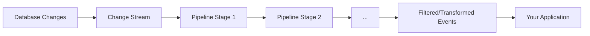

# MongoDB Change Stream Pipeline

In modern applications, real-time data processing has become increasingly important. MongoDB's Change Streams provide a way to watch for database changes in real-time. By adding pipelines to your change streams, you can filter and transform these events to match your specific needs, making your applications more efficient and focused.

## What is a Change Stream Pipeline?

A Change Stream Pipeline is an array of [aggregation stages](https://docs.mongodb.com/manual/reference/operator/aggregation-pipeline/) that processes change events before they are returned to your application. It works similarly to MongoDB's aggregation pipeline but is specifically designed to operate on change events.

Think of a pipeline as a series of filters and transformations that your change events pass through:



## Why Use Change Stream Pipelines?

Without pipelines, your application would receive **all** change events for a collection or database, forcing you to filter them in your application code. Using pipelines offers several advantages:

- **Reduced network traffic**: Only relevant events are sent to your application
- **Lower processing overhead**: MongoDB filters events before sending them
- **Cleaner application code**: Less filtering logic in your application
- **Transformed data**: Events can be reshaped before reaching your application

## Basic Syntax

Here's how you define a change stream with a pipeline:

```javascript
const changeStream = collection.watch([
  // Pipeline stages go here
  { $match: { ... } },
  { $project: { ... } },
  // More stages as needed
]);
```

## Common Pipeline Stages for Change Streams

### 1. The `$match` Stage

This is the most commonly used stage with change streams. It filters change events based on specified conditions.

**Example: Watch only insert operations**

```javascript
const changeStream = collection.watch([
  {
    $match: {
      'operationType': 'insert'
    }
  }
]);

// Now the change stream will only notify about inserts
changeStream.on('change', (change) => {
  console.log('New document inserted:', change.fullDocument);
});
```

**Example: Watch specific fields for updates**

```javascript
const changeStream = collection.watch([
  {
    $match: {
      'operationType': 'update',
      'updateDescription.updatedFields.status': { $exists: true }
    }
  }
]);

// This will only notify when the "status" field is updated
changeStream.on('change', (change) => {
  console.log('Status field was updated:', change.updateDescription.updatedFields.status);
});
```

### 2. The `$project` Stage

Use `$project` to reshape the change event document, including only the fields you need.

**Example: Simplify change events to include only essential information**

```javascript
const changeStream = collection.watch([
  {
    $project: {
      _id: 0,
      operation: '$operationType',
      documentId: '$documentKey._id',
      updatedFields: {
        $cond: {
          if: { $eq: ['$operationType', 'update'] },
          then: '$updateDescription.updatedFields',
          else: '$$REMOVE'
        }
      }
    }
  }
]);

// Output will be a simplified object with just the fields you need
changeStream.on('change', (change) => {
  console.log('Change detected:', change);
  // Example output: { operation: 'update', documentId: ObjectId('...'), updatedFields: { name: 'New Name' } }
});
```

### 3. The `$redact` Stage

The `$redact` stage can be used to exclude sensitive information from change events.

**Example: Redacting sensitive payment information**

```javascript
const changeStream = collection.watch([
  {
    $redact: {
      $cond: {
        if: { $eq: [{ $substr: [{ $toString: "$fieldPath" }, 0, 8] }, "payment."] },
        then: "$$PRUNE",
        else: "$$DESCEND"
      }
    }
  }
]);
```

### 4. The `$addFields` Stage

Add calculated fields to your change event documents.

**Example: Adding a timestamp and user-friendly message**

```javascript
const changeStream = collection.watch([
  {
    $addFields: {
      timestamp: { $toDate: '$clusterTime' },
      message: {
        $concat: [
          'Document was ',
          '$operationType',
          ' at ',
          { $toString: { $toDate: '$clusterTime' } }
        ]
      }
    }
  }
]);

changeStream.on('change', (change) => {
  console.log(change.message); // Example: "Document was update at 2023-05-15T14:23:45.123Z"
});
```

## Combining Multiple Stages

The real power of pipelines comes when combining multiple stages:

```javascript
const changeStream = collection.watch([
  // Stage 1: Filter for updates to the price field
  {
    $match: {
      'operationType': 'update',
      'updateDescription.updatedFields.price': { $exists: true }
    }
  },
  // Stage 2: Extract only needed fields
  {
    $project: {
      _id: 0,
      productId: '$documentKey._id',
      oldPrice: '$fullDocumentBeforeChange.price',
      newPrice: '$updateDescription.updatedFields.price',
      percentChange: {
        $multiply: [
          {
            $divide: [
              { $subtract: ['$updateDescription.updatedFields.price', '$fullDocumentBeforeChange.price'] },
              '$fullDocumentBeforeChange.price'
            ]
          },
          100
        ]
      }
    }
  },
  // Stage 3: Filter for significant price changes (more than 5%)
  {
    $match: {
      $or: [
        { percentChange: { $gt: 5 } },
        { percentChange: { $lt: -5 } }
      ]
    }
  }
]);

changeStream.on('change', (change) => {
  console.log(`Price alert! Product ${change.productId} price changed by ${change.percentChange.toFixed(2)}%`);
  console.log(`Old price: $${change.oldPrice}, New price: $${change.newPrice}`);
});
```

This pipeline:
1. Watches for price updates
2. Calculates the percentage change
3. Only notifies for changes greater than 5%

## Real-World Examples

### Example 1: Notification System for Critical User Actions

Imagine you're building a banking application and need to monitor for security-sensitive operations:

```javascript
const securityStream = db.collection('transactions').watch([
  {
    $match: {
      $or: [
        { 'operationType': 'insert', 'fullDocument.amount': { $gt: 10000 } },
        { 'operationType': 'update', 'updateDescription.updatedFields.status': 'rejected' },
        { 'fullDocument.flags.suspicious': true }
      ]
    }
  },
  {
    $addFields: {
      alertLevel: {
        $switch: {
          branches: [
            { 
              case: { $gt: ['$fullDocument.amount', 50000] }, 
              then: 'HIGH' 
            },
            { 
              case: { $eq: ['$fullDocument.flags.suspicious', true] }, 
              then: 'MEDIUM' 
            }
          ],
          default: 'LOW'
        }
      }
    }
  }
]);

securityStream.on('change', (change) => {
  // Alert security team based on alertLevel
  notifySecurityTeam(change.alertLevel, change.fullDocument);
});
```

### Example 2: Inventory Management System

For an e-commerce application that needs to track low stock levels:

```javascript
const inventoryStream = db.collection('products').watch([
  // Match products where quantity drops below threshold
  {
    $match: {
      'operationType': 'update',
      'updateDescription.updatedFields.quantity': { $exists: true }
    }
  },
  // Calculate if this update brought the stock below threshold
  {
    $addFields: {
      newQuantity: '$updateDescription.updatedFields.quantity',
      isLowStock: { $lt: ['$updateDescription.updatedFields.quantity', 10] },
      wasLowStock: { $lt: ['$fullDocumentBeforeChange.quantity', 10] }
    }
  },
  // Only alert on new low stock situations
  {
    $match: {
      isLowStock: true,
      wasLowStock: false
    }
  },
  // Shape the output
  {
    $project: {
      _id: 0,
      productId: '$documentKey._id',
      productName: '$fullDocument.name',
      currentStock: '$newQuantity'
    }
  }
]);

inventoryStream.on('change', (change) => {
  console.log(`Low stock alert: ${change.productName} has only ${change.currentStock} units left!`);
  // Trigger reordering process
  reorderInventory(change.productId, 100 - change.currentStock);
});
```

## Performance Considerations

When working with change stream pipelines:

1. **Put the most selective filters first**: Place `$match` stages early in your pipeline to reduce the amount of documents processed by later stages.

2. **Avoid complex calculations** when possible: Complex operations in pipelines can consume significant resources.

3. **Consider resumability**: Change streams are resumable after network interruptions, but ensure your pipeline produces consistent results.

4. **Index support**: Ensure that fields used in your `$match` conditions are properly indexed.

5. **Testing with realistic data volumes**: A pipeline that works well with small data sets might perform poorly at scale.

## Limitations

While powerful, change stream pipelines have some limitations:

- You cannot use all aggregation pipeline stages (e.g., `$out`, `$merge`, and some others are not supported)
- Pipeline stages cannot access collections other than the one being watched
- For sharded clusters, certain operations may not be atomically processed by the change stream
- Pipelines cannot reference data that's no longer in the database

## Summary

Change Stream Pipelines are a powerful feature in MongoDB that allow you to filter and transform database change events in real-time. By designing effective pipelines, you can:

- Filter out irrelevant events
- Extract only the information you need
- Transform events to match your application's requirements
- React to specific patterns or thresholds in your data

This capability enables you to build more efficient, responsive, and maintainable real-time applications with MongoDB.

## Additional Resources

- [MongoDB Change Streams Documentation](https://docs.mongodb.com/manual/changeStreams/)
- [MongoDB Aggregation Pipeline Operators](https://docs.mongodb.com/manual/reference/operator/aggregation/)

## Exercises for Practice

1. Create a change stream pipeline that watches for document deletions and captures the document before it was deleted.

2. Build a pipeline that detects when a user's role changes from "user" to "admin" and generates an audit event.

3. Develop a pipeline for a social media application that tracks when posts receive more than 5 new likes within a minute.

4. Create a pipeline that monitors product reviews and alerts when a product receives a rating below 2 stars.