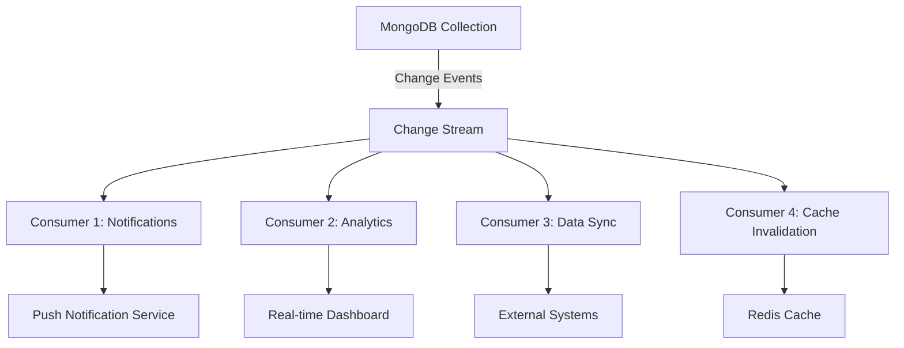

# MongoDB Change Stream Applications

In this tutorial, we'll explore practical applications of MongoDB Change Streams and how they can be implemented in real-world scenarios. You'll learn how to leverage Change Streams to build responsive, event-driven applications that react to data changes in real-time.

## Introduction to Change Stream Applications

Change Streams are a powerful feature in MongoDB that allow applications to subscribe to changes occurring in collections or databases. Instead of constantly polling the database for updates, applications can listen for specific events and respond accordingly. This capability opens up many possibilities for real-time applications.

Some key benefits of using Change Streams in applications:

- **Real-time responsiveness**: Act on data changes immediately
- **Reduced database load**: Eliminate the need for polling
- **Event-driven architectures**: Build reactive systems that respond to changes
- **Decoupled systems**: Separate data producers from consumers

Let's explore some common use cases and how to implement them.

## Common Change Stream Applications

### 1. Real-time Notification Systems

One of the most common applications of Change Streams is building notification systems that alert users or systems about relevant data changes.

#### Example: Building a User Activity Notification System

Let's say we have a social media application where users want to be notified when someone interacts with their posts:

```javascript
const { MongoClient } = require('mongodb');

async function monitorUserActivity() {
  const client = new MongoClient('mongodb://localhost:27017');
  
  try {
    await client.connect();
    console.log('Connected to MongoDB');
    
    const database = client.db('socialApp');
    const interactions = database.collection('interactions');
    
    // Watch for new interactions
    const changeStream = interactions.watch([
      {
        $match: {
          operationType: 'insert',
          'fullDocument.targetUserId': 'user123' // Filter for a specific user
        }
      }
    ]);
    
    console.log('Change stream established, waiting for interactions...');
    
    // Process each change event
    changeStream.on('change', (change) => {
      const interaction = change.fullDocument;
      console.log('New interaction detected:', interaction);
      
      // Send notification to the user
      sendNotification(
        interaction.targetUserId,
        `${interaction.sourceUserName} ${interaction.actionType} your post`
      );
    });
    
    // Error handling
    changeStream.on('error', (error) => {
      console.error('Error in change stream:', error);
    });
  } catch (error) {
    console.error('Error connecting to MongoDB:', error);
  }
}

// Simulate notification sending
function sendNotification(userId, message) {
  console.log(`Notification to ${userId}: ${message}`);
  // In a real application, this would send push notifications,
  // emails, or update a notifications collection
}

monitorUserActivity();
```

**Output:**
```
Connected to MongoDB
Change stream established, waiting for interactions...
New interaction detected: {
  _id: ObjectId("6123456789abcdef12345678"),
  sourceUserId: "user456",
  sourceUserName: "Jane Doe",
  targetUserId: "user123",
  actionType: "liked",
  postId: "post789",
  timestamp: ISODate("2023-10-15T14:28:45.123Z")
}
Notification to user123: Jane Doe liked your post
```

### 2. Data Synchronization Between Systems

Change Streams are excellent for keeping multiple systems synchronized by propagating changes from one data store to another.

#### Example: Syncing MongoDB Data to Elasticsearch

```javascript
const { MongoClient } = require('mongodb');
const { Client } = require('@elastic/elasticsearch');

async function syncToElasticsearch() {
  // MongoDB connection
  const mongoClient = new MongoClient('mongodb://localhost:27017');
  
  // Elasticsearch connection
  const esClient = new Client({ node: 'http://localhost:9200' });
  
  try {
    await mongoClient.connect();
    console.log('Connected to MongoDB');
    
    const database = mongoClient.db('productCatalog');
    const products = database.collection('products');
    
    // Watch for product changes
    const changeStream = products.watch([], { fullDocument: 'updateLookup' });
    
    console.log('Change stream established, waiting for product changes...');
    
    changeStream.on('change', async (change) => {
      const { operationType, fullDocument, documentKey } = change;
      
      try {
        switch (operationType) {
          case 'insert':
          case 'update':
          case 'replace':
            // Index or update document in Elasticsearch
            await esClient.index({
              index: 'products',
              id: documentKey._id.toString(),
              document: {
                id: documentKey._id.toString(),
                name: fullDocument.name,
                price: fullDocument.price,
                description: fullDocument.description,
                category: fullDocument.category,
                // Map other fields as needed
              }
            });
            console.log(`Indexed product ${documentKey._id} in Elasticsearch`);
            break;
            
          case 'delete':
            // Remove document from Elasticsearch
            await esClient.delete({
              index: 'products',
              id: documentKey._id.toString()
            });
            console.log(`Deleted product ${documentKey._id} from Elasticsearch`);
            break;
        }
      } catch (error) {
        console.error('Elasticsearch sync error:', error);
      }
    });
    
    changeStream.on('error', (error) => {
      console.error('Change stream error:', error);
    });
  } catch (error) {
    console.error('Error setting up sync:', error);
  }
}

syncToElasticsearch();
```

This pattern ensures that your search index stays up-to-date with your primary database without needing batch jobs or frequent re-indexing.

### 3. Analytics and Auditing

Change Streams can power real-time analytics dashboards and audit logs by tracking all modifications to sensitive data.

#### Example: Creating an Audit Trail for Financial Transactions

```javascript
const { MongoClient } = require('mongodb');

async function auditFinancialTransactions() {
  const client = new MongoClient('mongodb://localhost:27017');
  
  try {
    await client.connect();
    const database = client.db('financialSystem');
    const transactions = database.collection('transactions');
    const auditLogs = database.collection('auditLogs');
    
    // Watch for all changes to transactions
    const changeStream = transactions.watch();
    
    console.log('Monitoring financial transactions...');
    
    changeStream.on('change', async (change) => {
      // Create audit record
      const auditEntry = {
        timestamp: new Date(),
        operation: change.operationType,
        documentId: change.documentKey._id,
        user: change.fullDocument?.modifiedBy || 'system',
        collectionName: 'transactions',
        // For updates, store what changed
        updateDescription: change.updateDescription,
        // Store additional metadata
        clientInfo: {
          applicationName: change.connectionInformation?.applicationName,
          clientAddress: change.connectionInformation?.clientAddress
        }
      };
      
      // Save to audit collection
      await auditLogs.insertOne(auditEntry);
      
      console.log(`Audit log created for ${change.operationType} operation on document ${change.documentKey._id}`);
      
      // For large amounts, trigger alert
      if (change.operationType === 'insert' && 
          change.fullDocument?.amount > 1000000) {
        alertLargeTransaction(change.fullDocument);
      }
    });
  } catch (error) {
    console.error('Error in audit system:', error);
  }
}

function alertLargeTransaction(transaction) {
  console.log(`🚨 ALERT: Large transaction detected! Amount: $${transaction.amount}`);
  // In production, this would send alerts to appropriate channels
}

auditFinancialTransactions();
```

### 4. Cache Invalidation

Keep caches fresh by invalidating or updating them when underlying data changes.

#### Example: Redis Cache Invalidation

```javascript
const { MongoClient } = require('mongodb');
const Redis = require('ioredis');

async function setupCacheInvalidation() {
  const mongoClient = new MongoClient('mongodb://localhost:27017');
  const redisClient = new Redis();
  
  try {
    await mongoClient.connect();
    const database = mongoClient.db('ecommerce');
    const products = database.collection('products');
    
    // Watch for product changes
    const changeStream = products.watch();
    
    changeStream.on('change', async (change) => {
      const productId = change.documentKey._id.toString();
      
      // Clear product cache
      await redisClient.del(`product:${productId}`);
      console.log(`Cache invalidated for product: ${productId}`);
      
      // Also clear any category or listing caches that might include this product
      if (change.operationType === 'update' && 
          change.updateDescription?.updatedFields?.category) {
        // If category changed, invalidate category caches
        await redisClient.del('categories:featured');
        await redisClient.del(`category:${change.fullDocument.category}`);
        console.log('Category caches invalidated');
      }
      
      // Invalidate search results that might include this product
      await redisClient.keys('search:*').then(keys => {
        if (keys.length > 0) {
          return redisClient.del(keys);
        }
      });
    });
    
    console.log('Cache invalidation system ready');
  } catch (error) {
    console.error('Error setting up cache invalidation:', error);
  }
}

setupCacheInvalidation();
```

## Advanced Change Stream Patterns

### Handling Resume Tokens for Resilience

For production applications, you need to handle network interruptions or server restarts by storing and using resume tokens:

```javascript
const { MongoClient } = require('mongodb');
const fs = require('fs').promises;

async function resumableChangeStream() {
  const RESUME_TOKEN_FILE = './resumeToken.json';
  const client = new MongoClient('mongodb://localhost:27017');
  
  try {
    await client.connect();
    const database = client.db('myapp');
    const collection = database.collection('data');
    
    // Try to load existing resume token
    let resumeToken;
    try {
      const tokenData = await fs.readFile(RESUME_TOKEN_FILE, 'utf8');
      resumeToken = JSON.parse(tokenData);
      console.log('Resuming from saved token');
    } catch (err) {
      console.log('No resume token found, starting fresh');
    }
    
    // Create pipeline with resumeAfter if token exists
    const pipeline = [];
    const options = { fullDocument: 'updateLookup' };
    
    if (resumeToken) {
      options.resumeAfter = resumeToken;
    }
    
    const changeStream = collection.watch(pipeline, options);
    
    // Process changes and save resume token periodically
    changeStream.on('change', async (change) => {
      try {
        console.log('Processing change:', change.operationType);
        
        // Process the change here...
        
        // Save resume token after processing
        await fs.writeFile(
          RESUME_TOKEN_FILE, 
          JSON.stringify(change._id),
          'utf8'
        );
      } catch (error) {
        console.error('Error processing change:', error);
      }
    });
    
    changeStream.on('error', (error) => {
      console.error('Change stream error:', error);
      // Implement reconnect logic here
    });
    
    console.log('Change stream established');
  } catch (error) {
    console.error('Failed to establish change stream:', error);
  }
}

resumableChangeStream();
```

### Distributed Processing with Multiple Consumers

For high-throughput applications, you might need multiple consumers processing change events:



Each consumer can use its own resume token and filtering pipeline to focus on relevant changes.

## Performance and Best Practices

When implementing Change Stream applications in production, consider these best practices:

1. **Use appropriate filters**: Narrow down the events you're watching to reduce processing overhead.

2. **Handle errors gracefully**: Implement reconnection logic and error reporting.

3. **Manage resume tokens carefully**: Store tokens durably to resume after disconnections.

4. **Consider change volume**: For high-volume collections, distribute processing across multiple consumers.

5. **Mind the oplog**: Change Streams rely on the oplog, so ensure it's sized appropriately.

6. **Process events efficiently**: Keep event handlers lightweight to avoid backlogs.

7. **Consider batching**: For high-volume updates to external systems, consider batching operations.

## Example: Building a Real-time Dashboard

Let's combine several concepts to build a real-time analytics dashboard that tracks user activity:

```javascript
const { MongoClient } = require('mongodb');
const WebSocket = require('ws');

async function userActivityDashboard() {
  // Set up MongoDB connection
  const client = new MongoClient('mongodb://localhost:27017');
  await client.connect();
  const database = client.db('analytics');
  const userActivity = database.collection('userActivity');
  
  // Set up WebSocket server for dashboard
  const wss = new WebSocket.Server({ port: 8080 });
  
  // Track aggregate metrics
  let metrics = {
    activeSessions: 0,
    pageViews: 0,
    signups: 0,
    purchases: 0
  };
  
  // Watch for new user activity
  const changeStream = userActivity.watch([
    { $match: { operationType: 'insert' } }
  ]);
  
  changeStream.on('change', (change) => {
    const activity = change.fullDocument;
    
    // Update metrics based on activity type
    switch (activity.type) {
      case 'session_start':
        metrics.activeSessions++;
        break;
      case 'session_end':
        metrics.activeSessions = Math.max(0, metrics.activeSessions - 1);
        break;
      case 'page_view':
        metrics.pageViews++;
        break;
      case 'signup':
        metrics.signups++;
        break;
      case 'purchase':
        metrics.purchases++;
        break;
    }
    
    // Broadcast updated metrics to all connected dashboards
    const update = JSON.stringify({
      metrics,
      lastActivity: {
        type: activity.type,
        userId: activity.userId,
        timestamp: activity.timestamp
      }
    });
    
    wss.clients.forEach((client) => {
      if (client.readyState === WebSocket.OPEN) {
        client.send(update);
      }
    });
    
    console.log('Dashboard updated:', metrics);
  });
  
  // Handle WebSocket connections
  wss.on('connection', (ws) => {
    console.log('Dashboard client connected');
    // Send current metrics to new connections
    ws.send(JSON.stringify({ metrics }));
  });
  
  console.log('Real-time dashboard running on ws://localhost:8080');
}

userActivityDashboard().catch(console.error);
```

This example shows how Change Streams can power a real-time dashboard without constantly querying the database.

## Summary

In this tutorial, we've explored practical applications of MongoDB Change Streams, demonstrating how they can be implemented for:

- Real-time notification systems
- Data synchronization between systems
- Analytics and audit logging
- Cache invalidation
- Resilient change processing with resume tokens
- Real-time dashboards

Change Streams provide a powerful foundation for building event-driven applications that respond immediately to data changes. By leveraging this feature, you can create more responsive, efficient, and decoupled systems.

## Additional Resources

- [MongoDB Change Streams Documentation](https://www.mongodb.com/docs/manual/changeStreams/)
- [Node.js MongoDB Driver API](https://mongodb.github.io/node-mongodb-native/4.0/classes/collection.html#watch)
- [Change Events Response Document](https://www.mongodb.com/docs/manual/reference/change-events/)

## Exercises

1. Modify the notification example to filter for multiple types of events (likes, comments, follows).

2. Create a change stream application that tracks inventory levels and alerts when stock falls below a threshold.

3. Implement a system that uses change streams to maintain aggregated statistics (e.g., total sales by product category).

4. Extend the data synchronization example to handle retries and conflict resolution.

5. Build a change stream processor that handles document versioning by storing previous versions of documents when they're updated.