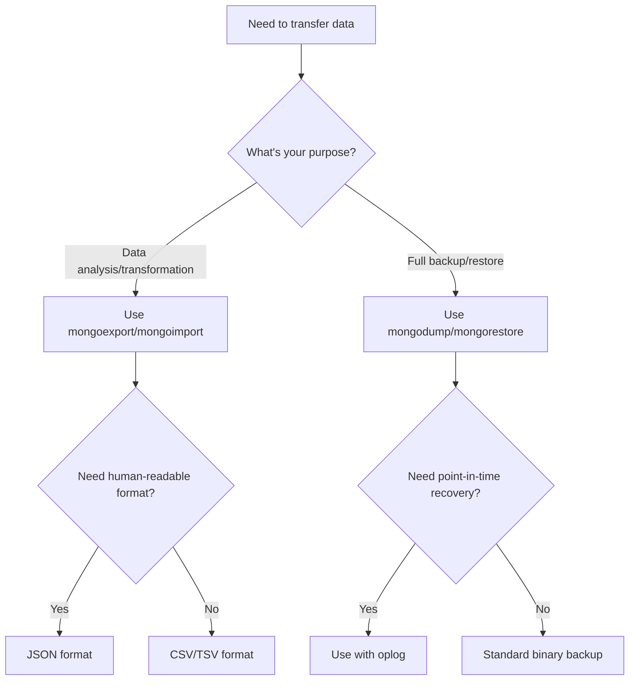

# MongoDB Import Export

In this tutorial, you'll learn how to efficiently move data in and out of MongoDB using its native import and export utilities. These tools are essential for database migration, backup strategies, and transferring data between environments.

## Introduction

Data migration is a fundamental operation when working with databases. Whether you're moving to a new server, backing up your data, or transferring information between development and production environments, MongoDB provides powerful tools to handle these tasks:

1. **mongoexport/mongoimport** - For exporting and importing data in JSON, CSV, or TSV formats
2. **mongodump/mongorestore** - For binary backups of entire databases or collections

Understanding these tools will help you manage your MongoDB data effectively and safely.

## Prerequisites

Before we begin, ensure you have:

- MongoDB installed on your system
- Basic knowledge of MongoDB concepts
- Access to a MongoDB database
- MongoDB command-line tools installed

## Command-line Export Tools

### mongoexport

The `mongoexport` utility creates a JSON or CSV export of data stored in a MongoDB instance.

#### Basic Syntax

```bash
mongoexport --uri="mongodb://host:port/database" --collection=collectionName --out=outputFile.json
```

#### Common Options

- `--uri`: Connection string to your MongoDB instance
- `--collection`: The collection to export
- `--out`: Output file path
- `--fields`: Fields to export (comma-separated)
- `--type`: Output format (json, csv)
- `--query`: Filter documents to export

#### Example 1: Export a Collection to JSON

Let's export a collection named "products" to a JSON file:

```bash
mongoexport --uri="mongodb://localhost:27017/ecommerce" --collection=products --out=products.json
```

**Output:**
```
2023-10-20T14:25:32.637+0000    connected to: mongodb://localhost:27017/ecommerce
2023-10-20T14:25:32.680+0000    exported 1250 records to products.json
```

#### Example 2: Export Specific Fields to CSV

To export only certain fields from the "users" collection:

```bash
mongoexport --uri="mongodb://localhost:27017/ecommerce" \
  --collection=users \
  --fields=username,email,signup_date \
  --type=csv \
  --out=users.csv
```

**Output:**
```
2023-10-20T14:32:20.107+0000    connected to: mongodb://localhost:27017/ecommerce
2023-10-20T14:32:20.257+0000    exported 850 records to users.csv
```

#### Example 3: Export with a Query Filter

Export only products with category "electronics":

```bash
mongoexport --uri="mongodb://localhost:27017/ecommerce" \
  --collection=products \
  --query='{"category":"electronics"}' \
  --out=electronics.json
```

**Output:**
```
2023-10-20T14:38:12.481+0000    connected to: mongodb://localhost:27017/ecommerce
2023-10-20T14:38:12.532+0000    exported 342 records to electronics.json
```

### mongoimport

The `mongoimport` utility imports content from a JSON, CSV, or TSV file into a MongoDB instance.

#### Basic Syntax

```bash
mongoimport --uri="mongodb://host:port/database" --collection=collectionName --file=inputFile.json
```

#### Common Options

- `--uri`: Connection string to your MongoDB instance
- `--collection`: Target collection
- `--file`: Input file path
- `--type`: Input format (json, csv, tsv)
- `--headerline`: Use the first line as field names (for CSV/TSV)
- `--drop`: Drop collection before importing
- `--mode`: Insert mode (insert, upsert, merge)

#### Example 1: Import JSON Data

Import the products file we exported earlier:

```bash
mongoimport --uri="mongodb://localhost:27017/newstore" \
  --collection=products \
  --file=products.json
```

**Output:**
```
2023-10-20T14:45:22.338+0000    connected to: mongodb://localhost:27017/newstore
2023-10-20T14:45:22.484+0000    1250 document(s) imported successfully
```

#### Example 2: Import CSV with Headers

For importing a CSV file with headers:

```bash
mongoimport --uri="mongodb://localhost:27017/newstore" \
  --collection=users \
  --type=csv \
  --headerline \
  --file=users.csv
```

**Output:**
```
2023-10-20T14:48:15.629+0000    connected to: mongodb://localhost:27017/newstore
2023-10-20T14:48:15.772+0000    850 document(s) imported successfully
```

#### Example 3: Import with Upsert

Import and update existing documents based on a specific field:

```bash
mongoimport --uri="mongodb://localhost:27017/newstore" \
  --collection=products \
  --file=updated_products.json \
  --upsertFields=product_id \
  --mode=upsert
```

**Output:**
```
2023-10-20T14:53:07.112+0000    connected to: mongodb://localhost:27017/newstore
2023-10-20T14:53:07.240+0000    300 document(s) imported successfully
2023-10-20T14:53:07.240+0000    150 document(s) updated, 150 document(s) created
```

## Binary Export Tools

### mongodump

The `mongodump` utility creates a binary export (BSON) of the content of a MongoDB database.

#### Basic Syntax

```bash
mongodump --uri="mongodb://host:port/database" --out=outputDirectory
```

#### Common Options

- `--uri`: Connection string to your MongoDB instance
- `--out`: Output directory
- `--collection`: Collection to dump
- `--db`: Database to dump
- `--query`: Filter documents to dump
- `--gzip`: Compress the output files

#### Example 1: Full Database Dump

Create a binary backup of the entire database:

```bash
mongodump --uri="mongodb://localhost:27017/ecommerce" --out=./backup
```

**Output:**
```
2023-10-20T15:05:32.214+0000    writing ecommerce.products to backup/ecommerce/products.bson
2023-10-20T15:05:32.284+0000    writing ecommerce.users to backup/ecommerce/users.bson
2023-10-20T15:05:32.315+0000    done dumping ecommerce.products (1250 documents)
2023-10-20T15:05:32.352+0000    done dumping ecommerce.users (850 documents)
```

#### Example 2: Dump a Specific Collection with Compression

Dump only the products collection with compression:

```bash
mongodump --uri="mongodb://localhost:27017/ecommerce" \
  --collection=products \
  --out=./backup \
  --gzip
```

**Output:**
```
2023-10-20T15:08:43.491+0000    writing ecommerce.products to backup/ecommerce/products.bson.gz
2023-10-20T15:08:43.597+0000    done dumping ecommerce.products (1250 documents)
```

### mongorestore

The `mongorestore` utility loads data from a binary database dump into a MongoDB instance.

#### Basic Syntax

```bash
mongorestore --uri="mongodb://host:port/database" dumpDirectory
```

#### Common Options

- `--uri`: Connection string to your MongoDB instance
- `--dir`: Source directory
- `--drop`: Drop collections before importing
- `--gzip`: Restore from compressed files
- `--nsInclude`: Include specific namespaces
- `--nsExclude`: Exclude specific namespaces

#### Example 1: Restore Entire Database

Restore a full database from backup:

```bash
mongorestore --uri="mongodb://localhost:27017/restored_ecommerce" --dir=./backup/ecommerce
```

**Output:**
```
2023-10-20T15:15:28.105+0000    preparing collections to restore from
2023-10-20T15:15:28.118+0000    reading metadata for restored_ecommerce.products from backup/ecommerce/products.metadata.json
2023-10-20T15:15:28.122+0000    reading metadata for restored_ecommerce.users from backup/ecommerce/users.metadata.json
2023-10-20T15:15:28.293+0000    restored 1250 documents to restored_ecommerce.products
2023-10-20T15:15:28.385+0000    restored 850 documents to restored_ecommerce.users
2023-10-20T15:15:28.385+0000    finished restoring restored_ecommerce.products (1250 documents, 0 failures)
2023-10-20T15:15:28.385+0000    finished restoring restored_ecommerce.users (850 documents, 0 failures)
2023-10-20T15:15:28.385+0000    2100 document(s) restored successfully
```

#### Example 2: Restore Compressed Collection with Drop

Restore a specific compressed collection, dropping the existing one first:

```bash
mongorestore --uri="mongodb://localhost:27017/restored_ecommerce" \
  --gzip \
  --drop \
  --nsInclude=ecommerce.products \
  ./backup
```

**Output:**
```
2023-10-20T15:19:17.203+0000    preparing collections to restore from
2023-10-20T15:19:17.224+0000    reading metadata for restored_ecommerce.products from backup/ecommerce/products.metadata.json.gz
2023-10-20T15:19:17.251+0000    dropping restored_ecommerce.products
2023-10-20T15:19:17.369+0000    restored 1250 documents to restored_ecommerce.products
2023-10-20T15:19:17.369+0000    finished restoring restored_ecommerce.products (1250 documents, 0 failures)
2023-10-20T15:19:17.369+0000    1250 document(s) restored successfully
```

## Real-World Applications

### Scenario 1: Database Migration Between Environments

When migrating from a development environment to a production environment:

```bash
# Step 1: Dump the development database
mongodump --uri="mongodb://dev-server:27017/dev_db" --out=./migration_backup

# Step 2: Restore to production (consider excluding certain collections like logs)
mongorestore --uri="mongodb://prod-server:27017/prod_db" \
  --nsExclude="dev_db.logs" \
  --dir=./migration_backup/dev_db
```

### Scenario 2: Data Transformation Pipeline

To transform data during migration:

```bash
# Step 1: Export the collection to JSON
mongoexport --uri="mongodb://localhost:27017/old_format" \
  --collection=customers \
  --out=customers_old.json

# Step 2: Process the JSON with a transformation script (example in Node.js)
node transform_customers.js

# Step 3: Import the transformed data
mongoimport --uri="mongodb://localhost:27017/new_format" \
  --collection=customers \
  --file=customers_new.json
```

The transformation script (`transform_customers.js`) might look like:

```javascript
const fs = require('fs');

// Read the exported JSON file
const customers = JSON.parse(fs.readFileSync('customers_old.json', 'utf8'));

// Transform each customer document
const transformedCustomers = customers.map(customer => {
  // Combine first and last name into full name
  const fullName = `${customer.firstName} ${customer.lastName}`;
  
  // Format phone number
  const formattedPhone = customer.phone.replace(/(\d{3})(\d{3})(\d{4})/, '($1) $2-$3');
  
  return {
    name: fullName,
    email: customer.email,
    phone: formattedPhone,
    // Add some computed field
    memberSince: new Date(customer.createdAt).getFullYear()
  };
});

// Write the transformed data
fs.writeFileSync('customers_new.json', JSON.stringify(transformedCustomers, null, 2));
```

### Scenario 3: Regular Database Backups

Create a scheduled backup script:

```bash
#!/bin/bash
# backup_mongo.sh

# Set variables
TIMESTAMP=$(date +%Y%m%d_%H%M%S)
BACKUP_DIR="/backups/mongodb/$TIMESTAMP"
LOG_FILE="/var/log/mongo_backup.log"
DB_URI="mongodb://localhost:27017/production"

# Create backup directory
mkdir -p $BACKUP_DIR

# Perform the backup
echo "Starting backup at $(date)" >> $LOG_FILE
mongodump --uri=$DB_URI --out=$BACKUP_DIR --gzip >> $LOG_FILE 2>&1

# Cleanup old backups (keep last 7 days)
find /backups/mongodb -type d -mtime +7 -exec rm -rf {} \; 2>/dev/null

echo "Backup completed at $(date)" >> $LOG_FILE
```

Add this script to your crontab to run daily:

```bash
# Run backup daily at 2 AM
0 2 * * * /path/to/backup_mongo.sh
```

## Best Practices for Import and Export

1. **Plan for downtime**: Large imports/exports can affect database performance
2. **Test in staging**: Always test migrations in a non-production environment first
3. **Use indexes wisely**: Drop indexes before large imports and recreate them after
4. **Consider data validation**: Validate imported data for integrity
5. **Mind the memory**: Large datasets may require streaming operations
6. **Secure your data**: Be cautious with exported data that may contain sensitive information
7. **Use compression**: For large datasets, use gzip to reduce file sizes
8. **Backup before import**: Always create backups before importing data

## Choosing Between Text and Binary Tools



- **Use mongoexport/mongoimport when**:
  - You need to transform data
  - You need human-readable formats
  - You're working with small to medium datasets
  - You need to import data into a different system

- **Use mongodump/mongorestore when**:
  - You need full database backups
  - You're working with large datasets
  - You need to preserve full data fidelity (including data types)
  - Performance is critical

## Common Issues and Solutions

### Import/Export Errors

1. **Connection issues**:
   ```
   Failed to connect to localhost:27017: Connection refused
   ```
   **Solution**: Verify MongoDB is running and check connection string parameters.

2. **Permission issues**:
   ```
   not authorized on admin to execute command
   ```
   **Solution**: Use appropriate credentials with the `--username` and `--password` options.

3. **File format issues**:
   ```
   JSON parse error
   ```
   **Solution**: Validate JSON format before import.

4. **Timeout errors**:
   ```
   Operation exceeded time limit
   ```
   **Solution**: Use `--numInsertionWorkers` to parallelize or increase timeout with `--socketTimeoutMS`.

## Summary

MongoDB provides powerful tools for importing and exporting data that are essential for database management:

- **mongoexport/mongoimport**: Text-based tools for JSON, CSV, and TSV formats
- **mongodump/mongorestore**: Binary tools for complete database backups and restores

Each tool has specific use cases and options to handle various data migration scenarios. By understanding their capabilities and best practices, you can efficiently manage your MongoDB data migrations and backups.

## Additional Resources

For further learning, consider these topics:

- MongoDB Atlas migration tools
- Sharded cluster backup strategies
- Replica set backup considerations
- Point-in-time recovery with oplog
- Automation tools for database management

## Exercises

1. Export a collection to JSON and modify one field, then import it back.
2. Create a script that backs up a database and sends a notification upon completion.
3. Practice restoring a database to a specific point in time.
4. Export data using different query filters and compare the results.
5. Create a data transformation pipeline that exports, transforms, and imports data with a custom script.