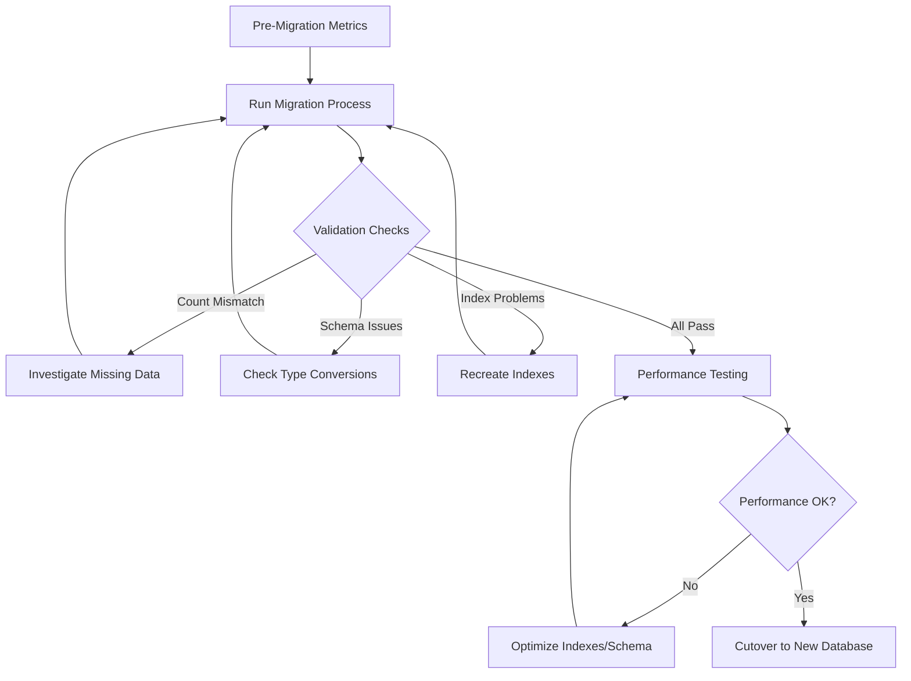

# MongoDB Migration Validation

Ensuring your data migrates correctly between MongoDB instances is a critical step that should never be skipped. In this lesson, we'll explore the important techniques and practices for validating MongoDB migrations to prevent data loss and maintain data integrity.

## Introduction to Migration Validation

When migrating data between MongoDB deployments, whether it's between development and production environments, during version upgrades, or when moving to a new infrastructure, validation is a crucial step that confirms your data has been transferred correctly and completely.

Migration validation ensures:
- All expected data was transferred
- Data integrity was maintained during migration
- No corruption or transformation errors occurred
- Indexes and performance characteristics are preserved

## Why Validation Matters

Consider a scenario where you're migrating a production e-commerce database. Without proper validation, you might miss critical customer orders or payment information, leading to:

1. Financial losses
2. Customer trust issues
3. Compliance violations
4. Extended system downtime

Let's explore the essential validation techniques to prevent these issues.

## Pre-Migration Validation Steps

Before beginning your migration, perform these important preparatory validation steps:

### 1. Document Your Source Data

```javascript
// Count documents in each collection
db.getCollectionNames().forEach(function(collectionName) {
  const count = db[collectionName].countDocuments({});
  print(`${collectionName}: ${count} documents`);
});
```

**Output:**
```
users: 5432 documents
orders: 23456 documents
products: 1200 documents
inventory: 1150 documents
```

### 2. Validate Database Integrity

```javascript
// Validate collection integrity on source database
db.runCommand({ validate: "users", full: true });
```

**Output:**
```json
{
  "ns" : "mystore.users",
  "nrecords" : 5432,
  "nIndexes" : 3,
  "keysPerIndex" : {
    "users_1" : 5432,
    "email_1" : 5432,
    "username_1" : 5432
  },
  "valid" : true,
  "errors" : [ ],
  "warning" : [ ],
  "ok" : 1
}
```

### 3. Document Schema and Indexes

```javascript
// Get all indexes for a collection
function getCollectionIndexes(collName) {
  print(`Indexes for ${collName}:`);
  db[collName].getIndexes().forEach(function(idx) {
    print(JSON.stringify(idx));
  });
}

// Example usage
getCollectionIndexes("users");
```

**Output:**
```json
Indexes for users:
{"v":2,"key":{"_id":1},"name":"_id_"}
{"v":2,"key":{"email":1},"name":"email_1","unique":true}
{"v":2,"key":{"username":1},"name":"username_1","unique":true}
```

## Post-Migration Validation Strategies

After completing your migration, use these techniques to verify success:

### 1. Count-Based Validation

The simplest validation is comparing document counts between source and target databases:

```javascript
// Source database count
const sourceCount = db.users.countDocuments({});

// Connect to target database
// const targetDb = connect("mongodb://target-server:27017/mydb");

// Target database count
const targetCount = db.users.countDocuments({});

// Compare counts
if (sourceCount === targetCount) {
  print("Document count matches! Source:", sourceCount, "Target:", targetCount);
} else {
  print("WARNING: Count mismatch! Source:", sourceCount, "Target:", targetCount);
}
```

### 2. Sample-Based Validation

Checking random document samples across collections:

```javascript
// Function to compare random documents
function validateRandomDocuments(collection, sampleSize = 10) {
  print(`Validating ${sampleSize} random documents from ${collection}...`);
  
  // Get random sample from source collection
  const sourceSample = db[collection].aggregate([
    { $sample: { size: sampleSize } }
  ]).toArray();
  
  let matchCount = 0;
  
  // Check each document in target
  sourceSample.forEach(function(doc) {
    const targetDoc = db[collection].findOne({ _id: doc._id });
    
    if (targetDoc && JSON.stringify(doc) === JSON.stringify(targetDoc)) {
      matchCount++;
    } else {
      print(`Mismatch found for document with _id: ${doc._id}`);
    }
  });
  
  print(`Matched ${matchCount}/${sampleSize} documents`);
  return matchCount === sampleSize;
}

// Example usage
validateRandomDocuments("orders", 20);
```

### 3. Checksum-Based Validation

For more comprehensive validation, you can calculate checksums of collections:

```javascript
// Function to calculate collection checksum
function getCollectionChecksum(collName) {
  // Get all documents sorted by _id to ensure consistent order
  const docs = db[collName].find().sort({_id: 1}).toArray();
  
  // Convert to string and create a simple hash
  let checksum = 0;
  const jsonStr = JSON.stringify(docs);
  
  // Simple string hash function
  for (let i = 0; i < jsonStr.length; i++) {
    const char = jsonStr.charCodeAt(i);
    checksum = ((checksum << 5) - checksum) + char;
    checksum = checksum & checksum; // Convert to 32bit integer
  }
  
  return checksum;
}

// Compare checksums between source and target
const sourceChecksum = getCollectionChecksum("products");
// Connect to target and get checksum
const targetChecksum = getCollectionChecksum("products");

if (sourceChecksum === targetChecksum) {
  print("Checksum validation passed!");
} else {
  print("WARNING: Checksum mismatch!");
}
```

### 4. Schema Validation

Ensuring your schema transferred correctly:

```javascript
// Check for schema consistency on a sample document
function validateSchema(collection) {
  // Get a sample document
  const sampleDoc = db[collection].findOne();
  if (!sampleDoc) return true; // Empty collection
  
  // Get document keys from source
  const sourceKeys = Object.keys(sampleDoc).sort().join(',');
  
  // Get a document with the same _id from target
  const targetDoc = db[collection].findOne({_id: sampleDoc._id});
  if (!targetDoc) {
    print(`Document with _id ${sampleDoc._id} missing in target!`);
    return false;
  }
  
  // Get target keys
  const targetKeys = Object.keys(targetDoc).sort().join(',');
  
  // Compare key structures
  if (sourceKeys !== targetKeys) {
    print(`Schema mismatch in ${collection}!`);
    print(`Source keys: ${sourceKeys}`);
    print(`Target keys: ${targetKeys}`);
    return false;
  }
  
  return true;
}

// Example usage
validateSchema("users");
```

### 5. Index Validation

Ensuring indexes are properly recreated:

```javascript
// Compare indexes between source and target databases
function validateIndexes(collection) {
  // Get source indexes
  const sourceIndexes = db[collection].getIndexes();
  
  // Get target indexes (assuming we've connected to target)
  const targetIndexes = db[collection].getIndexes();
  
  // Compare index count
  if (sourceIndexes.length !== targetIndexes.length) {
    print(`Index count mismatch! Source: ${sourceIndexes.length}, Target: ${targetIndexes.length}`);
    return false;
  }
  
  // Compare each index
  for (let i = 0; i < sourceIndexes.length; i++) {
    const srcIdx = sourceIndexes[i];
    
    // Find matching index in target
    const matchingIdx = targetIndexes.find(idx => 
      JSON.stringify(idx.key) === JSON.stringify(srcIdx.key));
    
    if (!matchingIdx) {
      print(`Missing index in target: ${JSON.stringify(srcIdx.key)}`);
      return false;
    }
  }
  
  print(`All indexes for ${collection} validated successfully`);
  return true;
}

// Example usage
validateIndexes("users");
```

## Automated Migration Validation Pipeline

For larger migrations, creating an automated validation pipeline can help ensure thorough and repeatable validation.

Here's a simple validation script example:

```javascript
// Comprehensive validation script
function validateMigration() {
  const collections = db.getCollectionNames();
  const results = {
    collectionCount: collections.length,
    validated: 0,
    failures: []
  };
  
  collections.forEach(collection => {
    print(`\n=== Validating collection: ${collection} ===`);
    
    // Skip system collections
    if (collection.startsWith('system.')) {
      print("Skipping system collection");
      return;
    }
    
    // 1. Count validation
    const sourceCount = db[collection].countDocuments({});
    const targetCount = db[collection].countDocuments({});
    
    if (sourceCount !== targetCount) {
      results.failures.push({
        collection,
        error: "Count mismatch",
        source: sourceCount,
        target: targetCount
      });
      print(`❌ Count mismatch! Source: ${sourceCount}, Target: ${targetCount}`);
      return;
    }
    print(`✓ Document count matches: ${sourceCount}`);
    
    // 2. Index validation
    if (!validateIndexes(collection)) {
      results.failures.push({
        collection,
        error: "Index mismatch"
      });
      return;
    }
    print(`✓ Indexes validated successfully`);
    
    // 3. Sample document validation
    if (!validateRandomDocuments(collection, 5)) {
      results.failures.push({
        collection,
        error: "Sample document mismatch"
      });
      return;
    }
    print(`✓ Sample documents validated`);
    
    // If all tests pass, mark as validated
    results.validated++;
  });
  
  // Print summary
  print("\n=== Migration Validation Summary ===");
  print(`Collections: ${results.collectionCount}`);
  print(`Successfully validated: ${results.validated}`);
  print(`Failed: ${results.failures.length}`);
  
  if (results.failures.length > 0) {
    print("Failed collections:");
    results.failures.forEach(f => {
      print(`- ${f.collection}: ${f.error}`);
    });
  }
  
  return results;
}

// Run the validation
validateMigration();
```

## Real-World Example: E-commerce Migration Validation

Let's walk through a practical example of validating an e-commerce database migration:

```javascript
// Connect to source database (already connected in this example)
// const sourceDb = db;

// Connect to target database
// const targetDb = connect("mongodb://new-server:27017/ecommerce");

// 1. Basic collection counts
print("Validating document counts...");
const collections = ["users", "products", "orders", "payments", "reviews"];

collections.forEach(collection => {
  const sourceCount = db[collection].countDocuments({});
  const targetCount = db[collection].countDocuments({});
  
  if (sourceCount === targetCount) {
    print(`✓ ${collection}: ${sourceCount} documents`);
  } else {
    print(`❌ ${collection}: Source=${sourceCount}, Target=${targetCount}`);
  }
});

// 2. Critical business data validation
print("\nValidating critical business data...");

// Check recent orders (last 24 hours)
const yesterday = new Date(new Date().setDate(new Date().getDate() - 1));
const recentOrdersSource = db.orders.countDocuments({createdAt: {$gte: yesterday}});
const recentOrdersTarget = db.orders.countDocuments({createdAt: {$gte: yesterday}});

print(`Recent orders: Source=${recentOrdersSource}, Target=${recentOrdersTarget}`);

// Check total revenue
const sourceRevenue = db.orders.aggregate([
  {$match: {status: "completed"}},
  {$group: {_id: null, total: {$sum: "$total"}}}
]).toArray()[0]?.total || 0;

const targetRevenue = db.orders.aggregate([
  {$match: {status: "completed"}},
  {$group: {_id: null, total: {$sum: "$total"}}}
]).toArray()[0]?.total || 0;

print(`Total revenue: Source=$${sourceRevenue.toFixed(2)}, Target=$${targetRevenue.toFixed(2)}`);

// 3. Validate specific critical documents
print("\nValidating specific critical documents...");

// Check VIP customer data
const vipCustomers = db.users.find({vipStatus: true}).toArray();
print(`Found ${vipCustomers.length} VIP customers to validate`);

let vipMismatchCount = 0;
vipCustomers.forEach(vipUser => {
  const targetVipUser = db.users.findOne({_id: vipUser._id});
  
  if (!targetVipUser || targetVipUser.vipStatus !== true) {
    print(`❌ VIP customer mismatch: ${vipUser._id} (${vipUser.email})`);
    vipMismatchCount++;
  }
});

if (vipMismatchCount === 0) {
  print("✓ All VIP customers validated successfully");
}
```

## Performance Validation

Data correctness is just one aspect of migration validation. You should also validate that your application will perform correctly with the new database:

```javascript
// Query performance test function
function testQueryPerformance(collection, query, limit = 100) {
  print(`Running performance test on ${collection}...`);
  
  // Source DB performance
  const startSource = new Date();
  const sourceResult = db[collection].find(query).limit(limit).explain("executionStats");
  const sourceTime = sourceResult.executionStats.executionTimeMillis;
  
  // Target DB performance (assuming we're connected to target)
  const startTarget = new Date();
  const targetResult = db[collection].find(query).limit(limit).explain("executionStats");
  const targetTime = targetResult.executionStats.executionTimeMillis;
  
  print(`Source execution time: ${sourceTime}ms`);
  print(`Target execution time: ${targetTime}ms`);
  
  // Compare execution plans
  if (JSON.stringify(sourceResult.queryPlanner) !== 
      JSON.stringify(targetResult.queryPlanner)) {
    print("Warning: Different execution plans used!");
  }
  
  return {
    sourceTime,
    targetTime,
    difference: Math.abs(sourceTime - targetTime),
    percentChange: ((targetTime - sourceTime) / sourceTime) * 100
  };
}

// Example performance test
const userQueryTest = testQueryPerformance(
  "users", 
  { lastLogin: { $gt: new Date(new Date().setDate(new Date().getDate() - 30)) } }
);

console.log(`Performance change: ${userQueryTest.percentChange.toFixed(2)}%`);
```

## Migration Validation Checklist

Use this checklist to ensure comprehensive validation of your MongoDB migration:

- [✓] Document counts match between source and target databases
- [✓] Collection statistics (size, storage) are consistent with expectations
- [✓] Indexes are correctly recreated in the target database
- [✓] Random sampling of documents match between source and target
- [✓] Critical business data is accurately migrated
- [✓] Query performance is comparable or better in the target database
- [✓] Application functionality tests pass against the migrated database
- [✓] All data types (especially dates, decimals, and ObjectIDs) migrated correctly
- [✓] Authentication and authorization mechanisms work correctly
- [✓] Backup strategy is implemented for the new database

## Common Validation Issues and Solutions

| Issue | Symptoms | Solution |
|-------|----------|----------|
| Missing documents | Document count mismatch | Check migration script for filtering/limits |
| Data type conversion | Schema inconsistencies | Use explicit type handling in migration scripts |
| Missing indexes | Slow queries after migration | Export and recreate indexes separately |
| Character encoding issues | String field corruption | Ensure consistent character encoding |
| Missing relationships | Broken references | Validate foreign key references |
| Date/time zone issues | Timestamp differences | Standardize on UTC during migration |

## Visual Migration Validation Process



## Summary

Validating MongoDB migrations is a critical step that helps ensure data integrity when moving between environments. By implementing a comprehensive validation strategy—combining document counts, schema validation, data sampling, and performance testing—you can confidently migrate your data while minimizing risks.

Remember these key points:
- Always validate before declaring a migration complete
- Use multiple validation techniques for comprehensive coverage
- Automate validation to make it repeatable and thorough
- Pay special attention to critical business data
- Validate both data correctness AND performance

## Additional Resources

1. MongoDB Documentation: [MongoDB Data Migration Guide](https://www.mongodb.com/docs/manual/core/data-modeling-introduction/)
2. MongoDB University: [M201: MongoDB Performance](https://learn.mongodb.com/courses/m201-mongodb-performance)

## Exercises

1. Create a simple validation script that compares document counts between two MongoDB databases for all collections.

2. Write a function that validates that all indexes from a source database exist in a target database.

3. Develop a schema validation function that ensures the field types match between source and target databases for a given collection.

4. Create a comprehensive validation pipeline for a database with at least three collections, including count validation, sample document validation, and index validation.

5. Implement a performance test that compares query execution times between source and target databases and reports significant differences.