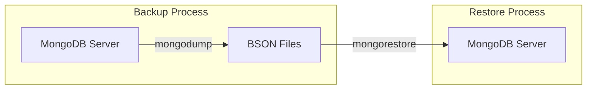

# MongoDB mongorestore

## Introduction

`mongorestore` is a powerful utility tool provided by MongoDB that allows you to restore databases and collections from BSON dump files. These dump files are typically created using the complementary tool `mongodump`. Understanding how to effectively use `mongorestore` is essential for database administrators and developers who need to perform data migrations, create backups, or set up development environments with production-like data.

In this guide, we'll explore:

- What is `mongorestore` and why it's useful
- Basic syntax and command options
- How to restore entire databases or specific collections
- Advanced features for handling various restoration scenarios
- Best practices for optimal use

## What is mongorestore?

`mongorestore` is a command-line utility that imports content from BSON dump files created by `mongodump`. It's part of the MongoDB Database Tools package and functions as the counterpart to `mongodump`.

Key characteristics:

- Recreates data previously backed up by `mongodump`
- Can restore entire databases or selected collections
- Supports both local and remote MongoDB instances
- Provides various options for controlling the restoration process

## Basic Syntax

The basic syntax for the `mongorestore` command is:

```bash
mongorestore [options] [directory or file to restore]
```

If you specify a directory, `mongorestore` will attempt to restore all BSON files in that directory. If you specify a file, it will restore only that file.

### Connection Options

To connect to a MongoDB instance:

```bash
mongorestore --host <hostname> --port <port> --username <username> --password <password> --authenticationDatabase <auth_db> <dump_directory>
```

For example:

```bash
mongorestore --host localhost --port 27017 --username admin --password secret --authenticationDatabase admin ./dump
```

## Common Usage Examples

### Restoring an Entire Database

To restore an entire database:

```bash
mongorestore --db myDatabase ./dump/myDatabase
```

This command will restore all collections found in the `./dump/myDatabase` directory into the `myDatabase` database.

**Example Output:**
```
2023-07-15T14:25:30.123+0000    preparing collections to restore from
2023-07-15T14:25:30.135+0000    restoring myDatabase.users from dump/myDatabase/users.bson
2023-07-15T14:25:30.240+0000    restoring myDatabase.products from dump/myDatabase/products.bson
2023-07-15T14:25:30.349+0000    finished restoring myDatabase.users (1000 documents, 0 failures)
2023-07-15T14:25:30.455+0000    finished restoring myDatabase.products (500 documents, 0 failures)
2023-07-15T14:25:30.456+0000    2 collections restored successfully. 0 failures.
```

### Restoring a Specific Collection

To restore a single collection:

```bash
mongorestore --db myDatabase --collection users ./dump/myDatabase/users.bson
```

This command will only restore the `users` collection to the `myDatabase` database.

### Restoring to a Different Database

You can restore data to a database with a different name:

```bash
mongorestore --nsFrom="originalDB.*" --nsTo="newDB.*" ./dump/originalDB
```

This will restore all collections from `originalDB` to `newDB`.

## Advanced Options

### Drop Option

The `--drop` option drops the collection before restoring it, ensuring a clean slate:

```bash
mongorestore --drop --db myDatabase ./dump/myDatabase
```

### Restoring with Different Indexes

By default, `mongorestore` will attempt to restore indexes defined in the metadata files. To skip index restoration:

```bash
mongorestore --noIndexRestore --db myDatabase ./dump/myDatabase
```

### Controlling Insertion Speed

For large restorations, you can control the number of insertion workers:

```bash
mongorestore --numInsertionWorkersPerCollection=4 ./dump/myDatabase
```

### Dry Run

To see what would be restored without actually restoring:

```bash
mongorestore --dryRun ./dump
```

## Real-World Application Examples

### Example 1: Database Migration

When migrating a database between environments (e.g., from development to staging):

```bash
# Step 1: Create a dump of the development database
mongodump --db devApp --out ./migration_backup

# Step 2: Restore to the staging environment
mongorestore --host staging-server --port 27017 --username stageuser --password stagepwd --db stageApp --drop ./migration_backup/devApp
```

### Example 2: Point-in-Time Recovery

Restoring a database to a specific point in time using oplog:

```bash
mongorestore --oplogReplay --oplogLimit "1627432800:0" ./dump
```

This restores the database and replays operations from the oplog up to July 28, 2021 (Unix timestamp 1627432800).

### Example 3: Selective Collection Restore with Transformation

Let's say you need to restore only specific collections and rename them:

```bash
# Restore users collection as archived_users
mongorestore --nsFrom="production.users" --nsTo="production.archived_users" ./dump/production/users.bson

# Restore only documents matching a query (MongoDB 4.4+)
mongorestore --nsInclude="production.orders" --queryFile filter.json ./dump
```

Where `filter.json` might contain:

```json
{ "orderDate": { "$gt": { "$date": "2023-01-01T00:00:00Z" } } }
```

## Handling Large Datasets

When working with large datasets, keep these tips in mind:

1. **Use compression**: Enable compression to reduce network load
   ```bash
   mongorestore --gzip ./compressed_dump
   ```

2. **Adjust batch size**: Control how many documents are inserted in each batch
   ```bash
   mongorestore --batchSize 100 ./dump
   ```

3. **Monitor system resources**: Large restores can be resource-intensive, so keep an eye on CPU, memory, and disk I/O

## Diagrams

Here's a visual representation of how `mongorestore` fits into a typical MongoDB backup and restoration workflow:



## Common Errors and Solutions

### Error: Failed to connect to host

```
Failed to connect to localhost:27017, reason: errno:111 Connection refused
```

**Solution**: Ensure MongoDB is running, check the hostname and port.

### Error: Not authorized

```
not authorized on admin to execute command { listDatabases: 1 }
```

**Solution**: Provide correct authentication credentials.

```bash
mongorestore --username <username> --password <password> --authenticationDatabase admin ./dump
```

### Error: Duplicate key error

```
E11000 duplicate key error collection: myDB.users index: _id_ dup key
```

**Solution**: Use the `--drop` option to drop the collection first, or use `--stopOnError=false` to continue despite errors.

## Best Practices

1. **Create clean backups**: Ensure your source dump files are complete and not corrupted.
2. **Test restores regularly**: Don't wait for an emergency to test your restore process.
3. **Use the `--drop` option with caution**: It deletes existing data before restoration.
4. **Document your restore procedures**: Keep records of commands used for future reference.
5. **Monitor storage space**: Ensure you have enough disk space for both the dump files and the restored database.
6. **Consider using `--dryRun`**: To test restoration without making actual changes.

## Summary

`mongorestore` is a versatile tool for importing MongoDB data from BSON dump files. It supports various scenarios from simple database restoration to complex migration tasks with transformations.

Key points to remember:
- `mongorestore` works with BSON files created by `mongodump`
- You can restore entire databases or specific collections
- Advanced options provide fine control over the restoration process
- Always exercise caution when using destructive options like `--drop`

Learning how to effectively use `mongorestore` is essential for MongoDB database management and ensures you can recover your data when needed.

## Additional Resources

- [Official MongoDB Documentation for mongorestore](https://www.mongodb.com/docs/database-tools/mongorestore/)
- [MongoDB Database Tools Documentation](https://www.mongodb.com/docs/database-tools/)

## Practice Exercises

1. Create a simple MongoDB database with a few collections, dump it using `mongodump`, then restore it to a different database name.
2. Practice restoring only specific collections from a dump.
3. Experiment with the `--drop` option to see how it affects existing data.
4. Try to restore data with and without index restoration and observe the difference in performance.
5. Create a script that automates the backup and restore process for a sample database.