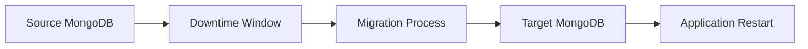
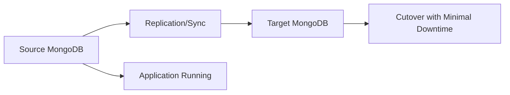
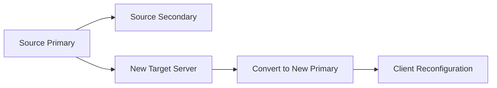

# MongoDB Migration Strategies

## Introduction

Database migration is a critical operation in any application's lifecycle. As your MongoDB application evolves, you may need to migrate data between environments, upgrade to new versions, change data models, or scale your infrastructure. A well-planned migration strategy ensures minimal downtime, data integrity, and smooth transitions.

In this guide, we'll explore various MongoDB migration strategies, from simple exports/imports to complex live migrations with zero downtime. You'll learn which approach fits different scenarios and how to implement them correctly.

## Understanding MongoDB Migration

Before diving into specific strategies, let's clarify what MongoDB migration typically involves:

- **Database version upgrades**: Moving from one MongoDB version to another
- **Schema changes**: Evolving your data model as application requirements change
- **Environment transitions**: Migrating from development to production or between cloud providers
- **Infrastructure scaling**: Moving from single-server to replica sets or sharded clusters
- **Consolidation**: Merging multiple MongoDB instances into one

Each migration type may require different approaches depending on your requirements for:
- Downtime tolerance
- Data volume
- Consistency requirements
- Available resources

## Migration Strategy Types

MongoDB migrations generally fall into two categories:

### 1. Offline Migration

Offline migration requires application downtime but is simpler to implement.



### 2. Online Migration 

Online migration allows continuous operation but requires more complex coordination.



Let's explore specific strategies within these categories.

## Offline Migration Strategies

### 1. mongoexport/mongoimport

This basic approach involves exporting data from the source database and importing it into the target database.

#### Step 1: Export data from source

```bash
mongoexport --uri="mongodb://sourcehost:27017/sourcedb" \
  --collection=users \
  --out=users.json
```

#### Step 2: Import data to target

```bash
mongoimport --uri="mongodb://targethost:27017/targetdb" \
  --collection=users \
  --file=users.json
```

**Pros**:
- Simple to implement
- Works well for smaller datasets

**Cons**:
- JSON format doesn't preserve all BSON types
- Not efficient for large datasets
- Requires application downtime

### 2. mongodump/mongorestore

This method creates binary dumps of your MongoDB collections and restores them in the target environment.

#### Step 1: Dump data from source

```bash
mongodump --uri="mongodb://sourcehost:27017/sourcedb" \
  --out=/backup/mongodump
```

#### Step 2: Restore data to target

```bash
mongorestore --uri="mongodb://targethost:27017/targetdb" \
  --dir=/backup/mongodump/sourcedb
```

**Pros**:
- Preserves all BSON types
- More efficient than mongoexport/mongoimport
- Can perform database-level or collection-level operations

**Cons**:
- Still requires application downtime
- Can be resource-intensive on large datasets

### 3. Filesystem Snapshot

For migrations between similar MongoDB versions, you can take filesystem snapshots of the data directory.

```bash
# Stop MongoDB service on source
systemctl stop mongod

# Create a snapshot or copy of data files
cp -R /var/lib/mongodb/data /backup/mongo_snapshot

# Transfer files to target server
scp -r /backup/mongo_snapshot targetuser@targethost:/var/lib/mongodb/data

# Start MongoDB on target server
ssh targetuser@targethost "systemctl start mongod"
```

**Pros**:
- Fast for large databases
- Preserves all data and indexes

**Cons**:
- Requires same MongoDB version and storage engine
- Doesn't work across different operating systems
- Requires complete downtime

## Online Migration Strategies

### 1. Replica Set Migration

This approach leverages MongoDB's built-in replication to minimize downtime.



#### Step 1: Add new members to replica set

```javascript
// Connect to primary in mongo shell
rs.add("newtarget.example.com:27017")

// Wait for initial sync to complete
rs.status()
```

#### Step 2: Step down original primary and promote new member

```javascript
// Once sync is complete
rs.stepDown()

// Force the new server to become primary
cfg = rs.conf()
cfg.members[2].priority = 2  // Assuming index 2 is the new server
rs.reconfig(cfg)
```

#### Step 3: Update application connection string and remove old members

```javascript
// After migration is verified
rs.remove("oldserver1.example.com:27017")
rs.remove("oldserver2.example.com:27017")
```

**Pros**:
- Minimal downtime
- Built-in data consistency verification
- Can perform gradual migration

**Cons**:
- Requires replica set deployment
- Need sufficient disk space on both systems
- Network bandwidth for replication

### 2. MongoDB Change Streams with Custom Sync

For cases where replica set migration isn't possible, you can build a custom synchronization using MongoDB change streams.

#### Step 1: Set up initial import

```javascript
// First do a full dump/restore to establish baseline
// Then set up change stream to capture ongoing changes
```

#### Step 2: Create a change stream consumer

```javascript
const { MongoClient } = require('mongodb');

async function syncData() {
  const sourceClient = new MongoClient('mongodb://sourcehost:27017');
  const targetClient = new MongoClient('mongodb://targethost:27017');
  
  await sourceClient.connect();
  await targetClient.connect();
  
  const sourceCollection = sourceClient.db('sourcedb').collection('users');
  const targetCollection = targetClient.db('targetdb').collection('users');
  
  // Track the last processed operation time
  let lastProcessed = new Date();
  
  const changeStream = sourceCollection.watch();
  
  changeStream.on('change', async (change) => {
    try {
      // Apply the same change to target database
      if (change.operationType === 'insert') {
        await targetCollection.insertOne(change.fullDocument);
      } else if (change.operationType === 'update') {
        await targetCollection.updateOne(
          { _id: change.documentKey._id },
          { $set: change.updateDescription.updatedFields }
        );
      } else if (change.operationType === 'delete') {
        await targetCollection.deleteOne({ _id: change.documentKey._id });
      }
      
      lastProcessed = new Date();
      console.log(`Applied ${change.operationType} operation`);
    } catch (err) {
      console.error('Error syncing change:', err);
    }
  });
  
  // Handle errors
  changeStream.on('error', console.error);
  
  console.log('Change stream syncing started');
}

syncData().catch(console.error);
```

#### Step 3: Switch application connections

Once the lag between source and target is minimal, redirect your application to the new database.

**Pros**:
- Works without replica sets
- Can synchronize between different MongoDB versions
- Flexible to implement custom transformations

**Cons**:
- More complex implementation
- Requires monitoring for drift
- Must handle error cases carefully

### 3. MongoDB Atlas Live Migration

If you're migrating to MongoDB Atlas (MongoDB's cloud service), you can use their Live Migration Service.

#### Step 1: Configure source database connection

In the MongoDB Atlas UI, navigate to the Live Migration section and provide source database connection information.

#### Step 2: Test the connection and migration

Atlas will validate the connection and perform a test to ensure migration is possible.

#### Step 3: Start the migration and perform cutover

Atlas will sync your data continuously from source to Atlas. When you're ready, perform cutover by updating your application connection string.

**Pros**:
- Managed service with minimal setup
- Continuous syncing with minimal downtime
- Works with various MongoDB deployments

**Cons**:
- Only for migrations to Atlas
- May require network configuration changes

## Schema Migration Strategies

Beyond moving data between environments, you might need to change your data schema. Here are strategies for evolving your schema:

### 1. Incremental Schema Migration

Make schema changes gradually to avoid downtime.

```javascript
// Example: Adding a new field with default value
db.users.updateMany(
  { newField: { $exists: false } },
  { $set: { newField: "default" } }
);
```

### 2. Dual-write Pattern

During schema changes, write to both old and new formats temporarily.

```javascript
// Application code example
async function createUser(userData) {
  // Write to current schema
  await db.users.insertOne(userData);
  
  // Also write to new schema format
  const newFormatData = transformToNewSchema(userData);
  await db.usersNew.insertOne(newFormatData);
}
```

### 3. Database Migration Framework

Consider using a schema migration framework like `migrate-mongo`:

```bash
# Install migrate-mongo
npm install -g migrate-mongo

# Initialize a migration project
migrate-mongo init

# Create a new migration
migrate-mongo create add-email-verification-field
```

Then edit the migration file:

```javascript
// migrations/20230615121212-add-email-verification-field.js
module.exports = {
  async up(db) {
    await db.collection('users').updateMany(
      { isEmailVerified: { $exists: false } },
      { $set: { isEmailVerified: false } }
    );
  },

  async down(db) {
    await db.collection('users').updateMany(
      {},
      { $unset: { isEmailVerified: "" } }
    );
  }
};
```

Run the migration:

```bash
migrate-mongo up
```

## Best Practices for MongoDB Migration

### 1. Planning and Preparation

- **Document your current setup**: Capture server configurations, indexes, authentication
- **Calculate data size**: Determine storage needs and transfer time
- **Create a rollback plan**: Know how to revert if necessary
- **Test thoroughly**: Perform practice migrations on test environments

### 2. Performance Considerations

- **Index strategy**: Create indexes after bulk data import for better performance
- **Batch processing**: Process data in chunks to minimize memory usage
- **Monitor resources**: Watch CPU, memory, disk I/O, and network usage
- **Schedule appropriately**: Choose low-traffic periods for migration tasks

### 3. Data Validation

- **Count documents**: Verify collection counts match after migration
- **Checksum validation**: Implement sampling-based validation for large datasets
- **Application testing**: Run tests against new database to verify functionality

```javascript
// Example validation script
async function validateMigration() {
  const sourceCount = await sourceDb.collection('users').countDocuments();
  const targetCount = await targetDb.collection('users').countDocuments();
  
  console.log(`Source count: ${sourceCount}, Target count: ${targetCount}`);
  console.log(`Match: ${sourceCount === targetCount}`);
  
  // Sample-based validation
  const sampleDocs = await sourceDb.collection('users').find().limit(100).toArray();
  
  for (const doc of sampleDocs) {
    const targetDoc = await targetDb.collection('users').findOne({ _id: doc._id });
    if (!targetDoc || JSON.stringify(doc) !== JSON.stringify(targetDoc)) {
      console.error(`Mismatch found for document ${doc._id}`);
    }
  }
}
```

## Real-World Migration Example

Let's walk through a complete example of migrating from a standalone MongoDB server to a sharded cluster.

### Scenario Requirements:
- 500GB database with growing transaction volume
- Maximum allowed downtime: 30 minutes
- Need to change document structure during migration

### Migration Plan:

1. **Preparation Phase**:

```javascript
// Create indexes on target system first
db.users.createIndex({ email: 1 }, { unique: true })
db.orders.createIndex({ userId: 1, createdAt: -1 })
```

2. **Initial Data Transfer**:

```bash
# Use mongodump with compression for efficient transfer
mongodump --uri="mongodb://sourcehost:27017/appdb" \
  --out=/backup/migration \
  --gzip
```

3. **Schema Transformation**:

```bash
# Custom script to transform data during restore
#!/usr/bin/env node
const { MongoClient } = require('mongodb');
const fs = require('fs');

async function transformAndLoad() {
  const data = JSON.parse(fs.readFileSync('users.json'));
  
  const transformedData = data.map(user => {
    // Transform: split name into firstName and lastName
    const [firstName, ...lastNameParts] = user.name.split(' ');
    const lastName = lastNameParts.join(' ');
    
    return {
      ...user,
      firstName,
      lastName,
      name: undefined, // Remove old field
      migrationDate: new Date()
    };
  });
  
  const client = new MongoClient('mongodb://targethost:27017');
  await client.connect();
  
  await client.db('appdb').collection('users').insertMany(transformedData);
  await client.close();
}

transformAndLoad().catch(console.error);
```

4. **Incremental Sync Setup**:

```javascript
// Set up change streams to capture ongoing changes
const changeStream = db.collection('users').watch();
changeStream.on('change', async change => {
  // Store change in a queue for later replay
  await changeQueue.push(change);
});
```

5. **Cutover Process**:

```bash
# 1. Put application in maintenance mode
kubectl apply -f maintenance-mode.yaml

# 2. Ensure change queue is processed
node process-remaining-changes.js

# 3. Verify data integrity
node verify-migration.js

# 4. Update application connection string
kubectl apply -f new-connection-config.yaml

# 5. Remove maintenance mode
kubectl delete -f maintenance-mode.yaml
```

## Summary

Successful MongoDB migrations require careful planning, appropriate strategy selection, and thorough validation. The key points to remember:

1. **Choose the right approach**: Select offline or online migration based on downtime tolerance
2. **Test thoroughly**: Always test your migration process in a staging environment first
3. **Monitor performance**: Watch for system resource usage during migration
4. **Validate data**: Ensure data integrity after migration
5. **Have a rollback plan**: Be prepared for unexpected issues

By following these strategies and best practices, you can perform MongoDB migrations with minimal risk and disruption to your applications.

## Additional Resources

- [MongoDB Documentation on Backup and Restore](https://docs.mongodb.com/manual/core/backups/)
- [MongoDB Atlas Live Migration](https://docs.atlas.mongodb.com/import/live-import/)
- [migrate-mongo npm package](https://www.npmjs.com/package/migrate-mongo)

## Exercises

1. Create a test database with sample data and practice using mongodump/mongorestore for migration.
2. Implement a simple change stream consumer that tracks and logs all operations on a collection.
3. Design a migration plan for converting a nested document structure to a referenced document model.
4. Create a script that validates data consistency between source and target databases.
5. Set up a local replica set and practice adding/removing members to simulate a migration scenario.