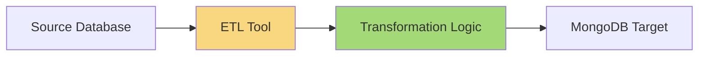

# MongoDB Data Transformation

Data transformation is a critical aspect of MongoDB data migration processes. It involves modifying the structure, format, and values of data as it moves from a source database to a target MongoDB database. Effective data transformation ensures that your migrated data is clean, consistent, and optimized for your application needs.

## Introduction to Data Transformation

When migrating data to MongoDB, you rarely perform a simple copy operation. Instead, you often need to transform the data to fit your new data model, improve quality, or enhance it with additional information.

Data transformation typically involves:

- Changing field names or document structure
- Converting data types
- Filtering unwanted records
- Enriching data with additional information
- Aggregating or summarizing information
- Cleaning up inconsistent or invalid data

Let's explore these concepts with practical examples.

## Basic Field Transformations

### Renaming Fields

One of the most common transformations is renaming fields to match your new schema.

```javascript
// Original document
{
  "first_name": "John",
  "last_name": "Doe",
  "user_id": 1001,
  "active_status": true
}

// Transformed document
{
  "firstName": "John",
  "lastName": "Doe",
  "userId": 1001,
  "isActive": true
}
```

You can achieve this with MongoDB's aggregation pipeline:

```javascript
db.oldCollection.aggregate([
  {
    $project: {
      firstName: "$first_name",
      lastName: "$last_name",
      userId: "$user_id",
      isActive: "$active_status",
      _id: 0
    }
  },
  { $out: "newCollection" }
]).pretty();
```

### Converting Data Types

Sometimes you need to convert data types, such as changing a string to a number or date.

```javascript
// Original document
{
  "userId": "1001",
  "joinDate": "2023-01-15",
  "score": "95.5"
}

// Transformed document
{
  "userId": 1001,
  "joinDate": ISODate("2023-01-15T00:00:00Z"),
  "score": 95.5
}
```

Using the aggregation pipeline:

```javascript
db.oldCollection.aggregate([
  {
    $addFields: {
      userId: { $toInt: "$userId" },
      joinDate: { $dateFromString: { dateString: "$joinDate" } },
      score: { $toDouble: "$score" }
    }
  },
  { $out: "newCollection" }
]);
```

## Document Structure Transformations

### Embedding Related Data

You might need to transform a normalized relational structure into MongoDB's embedded document model.

```javascript
// Original collections
// Users collection
{ "_id": 1, "name": "John Doe", "email": "john@example.com" }

// Address collection
{ "userId": 1, "street": "123 Main St", "city": "Boston", "state": "MA", "zip": "02101" }

// Transformed document (embedded)
{
  "_id": 1,
  "name": "John Doe",
  "email": "john@example.com",
  "address": {
    "street": "123 Main St",
    "city": "Boston",
    "state": "MA",
    "zip": "02101"
  }
}
```

Using the `$lookup` and `$mergeObjects` operators:

```javascript
db.users.aggregate([
  {
    $lookup: {
      from: "address",
      localField: "_id",
      foreignField: "userId",
      as: "addressArray"
    }
  },
  {
    $addFields: {
      address: { $arrayElemAt: ["$addressArray", 0] }
    }
  },
  {
    $project: {
      name: 1,
      email: 1,
      address: {
        street: 1,
        city: 1,
        state: 1,
        zip: 1
      },
      addressArray: 0
    }
  },
  { $out: "transformedUsers" }
]);
```

### Converting Arrays to Subdocuments

Sometimes you may want to transform array data into subdocuments for easier querying.

```javascript
// Original document
{
  "product": "Laptop",
  "specs": ["Intel i7", "16GB RAM", "512GB SSD", "15.6 inch"]
}

// Transformed document
{
  "product": "Laptop",
  "specs": {
    "processor": "Intel i7",
    "memory": "16GB RAM",
    "storage": "512GB SSD",
    "display": "15.6 inch"
  }
}
```

This transformation typically requires custom logic with a script:

```javascript
db.products.find().forEach(function(doc) {
  db.transformedProducts.insertOne({
    product: doc.product,
    specs: {
      processor: doc.specs[0],
      memory: doc.specs[1],
      storage: doc.specs[2],
      display: doc.specs[3]
    }
  });
});
```

## Data Cleansing and Enrichment

### Handling Missing Values

Data cleaning is vital during migration. Here's how to handle missing values:

```javascript
// Original documents with missing fields
{ "name": "John", "email": "john@example.com" }
{ "name": "Lisa", "phone": "555-1234" }

// Transformed documents with default values
{ "name": "John", "email": "john@example.com", "phone": "Unknown" }
{ "name": "Lisa", "email": "Not provided", "phone": "555-1234" }
```

Implementation:

```javascript
db.users.aggregate([
  {
    $addFields: {
      email: { $ifNull: ["$email", "Not provided"] },
      phone: { $ifNull: ["$phone", "Unknown"] }
    }
  },
  { $out: "cleanedUsers" }
]);
```

### Data Enrichment

Enrichment adds value to your data by incorporating additional information:

```javascript
// Original document
{
  "city": "New York",
  "country": "USA"
}

// Enriched document
{
  "city": "New York",
  "country": "USA",
  "continent": "North America",
  "timezone": "EST",
  "coordinates": {
    "latitude": 40.7128,
    "longitude": -74.0060
  }
}
```

You can enrich data using lookups against reference collections:

```javascript
db.cities.aggregate([
  {
    $lookup: {
      from: "geoData",
      localField: "city",
      foreignField: "name",
      as: "geoInfo"
    }
  },
  {
    $addFields: {
      continent: { $arrayElemAt: ["$geoInfo.continent", 0] },
      timezone: { $arrayElemAt: ["$geoInfo.timezone", 0] },
      coordinates: {
        latitude: { $arrayElemAt: ["$geoInfo.lat", 0] },
        longitude: { $arrayElemAt: ["$geoInfo.long", 0] }
      }
    }
  },
  {
    $project: {
      city: 1,
      country: 1,
      continent: 1,
      timezone: 1,
      coordinates: 1,
      geoInfo: 0
    }
  },
  { $out: "enrichedCities" }
]);
```

## Advanced Transformation Techniques

### Using the Aggregation Framework

MongoDB's aggregation framework is powerful for complex transformations. Here's a more advanced example that calculates statistics from raw data:

```javascript
// Original sales documents
{
  "date": "2023-06-15",
  "product": "Laptop",
  "quantity": 5,
  "unitPrice": 999
}

// Transformed into summary statistics
{
  "_id": "Laptop",
  "totalSold": 42,
  "totalRevenue": 41958,
  "averagePrice": 999,
  "monthlySales": [
    { "month": "2023-01", "units": 8 },
    { "month": "2023-02", "units": 12 },
    // other months...
    { "month": "2023-06", "units": 5 }
  ]
}
```

Implementation:

```javascript
db.sales.aggregate([
  {
    $group: {
      _id: "$product",
      totalSold: { $sum: "$quantity" },
      totalRevenue: { $sum: { $multiply: ["$quantity", "$unitPrice"] } },
      averagePrice: { $avg: "$unitPrice" },
      sales: {
        $push: {
          month: { $substr: ["$date", 0, 7] },
          units: "$quantity"
        }
      }
    }
  },
  {
    $addFields: {
      monthlySales: {
        $reduce: {
          input: "$sales",
          initialValue: [],
          in: {
            $concatArrays: [
              "$$value",
              {
                $cond: {
                  if: { $in: ["$$this.month", "$$value.month"] },
                  then: [],
                  else: ["$$this"]
                }
              }
            ]
          }
        }
      }
    }
  },
  {
    $project: {
      totalSold: 1,
      totalRevenue: 1,
      averagePrice: 1,
      monthlySales: 1,
      sales: 0
    }
  },
  { $out: "productAnalytics" }
]);
```

### Using External Tools for Complex Transformations

For more complex transformations, you might need external tools:



Common tools include:
- MongoDB Compass for simple transformations
- MongoDB Atlas Data Lake for cloud-based transformations
- Custom scripts using language drivers (Python, Node.js)
- ETL tools like Talend or Informatica

## Real-World Example: E-commerce Data Migration

Let's walk through a complete example of transforming an e-commerce dataset from a relational structure to MongoDB's document model.

### Source Data (Relational)

```javascript
// Products table
products = [
  { id: 1, name: "Smartphone", category_id: 101, price: 699.99 }
]

// Categories table
categories = [
  { id: 101, name: "Electronics", parent_id: null }
]

// Product_attributes table
attributes = [
  { product_id: 1, name: "color", value: "black" },
  { product_id: 1, name: "weight", value: "180g" },
  { product_id: 1, name: "memory", value: "128GB" }
]

// Reviews table
reviews = [
  { id: 501, product_id: 1, user_id: 1001, rating: 4, comment: "Great product!" },
  { id: 502, product_id: 1, user_id: 1002, rating: 5, comment: "Excellent!" }
]

// Users table
users = [
  { id: 1001, username: "user1", email: "user1@example.com" },
  { id: 1002, username: "user2", email: "user2@example.com" }
]
```

### Target Document Structure

```javascript
// Transformed product document
{
  "_id": 1,
  "name": "Smartphone",
  "price": 699.99,
  "category": {
    "id": 101,
    "name": "Electronics"
  },
  "attributes": {
    "color": "black",
    "weight": "180g",
    "memory": "128GB"
  },
  "reviews": [
    {
      "rating": 4,
      "comment": "Great product!",
      "user": {
        "username": "user1",
        "email": "user1@example.com"
      }
    },
    {
      "rating": 5,
      "comment": "Excellent!",
      "user": {
        "username": "user2",
        "email": "user2@example.com"
      }
    }
  ],
  "avgRating": 4.5,
  "reviewCount": 2
}
```

### Implementation Script

Here's how you might implement this complex transformation using Node.js and the MongoDB driver:

```javascript
const { MongoClient } = require('mongodb');

async function transformAndMigrateData() {
  const client = new MongoClient('mongodb://localhost:27017');
  
  try {
    await client.connect();
    
    // Source collections (simulated with arrays for this example)
    const products = [{ id: 1, name: "Smartphone", category_id: 101, price: 699.99 }];
    const categories = [{ id: 101, name: "Electronics", parent_id: null }];
    const attributes = [
      { product_id: 1, name: "color", value: "black" },
      { product_id: 1, name: "weight", value: "180g" },
      { product_id: 1, name: "memory", value: "128GB" }
    ];
    const reviews = [
      { id: 501, product_id: 1, user_id: 1001, rating: 4, comment: "Great product!" },
      { id: 502, product_id: 1, user_id: 1002, rating: 5, comment: "Excellent!" }
    ];
    const users = [
      { id: 1001, username: "user1", email: "user1@example.com" },
      { id: 1002, username: "user2", email: "user2@example.com" }
    ];
    
    const db = client.db('ecommerce');
    const transformedProducts = db.collection('transformedProducts');
    
    // Process each product
    for (const product of products) {
      // Find related category
      const category = categories.find(c => c.id === product.category_id);
      
      // Gather product attributes
      const productAttrs = attributes.filter(a => a.product_id === product.id);
      const attributesObj = {};
      productAttrs.forEach(attr => {
        attributesObj[attr.name] = attr.value;
      });
      
      // Gather product reviews with user info
      const productReviews = reviews.filter(r => r.product_id === product.id);
      const reviewsWithUser = productReviews.map(review => {
        const user = users.find(u => u.id === review.user_id);
        return {
          rating: review.rating,
          comment: review.comment,
          user: {
            username: user.username,
            email: user.email
          }
        };
      });
      
      // Calculate aggregate metrics
      const reviewCount = productReviews.length;
      const avgRating = productReviews.reduce((sum, review) => sum + review.rating, 0) / reviewCount;
      
      // Create transformed document
      const transformedProduct = {
        _id: product.id,
        name: product.name,
        price: product.price,
        category: {
          id: category.id,
          name: category.name
        },
        attributes: attributesObj,
        reviews: reviewsWithUser,
        avgRating: avgRating,
        reviewCount: reviewCount
      };
      
      // Insert transformed product
      await transformedProducts.insertOne(transformedProduct);
      console.log(`Transformed product ${product.id}`);
    }
    
  } finally {
    await client.close();
  }
}

transformAndMigrateData().catch(console.error);
```

## Best Practices for Data Transformation

1. **Plan your schema first**: Design your target MongoDB schema before starting the transformation process.

2. **Test with a subset**: Start transformations with a small dataset to validate your approach.

3. **Validate data integrity**: Implement checks to ensure data is transformed correctly.

4. **Handle errors gracefully**: Implement error handling for records that can't be transformed.

5. **Consider performance**: For large datasets, use batching techniques to avoid overwhelming system resources.

6. **Document your transformation logic**: Keep detailed documentation of your transformation rules for future reference.

7. **Preserve source data**: Keep your source data intact until you've verified your transformation.

8. **Monitor the process**: Use logging to track progress and identify issues.

## Common Challenges and Solutions

| Challenge | Solution |
|-----------|----------|
| Large dataset size | Use batch processing and incremental migrations |
| Complex transformations | Break them into multiple simpler steps |
| Data quality issues | Implement validation and cleaning logic |
| Performance bottlenecks | Use indexes, optimize queries, parallelize tasks |
| Schema inconsistencies | Normalize field names and types as part of transformation |

## Summary

Data transformation is a crucial aspect of MongoDB data migration that allows you to restructure, clean, and enhance your data. By leveraging MongoDB's aggregation framework, custom scripts, or external tools, you can transform data to fit your target schema and meet your application requirements.

Effective data transformation ensures that your migrated data is:
- Well-structured for MongoDB's document model
- Clean and consistent
- Properly typed and validated
- Enriched with derived or additional information
- Optimized for your application's query patterns

Remember that data transformation is not just about moving data—it's an opportunity to improve your data model and enhance your application's performance.

## Further Learning

### Practice Exercises

1. Create a transformation to convert a flat CSV file containing customer information into a nested MongoDB document structure.

2. Implement a transformation that uses the aggregation pipeline to calculate daily, weekly, and monthly metrics from a collection of event data.

3. Build a script that enriches product data with category hierarchies and related product recommendations.

### Additional Resources

- [MongoDB Aggregation Framework Documentation](https://www.mongodb.com/docs/manual/aggregation/)
- [MongoDB University Courses on Data Modeling](https://learn.mongodb.com/)
- [MongoDB Data Migration and ETL Best Practices](https://www.mongodb.com/blog/post/6-rules-of-thumb-for-mongodb-schema-design)