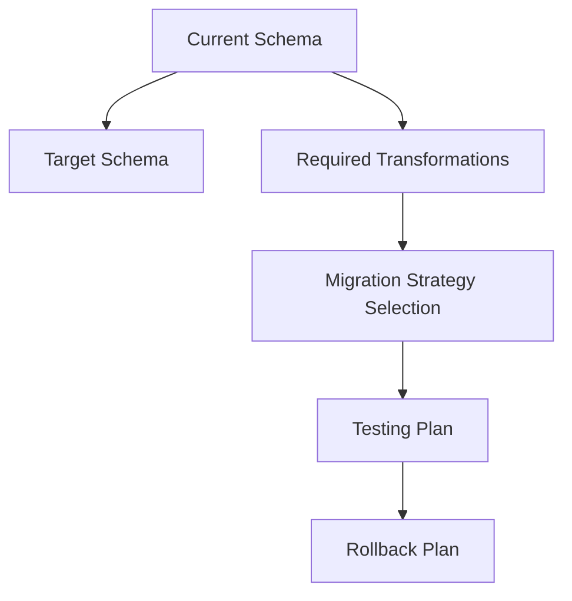

# MongoDB Schema Migration

## Introduction

Schema migration is a critical aspect of database management that involves evolving your data structure as your application requirements change. Unlike traditional relational databases with rigid schemas, MongoDB's flexible document model allows for more dynamic schema evolution. However, this flexibility comes with its own challenges when migrating between different schema versions.

In this guide, we'll explore how to effectively plan and implement MongoDB schema migrations, ensuring data integrity and application functionality throughout the process.

## Understanding Schema Evolution in MongoDB

MongoDB's schema-less nature doesn't mean your applications don't have an implicit schema. Your code expects documents to have certain fields and structures, and when these expectations change, you need a migration strategy.

### Why Schema Migration is Necessary

- **Application evolution**: As features are added or modified, data structures need to adapt
- **Performance optimization**: Restructuring data to improve query efficiency
- **Data normalization or denormalization**: Changing how related data is organized
- **Bug fixes**: Correcting problematic data structures

## Schema Migration Strategies

There are several approaches to MongoDB schema migration:

### 1. Schema Versioning

This approach involves adding a version field to each document and updating documents as they're accessed.

```javascript
// Before migration - document with old schema (implicit version 1)
{
  _id: ObjectId("5f8d0c089d7fe1d1c89ec702"),
  name: "John Doe",
  email: "john.doe@example.com",
  address: "123 Main Street, Anytown"
}

// After migration - document with new schema (version 2)
{
  _id: ObjectId("5f8d0c089d7fe1d1c89ec702"),
  schemaVersion: 2,
  name: "John Doe",
  email: "john.doe@example.com",
  address: {
    street: "123 Main Street",
    city: "Anytown"
  }
}
```

Implementation approach:

```javascript
// Application code to handle schema versioning
async function findUser(userId) {
  const user = await db.users.findOne({ _id: userId });
  
  // Migrate on read if necessary
  if (!user.schemaVersion || user.schemaVersion < 2) {
    user = await migrateUserToV2(user);
  }
  
  return user;
}

async function migrateUserToV2(user) {
  // Extract address components
  const addressParts = user.address.split(',').map(part => part.trim());
  
  // Update document with new schema
  const result = await db.users.updateOne(
    { _id: user._id },
    {
      $set: {
        schemaVersion: 2,
        address: {
          street: addressParts[0],
          city: addressParts[1] || 'Unknown'
        }
      }
    }
  );
  
  // Return updated document
  return await db.users.findOne({ _id: user._id });
}
```

### 2. Bulk Migration Scripts

For larger datasets or more complex migrations, running batch scripts to update all documents at once is often necessary.

```javascript
// Migration script to update all user documents to new address format
async function migrateAllUsersToV2() {
  const cursor = db.users.find({ 
    $or: [
      { schemaVersion: { $exists: false } },
      { schemaVersion: { $lt: 2 } }
    ]
  });
  
  let count = 0;
  
  while (await cursor.hasNext()) {
    const user = await cursor.next();
    
    // Skip if already migrated
    if (user.schemaVersion === 2) continue;
    
    // Extract address data
    let street = "Unknown";
    let city = "Unknown";
    
    if (user.address) {
      const parts = user.address.split(',').map(part => part.trim());
      street = parts[0] || "Unknown";
      city = parts[1] || "Unknown";
    }
    
    // Update the document
    await db.users.updateOne(
      { _id: user._id },
      {
        $set: {
          schemaVersion: 2,
          address: { street, city }
        }
      }
    );
    
    count++;
    
    // Log progress periodically
    if (count % 1000 === 0) {
      console.log(`Migrated ${count} documents`);
    }
  }
  
  console.log(`Migration complete. Total migrated: ${count}`);
}
```

### 3. Dual-Write Pattern

During transition periods, you might need to write to both old and new schemas.

```javascript
// Example of dual-write during transition period
async function createUser(userData) {
  // Write in new schema format
  const result = await db.users.insertOne({
    name: userData.name,
    email: userData.email,
    address: {
      street: userData.street,
      city: userData.city
    },
    schemaVersion: 2,
    createdAt: new Date()
  });
  
  // Also update legacy collection if needed
  await db.legacyUsers.insertOne({
    name: userData.name,
    email: userData.email,
    address: `${userData.street}, ${userData.city}`,
    created: new Date()
  });
  
  return result.insertedId;
}
```

## Step-by-Step Migration Process

Let's walk through a complete schema migration example:

### Step 1: Plan Your Migration

Before coding anything, document the current and target schemas:



### Step 2: Create Migration Scripts

Let's create a script to add a `dateOfBirth` field and convert existing `age` fields:

```javascript
// migration-script.js
const { MongoClient } = require('mongodb');

async function migrateUserAgeToDateOfBirth() {
  const uri = "mongodb://localhost:27017";
  const client = new MongoClient(uri);
  
  try {
    await client.connect();
    const db = client.db("myapp");
    const users = db.collection("users");
    
    // Find all users with age but no dateOfBirth
    const cursor = users.find({ 
      age: { $exists: true },
      dateOfBirth: { $exists: false }
    });
    
    let migratedCount = 0;
    const today = new Date();
    
    for await (const user of cursor) {
      // Calculate approximate birth date from age
      const birthYear = today.getFullYear() - user.age;
      const dateOfBirth = new Date(birthYear, 0, 1); // January 1st of birth year
      
      // Update the document
      await users.updateOne(
        { _id: user._id },
        { 
          $set: { 
            dateOfBirth,
            schemaVersion: 2
          }
        }
      );
      
      migratedCount++;
    }
    
    console.log(`Migration complete. Migrated ${migratedCount} users.`);
  } finally {
    await client.close();
  }
}

migrateUserAgeToDateOfBirth().catch(console.error);
```

### Step 3: Test Migration on Sample Data

Always test your migration on a copy of production data:

```javascript
// test-migration.js
const { MongoClient } = require('mongodb');

async function testMigration() {
  const uri = "mongodb://localhost:27017";
  const client = new MongoClient(uri);
  
  try {
    await client.connect();
    const db = client.db("test_myapp");
    
    // Create test collection
    const users = db.collection("users");
    await users.deleteMany({});
    
    // Insert test data
    await users.insertMany([
      { _id: 1, name: "Alice", age: 30 },
      { _id: 2, name: "Bob", age: 25 },
      { _id: 3, name: "Charlie", age: 42 },
      { _id: 4, name: "Diana", dateOfBirth: new Date(1995, 5, 15) } // Already has new schema
    ]);
    
    // Run migration
    const today = new Date();
    
    const cursor = users.find({ 
      age: { $exists: true },
      dateOfBirth: { $exists: false }
    });
    
    for await (const user of cursor) {
      const birthYear = today.getFullYear() - user.age;
      const dateOfBirth = new Date(birthYear, 0, 1);
      
      await users.updateOne(
        { _id: user._id },
        { 
          $set: { 
            dateOfBirth,
            schemaVersion: 2
          }
        }
      );
    }
    
    // Verify results
    const results = await users.find().toArray();
    console.log("Migration test results:");
    console.log(results);
    
    // Check if all documents have dateOfBirth
    const incompleteCount = await users.countDocuments({ dateOfBirth: { $exists: false } });
    console.log(`Documents missing dateOfBirth: ${incompleteCount}`);
  } finally {
    await client.close();
  }
}

testMigration().catch(console.error);
```

### Step 4: Implement Application Code to Handle Both Schemas

Your application needs to work with both schema versions during the migration period:

```javascript
// user-service.js
class UserService {
  constructor(db) {
    this.users = db.collection('users');
  }
  
  async getUserAge(userId) {
    const user = await this.users.findOne({ _id: userId });
    
    if (!user) return null;
    
    // Handle both schema versions
    if (user.age !== undefined) {
      return user.age;
    } else if (user.dateOfBirth) {
      // Calculate age from date of birth
      const today = new Date();
      const dob = new Date(user.dateOfBirth);
      let age = today.getFullYear() - dob.getFullYear();
      const monthDiff = today.getMonth() - dob.getMonth();
      
      if (monthDiff < 0 || (monthDiff === 0 && today.getDate() < dob.getDate())) {
        age--;
      }
      
      return age;
    }
    
    return null;
  }
  
  async createUser(userData) {
    // Always create users with new schema
    return this.users.insertOne({
      name: userData.name,
      dateOfBirth: userData.dateOfBirth,
      schemaVersion: 2,
      createdAt: new Date()
    });
  }
}
```

## Real-World Schema Migration Examples

### Example 1: Embedding Related Data

Let's say we initially have separate collections for users and addresses:

```javascript
// Original schema
// users collection
{
  _id: ObjectId("5f8d0c089d7fe1d1c89ec702"),
  name: "John Doe",
  email: "john@example.com",
  addressId: ObjectId("5f8d0c089d7fe1d1c89ec703")
}

// addresses collection
{
  _id: ObjectId("5f8d0c089d7fe1d1c89ec703"),
  street: "123 Main St",
  city: "Anytown",
  state: "CA",
  zipCode: "12345"
}
```

Migration to embed address data in the user document:

```javascript
// Migration script to embed address data
async function embedAddressesInUsers() {
  const cursor = db.users.find({ 
    addressId: { $exists: true },
    address: { $exists: false }
  });
  
  for await (const user of cursor) {
    const address = await db.addresses.findOne({ _id: user.addressId });
    
    if (!address) continue;
    
    await db.users.updateOne(
      { _id: user._id },
      {
        $set: {
          address: {
            street: address.street,
            city: address.city,
            state: address.state,
            zipCode: address.zipCode
          },
          schemaVersion: 2
        },
        $unset: { addressId: "" }
      }
    );
  }
  
  console.log("Address embedding migration complete");
}
```

### Example 2: Adding Indexable Fields

Let's say we have a products collection with nested categories that we want to make more searchable:

```javascript
// Original schema
{
  _id: ObjectId("5f8d0c089d7fe1d1c89ec705"),
  name: "Wireless Headphones",
  details: {
    categories: ["Electronics", "Audio", "Wireless"]
  },
  price: 99.99
}
```

Migration to flatten categories for better indexing:

```javascript
// Migration script to flatten categories
async function flattenProductCategories() {
  const cursor = db.products.find({
    "details.categories": { $exists: true },
    categories: { $exists: false }
  });
  
  for await (const product of cursor) {
    await db.products.updateOne(
      { _id: product._id },
      {
        $set: {
          categories: product.details.categories,
          schemaVersion: 2
        }
      }
    );
  }
  
  // Create index on the new field
  await db.products.createIndex({ categories: 1 });
  
  console.log("Category flattening migration complete");
}
```

## Best Practices for MongoDB Schema Migration

1. **Always back up your data** before running migrations
2. **Use transactions** where possible (requires MongoDB 4.0+ and replica sets)
3. **Implement migration in stages**:
   - Deploy code that can handle both schemas
   - Run migration scripts
   - Remove old schema handling when migration is complete
4. **Monitor performance** during migration to avoid overwhelming your database
5. **Implement logging and error handling** in migration scripts
6. **Have a rollback plan** in case of issues
7. **Test thoroughly** on staging environments with production-like data volumes

## Using Schema Management Tools

Several tools can help with MongoDB schema migrations:

### Mongoose Migrations

If you're using Mongoose with Node.js, you can leverage migration libraries:

```javascript
// Example using mongoose-migrate
const migrations = require('mongoose-migrate');

migrations.add({
  name: 'add-date-of-birth',
  
  async up(db) {
    const users = db.collection('users');
    const cursor = users.find({ age: { $exists: true } });
    
    const today = new Date();
    
    for await (const user of cursor) {
      const birthYear = today.getFullYear() - user.age;
      await users.updateOne(
        { _id: user._id },
        { 
          $set: { dateOfBirth: new Date(birthYear, 0, 1) }
        }
      );
    }
  },
  
  async down(db) {
    const users = db.collection('users');
    await users.updateMany(
      { dateOfBirth: { $exists: true } },
      { $unset: { dateOfBirth: "" } }
    );
  }
});

// Run migrations
migrations.run('mongodb://localhost:27017/mydb').then(() => {
  console.log('Migrations complete');
}).catch(err => {
  console.error('Migration failed', err);
});
```

### MongoDB Atlas Data Transformation API

MongoDB Atlas provides tools for data transformation that can assist with migrations:

```javascript
// Example transformation using MongoDB Atlas Data Transformation
exports = async function(changeEvent) {
  const docId = changeEvent.documentKey._id;
  const fullDocument = changeEvent.fullDocument;
  
  if (fullDocument && fullDocument.age && !fullDocument.dateOfBirth) {
    const birthYear = new Date().getFullYear() - fullDocument.age;
    const dateOfBirth = new Date(birthYear, 0, 1);
    
    const collection = context.services.get("mongodb-atlas").db("mydb").collection("users");
    await collection.updateOne(
      { _id: docId },
      { $set: { dateOfBirth, schemaVersion: 2 } }
    );
  }
};
```

## Summary

MongoDB schema migration is an essential skill for maintaining evolving applications. While MongoDB's flexible schema is a powerful feature, managing schema changes requires careful planning and execution to ensure data integrity and application functionality.

In this guide, we've explored:

- Different strategies for MongoDB schema migration
- Step-by-step implementation processes
- Real-world examples of common migration scenarios
- Best practices for successful migrations
- Tools that can assist with schema migrations

By following these approaches and principles, you can confidently evolve your MongoDB data model as your application requirements change.

## Additional Resources and Exercises

### Additional Resources

- [MongoDB Documentation on Schema Design](https://www.mongodb.com/docs/manual/core/data-modeling-introduction/)
- [MongoDB University M320: Data Modeling Course](https://learn.mongodb.com/courses/m320-mongodb-data-modeling)

### Practice Exercises

1. **Exercise 1:** Design a migration script that adds a new field `lastLogin` to a `users` collection, setting it to `null` for existing users.

2. **Exercise 2:** Create a migration script that converts a single-document approach to a reference-based approach by moving product reviews from an embedded array to a separate collection.

3. **Exercise 3:** Design a schema versioning system with middleware that automatically upgrades documents to the latest schema version when they're accessed.

4. **Advanced Exercise:** Implement a complete migration system with version tracking, up/down migrations, and a command-line interface to run migrations.