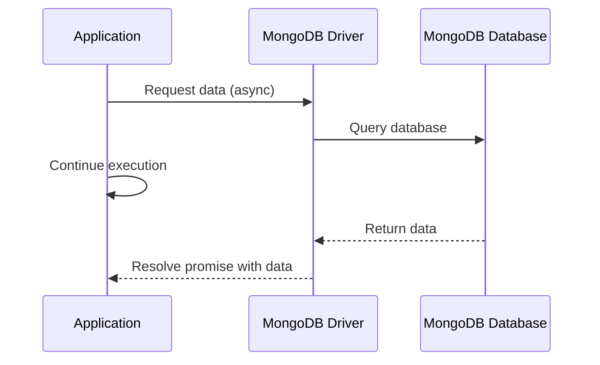

# MongoDB Asynchronous Operations

In modern web applications, responsiveness and efficiency are critical. Asynchronous operations allow your application to continue executing code while waiting for database operations to complete, rather than blocking the execution thread. This guide explores how to implement asynchronous operations with MongoDB in Node.js environments.

## Introduction to Asynchronous MongoDB

Traditional synchronous code executes sequentially, which means when your application makes a database query, it must wait for the response before continuing. In contrast, asynchronous code allows your application to initiate a database operation and then continue executing other tasks while waiting for the database operation to complete.

MongoDB's Node.js driver provides built-in support for asynchronous operations using Promises and async/await syntax, making it easier to write non-blocking code.



## Prerequisites

To follow this guide, you should have:

- Basic knowledge of JavaScript and Node.js
- MongoDB installed and running
- MongoDB Node.js driver installed in your project

If you haven't installed the MongoDB driver yet, you can do so using npm:

```bash
npm install mongodb
```

## Connecting to MongoDB Asynchronously

Let's start by establishing a connection to MongoDB using the asynchronous API:

```javascript
const { MongoClient } = require('mongodb');

// Connection URI
const uri = 'mongodb://localhost:27017';

// Database Name
const dbName = 'myDatabase';

// Create a new MongoClient
const client = new MongoClient(uri);

async function connectToDatabase() {
  try {
    // Connect to the MongoDB cluster
    await client.connect();
    console.log('Connected successfully to MongoDB');
    
    // Return the database object
    return client.db(dbName);
  } catch (e) {
    console.error('Connection error:', e);
    throw e;
  }
}

// Usage
connectToDatabase()
  .then(db => {
    console.log('Database connection ready for use');
    // Perform operations with the db object
  })
  .catch(err => console.error('Failed to connect:', err));
```

In this example, `connectToDatabase()` returns a Promise that resolves when the connection is established or rejects if there's an error.

## Basic CRUD Operations with Promises

### Creating Documents

Here's how to insert documents asynchronously:

```javascript
async function insertDocument(db, document) {
  try {
    const collection = db.collection('users');
    const result = await collection.insertOne(document);
    console.log(`Document inserted with id: ${result.insertedId}`);
    return result;
  } catch (err) {
    console.error('Failed to insert document:', err);
    throw err;
  }
}

// Usage
const newUser = {
  name: 'John Doe',
  email: 'john@example.com',
  age: 30,
  createdAt: new Date()
};

connectToDatabase()
  .then(db => insertDocument(db, newUser))
  .then(result => console.log('Insert operation completed'))
  .catch(err => console.error('Operation failed:', err));
```

### Reading Documents

Fetching documents asynchronously:

```javascript
async function findDocuments(db, query = {}) {
  try {
    const collection = db.collection('users');
    const documents = await collection.find(query).toArray();
    console.log(`Found ${documents.length} documents`);
    return documents;
  } catch (err) {
    console.error('Failed to find documents:', err);
    throw err;
  }
}

// Usage
connectToDatabase()
  .then(db => findDocuments(db, { age: { $gt: 25 } }))
  .then(docs => {
    console.log('Documents found:');
    docs.forEach(doc => console.log(` - ${doc.name}, ${doc.email}`));
  })
  .catch(err => console.error('Operation failed:', err));
```

### Updating Documents

Updating documents asynchronously:

```javascript
async function updateDocument(db, filter, update) {
  try {
    const collection = db.collection('users');
    const result = await collection.updateOne(filter, { $set: update });
    console.log(`${result.matchedCount} document(s) matched the filter`);
    console.log(`${result.modifiedCount} document(s) were updated`);
    return result;
  } catch (err) {
    console.error('Failed to update document:', err);
    throw err;
  }
}

// Usage
connectToDatabase()
  .then(db => updateDocument(
    db, 
    { name: 'John Doe' }, 
    { age: 31, lastUpdated: new Date() }
  ))
  .then(result => console.log('Update completed'))
  .catch(err => console.error('Operation failed:', err));
```

### Deleting Documents

Deleting documents asynchronously:

```javascript
async function deleteDocument(db, filter) {
  try {
    const collection = db.collection('users');
    const result = await collection.deleteOne(filter);
    console.log(`${result.deletedCount} document(s) were deleted`);
    return result;
  } catch (err) {
    console.error('Failed to delete document:', err);
    throw err;
  }
}

// Usage
connectToDatabase()
  .then(db => deleteDocument(db, { name: 'John Doe' }))
  .then(result => console.log('Delete operation completed'))
  .catch(err => console.error('Operation failed:', err));
```

## Using async/await with MongoDB

The async/await syntax makes asynchronous code more readable. Here's how you can use it to perform a sequence of operations:

```javascript
async function userWorkflow() {
  let client;
  try {
    client = new MongoClient(uri);
    await client.connect();
    const db = client.db(dbName);
    
    // Insert a new user
    const insertResult = await db.collection('users').insertOne({
      name: 'Alice Smith',
      email: 'alice@example.com',
      age: 28
    });
    console.log(`New user inserted with ID: ${insertResult.insertedId}`);
    
    // Find the user we just inserted
    const user = await db.collection('users').findOne({ _id: insertResult.insertedId });
    console.log('Found user:', user);
    
    // Update the user
    const updateResult = await db.collection('users').updateOne(
      { _id: user._id },
      { $set: { age: 29, lastUpdated: new Date() } }
    );
    console.log(`Updated ${updateResult.modifiedCount} user`);
    
    // Verify the update
    const updatedUser = await db.collection('users').findOne({ _id: user._id });
    console.log('Updated user:', updatedUser);
    
    return updatedUser;
  } catch (err) {
    console.error('An error occurred in the workflow:', err);
    throw err;
  } finally {
    // Always close the connection
    if (client) await client.close();
  }
}

// Execute the workflow
userWorkflow()
  .then(result => console.log('Workflow completed successfully'))
  .catch(err => console.error('Workflow failed:', err));
```

## Handling Multiple Asynchronous Operations

### Parallel Operations

Sometimes you need to run multiple MongoDB operations in parallel. `Promise.all()` is perfect for this:

```javascript
async function parallelOperations(db) {
  try {
    const usersCollection = db.collection('users');
    const postsCollection = db.collection('posts');
    
    // Run queries in parallel
    const [users, posts, stats] = await Promise.all([
      usersCollection.find({ active: true }).toArray(),
      postsCollection.find({ published: true }).limit(10).toArray(),
      db.stats()
    ]);
    
    console.log(`Found ${users.length} active users`);
    console.log(`Found ${posts.length} published posts`);
    console.log(`Database size: ${stats.dataSize} bytes`);
    
    return { users, posts, stats };
  } catch (err) {
    console.error('Parallel operations failed:', err);
    throw err;
  }
}
```

### Sequential Operations

For operations that depend on previous results:

```javascript
async function sequentialOperations(db) {
  try {
    const usersCollection = db.collection('users');
    
    // Get the most active user
    const mostActiveUser = await usersCollection.findOne({}, { sort: { activityScore: -1 } });
    console.log(`Most active user: ${mostActiveUser.name}`);
    
    // Now find posts by this user
    const postsCollection = db.collection('posts');
    const userPosts = await postsCollection.find({ authorId: mostActiveUser._id }).toArray();
    console.log(`Found ${userPosts.length} posts by ${mostActiveUser.name}`);
    
    // Calculate average likes per post
    const totalLikes = userPosts.reduce((sum, post) => sum + (post.likes || 0), 0);
    const averageLikes = userPosts.length > 0 ? totalLikes / userPosts.length : 0;
    console.log(`Average likes per post: ${averageLikes.toFixed(2)}`);
    
    return { user: mostActiveUser, posts: userPosts, stats: { totalLikes, averageLikes } };
  } catch (err) {
    console.error('Sequential operations failed:', err);
    throw err;
  }
}
```

## Real-World Example: Building an Asynchronous API

Let's build a simple Express API that uses asynchronous MongoDB operations:

```javascript
const express = require('express');
const { MongoClient, ObjectId } = require('mongodb');

const app = express();
app.use(express.json());

// MongoDB connection details
const uri = 'mongodb://localhost:27017';
const dbName = 'blogApp';

// Database connection
let db;

async function connectToMongoDB() {
  const client = new MongoClient(uri);
  await client.connect();
  db = client.db(dbName);
  console.log('Connected to MongoDB');
  return db;
}

// Initialize connection
connectToMongoDB()
  .catch(err => {
    console.error('Failed to connect to MongoDB', err);
    process.exit(1);
  });

// GET all posts
app.get('/api/posts', async (req, res) => {
  try {
    const posts = await db.collection('posts')
      .find({})
      .sort({ createdAt: -1 })
      .limit(20)
      .toArray();
      
    res.json(posts);
  } catch (err) {
    console.error('Error fetching posts:', err);
    res.status(500).json({ error: 'Internal server error' });
  }
});

// GET a single post by ID
app.get('/api/posts/:id', async (req, res) => {
  try {
    const post = await db.collection('posts').findOne({ 
      _id: new ObjectId(req.params.id) 
    });
    
    if (!post) {
      return res.status(404).json({ error: 'Post not found' });
    }
    
    res.json(post);
  } catch (err) {
    console.error('Error fetching post:', err);
    res.status(500).json({ error: 'Internal server error' });
  }
});

// POST a new post
app.post('/api/posts', async (req, res) => {
  try {
    const { title, content, authorId } = req.body;
    
    if (!title || !content || !authorId) {
      return res.status(400).json({ error: 'Missing required fields' });
    }
    
    const newPost = {
      title,
      content,
      authorId,
      createdAt: new Date(),
      likes: 0,
      comments: []
    };
    
    const result = await db.collection('posts').insertOne(newPost);
    
    res.status(201).json({ 
      ...newPost, 
      _id: result.insertedId 
    });
  } catch (err) {
    console.error('Error creating post:', err);
    res.status(500).json({ error: 'Internal server error' });
  }
});

// Start the server
const PORT = process.env.PORT || 3000;
app.listen(PORT, () => {
  console.log(`Server running on port ${PORT}`);
});
```

## Best Practices for Asynchronous MongoDB Operations

1. **Always handle errors**: Use try/catch blocks with async/await or .catch() with promises.

2. **Close connections properly**: Release resources when they're no longer needed.

```javascript
async function performOperations() {
  const client = new MongoClient(uri);
  
  try {
    await client.connect();
    const db = client.db(dbName);
    // Perform operations...
    return result;
  } catch (err) {
    console.error('Error:', err);
    throw err;
  } finally {
    await client.close();
  }
}
```

3. **Use connection pooling**: For production applications, reuse connections instead of creating new ones for each operation.

```javascript
// Create a singleton client connection
const client = new MongoClient(uri, {
  maxPoolSize: 10, // Maintain up to 10 socket connections
  minPoolSize: 5   // Maintain at least 5 socket connections
});

let dbConnection;

async function getDb() {
  if (dbConnection) return dbConnection;
  
  try {
    await client.connect();
    dbConnection = client.db(dbName);
    return dbConnection;
  } catch (err) {
    console.error('Failed to connect to MongoDB:', err);
    throw err;
  }
}

// Example usage
async function getUserById(userId) {
  const db = await getDb();
  return db.collection('users').findOne({ _id: new ObjectId(userId) });
}
```

4. **Batch operations when possible**: Use bulk operations for improved performance.

```javascript
async function updateManyUsers(userIds, updateData) {
  try {
    const db = await getDb();
    const collection = db.collection('users');
    
    const operations = userIds.map(id => ({
      updateOne: {
        filter: { _id: new ObjectId(id) },
        update: { $set: updateData }
      }
    }));
    
    const result = await collection.bulkWrite(operations);
    console.log(`${result.modifiedCount} users updated`);
    return result;
  } catch (err) {
    console.error('Bulk update failed:', err);
    throw err;
  }
}
```

5. **Use projection to limit returned fields**: This reduces network traffic and improves performance.

```javascript
async function getUserProfiles() {
  try {
    const db = await getDb();
    // Only return necessary fields
    return db.collection('users').find({}, { 
      projection: { name: 1, email: 1, profile_pic: 1, _id: 1 } 
    }).toArray();
  } catch (err) {
    console.error('Error fetching user profiles:', err);
    throw err;
  }
}
```

## Handling MongoDB Events Asynchronously

MongoDB Node.js driver emits various events you can listen to asynchronously:

```javascript
const client = new MongoClient(uri);

client.on('connectionReady', () => {
  console.log('MongoDB connection established and ready');
});

client.on('error', (err) => {
  console.error('MongoDB connection error:', err);
});

client.on('timeout', () => {
  console.warn('MongoDB operation timed out');
});

client.on('close', () => {
  console.log('MongoDB connection closed');
});

async function connect() {
  try {
    await client.connect();
    return client.db(dbName);
  } catch (err) {
    console.error('Connection failed:', err);
    throw err;
  }
}
```

## Summary

Asynchronous operations in MongoDB allow you to build more efficient and responsive applications by preventing blocking code execution. Using Promises and async/await, you can write clean, readable code that performs database operations without locking up your application's main thread.

Key points to remember:
- MongoDB's Node.js driver natively supports Promises and async/await
- Use async/await for cleaner, more maintainable code
- Handle errors properly with try/catch blocks
- Manage connections efficiently through connection pooling
- Use Promise.all() for parallel operations when appropriate
- Always close connections when they're no longer needed

By mastering asynchronous MongoDB operations, you'll be able to create fast, responsive applications that can handle high loads and provide a better user experience.

## Exercises

1. Create an asynchronous function that connects to MongoDB and retrieves the top 5 most recent documents from a collection of your choice.

2. Implement a function that performs parallel updates to multiple documents using bulkWrite.

3. Build a simple API endpoint that performs an aggregation operation asynchronously and returns the result.

4. Create a function that handles MongoDB change streams asynchronously to react to real-time data changes.

## Additional Resources

- [MongoDB Node.js Driver Documentation](https://mongodb.github.io/node-mongodb-native/)
- [Understanding async/await in JavaScript](https://developer.mozilla.org/en-US/docs/Web/JavaScript/Reference/Statements/async_function)
- [MongoDB Aggregation Framework](https://docs.mongodb.com/manual/aggregation/)
- [Node.js and MongoDB Performance Best Practices](https://docs.mongodb.com/drivers/node/fundamentals/connection-options/)

Happy coding!