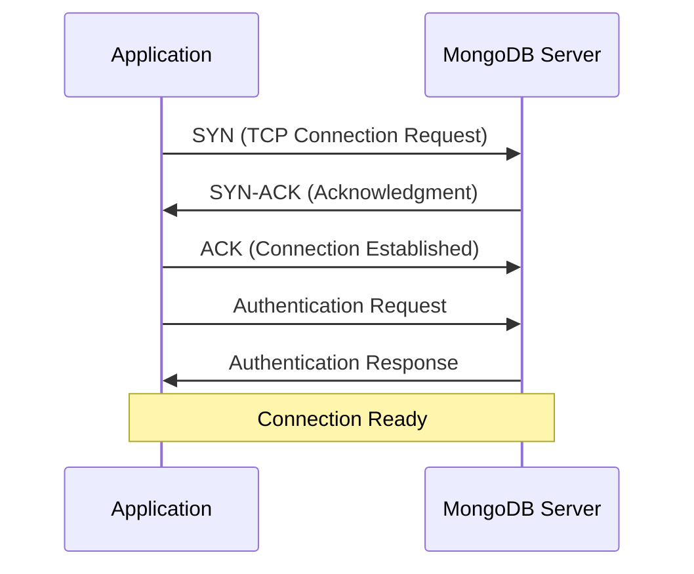
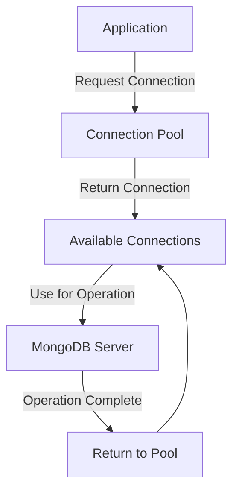

# MongoDB Connection Pooling

Connection pooling is one of the most important concepts to understand when building efficient applications that communicate with MongoDB. In this tutorial, we'll explore what connection pooling is, why it's crucial for performance, and how to implement and optimize it in your applications.

## Understanding MongoDB Connections

Before diving into connection pooling, let's understand what happens when your application connects to MongoDB.

### What is a MongoDB Connection?

A connection to MongoDB represents a network socket between your application and the MongoDB server. Establishing this connection involves several steps:

1. TCP/IP connection setup (3-way handshake)
2. Authentication with the MongoDB server
3. Setting up communication protocols

This process takes time and consumes resources on both the client and server.



## What is Connection Pooling?

Connection pooling is a technique that maintains a set of pre-established database connections that can be reused across multiple operations rather than creating and destroying connections for each operation.

### Why Connection Pooling Matters

Without connection pooling, your application would need to:

1. Establish a new connection for each database operation
2. Close the connection after the operation completes

This constant creation and destruction of connections leads to:

- Higher latency for operations
- Increased CPU usage on both client and server
- Potential bottlenecks during high-traffic periods
- TCP port exhaustion on busy servers

## How Connection Pooling Works in MongoDB

Most MongoDB drivers implement connection pooling automatically. When you create a MongoDB client:

1. The driver creates multiple connections (up to the configured pool size)
2. Connections are kept open and managed in a "pool"
3. When your application needs to perform an operation:
   - It requests a connection from the pool
   - Uses the connection for the operation
   - Returns the connection to the pool (instead of closing it)



## Implementing Connection Pooling in Node.js

Let's look at a practical example using the official MongoDB Node.js driver:

```javascript
const { MongoClient } = require('mongodb');

// Connection URI
const uri = 'mongodb://localhost:27017';

// Create a new MongoClient with poolSize option
const client = new MongoClient(uri, {
  maxPoolSize: 10,  // Maximum number of connections in the pool
  minPoolSize: 5,   // Minimum number of connections in the pool
  maxIdleTimeMS: 30000  // How long a connection can remain idle before being removed
});

async function run() {
  try {
    // Connect to the MongoDB server
    await client.connect();
    console.log('Connected to MongoDB server');
    
    // Get a database reference
    const database = client.db('sample_database');
    const collection = database.collection('sample_collection');
    
    // Perform operations using the connection pool
    const result = await collection.insertOne({ name: 'John Doe', age: 30 });
    console.log('Inserted document:', result);
    
    const documents = await collection.find({}).toArray();
    console.log('Found documents:', documents);
    
    // No need to explicitly return the connection to the pool
    // The driver handles this automatically
  } finally {
    // Close the connection pool when your app is terminating
    await client.close();
    console.log('Connection pool closed');
  }
}

run().catch(console.error);
```

In this example, the MongoDB driver automatically manages a pool of connections. When you perform operations like `insertOne` or `find`, the driver acquires a connection from the pool, executes the operation, and then returns the connection to the pool.

## Connection Pool Configuration Options

Most MongoDB drivers provide similar options for configuring connection pools:

| Option | Description | Common Default |
| ------ | ----------- | -------------- |
| `maxPoolSize` | Maximum number of connections in the pool | 100 |
| `minPoolSize` | Minimum number of connections to maintain | 0 |
| `maxIdleTimeMS` | Maximum time a connection can remain idle (in milliseconds) | 0 (no limit) |
| `waitQueueTimeoutMS` | How long to wait for a connection if maxPoolSize is reached | 0 (no timeout) |

### Example with Pool Configuration in Python

```python
from pymongo import MongoClient

# Create a new client with custom pool settings
client = MongoClient(
    'mongodb://localhost:27017/',
    maxPoolSize=50,
    minPoolSize=10,
    maxIdleTimeMS=10000,
    waitQueueTimeoutMS=2000
)

# The rest of your code remains the same
db = client['sample_database']
collection = db['sample_collection']

# Each operation uses a connection from the pool
result = collection.insert_one({"name": "Jane Smith", "age": 25})
print(f"Inserted document with ID: {result.inserted_id}")

# When the client is closed, all connections in the pool are closed
client.close()
```

## Best Practices for Connection Pooling

### 1. Set Appropriate Pool Size

The ideal pool size depends on your application's needs:

```javascript
const client = new MongoClient(uri, {
  // Formula: (number of concurrent operations) * (number of MongoDB nodes)
  maxPoolSize: 100
});
```

### 2. Monitor Pool Metrics

Most MongoDB drivers provide ways to monitor connection pool metrics:

```javascript
// Using the Node.js driver (v4.x+)
const { MongoClient } = require('mongodb');
const client = new MongoClient(uri);

// Connect to server
await client.connect();

// Get connection pool statistics
const stats = client.topology.s.coreTopology.s.pool.serverMonitor;
console.log('Active connections:', stats.s.pool.availableConnections.length);
console.log('In use connections:', stats.s.pool.inUseConnections.length);
```

### 3. Implement Proper Error Handling

Handle connection issues gracefully:

```javascript
async function performOperation() {
  let client;
  try {
    client = await MongoClient.connect(uri, { maxPoolSize: 10 });
    const db = client.db('sample_database');
    return await db.collection('users').findOne({ email: 'user@example.com' });
  } catch (error) {
    console.error('Database operation failed:', error);
    // Implement retry logic or fallback as needed
    throw error;
  } finally {
    // In modern drivers, this doesn't actually close the connection
    // but returns it to the pool
    if (client) await client.close();
  }
}
```

### 4. Use Connection Pooling with Replicas and Shards

When connecting to a replica set or sharded cluster, the driver creates connection pools for each server:

```javascript
// Connection to a replica set
const uri = 'mongodb://server1:27017,server2:27017,server3:27017/?replicaSet=rs0';
const client = new MongoClient(uri, { 
  maxPoolSize: 10  // 10 connections per replica set member
});
```

## Real-World Application: Connection Pooling in a Web Server

Let's examine a more practical example using Express.js:

```javascript
const express = require('express');
const { MongoClient } = require('mongodb');
const app = express();

// Connection URI
const uri = 'mongodb://localhost:27017';
const client = new MongoClient(uri, { maxPoolSize: 50 });

let db;

// Connect once at application startup
async function connectToMongo() {
  try {
    await client.connect();
    db = client.db('user_management');
    console.log('Connected to MongoDB');
  } catch (error) {
    console.error('Failed to connect to MongoDB', error);
    process.exit(1); // Exit on connection failure
  }
}

// Graceful shutdown
process.on('SIGINT', async () => {
  await client.close();
  console.log('MongoDB connection closed');
  process.exit(0);
});

// Middleware to handle database errors
app.use((req, res, next) => {
  if (!db) {
    return res.status(500).json({ error: 'Database connection not established' });
  }
  next();
});

// Sample API endpoints
app.get('/users', async (req, res) => {
  try {
    // Each request will use a connection from the pool
    const users = await db.collection('users').find({}).limit(100).toArray();
    res.json(users);
  } catch (error) {
    console.error('Error fetching users:', error);
    res.status(500).json({ error: 'Failed to fetch users' });
  }
  // No need to return the connection to the pool manually
});

app.post('/users', express.json(), async (req, res) => {
  try {
    // Connection automatically pulled from the pool
    const result = await db.collection('users').insertOne(req.body);
    res.status(201).json({ 
      success: true, 
      id: result.insertedId 
    });
  } catch (error) {
    console.error('Error creating user:', error);
    res.status(500).json({ error: 'Failed to create user' });
  }
});

// Start the server
const PORT = process.env.PORT || 3000;
connectToMongo().then(() => {
  app.listen(PORT, () => {
    console.log(`Server running on port ${PORT}`);
  });
});
```

In this example:
1. We establish one connection pool at application startup
2. Each API request uses a connection from the pool
3. Connections are automatically returned to the pool after operations
4. We handle graceful shutdown to close connections when the application terminates

## Common Connection Pooling Issues and Solutions

### Problem: Connection Exhaustion

**Symptoms:**
- Operations hang or timeout
- Error messages like "Timeout waiting for connection from pool"

**Solution:**
- Increase the maximum pool size
- Optimize queries to finish faster
- Implement request throttling

```javascript
// Increase pool size
const client = new MongoClient(uri, { 
  maxPoolSize: 200,
  waitQueueTimeoutMS: 5000  // Wait up to 5 seconds for a connection
});
```

### Problem: Zombie Connections

**Symptoms:**
- Connections remain in use even after operations complete
- Pool slowly becomes exhausted

**Solution:**
- Always use try/finally blocks to ensure connections are returned to the pool
- Set appropriate maxIdleTimeMS to clean up stale connections

```javascript
async function safeOperation() {
  let session;
  try {
    // Start a session
    session = client.startSession();
    const collection = client.db('test').collection('users');
    
    // Use the session for operations
    return await collection.findOne({ username: 'test' }, { session });
  } finally {
    // Always end the session to return the connection to the pool
    if (session) session.endSession();
  }
}
```

### Problem: Connection Churn

**Symptoms:**
- Rapidly opening and closing connections
- Poor performance under load

**Solution:**
- Set an appropriate minimum pool size
- Reuse the MongoDB client across your application

```javascript
const client = new MongoClient(uri, {
  minPoolSize: 5,  // Keep at least 5 connections ready
  maxPoolSize: 50
});

// Export the client for reuse across modules
module.exports = client;
```

## Connection Pooling with Mongoose

If you're using Mongoose (an ODM for MongoDB), connection pooling is still handled by the underlying MongoDB driver:

```javascript
const mongoose = require('mongoose');

// Connection options including pool size
const options = {
  maxPoolSize: 10,
  minPoolSize: 2,
  socketTimeoutMS: 45000,
  family: 4  // Use IPv4
};

mongoose.connect('mongodb://localhost:27017/mydatabase', options)
  .then(() => console.log('Connected to MongoDB'))
  .catch(err => console.error('MongoDB connection error:', err));

// Define a schema
const userSchema = new mongoose.Schema({
  name: String,
  email: String
});

const User = mongoose.model('User', userSchema);

// Each query uses a connection from the pool
async function createUser() {
  const user = new User({ name: 'Alice', email: 'alice@example.com' });
  await user.save();
  console.log('User created!');
}

createUser();

// Close the connection pool when your app is terminating
process.on('SIGINT', async () => {
  await mongoose.connection.close();
  process.exit(0);
});
```

## Summary

Connection pooling is a critical optimization technique for efficient communication with MongoDB:

- **Benefits**: Improved performance, reduced latency, better resource utilization
- **Implementation**: Most MongoDB drivers implement connection pooling automatically
- **Configuration**: Adjust pool sizes and timeouts based on your application needs
- **Best practices**: 
  - Create a single client instance for your application
  - Configure appropriate pool sizes
  - Implement proper error handling
  - Monitor pool metrics
  - Close connections during application shutdown

By properly implementing connection pooling, you can significantly improve your application's performance and reliability when interacting with MongoDB.

## Further Learning

1. **Practice Exercise**: Create a simple API with Node.js and Express that uses MongoDB connection pooling to handle concurrent requests.

2. **Challenge**: Implement a monitoring system that logs connection pool metrics (connections in use, available connections) to identify potential issues.

3. **Advanced Topic**: Research how to implement connection pooling with MongoDB transactions and session management.

## Additional Resources

- [MongoDB Node.js Driver Documentation](https://mongodb.github.io/node-mongodb-native/4.0/classes/mongoclient.html)
- [MongoDB Connection String URI Format](https://docs.mongodb.com/manual/reference/connection-string/)
- [Performance Best Practices: Connection Pools](https://docs.mongodb.com/manual/administration/performance/#connection-pools)

Happy coding with MongoDB!