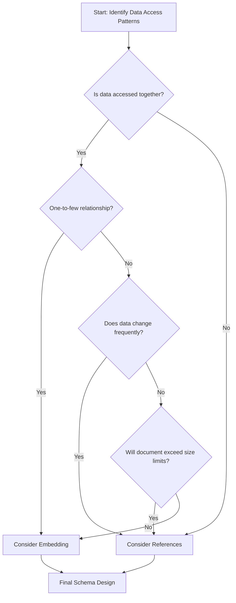

# MongoDB Schema Design Best Practices

## Introduction

MongoDB is a popular NoSQL database that offers flexibility in how you store and structure your data. Unlike traditional relational databases that require predefined schemas, MongoDB allows you to work with dynamic schemas, giving developers the freedom to evolve data models over time. However, this flexibility comes with responsibility – poor schema design decisions can lead to performance issues, difficult maintenance, and scalability problems.

In this guide, we'll explore best practices for MongoDB schema design to help you create efficient, scalable, and maintainable database structures for your applications.

## Understanding MongoDB Document Model

Before diving into best practices, let's understand the fundamental concepts of MongoDB's document model:

- **Documents**: JSON-like objects (BSON format) that store data
- **Collections**: Groups of documents (similar to tables in relational DBs)
- **Embedded Documents**: Nested documents within a document
- **References**: Links between documents (similar to relationships in relational DBs)

## Schema Design Principles

### 1. Design for How You Access Data

One of the most important principles in MongoDB schema design is to structure your data based on how your application accesses it. This is different from relational databases, which often optimize for storage and normalization.

**Example**: If your application frequently needs to display blog posts with author information, you might embed author data directly in the post document:

```javascript
// Blog post document with embedded author information
{
  "_id": ObjectId("5f8a716b9d3b3e001c390001"),
  "title": "MongoDB Schema Design Best Practices",
  "content": "MongoDB offers flexibility in how you structure your data...",
  "publishedDate": ISODate("2023-10-15T00:00:00Z"),
  "author": {
    "name": "Jane Doe",
    "email": "jane.doe@example.com",
    "bio": "Database architect with 10 years of experience"
  },
  "tags": ["mongodb", "schema-design", "best-practices"]
}
```

This approach minimizes the need for joins (or lookups in MongoDB terms), making data retrieval faster.

### 2. Embedding vs. Referencing

MongoDB offers two primary ways to represent relationships between data:

#### Embedding (Denormalization)

Embedding means storing related data in the same document. This approach is ideal for:

- One-to-few relationships
- Data that's frequently accessed together
- Data that doesn't change often

**Benefits**:
- Retrieves all related data in a single database operation
- Better read performance

**Example**: Product with embedded reviews:

```javascript
{
  "_id": ObjectId("5f8a716b9d3b3e001c390002"),
  "name": "Wireless Headphones",
  "price": 99.99,
  "category": "Electronics",
  "reviews": [
    {
      "user": "customer123",
      "rating": 5,
      "comment": "Great sound quality!"
    },
    {
      "user": "audiophile456",
      "rating": 4,
      "comment": "Good battery life but could be better"
    }
  ]
}
```

#### Referencing (Normalization)

Referencing stores a reference (typically an `_id`) to documents in other collections. This approach is ideal for:

- One-to-many relationships
- Many-to-many relationships
- Large subdocuments
- Data that changes frequently

**Benefits**:
- Avoids duplication of data
- Better write performance for frequently changing data

**Example**: User document with references to orders:

```javascript
// User document
{
  "_id": ObjectId("5f8a716b9d3b3e001c390003"),
  "name": "Alice Smith",
  "email": "alice@example.com",
  "orderIds": [
    ObjectId("5f8a716b9d3b3e001c390010"),
    ObjectId("5f8a716b9d3b3e001c390011")
  ]
}

// Order document
{
  "_id": ObjectId("5f8a716b9d3b3e001c390010"),
  "orderNumber": "ORD-2023-10001",
  "total": 129.99,
  "items": [
    { "product": "Wireless Headphones", "quantity": 1, "price": 99.99 },
    { "product": "Headphone Case", "quantity": 1, "price": 29.99 }
  ]
}
```

To retrieve a user with their orders, you would need to perform a lookup:

```javascript
db.users.aggregate([
  { $match: { _id: ObjectId("5f8a716b9d3b3e001c390003") } },
  {
    $lookup: {
      from: "orders",
      localField: "orderIds",
      foreignField: "_id",
      as: "orders"
    }
  }
])
```

### 3. Document Size Considerations

MongoDB has a 16MB document size limit. While this is generous, it's important to plan for growth and avoid hitting this limit:

- Be cautious with arrays that can grow unbounded
- Monitor document sizes in collections with embedded arrays
- Consider referencing when documents might exceed a few megabytes

**Example of a potential problem**: A social media post with embedded comments:

```javascript
{
  "_id": ObjectId("5f8a716b9d3b3e001c390004"),
  "content": "Check out my new MongoDB tutorial!",
  "author": "tech_blogger",
  "likes": 1503,
  "comments": [
    // Imagine thousands of comments here
    // This could eventually hit the 16MB limit
  ]
}
```

**Better approach**: Store comments in a separate collection:

```javascript
// Post document
{
  "_id": ObjectId("5f8a716b9d3b3e001c390004"),
  "content": "Check out my new MongoDB tutorial!",
  "author": "tech_blogger",
  "likes": 1503
}

// Comments collection
{
  "_id": ObjectId("5f8a716b9d3b3e001c390020"),
  "postId": ObjectId("5f8a716b9d3b3e001c390004"),
  "user": "mongodb_fan",
  "text": "Great tutorial! Very helpful.",
  "createdAt": ISODate("2023-10-15T14:25:00Z")
}
```

### 4. Schema Versioning

As your application evolves, your schema will need to change. MongoDB's flexible schema makes this easier, but you still need a strategy:

1. Use a schema version field in documents
2. Handle multiple schema versions in your application code
3. Migrate data in batches during off-peak hours

**Example**:

```javascript
{
  "_id": ObjectId("5f8a716b9d3b3e001c390005"),
  "schemaVersion": 2,  // Indicates which version of the schema this document uses
  "name": "John Doe",
  "contactInfo": {
    "email": "john@example.com",
    "phone": "555-123-4567"
  }
  // In version 1, contactInfo might have been separate fields
}
```

### 5. Indexing Strategy

Proper indexing is crucial for MongoDB performance:

1. Create indexes for frequently queried fields
2. Use compound indexes for queries on multiple fields
3. Consider covered queries (queries that can be satisfied entirely by indexes)
4. Be cautious about adding too many indexes, as they slow down writes

**Example**: Creating indexes for a user collection:

```javascript
// Create an index on email field for fast user lookups
db.users.createIndex({ "email": 1 }, { unique: true })

// Create a compound index for searching users by name and age
db.users.createIndex({ "lastName": 1, "firstName": 1, "age": -1 })
```

## Real-world Schema Design Patterns

### Pattern 1: Attribute Pattern

The attribute pattern is useful when:
- Documents have many attributes, but queries only use a few
- You need to search for documents based on dynamic attributes

**Example**: E-commerce product catalog:

```javascript
// Traditional approach - difficult to query for specific attributes
{
  "_id": ObjectId("5f8a716b9d3b3e001c390006"),
  "name": "Smartphone X",
  "brand": "TechCorp",
  "color": "Black",
  "storage": "128GB",
  "screen": "6.5 inch",
  "camera": "12MP",
  "battery": "4000mAh",
  "processor": "OctaCore",
  "ram": "8GB"
  // many more attributes
}

// Attribute pattern - easier to query for specific combinations
{
  "_id": ObjectId("5f8a716b9d3b3e001c390006"),
  "name": "Smartphone X",
  "brand": "TechCorp",
  "attributes": [
    { "name": "color", "value": "Black" },
    { "name": "storage", "value": "128GB" },
    { "name": "screen", "value": "6.5 inch" },
    { "name": "camera", "value": "12MP" },
    { "name": "battery", "value": "4000mAh" },
    { "name": "processor", "value": "OctaCore" },
    { "name": "ram", "value": "8GB" }
  ]
}
```

With the attribute pattern, you can easily create an index and query:

```javascript
db.products.createIndex({ "attributes.name": 1, "attributes.value": 1 })

// Find all products with 8GB RAM
db.products.find({
  "attributes": { 
    $elemMatch: { 
      "name": "ram", 
      "value": "8GB" 
    }
  }
})
```

### Pattern 2: Bucket Pattern

The bucket pattern is useful for time-series data or situations where you have many related small documents:

**Example**: IoT temperature readings:

```javascript
// Instead of one document per reading:
{
  "deviceId": "temp-sensor-01",
  "timestamp": ISODate("2023-10-15T12:00:00Z"),
  "temperature": 22.5
}

// Use buckets to group readings by hour:
{
  "deviceId": "temp-sensor-01",
  "hour": ISODate("2023-10-15T12:00:00Z"),
  "readings": [
    { "minute": 0, "temperature": 22.5 },
    { "minute": 1, "temperature": 22.5 },
    { "minute": 2, "temperature": 22.6 },
    // ... more readings for this hour
  ]
}
```

### Pattern 3: Extended Reference Pattern

This pattern duplicates some data to avoid frequent joins but maintains references for complete data access:

**Example**: E-commerce orders with product information:

```javascript
{
  "_id": ObjectId("5f8a716b9d3b3e001c390007"),
  "orderNumber": "ORD-2023-10002",
  "user": {
    "id": ObjectId("5f8a716b9d3b3e001c390008"),
    "name": "Sarah Johnson",
    "email": "sarah@example.com"
    // Basic user info frequently needed with orders
  },
  "items": [
    {
      "productId": ObjectId("5f8a716b9d3b3e001c390009"),
      "name": "Wireless Headphones",
      "price": 99.99,
      "quantity": 1,
      // Frequently needed product info is embedded
      // Full product details remain in the products collection
    }
  ],
  "total": 99.99,
  "status": "shipped"
}
```

## Schema Design Decision Flow

When designing your schema, follow this general decision-making process:



## Common Schema Design Mistakes

1. **Over-embedding**: Embedding too many documents or arrays that can grow indefinitely
2. **Excessive normalization**: Creating too many collections and references, requiring complex lookups
3. **Ignoring write patterns**: Optimizing only for reads when write operations are frequent
4. **Neglecting indexes**: Not creating proper indexes for common query patterns
5. **One schema for all use cases**: Not adapting schema for different access patterns

## Example: Complete Blog Application Schema

Let's design a schema for a blog application with users, posts, comments, and categories:

```javascript
// Users Collection
{
  "_id": ObjectId("5f8a716b9d3b3e001c390020"),
  "username": "tech_writer",
  "email": "writer@example.com",
  "passwordHash": "...",
  "profile": {
    "name": "Alex Johnson",
    "bio": "Tech enthusiast and writer",
    "avatarUrl": "/images/avatars/alex.jpg"
  },
  "createdAt": ISODate("2023-01-15T00:00:00Z"),
  "lastLogin": ISODate("2023-10-14T09:15:00Z")
}

// Categories Collection
{
  "_id": ObjectId("5f8a716b9d3b3e001c390021"),
  "name": "MongoDB",
  "slug": "mongodb",
  "description": "Articles about MongoDB database"
}

// Posts Collection
{
  "_id": ObjectId("5f8a716b9d3b3e001c390022"),
  "title": "MongoDB Schema Design Best Practices",
  "slug": "mongodb-schema-design-best-practices",
  "content": "MongoDB offers flexibility in how you structure your data...",
  "author": {
    "_id": ObjectId("5f8a716b9d3b3e001c390020"),
    "username": "tech_writer",
    "name": "Alex Johnson"
    // Note: We embed frequently needed author information
  },
  "categoryId": ObjectId("5f8a716b9d3b3e001c390021"),
  "tags": ["mongodb", "schema-design", "best-practices"],
  "publishedDate": ISODate("2023-10-15T00:00:00Z"),
  "lastModified": ISODate("2023-10-15T00:00:00Z"),
  "status": "published",
  "commentCount": 5  // Store count for quick access
}

// Comments Collection
{
  "_id": ObjectId("5f8a716b9d3b3e001c390023"),
  "postId": ObjectId("5f8a716b9d3b3e001c390022"),
  "author": {
    "_id": ObjectId("5f8a716b9d3b3e001c390024"),
    "username": "mongodb_fan",
    "name": "Jamie Smith"
  },
  "content": "This article helped me understand embedding vs. referencing!",
  "createdAt": ISODate("2023-10-15T10:30:00Z"),
  "likes": 3
}
```

**Key Design Decisions:**
1. We reference comments from posts rather than embedding them (one-to-many relationship)
2. We include a `commentCount` in posts for quick access without loading comments
3. We embed basic author information in posts and comments for quick rendering
4. We use a separate categories collection with references from posts

## Summary

Effective MongoDB schema design requires thinking differently from traditional relational databases. By focusing on access patterns, making thoughtful decisions about embedding vs. referencing, and applying appropriate schema design patterns, you can create performant and maintainable MongoDB applications.

Key takeaways:
- Design for your access patterns
- Choose wisely between embedding and referencing
- Consider document growth and size limits
- Create appropriate indexes
- Apply schema design patterns that fit your use case
- Be prepared to evolve your schema over time

## Additional Resources

* [MongoDB Data Modeling Documentation](https://www.mongodb.com/docs/manual/core/data-modeling-introduction/)
* [MongoDB University - Data Modeling Course](https://learn.mongodb.com/courses/data-modeling)
* [MongoDB Schema Design Patterns](https://www.mongodb.com/blog/post/building-with-patterns-a-summary)

## Exercises

1. Design a MongoDB schema for an e-commerce application with products, users, orders, and reviews.
2. Refactor a relational database schema into a MongoDB schema for a social media application.
3. Create indexes for common queries in your schema design.
4. Implement the attribute pattern for a flexible product catalog.
5. Design a schema for time-series data that efficiently handles queries for different time ranges.