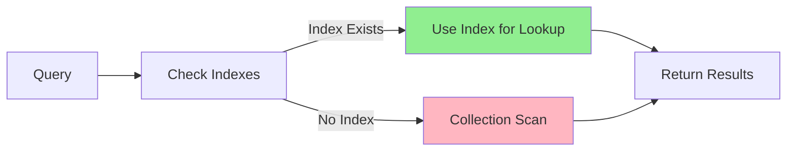

# MongoDB Query Optimization

## Introduction

Query optimization is a critical aspect of working with MongoDB, especially as your database grows in size and complexity. Efficiently structured queries can dramatically improve application performance, reduce server load, and enhance user experience. This guide will walk you through the fundamentals of MongoDB query optimization, providing practical examples and techniques to help you write faster, more efficient database operations.

Whether you're working on a small project or a large-scale application, understanding how to optimize your MongoDB queries is an essential skill that will help you create more responsive and scalable applications.

## Why Query Optimization Matters

Before diving into specific techniques, let's understand why query optimization is important:

1. **Performance**: Optimized queries execute faster, reducing response times for your users.
2. **Resource Utilization**: Efficient queries use fewer server resources (CPU, memory, disk I/O).
3. **Scalability**: Well-optimized databases handle growth better as your application scales.
4. **Cost Efficiency**: Better performance can mean less need for hardware upgrades or additional instances.

Let's explore how to achieve these benefits through practical MongoDB query optimization techniques.

## Creating and Using Indexes

### Understanding Indexes

Indexes are perhaps the single most important factor in query performance. They work like the index at the back of a book, helping MongoDB quickly locate the data without scanning every document.



### Creating Basic Indexes

Here's how to create a simple index on a field:

```javascript
// Creating an index on the "username" field
db.users.createIndex({ username: 1 });

// 1 specifies ascending order
// -1 would specify descending order
```

### Compound Indexes

For queries that filter on multiple fields, compound indexes can be very effective:

```javascript
// Creating a compound index on "age" and "city"
db.users.createIndex({ age: 1, city: 1 });

// This index supports queries filtering on:
// - age alone
// - age and city together
// But NOT city alone
```

### Checking Index Usage

To verify if your queries are using indexes, use the `explain()` method:

```javascript
// Check how a query executes
db.users.find({ username: "john_doe" }).explain("executionStats");
```

Expected output (simplified):

```javascript
{
  "executionStats": {
    "executionSuccess": true,
    "nReturned": 1,
    "executionTimeMillis": 0,
    "totalKeysExamined": 1,
    "totalDocsExamined": 1,
    // When totalDocsExamined equals nReturned, your query is efficient
  },
  "queryPlanner": {
    "winningPlan": {
      "stage": "FETCH",
      "inputStage": {
        "stage": "IXSCAN",  // This shows an index was used
        "indexName": "username_1"
      }
    }
  }
}
```

If you see `COLLSCAN` instead of `IXSCAN`, it means MongoDB had to scan all documents and no index was used.

## Query Structure Optimization

### Use Projection to Return Only Required Fields

Returning only the fields you need reduces network transfer and processing time:

```javascript
// Before: Returns all fields
db.products.find({ category: "electronics" });

// After: Returns only name and price
db.products.find({ category: "electronics" }, { name: 1, price: 1, _id: 0 });
```

### Limit Results When Possible

When you don't need all matching documents, use `limit()`:

```javascript
// Returns only the first 10 results
db.products.find({ category: "electronics" }).limit(10);
```

### Skip and Limit for Pagination

Though common, be cautious with `skip()` for large offsets as it can be inefficient:

```javascript
// Page 1 (items 1-10)
db.products.find().limit(10);

// Page 2 (items 11-20)
db.products.find().skip(10).limit(10);

// Page 3 (items 21-30)
db.products.find().skip(20).limit(10);
```

For better pagination with large collections, consider using query criteria:

```javascript
// First page
let firstPage = db.products.find().sort({ _id: 1 }).limit(10).toArray();
let lastIdOnPage = firstPage[firstPage.length - 1]._id;

// Next page (more efficient than using skip)
let nextPage = db.products.find({ _id: { $gt: lastIdOnPage } }).sort({ _id: 1 }).limit(10);
```

### Use Proper Query Operators

Choose the right operators for your use case:

```javascript
// Less efficient - scans all documents with regex
db.products.find({ name: /^Apple/ });

// More efficient - uses an index for a prefix search
db.products.find({ name: { $regex: "^Apple" } }).hint("name_1");
```

## Advanced Optimization Techniques

### Covered Queries

A covered query is one where all the fields in the query are part of an index, including the fields you want to return. This avoids looking up the actual document:

```javascript
// Create an index that includes all fields needed
db.users.createIndex({ username: 1, email: 1, age: 1 });

// This query can be "covered" by the index (if _id is not returned)
db.users.find(
  { username: "john_doe" },
  { username: 1, email: 1, age: 1, _id: 0 }
);
```

### Use $hint to Force Index Usage

Sometimes MongoDB may not choose the optimal index. You can force it to use a specific index:

```javascript
// Force MongoDB to use a specific index
db.users.find({ age: { $gt: 20 }, city: "New York" })
  .hint({ age: 1, city: 1 });
```

### Avoiding Large In-Memory Sorts

When MongoDB can't use an index for sorting, it performs an in-memory sort which can be expensive:

```javascript
// Create an index to support this sort operation
db.products.createIndex({ price: -1 });

// Now this query will use the index for sorting
db.products.find().sort({ price: -1 });
```

## Real-world Optimization Examples

### Example 1: E-commerce Product Search

Let's optimize a product search feature for an e-commerce application:

```javascript
// Original inefficient query
db.products.find(
  { category: "electronics", price: { $lt: 1000 }, inStock: true }
).sort({ rating: -1 });

// Step 1: Create a compound index to support this query pattern
db.products.createIndex({ 
  category: 1, 
  inStock: 1, 
  price: 1, 
  rating: -1 
});

// Step 2: Optimize the query by projecting only needed fields
db.products.find(
  { category: "electronics", price: { $lt: 1000 }, inStock: true },
  { name: 1, price: 1, rating: 1, imageUrl: 1, _id: 1 }
).sort({ rating: -1 }).limit(20);
```

### Example 2: User Activity Feed

For a social media application displaying recent activity:

```javascript
// Original query (inefficient for large collections)
db.activities.find({ userId: "user123" })
  .sort({ timestamp: -1 })
  .limit(50);

// Step 1: Create a compound index
db.activities.createIndex({ userId: 1, timestamp: -1 });

// Step 2: Use the index for efficient lookup and sorting
db.activities.find({ userId: "user123" })
  .sort({ timestamp: -1 })
  .limit(50)
  .projection({ activity: 1, timestamp: 1, target: 1 });

// Step 3: For newer activities, use a timestamp filter
let lastCheckTime = new Date('2023-10-15T00:00:00Z');
db.activities.find({ 
  userId: "user123",
  timestamp: { $gt: lastCheckTime }
})
.sort({ timestamp: -1 });
```

### Example 3: Geospatial Query Optimization

For a location-based application finding nearby places:

```javascript
// First, create a geospatial index
db.places.createIndex({ location: "2dsphere" });

// Query for places within 1km of a point
db.places.find({
  location: {
    $near: {
      $geometry: {
        type: "Point",
        coordinates: [-73.9667, 40.78]  // longitude, latitude
      },
      $maxDistance: 1000  // 1km in meters
    }
  },
  type: "restaurant"  // Add a filter for restaurant type
});

// For better performance with additional criteria, add a compound index
db.places.createIndex({ type: 1, location: "2dsphere" });
```

## Monitoring and Ongoing Optimization

### Using the MongoDB Profiler

Enable the database profiler to identify slow queries:

```javascript
// Enable profiler to catch queries taking longer than 100ms
db.setProfilingLevel(1, { slowms: 100 });

// Check profiler data
db.system.profile.find().sort({ ts: -1 }).limit(10);
```

### Analyzing Index Usage

Check which indexes are being used and which might be redundant:

```javascript
// Get index usage statistics
db.collection.aggregate([
  { $indexStats: {} }
]);

// Find unused indexes (low usage counts might be candidates for removal)
```

### Regular Index Maintenance

Periodically review and maintain your indexes:

```javascript
// List all indexes
db.collection.getIndexes();

// Drop unnecessary indexes
db.collection.dropIndex("index_name");
```

## Common Pitfalls to Avoid

1. **Too Many Indexes**: Each index adds overhead to write operations.

2. **Index Keys With High Cardinality**: Avoid indexing fields with too many unique values.

3. **Large Array Indexes**: Indexes on array fields can grow very large.

4. **Regex Queries Without Anchors**: Queries like `/pattern/` can't use indexes efficiently, while `/^pattern/` can use indexes.

5. **Negation Operators**: Queries with `$ne`, `$not`, etc. often can't use indexes effectively.

## Summary

MongoDB query optimization is a critical skill for building efficient applications. We've covered:

- Creating and using indexes effectively
- Structuring queries for optimal performance
- Advanced optimization techniques like covered queries
- Real-world examples demonstrating practical optimizations
- Monitoring and maintaining query performance

Remember that optimization is an ongoing process. As your data and access patterns change, you'll need to revisit and refine your optimization strategies. Start with the basics—proper indexing and query structure—and then move to more advanced techniques as needed.

## Additional Resources

- [MongoDB Index Documentation](https://www.mongodb.com/docs/manual/indexes/)
- [Query Optimization Strategies](https://www.mongodb.com/docs/manual/core/query-optimization/)
- [MongoDB Explain Output](https://www.mongodb.com/docs/manual/reference/explain-results/)

## Practice Exercises

1. Create a sample collection with at least 10,000 documents and experiment with different indexes to see their impact on query performance.

2. Take a slow query from your current project and optimize it using the techniques discussed in this guide.

3. Use the MongoDB profiler to identify the top 3 slowest queries in your application and implement optimizations for them.

4. Practice creating compound indexes that support multiple query patterns in your application.

5. Implement cursor-based pagination for a collection with more than 100,000 documents and compare its performance to skip-based pagination.