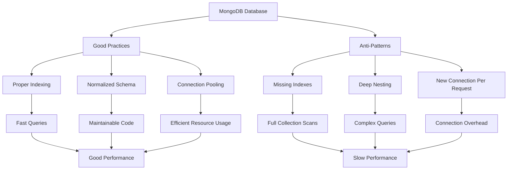

# MongoDB Anti-Patterns

When working with MongoDB, it's not just important to know what to do—it's equally important to understand what not to do. Anti-patterns are commonly reinvented solutions that appear to be beneficial but ultimately lead to poor outcomes. In this guide, we'll explore common MongoDB anti-patterns and provide better alternatives to help you build more efficient and maintainable applications.

## Introduction to MongoDB Anti-Patterns

MongoDB's flexibility is one of its greatest strengths, but it can also lead to design decisions that negatively impact performance, scalability, and maintainability. Anti-patterns often emerge when developers apply relational database concepts to MongoDB or fail to account for MongoDB's distributed nature and document model.

By learning to identify and avoid these pitfalls, you'll be able to leverage MongoDB's true power while steering clear of common mistakes that can degrade your application's performance.

## Schema Design Anti-Patterns

### Anti-Pattern 1: Massive Arrays

One common mistake is storing large arrays within documents.

```javascript
// ❌ Bad Practice
{
  "_id": "user123",
  "name": "John Doe",
  "comments": [
    { "text": "Great post!", "date": "2023-01-01" },
    { "text": "I disagree.", "date": "2023-01-02" },
    // Thousands more comments
  ]
}
```

**Why it's problematic:**
- Documents have a 16MB size limit
- Updating the array requires rewriting the entire document
- Reading the whole array when you only need part of it wastes bandwidth

**Better alternative:**

```javascript
// ✅ Good Practice
// users collection
{
  "_id": "user123",
  "name": "John Doe"
}

// comments collection
{
  "_id": "comment1",
  "userId": "user123",
  "text": "Great post!",
  "date": "2023-01-01"
}
{
  "_id": "comment2",
  "userId": "user123", 
  "text": "I disagree.",
  "date": "2023-01-02"
}
```

This approach references related data instead of embedding it, allowing for:
- Independent scaling of comments
- Pagination of comments
- Faster updates

### Anti-Pattern 2: Deep Nesting

Deeply nested documents can become difficult to work with and inefficient.

```javascript
// ❌ Bad Practice
{
  "store": {
    "address": {
      "building": {
        "floor": {
          "department": {
            "section": {
              "products": [
                // Products list
              ]
            }
          }
        }
      }
    }
  }
}
```

**Why it's problematic:**
- Difficult to query and update specific nested fields
- Complex aggregation operations
- Poor readability and maintainability

**Better alternative:**

```javascript
// ✅ Good Practice
{
  "storeId": "store123",
  "addressId": "addr456",
  "buildingId": "bldg789",
  "floorNumber": 3,
  "departmentName": "Electronics",
  "sectionName": "Computers",
  "products": [
    // Limited list of product references
  ]
}
```

Flattening the schema improves query performance and makes documents easier to work with.

## Query and Index Anti-Patterns

### Anti-Pattern 3: Missing Indexes

Failing to create appropriate indexes for your queries is a common and serious performance issue.

```javascript
// ❌ Bad Practice
db.users.find({ email: "user@example.com" })  // No index on email field
```

Without an index, MongoDB must scan every document in the collection to find matches.

**Better alternative:**

```javascript
// ✅ Good Practice
// Create an index on the email field
db.users.createIndex({ email: 1 })

// Now this query will use the index
db.users.find({ email: "user@example.com" })
```

The output from creating the index:

```
{
  "createdCollectionAutomatically" : false,
  "numIndexesBefore" : 1,
  "numIndexesAfter" : 2,
  "ok" : 1
}
```

### Anti-Pattern 4: Using $where Operator

The `$where` operator allows JavaScript execution within queries but comes with serious performance implications.

```javascript
// ❌ Bad Practice
db.products.find({
  $where: function() {
    return this.price * this.quantity > 100;
  }
})
```

**Why it's problematic:**
- Cannot use indexes effectively
- JavaScript execution is much slower than native operators
- Security concerns with JavaScript injection

**Better alternative:**

```javascript
// ✅ Good Practice
// Calculate and store the total value in your documents
{
  "name": "Keyboard",
  "price": 25,
  "quantity": 5,
  "totalValue": 125  // Pre-calculated field
}

// Then query using this field
db.products.find({ totalValue: { $gt: 100 } })

// Or use aggregation for dynamic calculations
db.products.aggregate([
  { $match: {} },
  { $addFields: { totalValue: { $multiply: ["$price", "$quantity"] }}},
  { $match: { totalValue: { $gt: 100 }}}
])
```

## Data Manipulation Anti-Patterns

### Anti-Pattern 5: Unbound Array Growth

Continuously adding items to an array without limits can lead to performance degradation.

```javascript
// ❌ Bad Practice
// Adding to logs array without bounds
db.systems.updateOne(
  { _id: "server001" },
  { $push: { logs: { timestamp: new Date(), message: "System check" } } }
);
```

**Better alternative:**

```javascript
// ✅ Good Practice
// Using $push with $slice to maintain a fixed-size array
db.systems.updateOne(
  { _id: "server001" },
  { 
    $push: { 
      logs: { 
        $each: [{ timestamp: new Date(), message: "System check" }],
        $slice: -100  // Keep only the most recent 100 logs
      } 
    } 
  }
);

// Or better yet, use a separate collection for logs
db.logs.insertOne({
  serverId: "server001",
  timestamp: new Date(),
  message: "System check"
});
```

### Anti-Pattern 6: Expensive Count Operations

Using `count()` on large collections without proper filtering can be expensive.

```javascript
// ❌ Bad Practice
// Getting total count of a large collection
const totalUsers = await db.users.countDocuments();
```

**Better alternative:**

```javascript
// ✅ Good Practice
// Store counters in a separate collection
db.stats.updateOne(
  { _id: "userStats" },
  { $inc: { totalUsers: 1 } },
  { upsert: true }
);

// Later retrieve the count quickly
const stats = await db.stats.findOne({ _id: "userStats" });
const totalUsers = stats.totalUsers;
```

## Connection Management Anti-Patterns

### Anti-Pattern 7: Creating New Connections for Each Request

Creating and destroying MongoDB connections frequently is inefficient.

```javascript
// ❌ Bad Practice
async function handleRequest(req, res) {
  const client = new MongoClient(uri);
  await client.connect();
  const db = client.db("myapp");
  // Do operations
  await client.close();
}
```

**Better alternative:**

```javascript
// ✅ Good Practice
// Create a connection pool once during app initialization
const client = new MongoClient(uri, { 
  maxPoolSize: 20,
  minPoolSize: 5
});
await client.connect();
const db = client.db("myapp");

// Reuse the connection in request handlers
async function handleRequest(req, res) {
  // Use the existing db connection
  const result = await db.collection("users").findOne({ _id: req.userId });
  // No need to close connection here
}
```

## Transaction Anti-Patterns

### Anti-Pattern 8: Misusing or Overusing Transactions

MongoDB supports multi-document transactions, but they come with performance overhead.

```javascript
// ❌ Bad Practice - Using transactions for simple operations
const session = client.startSession();
try {
  session.startTransaction();
  await db.collection('users').insertOne({ name: "Alice" }, { session });
  await session.commitTransaction();
} catch (error) {
  await session.abortTransaction();
} finally {
  await session.endSession();
}
```

**Better alternative:**

```javascript
// ✅ Good Practice - Only use transactions when necessary
// For simple operations, don't use transactions
await db.collection('users').insertOne({ name: "Alice" });

// For truly transactional operations, use transactions properly
const session = client.startSession();
try {
  session.startTransaction();
  await db.collection('accounts').updateOne(
    { userId: "123" }, 
    { $inc: { balance: -100 } }, 
    { session }
  );
  await db.collection('accounts').updateOne(
    { userId: "456" },
    { $inc: { balance: 100 } },
    { session }
  );
  await db.collection('transfers').insertOne({
    from: "123",
    to: "456",
    amount: 100,
    date: new Date()
  }, { session });
  
  await session.commitTransaction();
} catch (error) {
  await session.abortTransaction();
  throw error;
} finally {
  await session.endSession();
}
```

## Schema Validation Anti-Patterns

### Anti-Pattern 9: No Schema Validation

MongoDB's flexibility doesn't mean you should skip schema validation altogether.

```javascript
// ❌ Bad Practice - No validation at all
db.createCollection("products");

// Insert inconsistent data
db.products.insertOne({ name: "Laptop", price: "1000" }); // price as string
db.products.insertOne({ name: "Phone", price: 500 }); // price as number
```

**Better alternative:**

```javascript
// ✅ Good Practice - Define validation rules
db.createCollection("products", {
  validator: {
    $jsonSchema: {
      bsonType: "object",
      required: ["name", "price"],
      properties: {
        name: {
          bsonType: "string",
          description: "must be a string and is required"
        },
        price: {
          bsonType: "double",
          minimum: 0,
          description: "must be a positive number and is required"
        }
      }
    }
  }
});

// Now this will fail validation
db.products.insertOne({ name: "Laptop", price: "1000" });
// Error: Document failed validation

// This will succeed
db.products.insertOne({ name: "Laptop", price: 1000.0 });
```

## Visual Representation of Anti-Patterns Impact

Here's a diagram showing how anti-patterns can impact database performance:



## Summary

MongoDB's flexibility is powerful but requires careful consideration to avoid anti-patterns. By following these best practices, you can build more efficient, scalable, and maintainable MongoDB applications:

1. **Avoid massive arrays** in documents; use separate collections with references instead
2. **Flatten deeply nested documents** for better query performance
3. **Create appropriate indexes** for your query patterns
4. **Avoid using `$where`** for filtering; use MongoDB's native operators
5. **Set boundaries for array growth** to prevent unbounded document expansion
6. **Optimize expensive operations** like counts with application-level counters
7. **Use connection pooling** rather than creating new connections for each request
8. **Use transactions judiciously** only when truly needed
9. **Implement schema validation** to ensure data consistency

By steering clear of these anti-patterns, you'll build MongoDB applications that are faster, more reliable, and easier to maintain.

## Further Resources

To dive deeper into MongoDB best practices and anti-patterns, consider exploring:

1. MongoDB University courses on data modeling and performance optimization
2. The official MongoDB documentation on schema design patterns
3. Books like "MongoDB: The Definitive Guide" which cover advanced concepts

## Practice Exercises

1. Examine an existing MongoDB schema and identify potential anti-patterns
2. Refactor a schema with deeply nested documents into a flatter structure
3. Create appropriate indexes for commonly used queries in your application
4. Replace any `$where` queries with equivalent queries using MongoDB operators
5. Implement connection pooling in an application that creates new connections frequently

By understanding and avoiding these anti-patterns, you'll be well on your way to mastering MongoDB best practices!