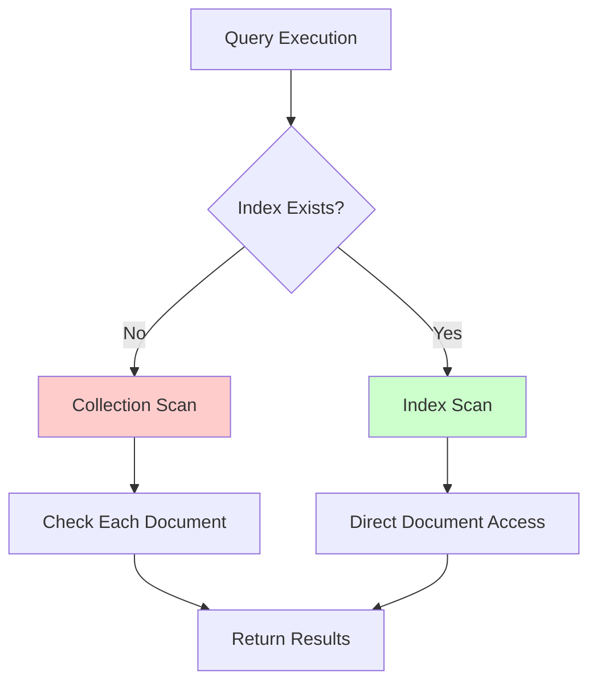

# MongoDB Indexing Strategies

## Introduction

Effective indexing is one of the most important aspects of database performance optimization in MongoDB. Much like an index in a book helps you quickly find specific content, MongoDB indexes help the database engine locate data efficiently without scanning the entire collection.

In this guide, we'll explore various MongoDB indexing strategies that can significantly improve your application's performance. We'll cover when and how to use different types of indexes, considerations for indexing in production environments, and best practices to follow.

## Why Indexing Matters

Without proper indexes, MongoDB must perform collection scans—reviewing every document in a collection—to find the documents that match your query criteria. This becomes increasingly inefficient as your data grows.

Let's visualize the difference:



A well-designed indexing strategy can turn a query that takes seconds or minutes into one that completes in milliseconds.

## Basic Indexing Concepts

### Creating a Simple Index

MongoDB automatically creates an index on the `_id` field for every collection. To create additional indexes, you can use the `createIndex()` method:

```javascript
// Create a simple index on the "username" field
db.users.createIndex({ username: 1 })
```

The `1` indicates an ascending index. You can use `-1` for descending order.

### Viewing Existing Indexes

To see what indexes exist on a collection:

```javascript
// View all indexes on the users collection
db.users.getIndexes()
```

Output:
```javascript
[
  {
    "v": 2,
    "key": { "_id": 1 },
    "name": "_id_",
    "ns": "mydatabase.users"
  },
  {
    "v": 2,
    "key": { "username": 1 },
    "name": "username_1",
    "ns": "mydatabase.users"
  }
]
```

### Understanding Index Types

MongoDB supports several types of indexes to optimize different query patterns:

1. **Single Field Index**: Indexes on a single field
2. **Compound Index**: Indexes on multiple fields
3. **Multikey Index**: Indexes on array fields
4. **Geospatial Index**: Optimizes queries for geographical data
5. **Text Index**: Optimizes for text search operations
6. **Hashed Index**: Optimizes for equality matches and sharding

Let's explore each of these in more detail.

## Single Field Indexes

Single field indexes are the most basic type and are created on a single field of a document.

### Example: Creating and Using a Single Field Index

Imagine we have a `products` collection with thousands of items:

```javascript
// Without an index, this query would scan all documents
db.products.find({ category: "electronics" })
```

Let's create an index on the `category` field:

```javascript
db.products.createIndex({ category: 1 })
```

Now the same query will use the index and execute much faster.

To verify the index is being used, we can use the `explain()` method:

```javascript
db.products.find({ category: "electronics" }).explain("executionStats")
```

Output (abbreviated):
```javascript
{
  "executionStats": {
    "executionTimeMillis": 5,
    "totalKeysExamined": 85,
    "totalDocsExamined": 85,
    // ... other stats
  },
  "queryPlanner": {
    // ... planner info
    "winningPlan": {
      "stage": "FETCH",
      "inputStage": {
        "stage": "IXSCAN",
        "keyPattern": { "category": 1 },
        // ... indicates index was used
      }
    }
  }
}
```

Notice the `IXSCAN` stage, which indicates an index scan was used instead of a collection scan (`COLLSCAN`).

## Compound Indexes

Compound indexes include multiple fields. The order of fields in a compound index is critically important.

### Creating a Compound Index

```javascript
// Create a compound index on category and price
db.products.createIndex({ category: 1, price: -1 })
```

This index supports queries that filter by:
- Just the `category` field
- Both `category` and `price` fields

But it does **not** efficiently support queries that only filter by `price`.

### Index Prefix Rule

MongoDB can use a compound index for queries that include the prefix of the indexed fields. For example, with the index `{ a: 1, b: 1, c: 1 }`, MongoDB can use this index for queries on:
- `{ a: 1 }`
- `{ a: 1, b: 1 }`
- `{ a: 1, b: 1, c: 1 }`

But not for:
- `{ b: 1 }`
- `{ c: 1 }`
- `{ b: 1, c: 1 }`

### Sort Operations and Compound Indexes

A key benefit of compound indexes is that they can support efficient sorting:

```javascript
// This query benefits from our compound index
db.products.find({ category: "electronics" }).sort({ price: -1 })
```

## Multikey Indexes

When you create an index on a field that contains an array, MongoDB creates separate index entries for each element in the array. These are called multikey indexes.

### Example

Consider a `blog_posts` collection with documents like:

```javascript
{
  _id: ObjectId("..."),
  title: "MongoDB Indexing Guide",
  tags: ["mongodb", "database", "performance"]
}
```

Create an index on the `tags` array:

```javascript
db.blog_posts.createIndex({ tags: 1 })
```

This allows efficient queries like:

```javascript
// Find all posts with the "performance" tag
db.blog_posts.find({ tags: "performance" })
```

## Text Indexes

Text indexes support text search operations on string content.

### Creating a Text Index

```javascript
// Create a text index on the "description" field
db.products.createIndex({ description: "text" })
```

### Performing Text Searches

```javascript
// Find products with descriptions containing "wireless" or "bluetooth"
db.products.find({ $text: { $search: "wireless bluetooth" } })
```

### Multiple Field Text Index

You can create a text index on multiple fields:

```javascript
// Create a text index on both title and description
db.products.createIndex({ 
  title: "text", 
  description: "text" 
})
```

## Geospatial Indexes

MongoDB supports two types of geospatial indexes:

1. **2dsphere**: For Earth-like geometries
2. **2d**: For planar (flat) geometry

### 2dsphere Example

```javascript
// Create a 2dsphere index on the location field
db.places.createIndex({ location: "2dsphere" })

// Find places within 1000 meters of a point
db.places.find({
  location: {
    $near: {
      $geometry: {
        type: "Point",
        coordinates: [-73.9667, 40.78]
      },
      $maxDistance: 1000
    }
  }
})
```

## Indexing Strategies for Common Query Patterns

### Strategy 1: Cover Your Queries

A covered query is one where all the fields in the query are part of an index, and all the fields returned are also in that same index. MongoDB can satisfy these queries without looking up the actual documents.

```javascript
// Create an index that includes fields for filtering, sorting, and projection
db.users.createIndex({ age: 1, lastLogin: -1, email: 1, username: 1 })

// This query can now be covered by the index
db.users.find(
  { age: { $gt: 21 } },
  { email: 1, username: 1, _id: 0 }
).sort({ lastLogin: -1 })
```

### Strategy 2: Index for Range Queries

For compound indexes that include both equality and range filters, put the equality fields first:

```javascript
// Good: category (equality) then price (range)
db.products.createIndex({ category: 1, price: 1 })

// Query pattern
db.products.find({ category: "electronics", price: { $gt: 100, $lt: 500 } })
```

### Strategy 3: Use Partial Indexes for Sparse Data

If you frequently query for a specific subset of documents, create a partial index:

```javascript
// Create a partial index for only active users
db.users.createIndex(
  { lastLogin: 1 },
  { partialFilterExpression: { active: true } }
)

// This query can use the partial index
db.users.find({ active: true }).sort({ lastLogin: -1 })
```

## Index Performance and Maintenance

### Measuring Index Performance

Always use `explain()` to verify index usage:

```javascript
// Check how a query uses indexes
db.collection.find({ field: value }).explain("executionStats")
```

Look for these key metrics:
- `totalKeysExamined`: Number of index entries scanned
- `totalDocsExamined`: Number of documents examined
- `executionTimeMillis`: Query execution time
- `stage`: Should be `IXSCAN`, not `COLLSCAN`

### Finding Unused Indexes

In production environments, you can identify unused indexes:

```javascript
// Check index usage statistics
db.collection.aggregate([
  { $indexStats: {} }
])
```

### Rebuilding Indexes

Occasionally, you might need to rebuild indexes:

```javascript
// Rebuild indexes on a collection
db.collection.reIndex()
```

## Best Practices for MongoDB Indexing

1. **Don't Over-Index**: Each index adds overhead to write operations. Only create indexes that support your query patterns.

2. **Background Indexing**: For production databases, create indexes in the background:
   ```javascript
   db.collection.createIndex({ field: 1 }, { background: true })
   ```

3. **Consider the ESR Rule**: For compound indexes that support both Equality, Sort, and Range queries:
   - **E**quality conditions first (exact matches)
   - **S**ort fields next
   - **R**ange query fields last

4. **Monitor Index Size**:
   ```javascript
   // View index sizes and statistics
   db.collection.stats().indexSizes
   ```

5. **Use Partial Indexes for Large Collections**: Limit indexes to only the documents that need them.

6. **Consider TTL Indexes for Expiring Data**: Use Time-To-Live indexes for data that should expire:
   ```javascript
   // Documents will be removed after createdAt + 3600 seconds
   db.sessions.createIndex({ createdAt: 1 }, { expireAfterSeconds: 3600 })
   ```

## Real-world Example: E-commerce Product Catalog

Let's implement an indexing strategy for an e-commerce product catalog:

```javascript
// Create the collection
db.createCollection("products")

// Insert sample products
db.products.insertMany([
  {
    name: "Wireless Headphones",
    category: "electronics",
    price: 79.99,
    stock: 45,
    tags: ["audio", "wireless", "headphones"],
    specs: { color: "black", connectivity: "bluetooth", batteryLife: "20h" },
    description: "High-quality wireless headphones with noise cancellation"
  },
  // ... more products
])

// Index strategy implementation
// 1. Compound index for category browsing and sorting by price
db.products.createIndex({ category: 1, price: 1 })

// 2. Text index for search functionality
db.products.createIndex({ 
  name: "text", 
  description: "text", 
  tags: "text" 
})

// 3. Index for inventory management queries
db.products.createIndex({ stock: 1 })

// 4. Compound index for filtered searches within categories
db.products.createIndex({ 
  category: 1, 
  "specs.connectivity": 1 
})
```

Now let's test some common queries:

```javascript
// Browse electronics, sorted by price (uses first index)
db.products.find({ category: "electronics" }).sort({ price: 1 })

// Search for products (uses text index)
db.products.find({ $text: { $search: "wireless headphones" } })

// Find low stock items (uses stock index)
db.products.find({ stock: { $lt: 10 } })

// Find bluetooth products in electronics category (uses compound index)
db.products.find({ 
  category: "electronics", 
  "specs.connectivity": "bluetooth" 
})
```

## Summary

Effective MongoDB indexing strategy is essential for application performance as your data grows. The key points to remember:

- Create indexes that match your query patterns
- Use compound indexes with careful attention to field order
- Use specialized indexes (text, geospatial) for specific use cases
- Monitor index performance and remove unused indexes
- Consider partial indexes for large collections with filtered queries

By implementing these strategies, you can ensure your MongoDB applications remain performant even as they scale.

## Additional Resources

- [MongoDB Official Documentation on Indexes](https://docs.mongodb.com/manual/indexes/)
- [MongoDB University Course on Performance](https://university.mongodb.com/)

## Practice Exercises

1. Create a MongoDB collection for a blog with posts, comments, and user data. Design an indexing strategy that optimizes for:
   - Displaying recent posts
   - Searching post content
   - Filtering posts by author
   - Retrieving comments for a specific post

2. Use the `explain()` method to analyze the performance of your queries with and without indexes.

3. Implement a partial index strategy for a user collection where only active users (less than 20% of total users) need to be quickly searchable.

Happy indexing!