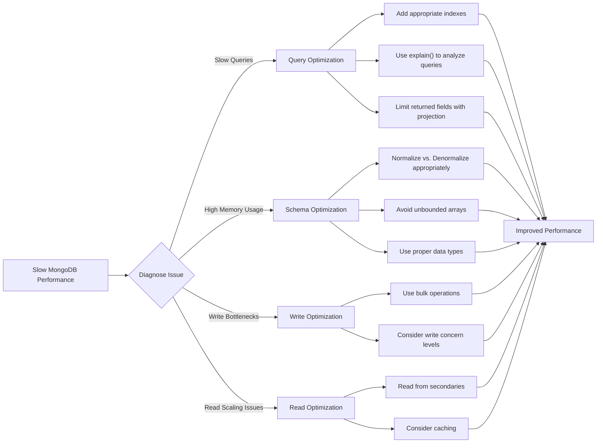

# MongoDB Performance Tips

When working with MongoDB, performance optimization is crucial for building scalable applications. Whether you're handling a small project or a large-scale system, implementing the right performance strategies can dramatically improve your database's efficiency. This guide covers essential MongoDB performance tips for beginners and intermediate developers.

## Introduction

MongoDB is a powerful NoSQL database that offers flexibility and scalability. However, without proper optimization, your MongoDB deployment can suffer from slow queries, excessive memory usage, and poor overall performance. This guide will walk you through practical tips and techniques to ensure your MongoDB databases run efficiently.

## Understanding MongoDB Performance Factors

Before diving into specific tips, it's important to understand what affects MongoDB performance:

1. **Query execution** - How efficiently MongoDB can retrieve or modify data
2. **Indexing strategy** - How data is indexed to speed up queries
3. **Schema design** - How your data is structured and organized
4. **Hardware resources** - CPU, memory, disk I/O capabilities
5. **Network latency** - Communication between servers and clients

## Essential Performance Tips

### 1. Implement Proper Indexing

Indexes are one of the most powerful tools for improving query performance in MongoDB. They work similarly to indexes in a book, allowing MongoDB to quickly locate the documents that match your query without scanning every document in a collection.

#### Creating Simple Indexes

```javascript
// Create a simple index on the "username" field
db.users.createIndex({ username: 1 });

// Query that will use this index
db.users.find({ username: "johndoe" });
```

#### Compound Indexes for Multiple Field Queries

```javascript
// Create a compound index on "category" and "date"
db.products.createIndex({ category: 1, date: -1 });

// This query will use the compound index
db.products.find({ category: "electronics", date: { $gt: new Date('2023-01-01') } });
```

#### Index Analysis with explain()

Use `explain()` to understand how MongoDB executes your queries and whether they're using your indexes effectively:

```javascript
// Analyze query execution
db.users.find({ username: "johndoe" }).explain("executionStats");
```

Example output:
```json
{
  "executionStats": {
    "executionSuccess": true,
    "nReturned": 1,
    "executionTimeMillis": 0,
    "totalKeysExamined": 1,
    "totalDocsExamined": 1,
    ...
  },
  "queryPlanner": {
    "winningPlan": {
      "stage": "FETCH",
      "inputStage": {
        "stage": "IXSCAN",
        "keyPattern": { "username": 1 },
        ...
      }
    }
  }
}
```

The "IXSCAN" stage indicates the query is using your index.

#### Index Tips:

- Don't over-index - each index has a maintenance cost
- Create indexes that support your common queries
- Place most selective fields first in compound indexes
- Consider covered queries (queries that can be satisfied entirely by indexes)

### 2. Optimize Your Schema Design

MongoDB's flexible schema is powerful, but requires thoughtful design for optimal performance.

#### Embedding vs. Referencing

**Embedding (for 1:1 or 1:few relationships):**

```javascript
// Embedding addresses in a user document
db.users.insertOne({
  name: "John Doe",
  email: "john@example.com",
  addresses: [
    { type: "home", street: "123 Main St", city: "Springfield", zip: "12345" },
    { type: "work", street: "456 Market St", city: "Springfield", zip: "12345" }
  ]
});

// Easy retrieval of user with all their addresses in one query
db.users.findOne({ name: "John Doe" });
```

**Referencing (for 1:many relationships):**

```javascript
// User document
db.users.insertOne({
  _id: ObjectId("507f1f77bcf86cd799439011"),
  name: "John Doe",
  email: "john@example.com"
});

// Orders that reference the user
db.orders.insertMany([
  { user_id: ObjectId("507f1f77bcf86cd799439011"), product: "Laptop", price: 999 },
  { user_id: ObjectId("507f1f77bcf86cd799439011"), product: "Phone", price: 699 }
]);

// Retrieving orders for a specific user
db.orders.find({ user_id: ObjectId("507f1f77bcf86cd799439011") });
```

#### Schema Design Tips:

- Group frequently accessed data together
- Avoid unbounded array growth in documents
- Design for your access patterns
- Consider data lifecycle (how often it's updated)

### 3. Write Efficient Queries

Inefficient queries can severely impact performance, regardless of your indexing strategy.

#### Use Projection to Return Only Necessary Fields

```javascript
// Bad: Returns all fields in matching documents
db.products.find({ category: "electronics" });

// Good: Returns only the name and price fields
db.products.find({ category: "electronics" }, { name: 1, price: 1, _id: 0 });
```

#### Limit Results When Possible

```javascript
// Return only the first 20 matches
db.products.find({ category: "electronics" }).limit(20);
```

#### Use Aggregation Pipeline for Complex Operations

```javascript
db.orders.aggregate([
  // Match documents with status "completed"
  { $match: { status: "completed" } },
  
  // Group by customer_id and calculate total spend
  { $group: { 
      _id: "$customer_id", 
      totalSpend: { $sum: "$amount" },
      orderCount: { $sum: 1 }
    }
  },
  
  // Sort by total spend descending
  { $sort: { totalSpend: -1 } },
  
  // Limit to top 5 customers
  { $limit: 5 }
]);
```

### 4. Use Appropriate Data Types

Using appropriate data types improves both storage efficiency and query performance.

```javascript
// Bad: Using strings for dates
db.events.insertOne({
  name: "Conference",
  date: "2023-05-15"  // String representation
});

// Good: Using native Date objects
db.events.insertOne({
  name: "Conference",
  date: new Date("2023-05-15")  // Date object
});

// Now queries on date ranges work properly
db.events.find({
  date: {
    $gte: new Date("2023-05-01"),
    $lt: new Date("2023-06-01")
  }
});
```

### 5. Monitor and Profile Your Database

MongoDB provides tools to help you understand performance issues.

#### Enable the Database Profiler

```javascript
// Enable profiling for slow operations (>100ms)
db.setProfilingLevel(1, { slowms: 100 });

// Check profiling status
db.getProfilingStatus();

// View profiled operations
db.system.profile.find().sort({ ts: -1 }).limit(10);
```

#### Use MongoDB Compass for Visual Analysis

MongoDB Compass provides a graphical interface for analyzing query performance and collection statistics.

#### Set Up Proper Monitoring

Consider using MongoDB Atlas monitoring, MongoDB Cloud Manager, or tools like Prometheus with the MongoDB exporter to track database performance metrics over time.

### 6. Connection Pooling

For applications with many database operations, connection pooling is essential.

```javascript
// Node.js MongoDB driver connection with pooling
const { MongoClient } = require('mongodb');

const uri = "mongodb://localhost:27017";
const client = new MongoClient(uri, {
  useNewUrlParser: true,
  useUnifiedTopology: true,
  // Set maximum pool size
  maxPoolSize: 50,
  // Set minimum pool size
  minPoolSize: 5
});

async function run() {
  try {
    await client.connect();
    const database = client.db("sample_database");
    const collection = database.collection("documents");
    
    // Your operations here
    
  } finally {
    // No need to close for each operation - the pool manages connections
    // Only close when shutting down your application
    // await client.close();
  }
}
run().catch(console.dir);
```

### 7. Use Bulk Operations

When inserting or updating multiple documents, use bulk operations instead of individual calls.

```javascript
// Inefficient: Individual inserts
for (let i = 0; i < 1000; i++) {
  db.items.insertOne({ value: i });
}

// Efficient: Bulk insert
const documents = [];
for (let i = 0; i < 1000; i++) {
  documents.push({ value: i });
}
db.items.insertMany(documents);
```

For complex operations, use the bulk operation API:

```javascript
// Initialize bulk operations
const bulk = db.products.initializeUnorderedBulkOp();

// Add operations to the bulk
bulk.find({ category: "electronics" }).update({ $inc: { stockCount: -1 } });
bulk.find({ category: "books" }).update({ $set: { featured: true } });
bulk.insert({ name: "New Product", category: "home", price: 19.99 });

// Execute all operations in bulk
const result = bulk.execute();
console.log(`Modified ${result.nModified} documents`);
```

## Real-World Performance Optimization Example

Let's walk through a practical example of optimizing a MongoDB e-commerce product catalog.

### Initial Schema and Query

```javascript
// Initial product schema
db.products.insertMany([
  {
    name: "Smartphone XL",
    description: "A large smartphone with advanced features",
    price: 899.99,
    category: "electronics",
    tags: ["smartphone", "android", "5G", "camera", "touchscreen"],
    specs: {
      screen: "6.7 inch",
      battery: "4500mAh",
      processor: "Octa-core",
      ram: "8GB",
      storage: "128GB"
    },
    stock: 42,
    reviews: [
      { user_id: "user123", rating: 5, comment: "Great phone!" },
      { user_id: "user456", rating: 4, comment: "Good but expensive" },
      // ... potentially hundreds of reviews
    ]
  },
  // ... thousands more products
]);

// A common but inefficient query
db.products.find({
  category: "electronics",
  "specs.ram": "8GB",
  price: { $lt: 1000 },
  tags: "android"
}).sort({ price: 1 });
```

### Performance Issues

1. No indexes for this query pattern
2. Embedded reviews array can grow unbounded
3. The query has to examine multiple fields

### Optimized Solution

#### Step 1: Add appropriate indexes

```javascript
// Create compound index for our common query pattern
db.products.createIndex({ 
  category: 1, 
  "specs.ram": 1, 
  price: 1, 
  tags: 1 
});
```

#### Step 2: Restructure the schema

```javascript
// Split reviews into a separate collection
db.reviews.insertMany([
  { 
    product_id: ObjectId("..."),
    user_id: "user123", 
    rating: 5, 
    comment: "Great phone!" 
  },
  { 
    product_id: ObjectId("..."),
    user_id: "user456", 
    rating: 4, 
    comment: "Good but expensive" 
  }
  // ... more reviews
]);

// Update product schema - remove embedded reviews
db.products.updateMany(
  {},
  { $unset: { reviews: "" } }
);

// Add an avg_rating field for quick access
db.products.updateOne(
  { _id: ObjectId("...") },
  { $set: { avg_rating: 4.5, review_count: 2 } }
);
```

#### Step 3: Optimize the query

```javascript
// Optimized query with proper index utilization
db.products.find({
  category: "electronics",
  "specs.ram": "8GB",
  price: { $lt: 1000 },
  tags: "android"
})
.sort({ price: 1 })
.projection({ name: 1, price: 1, avg_rating: 1, image_url: 1 });
```

#### Step 4: Analyze the performance improvement

```javascript
// Before optimization
db.products.find({/*...*/}).explain("executionStats");
// Shows: totalDocsExamined: 10000, executionTimeMillis: 500

// After optimization
db.products.find({/*...*/}).explain("executionStats");
// Shows: totalDocsExamined: 50, executionTimeMillis: 5
```

## Visualizing MongoDB Performance Optimization



## Summary

Optimizing MongoDB performance is an ongoing process that involves:

1. **Strategic indexing** to speed up queries
2. **Smart schema design** that aligns with your access patterns
3. **Efficient queries** that minimize resource usage
4. **Proper data types** for accurate and efficient operations
5. **Regular monitoring** to identify and fix bottlenecks
6. **Connection pooling** to manage database connections efficiently
7. **Bulk operations** for efficient batch processing

By implementing these tips, you'll be able to build MongoDB applications that are faster, more scalable, and more resilient under heavy loads.

## Additional Resources

- [MongoDB Official Documentation on Performance](https://docs.mongodb.com/manual/administration/analyzing-mongodb-performance/)
- [MongoDB University Courses](https://university.mongodb.com/)
- [Database Profiling Documentation](https://docs.mongodb.com/manual/tutorial/manage-the-database-profiler/)

## Exercises

1. Take an existing MongoDB collection and analyze its query patterns using `explain()`.
2. Create appropriate indexes for your most common queries and measure the performance improvement.
3. Identify a collection with an inefficient schema and redesign it for better performance.
4. Practice converting single operations to bulk operations and measure the time difference.
5. Set up database profiling for your MongoDB instance and analyze the results after running your application for a day.

By applying these performance optimization techniques consistently, you'll develop MongoDB applications that provide excellent user experience even as your data and user base grow.