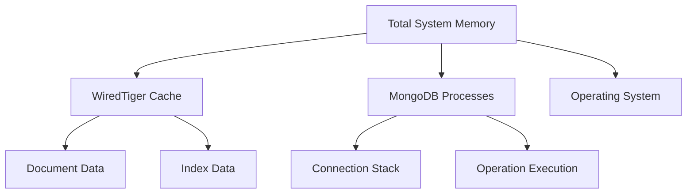
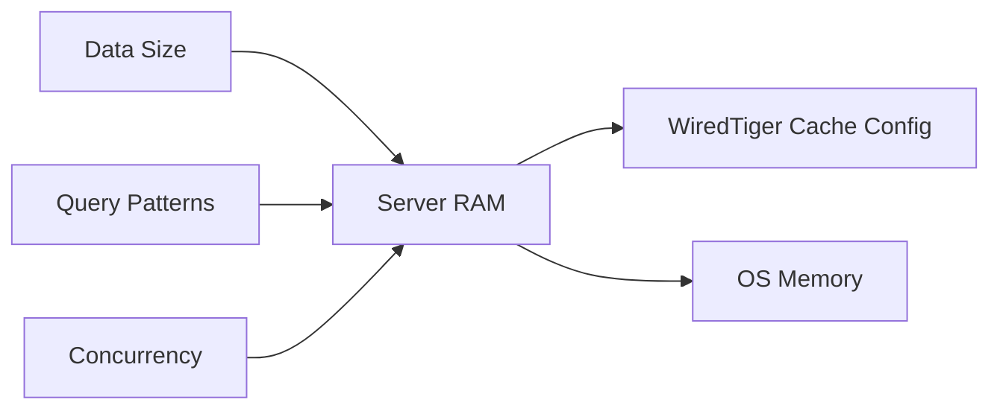
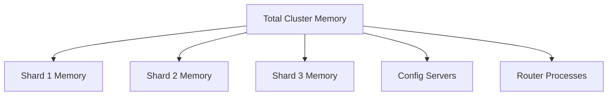

# MongoDB Memory Usage

## Introduction

Understanding how MongoDB uses memory is crucial for building efficient and scalable applications. MongoDB's performance is heavily dependent on available memory resources, and improper memory configuration can lead to degraded performance or even system crashes. 

In this guide, we'll explore how MongoDB manages memory, common memory-related issues, and best practices for optimizing your database's memory consumption.

## How MongoDB Uses Memory

MongoDB leverages memory in several distinct ways to provide fast data access and efficient operation. Let's break down the key components of MongoDB's memory usage:

### WiredTiger Storage Engine Memory Usage

Since MongoDB 3.2, WiredTiger has been the default storage engine. Understanding how it manages memory is essential:



#### 1. WiredTiger Cache

The WiredTiger storage engine maintains an in-memory cache that holds:

- Recently accessed documents
- Index data structures

By default, WiredTiger uses:
- 50% of (RAM - 1GB) on systems with more than 1GB RAM
- 256MB on systems with less than 1GB RAM

This can be configured using the `wiredTigerCacheSizeGB` parameter:

```js
// Setting WiredTiger cache to 4GB
db.adminCommand({
  setParameter: 1,
  wiredTigerCacheSizeGB: 4
})
```

#### 2. Memory-Mapped Files (MMF)

For MongoDB versions prior to 3.2 or when using the MMAPv1 storage engine:

- MongoDB maps data files directly into memory
- The operating system handles paging data between RAM and disk
- Memory usage grows in proportion to data size

### Monitoring Memory Usage

Let's explore some practical ways to monitor MongoDB's memory consumption:

#### Using MongoDB's Built-in Tools

```js
// Check server status for memory metrics
db.serverStatus().wiredTiger.cache

// Example output:
{
  "bytes currently in the cache": 1073741824,  // ~1GB
  "maximum bytes configured": 2147483648,      // 2GB
  "pages read into cache": 10928,
  "pages written from cache": 2361
}
```

#### Using db.stats()

```js
// Get database statistics including storage information
db.stats()

// Example output (partial):
{
  "db": "myDatabase",
  "collections": 12,
  "views": 0,
  "objects": 52482,
  "avgObjSize": 1024,
  "dataSize": 53741568,
  "storageSize": 20385792,
  "indexes": 24,
  "indexSize": 10276864,
  // ... other stats ...
}
```

## Common Memory Issues and Solutions

### Issue 1: Memory Leaks

MongoDB can experience memory growth due to several factors:

1. **Large number of connections**: Each connection consumes memory
2. **In-memory sort operations**: Large sorts that exceed sort memory limit
3. **Unindexed queries**: Forcing large in-memory scans

#### Solutions:

```js
// Set a reasonable connection pool size in your application
// Node.js MongoDB driver example:
const client = new MongoClient(uri, {
  maxPoolSize: 50  // Adjust based on your needs
});

// Index fields used in sort operations
db.users.createIndex({ lastName: 1, firstName: 1 });

// Monitor slow queries and add necessary indexes
db.setProfilingLevel(1, { slowms: 100 });
```

### Issue 2: Page Faults

When MongoDB can't find data in memory and needs to read from disk:

#### Solutions:

```js
// Increase the WiredTiger cache size if you have available RAM
db.adminCommand({
  setParameter: 1,
  wiredTigerCacheSizeGB: 6  // Increase based on available system RAM
})

// Create indexes to reduce document scanning
db.products.createIndex({ category: 1, price: 1 });

// Use projection to limit data returned
db.users.find({}, { name: 1, email: 1 });  // Only return name and email
```

## Memory Optimization Best Practices

### 1. Right-size Your Instances

Choose appropriate server specifications based on your data size and workload:



For production workloads:
- RAM should be at least 2-3x the size of your working set
- Leave sufficient memory for the operating system (typically 1-2GB)

### 2. Use Appropriate Indexes

Indexes speed up queries but also consume memory:

```js
// Create compound indexes for common query patterns
db.orders.createIndex({ userId: 1, orderDate: -1 });

// Use covered queries when possible (all fields in query and projection are indexed)
db.customers.find({ status: "active" }, { _id: 0, name: 1, status: 1 })
  .hint({ status: 1, name: 1 }); // Assuming this index exists
```

### 3. Configure WiredTiger Cache Appropriately

```js
// For a dedicated MongoDB server with 32GB RAM
db.adminCommand({
  setParameter: 1,
  wiredTigerCacheSizeGB: 14  // (32GB - 1GB) * 0.5 = ~15.5GB, rounded down
})
```

### 4. Implement Data Lifecycle Management

For large collections, consider:

```js
// Create a TTL index to automatically remove old data
db.logs.createIndex({ createdAt: 1 }, { expireAfterSeconds: 604800 }); // 7 days

// Use time-based sharding for historical data
sh.shardCollection("mydb.events", { eventDate: 1 });
```

## Real-world Example: E-commerce Application

Let's look at a practical example of optimizing memory usage for an e-commerce platform:

### Initial Memory Issues

- High page fault rate during peak shopping hours
- Slow checkout process due to memory pressure
- Growing catalog causing increased memory consumption

### Optimization Steps

1. **Analyze current memory usage:**

```js
// Check current cache usage
db.serverStatus().wiredTiger.cache

// Identify largest collections
db.stats().collections.forEach(function(collection) {
  print(collection.name + ": " + collection.size);
});
```

2. **Index optimization:**

```js
// Add index for common product search patterns
db.products.createIndex({ category: 1, brand: 1, price: 1 });

// Use compound indexes for order queries
db.orders.createIndex({ userId: 1, status: 1, orderDate: -1 });
```

3. **Memory configuration:**

```js
// Increase WiredTiger cache on a 64GB server
db.adminCommand({
  setParameter: 1,
  wiredTigerCacheSizeGB: 28  // Adjusted based on workload
})
```

4. **Schema optimization:**

```js
// Before: Storing full product details in each order
{
  "_id": ObjectId("..."),
  "userId": "user123",
  "product": {
    "title": "Smartphone X",
    "description": "Advanced smartphone with...",
    "specifications": { /* large object */ },
    "price": 599.99,
    // many more fields
  }
}

// After: Reference product and store only necessary fields
{
  "_id": ObjectId("..."),
  "userId": "user123",
  "productId": ObjectId("product789"),
  "productSnapshot": {
    "title": "Smartphone X",
    "price": 599.99
  }
}
```

### Results

- 60% reduction in page faults
- 45% faster checkout process
- More efficient memory utilization during peak hours

## Advanced Memory Monitoring

For production environments, implement comprehensive monitoring:

```js
// Create a monitoring function that runs periodically
function checkMemoryUsage() {
  const stats = db.serverStatus();
  const wiredTigerCache = stats.wiredTiger.cache;
  
  const cacheUsedBytes = wiredTigerCache["bytes currently in the cache"];
  const cacheMaxBytes = wiredTigerCache["maximum bytes configured"];
  const cacheUsagePercentage = (cacheUsedBytes / cacheMaxBytes) * 100;
  
  print(`WiredTiger cache usage: ${cacheUsagePercentage.toFixed(2)}% (${(cacheUsedBytes/1024/1024/1024).toFixed(2)}GB / ${(cacheMaxBytes/1024/1024/1024).toFixed(2)}GB)`);
  
  if (cacheUsagePercentage > 90) {
    print("WARNING: WiredTiger cache usage is very high!");
  }
}

// Execute this function periodically or set up proper monitoring tools
```

## Memory and Sharding

For large-scale applications using sharded clusters:



- Each shard manages its own WiredTiger cache
- Choose an appropriate shard key to distribute memory usage
- Monitor memory usage across all shards

```js
// Check memory usage across shards
sh.status();

// For each shard, connect and check cache usage
db.adminCommand({ serverStatus: 1 }).wiredTiger.cache
```

## Summary

Managing MongoDB's memory usage effectively is crucial for maintaining optimal performance in your applications. Key takeaways include:

1. **Understand WiredTiger's memory model** and how it caches data and indexes
2. **Monitor memory usage regularly** using built-in MongoDB tools
3. **Size your server properly** based on your working set and access patterns
4. **Create appropriate indexes** to reduce memory pressure and page faults
5. **Configure the WiredTiger cache** based on your available system resources
6. **Optimize your schema** to minimize memory requirements

By following these best practices, you can ensure that your MongoDB deployment makes efficient use of available memory resources, leading to better performance, improved reliability, and lower operational costs.

## Additional Resources

- [MongoDB Documentation on WiredTiger Storage Engine](https://www.mongodb.com/docs/manual/core/wiredtiger/)
- [MongoDB Memory Diagnostics](https://www.mongodb.com/docs/manual/administration/analyzing-mongodb-performance/)
- [MongoDB University M201: MongoDB Performance Course](https://learn.mongodb.com/courses/m201-mongodb-performance)

## Practice Exercises

1. Use `db.serverStatus()` to analyze your database's current memory usage
2. Identify collections with high memory usage and implement appropriate indexes
3. Calculate the optimal WiredTiger cache size for your system's RAM
4. Create a monitoring script that alerts when memory usage exceeds a threshold
5. Analyze your application's query patterns and optimize them to reduce memory pressure