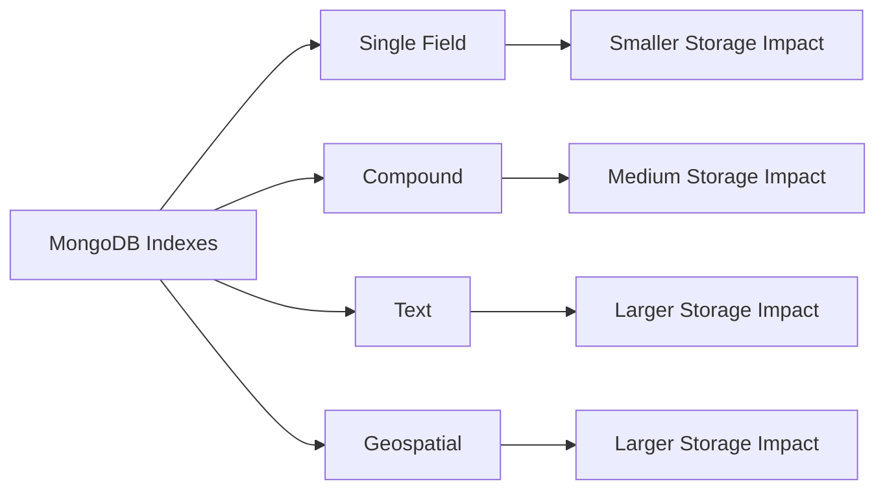

# MongoDB Storage Optimization

In the world of MongoDB databases, efficient storage management is crucial for maintaining performance, reducing costs, and ensuring scalability. This guide walks you through essential MongoDB storage optimization techniques that will help you build more efficient applications.

## Introduction to MongoDB Storage

MongoDB stores data as BSON (Binary JSON) documents, which offers flexibility but also requires careful management to ensure optimal performance. Storage optimization involves multiple aspects:

- Document structure design
- Proper indexing
- Compression strategies
- Storage engine configuration
- Data lifecycle management

Let's explore these concepts to help you build more efficient MongoDB applications.

## Document Structure Optimization

### Schema Design Principles

Unlike relational databases, MongoDB gives you flexibility in document structure, but this freedom requires thoughtful design decisions.

#### Normalization vs. Embedding

MongoDB lets you choose between:

1. **Embedding data** (denormalization) - Keeping related data in a single document
2. **Referencing data** (normalization) - Storing related data in separate documents with references

Let's compare both approaches:

```javascript
// Approach 1: Embedding comments in a blog post (denormalized)
{
  "_id": ObjectId("5f9e7b9b9d3b2c1a2c3b4c5d"),
  "title": "MongoDB Storage Optimization",
  "content": "Learning about storage optimization...",
  "author": "Jane Doe",
  "comments": [
    {
      "user": "Bob Smith",
      "text": "Great article!",
      "date": ISODate("2023-10-15T10:30:00Z")
    },
    {
      "user": "Alice Johnson",
      "text": "Very helpful content.",
      "date": ISODate("2023-10-15T14:15:00Z")
    }
  ]
}

// Approach 2: Referencing comments (normalized)
// Blog post document
{
  "_id": ObjectId("5f9e7b9b9d3b2c1a2c3b4c5d"),
  "title": "MongoDB Storage Optimization",
  "content": "Learning about storage optimization...",
  "author": "Jane Doe"
}

// Comment documents
{
  "_id": ObjectId("6a1b2c3d4e5f6a7b8c9d0e1f"),
  "post_id": ObjectId("5f9e7b9b9d3b2c1a2c3b4c5d"),
  "user": "Bob Smith",
  "text": "Great article!",
  "date": ISODate("2023-10-15T10:30:00Z")
}
{
  "_id": ObjectId("6a1b2c3d4e5f6a7b8c9d0e2f"),
  "post_id": ObjectId("5f9e7b9b9d3b2c1a2c3b4c5d"),
  "user": "Alice Johnson",
  "text": "Very helpful content.",
  "date": ISODate("2023-10-15T14:15:00Z")
}
```

**When to embed:**
- When data is always accessed together
- When the embedded data doesn't grow significantly
- For one-to-few relationships (usually < 100 items)

**When to reference:**
- When data is often accessed separately
- When the embedded array might grow very large
- For many-to-many relationships

### Field Naming Optimization

MongoDB stores field names in each document, so optimizing field names can save significant space in large collections:

```javascript
// Before optimization - longer field names
{
  "userIdentificationNumber": "U12345",
  "userFullName": "John Smith",
  "userEmailAddress": "john.smith@example.com",
  "userRegistrationDate": ISODate("2023-01-15")
}

// After optimization - shorter field names
{
  "uid": "U12345",
  "name": "John Smith",
  "email": "john.smith@example.com",
  "reg": ISODate("2023-01-15")
}
```

For collections with millions of documents, reducing field name lengths can save gigabytes of storage.

## Indexing for Storage Optimization

While indexes speed up queries, they also consume disk space. Balancing query performance with storage usage is essential.

### Index Types and Storage Impact

Here's a comparison of different index types and their storage implications:



### Index Optimization Strategies

1. **Remove unused indexes**

First, identify unused indexes with the `$indexStats` aggregation stage:

```javascript
db.users.aggregate([
  { $indexStats: { } }
])
```

This returns statistics on index usage. Indexes with low usage might be candidates for removal:

```javascript
// Remove an unused index
db.users.dropIndex("rarely_used_field_1")
```

2. **Use partial indexes** to reduce index size by only including documents that meet specific criteria:

```javascript
// Instead of indexing all documents
db.orders.createIndex({ status: 1 })

// Only index active orders (much smaller index)
db.orders.createIndex(
  { status: 1 },
  { partialFilterExpression: { active: true } }
)
```

3. **Create compound indexes** instead of multiple single-field indexes when queries frequently filter on multiple fields:

```javascript
// Instead of these two separate indexes
db.products.createIndex({ category: 1 })
db.products.createIndex({ brand: 1 })

// Create one compound index if you often query by both fields
db.products.createIndex({ category: 1, brand: 1 })
```

## Data Compression Strategies

MongoDB offers multiple compression options to reduce storage requirements.

### WiredTiger Compression Options

MongoDB's WiredTiger storage engine provides two compression options:

1. **snappy** (default) - Balances decent compression with low CPU usage
2. **zlib** - Higher compression ratio but more CPU intensive

Here's how to configure collection level compression:

```javascript
// Create a collection with zlib compression
db.createCollection("highCompressedData", {
  storageEngine: {
    wiredTiger: {
      configString: "block_compressor=zlib"
    }
  }
})
```

For a database-wide configuration, you can set it in the MongoDB configuration file:

```yaml
storage:
  wiredTiger:
    collectionConfig:
      blockCompressor: zlib
```

### Measuring Compression Effectiveness

You can check compression statistics using the `db.collection.stats()` command:

```javascript
// Check storage details including compression
db.users.stats()
```

Example output showing compression metrics:

```javascript
{
  // ... other stats
  "wiredTiger": {
    // ... other WiredTiger stats
    "creationTime": "2023-10-15T22:00:00Z",
    "file size in bytes": 524288000,
    "size": 1073741824,
    // The size difference indicates compression savings
  }
}
```

## Data Lifecycle Management

Implementing proper data lifecycle policies can significantly reduce storage requirements.

### Time-Based Data Retention

For time-series data or logs, set up automatic expiration using TTL (Time-To-Live) indexes:

```javascript
// Create a TTL index that automatically removes documents 
// after 30 days from the created_at date
db.logs.createIndex(
  { created_at: 1 },
  { expireAfterSeconds: 2592000 } // 30 days in seconds
)
```

When you insert documents, ensure they have the TTL field:

```javascript
db.logs.insertOne({
  message: "User login",
  severity: "info",
  created_at: new Date() // TTL index will use this date
})
```

### Tiered Storage Strategy

For large-scale applications, implement a tiered storage strategy:

1. **Hot data** - Recent, frequently accessed data stays in the primary MongoDB cluster
2. **Warm data** - Less frequently accessed data moves to a secondary storage
3. **Cold data** - Archive rarely accessed data to low-cost storage options

Here's a simple implementation example using a monthly data strategy:

```javascript
// Query the current month's data (hot tier)
db.transactions.find({
  date: { $gte: new Date("2023-10-01"), $lt: new Date("2023-11-01") }
})

// Move last month's data to the archive collection
const lastMonthData = db.transactions.find({
  date: { $gte: new Date("2023-09-01"), $lt: new Date("2023-10-01") }
}).toArray();

db.transactions_archive.insertMany(lastMonthData);

// Remove the archived data from the main collection
db.transactions.deleteMany({
  date: { $gte: new Date("2023-09-01"), $lt: new Date("2023-10-01") }
});
```

## Storage Engine Configuration

The WiredTiger storage engine offers several configurations that can optimize storage usage.

### Cache Size Configuration

Properly sizing the WiredTiger cache can improve performance and reduce disk I/O:

```yaml
# mongodb.conf example for a server with 16GB RAM
storage:
  wiredTiger:
    engineConfig:
      cacheSizeGB: 8  # 50% of available RAM
```

### Journal Compression

Configure journal compression to reduce the disk space used for write-ahead logging:

```yaml
storage:
  journal:
    enabled: true
    commitIntervalMs: 100
  wiredTiger:
    engineConfig:
      journalCompressor: snappy  # Options: none, snappy, zlib
```

## Real-World Optimization Example

Let's walk through a complete optimization scenario for an e-commerce application.

### Initial Database Schema

```javascript
// Original product schema (inefficient)
{
  "_id": ObjectId("5f9e7b9b9d3b2c1a2c3b4c5d"),
  "productName": "Wireless Bluetooth Headphones",
  "productDescription": "High-quality wireless headphones with noise cancellation...",
  "productCategory": "Electronics",
  "productSubcategory": "Audio",
  "productBrand": "AudioTech",
  "productPrice": 129.99,
  "productCurrency": "USD",
  "productWeight": 0.3,
  "productWeightUnit": "kg",
  "productDimensions": {
    "length": 18,
    "width": 15,
    "height": 8,
    "dimensionUnit": "cm"
  },
  "productStockQuantity": 145,
  "productTags": ["wireless", "bluetooth", "headphones", "audio", "noise-cancellation"],
  "productRatings": [
    { "userId": "user123", "rating": 4.5, "review": "Great sound quality!" },
    { "userId": "user456", "rating": 5, "review": "Comfortable and great battery life" },
    // ... potentially hundreds of ratings
  ]
}
```

### Optimized Schema

```javascript
// Optimized product schema
{
  "_id": ObjectId("5f9e7b9b9d3b2c1a2c3b4c5d"),
  "name": "Wireless Bluetooth Headphones",
  "desc": "High-quality wireless headphones with noise cancellation...",
  "cat": "Electronics",
  "scat": "Audio",
  "brand": "AudioTech",
  "price": 129.99,
  "curr": "USD",
  "specs": {
    "wt": 0.3,
    "wtu": "kg",
    "dim": "18x15x8cm"
  },
  "stock": 145,
  "tags": ["wireless", "bluetooth", "headphones", "audio", "nc"]
}

// Separate collection for ratings
{
  "_id": ObjectId("6a1b2c3d4e5f6a7b8c9d0e1f"),
  "p_id": ObjectId("5f9e7b9b9d3b2c1a2c3b4c5d"), // product ID
  "u": "user123",
  "r": 4.5,
  "rv": "Great sound quality!",
  "dt": ISODate("2023-09-15T10:30:00Z")
}
```

### Optimization Impact Analysis

For this e-commerce database with 1 million products:

1. **Field name optimization**: Reduced average document size from 1.2KB to 0.8KB
   - Storage saving: ~400GB (from 1.2TB to 0.8TB)

2. **Normalized ratings**: Moved 10 million reviews to a separate collection
   - Improved query performance for basic product listing by 70%
   - Made product rating queries more efficient with proper indexing

3. **Compression strategy**: Changed from snappy to zlib
   - Additional 30% storage reduction (from 0.8TB to 0.56TB)
   - Slightly increased CPU usage (acceptable trade-off)

4. **Indexing improvements**:
   - Removed 5 unused indexes
   - Created compound indexes for common query patterns
   - Reduced index size by 40% (from 50GB to 30GB)

Total storage reduction: From 1.25TB to 0.59TB (over 50% savings)

## Summary and Best Practices

We've covered several MongoDB storage optimization techniques:

1. **Document structure optimization**
   - Choose between embedding and referencing data appropriately
   - Use shorter field names for large collections

2. **Strategic indexing**
   - Create only necessary indexes
   - Use compound and partial indexes when appropriate

3. **Data compression**
   - Select the right compression algorithm for your needs
   - Balance between compression ratio and CPU usage

4. **Data lifecycle management**
   - Implement TTL indexes for automatic expiration
   - Consider tiered storage for different data access patterns

5. **Storage engine configuration**
   - Optimize WiredTiger cache size
   - Configure journal compression

### When to optimize

Storage optimization should be considered:
- When your database size approaches storage limits
- When query performance degrades
- Before scaling to more expensive hardware
- As part of regular maintenance

Remember that premature optimization can add unnecessary complexity. Start with good design principles, measure actual usage, and then optimize based on data.

## Additional Resources

To learn more about MongoDB storage optimization:

1. Official MongoDB documentation on [storage optimization](https://docs.mongodb.com/manual/core/storage-engine/)
2. MongoDB University course on [performance tuning](https://university.mongodb.com/)
3. The WiredTiger storage engine [documentation](https://source.wiredtiger.com/)

## Practice Exercises

1. **Analyze schema design**: Take an existing collection in your database and identify opportunities to optimize field names or structure.

2. **Index audit**: Use the `$indexStats` aggregation to identify unused indexes in your database.

3. **Compression experiment**: Create test collections with different compression options and compare their performance and storage requirements.

4. **TTL implementation**: Add TTL indexes to log or audit collections that don't require permanent storage.

By implementing these MongoDB storage optimization techniques, you'll improve your application's performance, reduce costs, and build a more efficient database system.