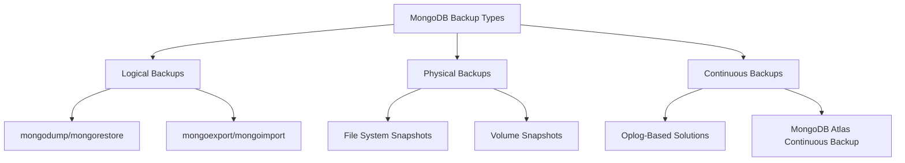
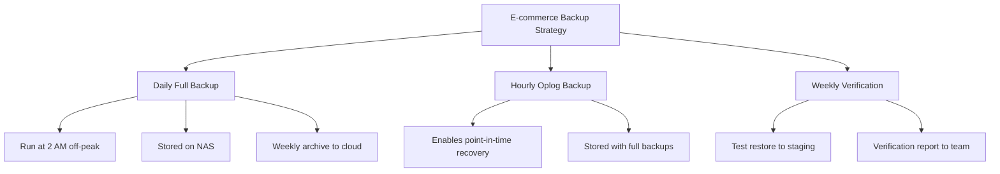

# MongoDB Backup Strategies

## Introduction

Data is one of your application's most valuable assets, and losing it can be catastrophic. As your MongoDB database grows and becomes more critical to your operations, implementing robust backup strategies becomes essential.

In this guide, you'll learn various approaches to backing up MongoDB databases, from simple to sophisticated methods. We'll cover built-in tools, scheduling options, and best practices to ensure your data remains safe and recoverable in case of hardware failures, human errors, or other unexpected events.

## Why Backup Strategies Matter

Before diving into specific backup methods, let's understand why having a proper backup strategy is crucial:

- **Data Protection**: Guards against accidental deletions, application bugs, or malicious activities
- **Business Continuity**: Enables quick recovery from failures with minimal downtime
- **Compliance**: Many industries have regulatory requirements for data retention
- **Migration Support**: Facilitates moving data between environments or cloud providers

## MongoDB Backup Types

MongoDB supports several types of backups, each with its own benefits and limitations:

### 1. Logical Backups (Data Exports)

Logical backups export your data in a format that can be reimported. They're flexible but typically slower for large datasets.

### 2. Physical Backups (File Snapshots)

Physical backups copy the actual database files, offering faster backup and restoration for large databases.

### 3. Continuous Backups (Oplog-Based)

These capture changes in real-time by tailing the operation log, allowing point-in-time recovery.



## Backup Tools and Methods

### Using `mongodump` and `mongorestore`

The `mongodump` utility creates a binary export of your database contents, while `mongorestore` can reinstate that data.

#### Basic Usage:

```bash
# Backup an entire database
mongodump --db mydatabase --out /backup/mongodb/$(date +%Y-%m-%d)

# Restore the database
mongorestore --db mydatabase /backup/mongodb/2023-10-15/mydatabase
```

#### Backing up a specific collection:

```bash
# Backup a single collection
mongodump --db mydatabase --collection users --out /backup/mongodb/$(date +%Y-%m-%d)
```

#### Excluding collections:

```bash
# Backup everything except the logs collection
mongodump --db mydatabase --excludeCollection=logs --out /backup/mongodb/$(date +%Y-%m-%d)
```

### Using `mongoexport` and `mongoimport`

These tools export and import data in JSON or CSV format, which can be useful for human-readable backups or data interchange.

```bash
# Export a collection to JSON
mongoexport --db mydatabase --collection users --out users.json

# Import the collection from JSON
mongoimport --db mydatabase --collection users --file users.json
```

### File System Snapshots

For production deployments, filesystem snapshots provide a consistent point-in-time backup of your data files. This requires careful coordination with MongoDB to ensure consistency.

#### Steps for LVM Snapshot (Linux):

```bash
# 1. Lock database to prevent writes
mongo admin --eval "db.fsyncLock()"

# 2. Create LVM snapshot
lvcreate --size 10G --snapshot --name mongodb_backup /dev/vg0/mongodb

# 3. Unlock database to allow writes again
mongo admin --eval "db.fsyncUnlock()"

# 4. Mount snapshot and copy files
mount /dev/vg0/mongodb_backup /mnt/backup
cp -R /mnt/backup/path/to/mongodb/data /backup/destination/
umount /mnt/backup

# 5. Remove snapshot
lvremove -f /dev/vg0/mongodb_backup
```

## Backup Strategies for Different MongoDB Deployments

### Standalone MongoDB Instances

For a single MongoDB server, you can implement:

1. **Daily Full Backups**: Complete backups using `mongodump`
2. **Scripted File System Snapshots**: For fast backup/recovery of large databases

Here's a simple backup script for standalone instances:

```bash
#!/bin/bash
# Simple MongoDB backup script
DATE=$(date +%Y-%m-%d)
BACKUP_DIR="/var/backups/mongodb/$DATE"

# Create backup directory
mkdir -p $BACKUP_DIR

# Perform backup
mongodump --out $BACKUP_DIR

# Compress the backup
tar -czf $BACKUP_DIR.tar.gz $BACKUP_DIR

# Remove the uncompressed directory
rm -rf $BACKUP_DIR

# Keep only last 7 days of backups
find /var/backups/mongodb/ -name "*.tar.gz" -type f -mtime +7 -delete
```

### MongoDB Replica Sets

For replica sets, you can implement more sophisticated strategies:

1. **Hidden Secondary Backups**: Create backups from a hidden secondary to avoid impacting production traffic
2. **Staggered Backups**: Perform backups on different secondaries on different days

Example configuration for creating a backup-dedicated hidden secondary:

```javascript
// Add a hidden secondary node for backups
rs.add({
  host: "mongodb-backup:27017",
  priority: 0,
  hidden: true,
  votes: 0
})
```

Then run backups on this node:

```bash
mongodump --host mongodb-backup:27017 --out /backup/mongodb/$(date +%Y-%m-%d)
```

### MongoDB Sharded Clusters

Backing up sharded clusters requires additional coordination:

1. **Config Server Backups**: Essential for cluster metadata
2. **Individual Shard Backups**: Each shard needs consistent backups
3. **Balancer Management**: Pause the balancer during backups

```bash
# Disable the balancer
mongo --host mongos --eval "sh.stopBalancer()"

# Backup config servers
mongodump --host configsvr1:27019 --out /backup/config/$(date +%Y-%m-%d)

# Backup each shard (repeat for each)
mongodump --host shard1/shard1svr1:27018 --out /backup/shard1/$(date +%Y-%m-%d)

# Re-enable the balancer
mongo --host mongos --eval "sh.startBalancer()"
```

## Implementing a Comprehensive Backup Strategy

A complete MongoDB backup strategy typically includes:

### 1. Regular Scheduled Backups

Set up automated, scheduled backups using cron jobs or other scheduling tools:

```bash
# Add to crontab (runs at 1 AM daily)
0 1 * * * /path/to/mongodb_backup_script.sh
```

### 2. Backup Verification

Always verify your backups by testing restoration regularly:

```bash
# Restore to a test database to verify backup integrity
mongorestore --db test_restore --drop /backup/mongodb/2023-10-15/mydatabase
```

### 3. Off-Site Backup Storage

Store backups in multiple locations, including off-site or cloud storage:

```bash
#!/bin/bash
# Backup and upload to cloud storage
DATE=$(date +%Y-%m-%d)
BACKUP_DIR="/var/backups/mongodb/$DATE"

# Perform backup
mongodump --out $BACKUP_DIR

# Compress
tar -czf $BACKUP_DIR.tar.gz $BACKUP_DIR
rm -rf $BACKUP_DIR

# Upload to cloud storage (e.g., AWS S3)
aws s3 cp $BACKUP_DIR.tar.gz s3://my-mongodb-backups/
```

### 4. Point-in-Time Recovery Setup

For critical deployments, implement oplog-based backups for point-in-time recovery:

```bash
# Backup the database
mongodump --db mydatabase --out /backup/mongodb/base

# Capture oplog entries from the last 24 hours
mongodump --db local --collection oplog.rs \
  --query '{"ts":{"$gt":{"$timestamp":{"t":'$(date -d "24 hours ago" +%s)',"i":0}}}}' \
  --out /backup/mongodb/oplog
```

### 5. Documentation and Runbooks

Create comprehensive documentation for your backup procedures and recovery plans:

- Backup schedule and retention policy
- Storage locations and access procedures
- Recovery process step-by-step guide
- Contact information for responsible team members

## Best Practices

- **Automate Everything**: Manual backups are prone to human error and neglect
- **Encryption**: Encrypt backup data, especially when stored off-site
- **Validate Regularly**: Test recovery procedures monthly or quarterly
- **Monitor Backup Jobs**: Set up alerting for failed backups
- **Backup Metadata Too**: Don't forget to back up indexes, users, and permissions
- **Right-Size Backup Windows**: Ensure backup completion within maintenance windows

## Real-World Application: E-commerce Database Backup

Let's consider an example of a backup strategy for an e-commerce application:

### Scenario:
- 500GB MongoDB database
- 24/7 operation with peak hours between 9 AM and 9 PM
- Must comply with regulations requiring 7-year data retention
- Recovery Time Objective (RTO): 2 hours

### Solution:



#### Implementation Script:

```bash
#!/bin/bash
# E-commerce MongoDB Backup Script

# Configuration
DB_NAME="ecommerce"
BACKUP_ROOT="/backup"
DAILY_DIR="$BACKUP_ROOT/daily/$(date +%Y-%m-%d)"
HOURLY_DIR="$BACKUP_ROOT/hourly/$(date +%Y-%m-%d_%H)"
LOG_FILE="$BACKUP_ROOT/logs/backup_$(date +%Y-%m-%d).log"
SLACK_WEBHOOK="https://hooks.slack.com/services/TXXXXXXXX/BXXXXXXXX/XXXXXXXXXX"

# Create directories
mkdir -p $DAILY_DIR $HOURLY_DIR $(dirname $LOG_FILE)

# Determine backup type
if [ $(date +%H) -eq 2 ]; then
  # Daily full backup at 2 AM
  echo "Starting daily backup at $(date)" >> $LOG_FILE
  mongodump --db $DB_NAME --out $DAILY_DIR >> $LOG_FILE 2>&1
  
  # Compress backup
  tar -czf $DAILY_DIR.tar.gz $DAILY_DIR
  rm -rf $DAILY_DIR
  
  # Keep only last 14 days of daily backups
  find $BACKUP_ROOT/daily/ -name "*.tar.gz" -type f -mtime +14 -delete
  
  # On Sundays, archive to cloud storage
  if [ $(date +%u) -eq 7 ]; then
    aws s3 cp $DAILY_DIR.tar.gz s3://ecommerce-backups/mongodb/weekly/
  fi
else
  # Hourly oplog backup
  echo "Starting hourly oplog backup at $(date)" >> $LOG_FILE
  # Get timestamp of last hour
  LAST_HOUR=$(date -d "1 hour ago" +%s)
  
  # Backup recent oplog entries
  mongodump --db local --collection oplog.rs \
    --query '{"ts":{"$gt":{"$timestamp":{"t":'$LAST_HOUR',"i":0}}}}' \
    --out $HOURLY_DIR >> $LOG_FILE 2>&1
    
  # Keep only last 48 hours of hourly backups
  find $BACKUP_ROOT/hourly/ -type d -mtime +2 -delete
fi

# Check if backup was successful
if [ $? -eq 0 ]; then
  echo "Backup completed successfully at $(date)" >> $LOG_FILE
  # Send success notification
  curl -X POST -H 'Content-type: application/json' --data '{"text":"✅ MongoDB backup successful"}' $SLACK_WEBHOOK
else
  echo "Backup FAILED at $(date)" >> $LOG_FILE
  # Send failure notification
  curl -X POST -H 'Content-type: application/json' --data '{"text":"🚨 MongoDB backup FAILED!"}' $SLACK_WEBHOOK
fi
```

## Summary

A robust MongoDB backup strategy is essential for protecting your data and ensuring business continuity. We've covered:

1. **Different Backup Types**: Logical, physical, and continuous backup methods
2. **Backup Tools**: `mongodump`, `mongorestore`, file system snapshots, and more
3. **Deployment-Specific Strategies**: For standalone, replica sets, and sharded clusters
4. **Comprehensive Backup Plan Elements**: Scheduling, verification, off-site storage, and documentation
5. **Real-World Example**: An e-commerce application backup strategy

By implementing the approaches described in this guide, you can significantly reduce the risk of data loss and ensure your MongoDB databases remain protected against various failure scenarios.

## Additional Resources and Exercises

### Resources
- [MongoDB Official Documentation on Backup Methods](https://docs.mongodb.com/manual/core/backups/)
- [MongoDB University Course: M201 MongoDB Performance](https://university.mongodb.com/)
- [MongoDB Atlas Backup Service](https://www.mongodb.com/cloud/atlas/backup)

### Exercises

1. **Basic Backup & Restore**: Create a test database with sample data, back it up using `mongodump`, delete the database, and then restore it using `mongorestore`.

2. **Automated Backup Script**: Write a shell script that performs daily backups of your MongoDB database and maintains a 7-day retention policy.

3. **Disaster Recovery Drill**: Simulate a complete server failure and practice restoring your database from backups to a new server.

4. **Point-in-Time Recovery**: Set up a test environment where you back up a database, make several changes over time while capturing the oplog, then practice recovering to a specific point in time.

5. **Deployment-Specific Plan**: Draft a comprehensive backup strategy document for a real or hypothetical application, including schedules, retention policies, and recovery procedures.

By mastering these backup strategies, you'll be well-prepared to protect your MongoDB data and respond effectively to any data loss scenario.