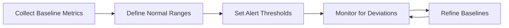

# MongoDB Monitoring Best Practices

## Introduction

Effective monitoring is a critical component of managing any production MongoDB deployment. Without proper monitoring, you might miss performance degradation, resource constraints, or potential failures until they affect your application users. This guide covers essential MongoDB monitoring best practices to help you maintain healthy, performant databases and respond proactively to issues before they become critical.

Monitoring MongoDB involves tracking various metrics related to:

- Database performance
- Resource utilization
- Replication health
- Query performance
- Security and access patterns
- Storage capacity and utilization

By the end of this guide, you'll understand which metrics matter most, how to set up effective monitoring, and how to interpret the collected data to make informed decisions about your MongoDB deployments.

## Why MongoDB Monitoring Matters

Before diving into specific metrics and tools, let's understand why monitoring is essential:

1. **Performance Optimization**: Identify bottlenecks and inefficient queries
2. **Capacity Planning**: Track resource usage trends to plan for scaling
3. **Incident Detection**: Catch issues early before they affect users
4. **Security**: Identify unusual access patterns or potential breaches
5. **Data Integrity**: Ensure replication is functioning correctly
6. **SLA Compliance**: Verify your database meets service level agreements

## Essential MongoDB Metrics to Monitor

### System-Level Metrics

These metrics relate to the underlying hardware and operating system:

#### 1. CPU Usage

High CPU utilization can indicate inefficient queries or indexing issues.

```javascript
// MongoDB command to check current operation metrics
db.currentOp(
  { 
    "active": true, 
    "secs_running": { "$gt": 5 } 
  }
)
```

**Output:**
```json
{
  "inprog": [
    {
      "desc": "conn57",
      "opid": 123456,
      "active": true,
      "secs_running": 10,
      "op": "query",
      "ns": "mydb.mycollection",
      "query": { "status": "pending" },
      "client": "192.168.1.10:12345",
      "locks": { /* lock info */ },
      "waitingForLock": false,
      "numYields": 5,
      "threadId": "0x7f1a9d3cd700"
    }
  ]
}
```

#### 2. Memory Usage

MongoDB performance heavily depends on having sufficient memory for its working set. When memory is constrained, performance can degrade significantly.

Key memory metrics:
- **Resident memory**: Actual physical RAM used
- **Virtual memory**: Total memory allocated
- **Page faults**: Indicates data being read from disk instead of memory

#### 3. Disk I/O

MongoDB writes data to disk, so disk performance is crucial:
- **IOPS (Input/Output Operations Per Second)**
- **Disk latency**
- **Disk queue depth**

#### 4. Network Traffic

Monitor:
- **Network throughput**
- **Connection counts**
- **Network errors**

### MongoDB-Specific Metrics

#### 1. Operations Counters

MongoDB maintains counters for different operation types:

```javascript
// Check operation counters
db.serverStatus().opcounters
```

**Output:**
```json
{
  "insert": 3245,
  "query": 23456,
  "update": 1234,
  "delete": 345,
  "getmore": 5678,
  "command": 87654
}
```

These metrics show the number of each operation type since the server started. For monitoring, you should track the rate of change rather than absolute values.

#### 2. Connection Statistics

```javascript
// Check connection statistics
db.serverStatus().connections
```

**Output:**
```json
{
  "current": 125,
  "available": 51075,
  "totalCreated": 1234,
  "active": 100,
  "exhaustIsMaster": 0,
  "exhaustHello": 0,
  "awaitingTopologyChanges": 0
}
```

Keep an eye on connection usage patterns and ensure you're not approaching the connection limit.

#### 3. Replica Set Health

For deployments with replication, monitor:

```javascript
// Check replica set status
rs.status()
```

Key metrics to watch:
- **Replication lag**: How far behind secondaries are from the primary
- **Oplog window**: How much time is covered by the operation log
- **Member states**: Ensure all members are in the expected state

#### 4. Query Performance

```javascript
// Find slow queries
db.getSiblingDB("admin").system.profile.find(
  { millis: { $gt: 100 } }
).sort(
  { millis: -1 }
).limit(5)
```

Enable profiling to capture slow queries:

```javascript
// Enable profiling for queries slower than 100ms
db.setProfilingLevel(1, { slowms: 100 })
```

#### 5. Database Storage Metrics

Monitor collection and index sizes:

```javascript
// Get statistics for a database
db.stats()
```

**Output:**
```json
{
  "db": "mydb",
  "collections": 12,
  "views": 0,
  "objects": 45678,
  "avgObjSize": 256.3,
  "dataSize": 11700000,
  "storageSize": 13200000,
  "freeStorageSize": 1500000,
  "indexes": 25,
  "indexSize": 3400000,
  "totalSize": 16600000,
  "scaleFactor": 1,
  "fsUsedSize": 256000000000,
  "fsTotalSize": 1000000000000,
  "ok": 1
}
```

## Setting Up Effective Monitoring

### 1. MongoDB Built-in Tools

#### MongoDB Compass

MongoDB Compass provides a GUI for monitoring many aspects of your database:
- Real-time server statistics
- Query performance analysis
- Index suggestions
- Schema visualization

#### MongoDB Cloud Manager/Ops Manager

MongoDB's official monitoring solutions provide comprehensive monitoring:
- Performance metrics
- Real-time alerting
- Visualization of cluster statistics
- Historical data for trend analysis

### 2. Third-Party Monitoring Solutions

Many general-purpose monitoring tools can be configured for MongoDB:

- **Prometheus with MongoDB Exporter**: Open-source monitoring and alerting
- **Grafana**: Visualization for MongoDB metrics
- **Datadog**: Cloud monitoring with MongoDB integration
- **New Relic**: Performance monitoring platform
- **Zabbix/Nagios**: Enterprise monitoring solutions

### 3. Custom Monitoring Scripts

For specific needs, you might write custom monitoring scripts:

```javascript
// Example monitoring script to check replication lag
const checkReplicationLag = () => {
  const status = rs.status();
  const primary = status.members.find(m => m.state === 1);
  
  status.members.forEach(member => {
    if (member.state === 2) { // Secondary
      const lagSeconds = Math.abs(member.optimeDate.getTime() - primary.optimeDate.getTime()) / 1000;
      print(`Member ${member.name} lag: ${lagSeconds.toFixed(2)} seconds`);
      
      // Alert if lag exceeds threshold
      if (lagSeconds > 60) {
        print(`ALERT: High replication lag on ${member.name}`);
        // Add code to send notification
      }
    }
  });
};

// Run check every minute
setInterval(checkReplicationLag, 60000);
```

## Implementing Monitoring Best Practices

### 1. Define Clear Baselines

Before you can identify problems, you need to understand what "normal" looks like:

1. Collect metrics during typical operations for at least a week
2. Establish performance patterns across different times of day
3. Document expected ranges for key metrics



### 2. Set Appropriate Alerting Thresholds

Not all metrics require the same level of alerting:

- **Critical alerts**: Immediate response required (e.g., replica set primary down)
- **Warning alerts**: Needs attention soon (e.g., increasing replication lag)
- **Informational alerts**: For capacity planning (e.g., disk space trending up)

Example alerting thresholds:

| Metric          | Warning Threshold    | Critical Threshold   |
|-----------------|----------------------|----------------------|
| CPU Usage       | `>70%` for 5 minutes | `>90%` for 5 minutes |
| Memory Usage    | `>80%`               | `>95%`               |
| Replication Lag | `>60` seconds        | `>300` seconds       |
| Connections     | `>70%` of limit      | `>90%` of limit      |
| Disk Space      | `<25%` free          | `<10%` free          |

### 3. Implement a Monitoring Rotation

For larger teams, implement a monitoring rotation where team members take turns being responsible for:

1. Reviewing monitoring dashboards
2. Investigating alerts
3. Documenting patterns or incidents
4. Suggesting monitoring improvements

### 4. Create Runbooks for Common Issues

Document procedures for handling common issues identified by monitoring:

Example runbook snippet for handling high CPU usage:

1. Check for long-running operations:

   ```javascript
   db.currentOp({"active": true, "secs_running": {$gt: 10}})
   ```

2. Review slow queries in the profiler:

   ```javascript
    db.system.profile.find({millis:{$gt:100}}).sort({ts:-1})
    ```

3. Check for missing indexes:

   ```javascript
   db.collection.explain("executionStats").find({query_condition})
   ```

4. If necessary, kill long-running operations:

    ```javascript
    db.killOp(opId)
    ```

## Real-World Monitoring Examples

### Example 1: E-Commerce Application Monitoring

An e-commerce platform needs to ensure their MongoDB database can handle traffic spikes during sales events:

1. **Key metrics to monitor:**
   - Query response times for product searches
   - Read/write operation throughput
   - Connection pool utilization
   - Cache hit ratios

2. **Monitoring strategy:**
   - Real-time dashboard for current load
   - Historical comparisons with previous sales events
   - Automatic scaling triggers based on connection counts
   - Alerts for query performance degradation

```javascript
// Example aggregation to monitor slow product searches
db.queries.aggregate([
  {
    $match: {
      namespace: "ecommerce.products",
      operation: "query",
      millis: { $gt: 100 },
      ts: { $gt: new Date(Date.now() - 3600000) } // Last hour
    }
  },
  {
    $group: {
      _id: null,
      count: { $sum: 1 },
      avgTime: { $avg: "$millis" },
      maxTime: { $max: "$millis" }
    }
  }
])
```

### Example 2: Financial Services Application

A financial application requires high availability and data consistency:

1. **Key metrics to monitor:**
   - Write concern acknowledgments and timing
   - Replication health and lag
   - Index usage for financial transaction queries
   - Authentication and authorization events

2. **Monitoring strategy:**
   - Primary focus on replication metrics
   - Multiple notification channels for critical alerts
   - Geographic distribution visualizations for global deployments
   - Compliance reporting for audit requirements

```javascript
// Check write concern performance
db.serverStatus().metrics.operation.writeLatency
```

## Troubleshooting Common Issues with Monitoring

### Problem: Unexpected High CPU Usage

**Monitoring indicators:**
- Sustained CPU usage above 80%
- Increasing query latency

**Investigation steps:**
```javascript
// 1. Check for long-running operations
db.currentOp(
  {
    "active": true,
    "secs_running": { "$gt": 5 }
  }
)

// 2. Look for collection scans (missing indexes)
db.system.profile.find(
  {
    "planSummary": /COLLSCAN/,
    "millis": { "$gt": 100 }
  }
).sort({ "millis": -1 })
```

**Common solutions:**
- Add missing indexes
- Optimize query patterns
- Implement read/write operation separation

### Problem: Memory Pressure

**Monitoring indicators:**
- Increasing page faults
- Growing virtual memory usage
- Working set exceeding available RAM

**Investigation steps:**
```javascript
// Check memory statistics
db.serverStatus().mem

// Check working set 
db.serverStatus().wiredTiger.cache
```

**Common solutions:**
- Increase available RAM
- Limit in-memory sort sizes
- Review indexing strategy

## Summary

Effective MongoDB monitoring is a crucial aspect of database management that helps ensure optimal performance, reliability, and security. By monitoring system-level metrics, MongoDB-specific metrics, and implementing appropriate alerting and response procedures, you can maintain healthy database deployments.

Key takeaways:
1. Establish baselines before setting alert thresholds
2. Monitor both system-level and MongoDB-specific metrics
3. Implement proper alerting with appropriate severity levels
4. Create runbooks for common issues
5. Regularly review monitoring strategies and refine as needed

Monitoring is not a set-it-and-forget-it task. As your application evolves, your monitoring strategy should adapt to focus on the metrics most relevant to your current architecture and usage patterns.

## Additional Resources

- [MongoDB Server Status Documentation](https://www.mongodb.com/docs/manual/reference/command/serverStatus/)
- [MongoDB Monitoring Best Practices](https://www.mongodb.com/docs/manual/administration/monitoring/)
- [MongoDB Profiler Configuration](https://www.mongodb.com/docs/manual/tutorial/manage-the-database-profiler/)
- [MongoDB University: M103 Basic Cluster Administration](https://university.mongodb.com/courses/M103/about)

## Exercises

1. **Basic Monitoring Setup**: Configure MongoDB to log slow queries (>100ms) and set up a simple script to analyze the logs.

2. **Alert Configuration**: Define appropriate warning and critical thresholds for CPU, memory, connections, and replication lag for a MongoDB replica set.

3. **Dashboard Creation**: Using a tool like Grafana or MongoDB Compass, create a dashboard showing key MongoDB performance metrics.

4. **Benchmark Testing**: Run a load test on a test MongoDB instance and observe how different metrics change under load.

5. **Incident Response Drill**: Simulate a common MongoDB issue (high CPU, replication delay, etc.) and practice following your monitoring and response procedures.