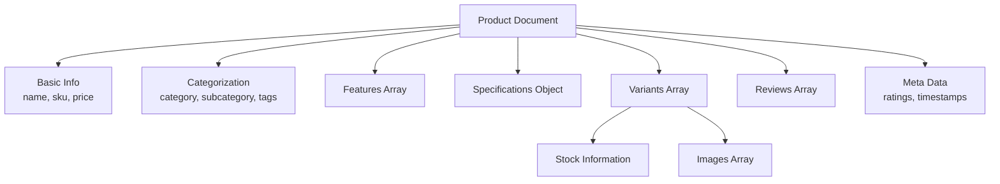

# MongoDB Document Structure

## Introduction

MongoDB is a document-oriented NoSQL database that stores data in flexible, JSON-like documents. Understanding how documents are structured in MongoDB is fundamental to effectively designing your database schema and performing CRUD operations. In this guide, we'll explore the MongoDB document structure, from its basic format to advanced structuring techniques.

## What are MongoDB Documents?

In MongoDB, a document is the basic unit of data storage, similar to a row in relational databases. However, unlike rigid relational tables, MongoDB documents are flexible and can have varying structures within the same collection.

### Document Format

MongoDB documents are stored in Binary JSON (BSON) format, which extends the JSON format to include additional data types and be more efficient for storage and retrieval.

A basic document looks like this:

```javascript
{
  _id: ObjectId("5f8d0c1b9d3b2e1a2c3d4e5f"),
  name: "John Doe",
  age: 30,
  email: "john@example.com",
  created_at: new Date()
}
```

Every document in MongoDB requires a unique identifier stored in the `_id` field. If you don't provide one when inserting a document, MongoDB automatically generates an `ObjectId` for it.

## Document Data Types

MongoDB supports various data types to represent different kinds of data:

- **String**: UTF-8 character strings
- **Number**: Integer, Double, Decimal128
- **Boolean**: true or false
- **Date**: ISODate or timestamp
- **Array**: List of values of any type
- **Object/Document**: Embedded documents
- **ObjectId**: 12-byte identifier typically used for `_id`
- **Null**: Null value
- **Binary Data**: For storing binary data
- **Regular Expression**: For pattern matching
- **JavaScript Code**: Store JavaScript functions

Let's see these types in action:

```javascript
{
  _id: ObjectId("60a6e8d91f2a1b3b5c7d8e9f"),
  name: "Alice Smith",
  age: 28,
  isActive: true,
  registeredOn: ISODate("2021-05-20T08:30:00Z"),
  tags: ["developer", "javascript", "mongodb"],
  address: {
    street: "123 Tech Lane",
    city: "San Francisco",
    zipCode: "94105"
  },
  profilePicture: BinData(0, "base64EncodedData"),
  searchPattern: /^dev.*/i,
  calculateScore: function() { return this.points * 2; }
}
```

## Embedded Documents

One of MongoDB's powerful features is the ability to embed documents within other documents, creating a nested structure. This approach can reduce the need for joins and improve query performance.

### Example of Embedding

```javascript
{
  _id: ObjectId("60a6e8d91f2a1b3b5c7d8e9f"),
  name: "Jane Wilson",
  contact: {
    email: "jane@example.com",
    phone: "+1-555-123-4567",
    address: {
      street: "456 Database Ave",
      city: "Chicago",
      state: "IL",
      zipCode: "60601"
    }
  },
  skills: ["MongoDB", "Express", "React", "Node.js"]
}
```

To access fields in embedded documents, you can use dot notation:

```javascript
// Query to find Jane's email
db.users.find({ "contact.email": "jane@example.com" })

// Query to find users in Chicago
db.users.find({ "contact.address.city": "Chicago" })
```

## Working with Arrays

Arrays in MongoDB documents can store lists of values, whether they are simple scalar values or complex objects.

### Array of Simple Values

```javascript
{
  _id: ObjectId("60a6e8d91f2a1b3b5c7d8eaf"),
  name: "Tech Conference 2023",
  tags: ["mongodb", "database", "nosql", "webdev"]
}
```

### Array of Embedded Documents

```javascript
{
  _id: ObjectId("60a6e8d91f2a1b3b5c7d8ebf"),
  name: "Michael Brown",
  courses: [
    {
      title: "Introduction to MongoDB",
      score: 95,
      completed: true
    },
    {
      title: "Advanced Document Modeling",
      score: 87,
      completed: false
    }
  ]
}
```

### Querying Arrays

MongoDB provides several operators for working with arrays:

```javascript
// Find users who know MongoDB
db.users.find({ skills: "MongoDB" })

// Find users who completed "Introduction to MongoDB" with a score above 90
db.users.find({ 
  "courses": { 
    $elemMatch: { 
      title: "Introduction to MongoDB", 
      score: { $gt: 90 },
      completed: true
    } 
  } 
})
```

## Document Size Limitations

MongoDB documents have a maximum size of 16 megabytes. This limit helps ensure good performance and prevents excessive memory usage. If you need to store larger objects, consider using GridFS, MongoDB's specification for storing and retrieving large files.

## Schema Design Patterns

Unlike relational databases, MongoDB doesn't enforce a strict schema. However, designing an effective schema is still crucial for application performance. Here are common patterns:

### 1. Embedding vs. Referencing

#### When to Embed:
- When data is frequently accessed together
- For "contains" relationships (1:few)
- When data doesn't change frequently

```javascript
// Embedding comments in a post document
{
  _id: ObjectId("60a6e8d91f2a1b3b5c7d8ecf"),
  title: "Introduction to MongoDB",
  content: "MongoDB is a document database...",
  comments: [
    {
      user: "Alice",
      text: "Great article!",
      date: ISODate("2021-05-21T14:30:00Z")
    },
    {
      user: "Bob",
      text: "Very informative",
      date: ISODate("2021-05-22T09:15:00Z")
    }
  ]
}
```

#### When to Reference:
- For many-to-many relationships
- When data is updated frequently
- When the embedded data would grow unbounded

```javascript
// Post document with references to comments
{
  _id: ObjectId("60a6e8d91f2a1b3b5c7d8ecf"),
  title: "Introduction to MongoDB",
  content: "MongoDB is a document database...",
  comment_ids: [
    ObjectId("60a7f9e82b3c4d5e6f7g8h9i"),
    ObjectId("60a7f9e82b3c4d5e6f7g8h9j")
  ]
}

// Comment documents
{
  _id: ObjectId("60a7f9e82b3c4d5e6f7g8h9i"),
  post_id: ObjectId("60a6e8d91f2a1b3b5c7d8ecf"),
  user: "Alice",
  text: "Great article!",
  date: ISODate("2021-05-21T14:30:00Z")
}
```

### 2. Subset Pattern

Store a subset of data where it's frequently accessed and the complete data elsewhere:

```javascript
// User document with a subset of posts
{
  _id: ObjectId("60a6e8d91f2a1b3b5c7d8edf"),
  name: "David Johnson",
  recent_posts: [
    {
      _id: ObjectId("60a7f9e82b3c4d5e6f7g8h9k"),
      title: "MongoDB Aggregation",
      snippet: "Learn how to use the aggregation framework...",
      date: ISODate("2021-06-01T10:00:00Z")
    },
    {
      _id: ObjectId("60a7f9e82b3c4d5e6f7g8h9l"),
      title: "Document Structure Best Practices",
      snippet: "Designing efficient document structures...",
      date: ISODate("2021-06-03T14:20:00Z")
    }
  ]
}
```

## Real-World Example: E-commerce Product Catalog

Let's look at how we might structure an e-commerce product document:

```javascript
{
  _id: ObjectId("60a6e8d91f2a1b3b5c7d8eef"),
  name: "Wireless Noise-Cancelling Headphones",
  slug: "wireless-noise-cancelling-headphones",
  sku: "HDPHN-NC-001",
  price: {
    amount: 199.99,
    currency: "USD"
  },
  discount: {
    percentage: 10,
    validUntil: ISODate("2023-12-31T23:59:59Z")
  },
  category: "Electronics",
  subcategory: "Audio",
  tags: ["headphones", "wireless", "noise-cancelling", "bluetooth"],
  features: [
    "40-hour battery life",
    "Bluetooth 5.0",
    "Active noise cancellation",
    "Voice assistant compatible"
  ],
  specifications: {
    weight: "250g",
    dimensions: {
      length: "18cm",
      width: "15cm",
      height: "8cm"
    },
    connectivity: ["Bluetooth", "3.5mm audio jack"],
    batteryLife: "40 hours"
  },
  variants: [
    {
      color: "Black",
      inStock: 156,
      images: [
        { 
          url: "black-headphones-main.jpg",
          alt: "Black headphones front view",
          isPrimary: true
        },
        { 
          url: "black-headphones-side.jpg",
          alt: "Black headphones side view",
          isPrimary: false
        }
      ]
    },
    {
      color: "White",
      inStock: 78,
      images: [
        { 
          url: "white-headphones-main.jpg",
          alt: "White headphones front view",
          isPrimary: true
        }
      ]
    }
  ],
  reviews: [
    {
      userId: ObjectId("60a7f9e82b3c4d5e6f7g8h9m"),
      rating: 5,
      title: "Amazing sound quality",
      comment: "These headphones have incredible sound and the noise cancellation is top-notch.",
      date: ISODate("2023-07-15T08:23:15Z"),
      helpful: 24
    }
  ],
  averageRating: 4.7,
  totalReviews: 356,
  created: ISODate("2023-01-15T10:30:00Z"),
  updated: ISODate("2023-08-01T16:45:23Z")
}
```

This document structure demonstrates:
1. Basic product information (name, sku, price)
2. Categorization (category, subcategory, tags)
3. Embedded documents for specifications and variants
4. Arrays for features and reviews
5. Pre-calculated fields (averageRating, totalReviews) to improve read performance

## Best Practices for Document Structure

1. **Design for your access patterns**: Structure your documents based on how your application will query and update the data.

2. **Keep related data together**: Embed related data that is accessed together to minimize the number of queries.

3. **Avoid unbounded growth**: Be cautious about embedding arrays that can grow indefinitely.

4. **Consider document size limits**: Remember the 16MB document size limit when designing your schema.

5. **Balance normalization and denormalization**: Duplicate some data to improve read performance, but consider update complexity.

6. **Use meaningful field names**: Choose descriptive field names that make your schema self-documenting.

7. **Be consistent with data types**: Use consistent data types for the same fields across documents.

## Schema Visualization

Here's a visualization of the relationships in our e-commerce product example:



## Summary

MongoDB's document structure offers flexibility and performance advantages over traditional relational databases. Key points to remember:

- Documents are stored in BSON format, which extends JSON with additional data types
- Every document needs a unique `_id` field
- Documents can contain embedded documents and arrays for complex data structures
- Schema design patterns include embedding vs. referencing, which should be chosen based on your application's needs
- Document size is limited to 16MB, so plan accordingly
- Design your schema around your application's query patterns

By understanding MongoDB document structure, you'll be better equipped to design efficient schemas that leverage MongoDB's strengths while avoiding common pitfalls.

## Further Resources

- [MongoDB Schema Design Patterns](https://www.mongodb.com/blog/post/building-with-patterns-a-summary)
- [MongoDB Data Modeling Introduction](https://docs.mongodb.com/manual/core/data-modeling-introduction/)
- [MongoDB University - Data Modeling Course](https://university.mongodb.com/courses/M320/about)

## Exercises

1. Design a document structure for a blog platform that includes users, posts, and comments.
2. Convert a simple relational database schema (with Users, Orders, and Products tables) to a MongoDB document structure.
3. Refactor the e-commerce product example to use references instead of embedding for product reviews.
4. Create a document structure for a social media application that efficiently stores user profiles, posts, and friend relationships.