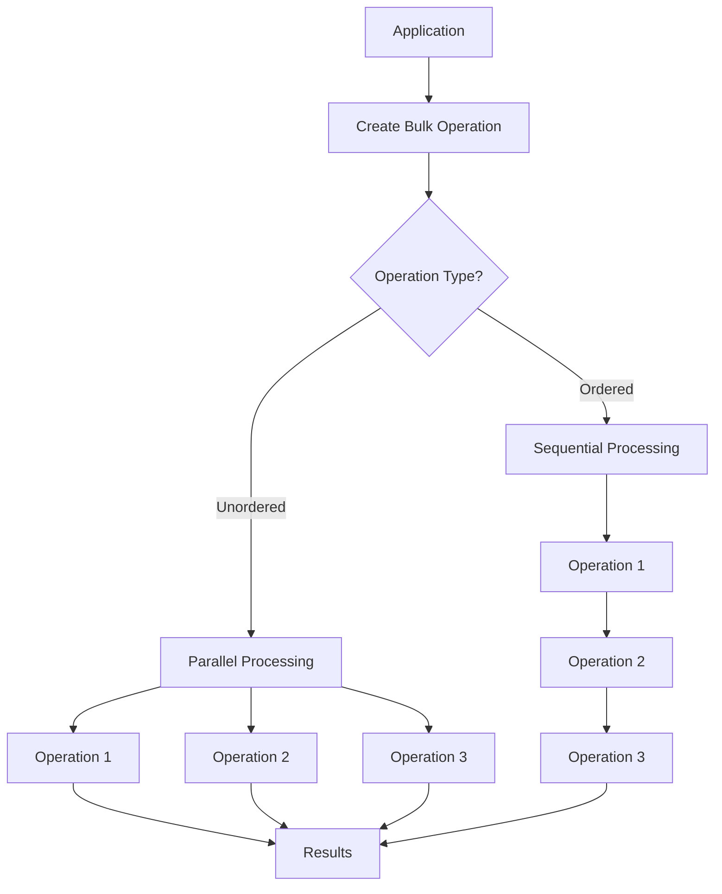

# MongoDB Bulk Operations

When working with MongoDB, there are times when you need to perform multiple write operations (inserts, updates, or deletes) on a collection. Instead of executing these operations one by one, MongoDB provides a powerful feature called **Bulk Operations** that allows you to batch multiple operations together and execute them as a single request to the database server.

## Why Use Bulk Operations?

Bulk operations offer significant performance benefits:

1. **Reduced network overhead**: Fewer round-trips between your application and the database
2. **Better throughput**: Processing multiple operations in a single batch is more efficient
3. **Atomic operations**: All operations in an ordered bulk execute together or fail together
4. **Performance optimization**: MongoDB can optimize the execution of multiple similar operations

## Types of Bulk Operations

MongoDB provides two types of bulk operations:

1. **Ordered Bulk Operations**: Operations are executed in sequence. If an operation fails, MongoDB stops processing remaining operations in the batch.

2. **Unordered Bulk Operations**: Operations are executed in parallel with no guaranteed order. If an operation fails, MongoDB continues to process the remaining operations.

## Basic Syntax

In most MongoDB drivers, you start by initializing a bulk operation object:

```javascript
// Ordered bulk operation (default)
const bulkOp = db.collection.initializeOrderedBulkOp();

// Unordered bulk operation
const bulkOp = db.collection.initializeUnorderedBulkOp();
```

Then you add operations to the bulk:

```javascript
bulkOp.insert({ name: "John", age: 25 });
bulkOp.find({ age: { $lt: 18 } }).update({ $set: { status: "minor" } });
bulkOp.find({ active: false }).remove();

// Execute all operations
const result = bulkOp.execute();
```

## Practical Examples

Let's explore some practical examples of bulk operations using the MongoDB Node.js driver.

### Setting Up

First, you need to set up your environment:

```javascript
const { MongoClient } = require('mongodb');

async function performBulkOperations() {
  const client = new MongoClient('mongodb://localhost:27017');
  
  try {
    await client.connect();
    const db = client.db('inventory');
    const products = db.collection('products');
    
    // Our bulk operations will go here
    
  } finally {
    await client.close();
  }
}
```

### Example 1: Bulk Inserts

Let's insert multiple product documents at once:

```javascript
async function bulkInserts(collection) {
  // Initialize ordered bulk operation
  const bulk = collection.initializeOrderedBulkOp();
  
  // Add multiple insert operations
  bulk.insert({ name: "Laptop", price: 999, category: "Electronics", stock: 50 });
  bulk.insert({ name: "Phone", price: 699, category: "Electronics", stock: 100 });
  bulk.insert({ name: "Headphones", price: 199, category: "Accessories", stock: 200 });
  bulk.insert({ name: "Mouse", price: 29, category: "Accessories", stock: 150 });
  bulk.insert({ name: "Keyboard", price: 59, category: "Accessories", stock: 75 });
  
  // Execute the bulk operation
  const result = await bulk.execute();
  
  console.log(`Inserted ${result.nInserted} documents`);
  return result;
}
```

**Output:**
```
Inserted 5 documents
```

### Example 2: Bulk Updates

Now let's update multiple documents matching specific criteria:

```javascript
async function bulkUpdates(collection) {
  // Initialize unordered bulk operation
  const bulk = collection.initializeUnorderedBulkOp();
  
  // Apply 10% discount to all electronics
  bulk.find({ category: "Electronics" })
      .update({ $mul: { price: 0.9 } });
  
  // Mark items with low stock
  bulk.find({ stock: { $lt: 100 } })
      .update({ $set: { status: "Low Stock" } });
  
  // Add a "featured" flag to expensive items
  bulk.find({ price: { $gt: 500 } })
      .update({ $set: { featured: true } });
  
  // Execute the bulk operation
  const result = await bulk.execute();
  
  console.log(`Updated ${result.nModified} documents`);
  return result;
}
```

**Output:**
```
Updated 4 documents
```

### Example 3: Mixed Operations

You can also mix different types of operations in a single bulk:

```javascript
async function mixedBulkOperations(collection) {
  // Initialize ordered bulk operation
  const bulk = collection.initializeOrderedBulkOp();
  
  // Insert new products
  bulk.insert({ name: "Tablet", price: 349, category: "Electronics", stock: 30 });
  bulk.insert({ name: "Smartwatch", price: 249, category: "Wearables", stock: 45 });
  
  // Update existing products
  bulk.find({ category: "Accessories" })
      .update({ $set: { department: "Computer Peripherals" } });
  
  // Remove out-of-stock products
  bulk.find({ stock: 0 }).remove();
  
  // Replace a product entirely
  bulk.find({ name: "Laptop" }).replaceOne({ 
    name: "Premium Laptop", 
    price: 1299, 
    category: "Electronics", 
    stock: 25,
    features: ["SSD", "16GB RAM"]
  });
  
  // Execute the bulk operation
  const result = await bulk.execute();
  
  console.log(`Bulk operation results: ${JSON.stringify(result, null, 2)}`);
  return result;
}
```

**Output:**
```
Bulk operation results: {
  "nInserted": 2,
  "nUpserted": 0,
  "nMatched": 4,
  "nModified": 4,
  "nRemoved": 0,
  "insertedIds": [
    { "index": 0, "_id": "62d7f3c67890abcdef123456" },
    { "index": 1, "_id": "62d7f3c67890abcdef123457" }
  ]
}
```

## Advanced Usage

### Upserts in Bulk Operations

The upsert operation inserts a document if it doesn't exist or updates it if it does:

```javascript
async function bulkUpserts(collection) {
  const bulk = collection.initializeOrderedBulkOp();
  
  // Upsert operations
  bulk.find({ sku: "ABC123" })
      .upsert()
      .updateOne({ 
        $set: { 
          name: "Wireless Charger",
          price: 39.99,
          category: "Accessories",
          stock: 200 
        } 
      });
      
  bulk.find({ sku: "DEF456" })
      .upsert()
      .updateOne({ 
        $set: { 
          name: "USB-C Cable",
          price: 19.99,
          category: "Accessories",
          stock: 300 
        } 
      });
  
  const result = await bulk.execute();
  console.log(`Upserted: ${result.nUpserted}, Updated: ${result.nModified}`);
  return result;
}
```

### Error Handling in Bulk Operations

It's important to handle errors when working with bulk operations:

```javascript
async function bulkOperationsWithErrorHandling(collection) {
  const bulk = collection.initializeOrderedBulkOp();
  
  try {
    // Add operations to bulk
    bulk.insert({ _id: 1, name: "Product 1" });
    bulk.insert({ _id: 2, name: "Product 2" });
    bulk.insert({ _id: 1, name: "Product 3" }); // This will cause a duplicate key error
    bulk.insert({ _id: 3, name: "Product 4" }); // This won't execute if using ordered bulk
    
    await bulk.execute();
  } catch (error) {
    console.error("Bulk operation failed:");
    
    if (error.writeErrors) {
      error.writeErrors.forEach(writeError => {
        console.error(`- Operation at index ${writeError.index} failed: ${writeError.errmsg}`);
        console.error(`  Document: ${JSON.stringify(writeError.op)}`);
      });
    }
    
    // For partially executed bulk (in unordered bulk)
    if (error.result) {
      console.log(`Inserted: ${error.result.nInserted}`);
      console.log(`Updated: ${error.result.nModified}`);
      console.log(`Deleted: ${error.result.nRemoved}`);
    }
  }
}
```

## Performance Considerations

When working with bulk operations, keep these tips in mind:

1. **Batch size**: While bulk operations can handle thousands of operations, consider limiting batches to 1,000-10,000 operations for optimal performance.

2. **Memory usage**: Large bulk operations consume more memory on both the client and server.

3. **Ordered vs. Unordered**: Use unordered bulk operations when order doesn't matter for better performance.

4. **Document size**: Remember that MongoDB has a 16MB document size limit which applies to bulk operations too.

5. **Error handling**: Especially with unordered bulk operations, be prepared to handle partial successes.



## Real-World Application: E-commerce Inventory Update

Let's simulate updating an e-commerce inventory after processing several orders:

```javascript
async function processOrders(db) {
  const orders = [
    { product: "Laptop", quantity: 2 },
    { product: "Phone", quantity: 5 },
    { product: "Headphones", quantity: 10 },
    { product: "Mouse", quantity: 3 }
  ];

  const inventory = db.collection('products');
  const bulk = inventory.initializeOrderedBulkOp();
  
  // Update inventory for each order
  orders.forEach(order => {
    bulk.find({ name: order.product })
        .updateOne({
          $inc: { stock: -order.quantity },
          $push: { 
            transactions: {
              type: "sale",
              quantity: order.quantity,
              date: new Date()
            }
          }
        });
  });
  
  // Mark products that need restocking
  bulk.find({ stock: { $lt: 20 } })
      .update({ $set: { needsRestock: true } });
  
  try {
    const result = await bulk.execute();
    console.log(`Processed ${orders.length} orders, updated ${result.nModified} inventory items`);
    return result;
  } catch (error) {
    console.error("Failed to process orders:", error);
    throw error;
  }
}
```

## Summary

MongoDB bulk operations provide an efficient way to execute multiple write operations in a single database request. This significantly improves performance by reducing network overhead and allowing MongoDB to optimize the execution of similar operations.

Key takeaways:

1. Use **ordered bulk operations** when the sequence of operations matters and you want execution to stop on the first error.
2. Use **unordered bulk operations** for better performance when the order doesn't matter and you want all possible operations to be attempted regardless of errors.
3. Bulk operations support inserts, updates, replacements, and deletes.
4. Error handling is important, especially for unordered bulk operations that may have partial successes.
5. Consider batch sizes and memory usage when working with very large bulk operations.

## Exercises

1. Create a bulk operation that adds 100 sample user documents to a collection.
2. Write a function that uses bulk operations to categorize products based on their price ranges.
3. Implement a bulk operation that archives old records by moving them to an archive collection and removing them from the active collection.
4. Create an unordered bulk operation that updates multiple fields across different document criteria and handle potential errors.
5. Compare the performance of individual operations versus bulk operations by measuring execution time for the same set of operations.

## Additional Resources

- [MongoDB Bulk Operations Documentation](https://www.mongodb.com/docs/manual/core/bulk-write-operations/)
- [MongoDB Node.js Driver Documentation](https://mongodb.github.io/node-mongodb-native/api-generated/collection.html#bulkwrite)
- [Optimization Strategies for MongoDB](https://www.mongodb.com/blog/post/performance-best-practices-mongodb-data-modeling-and-memory-sizing)