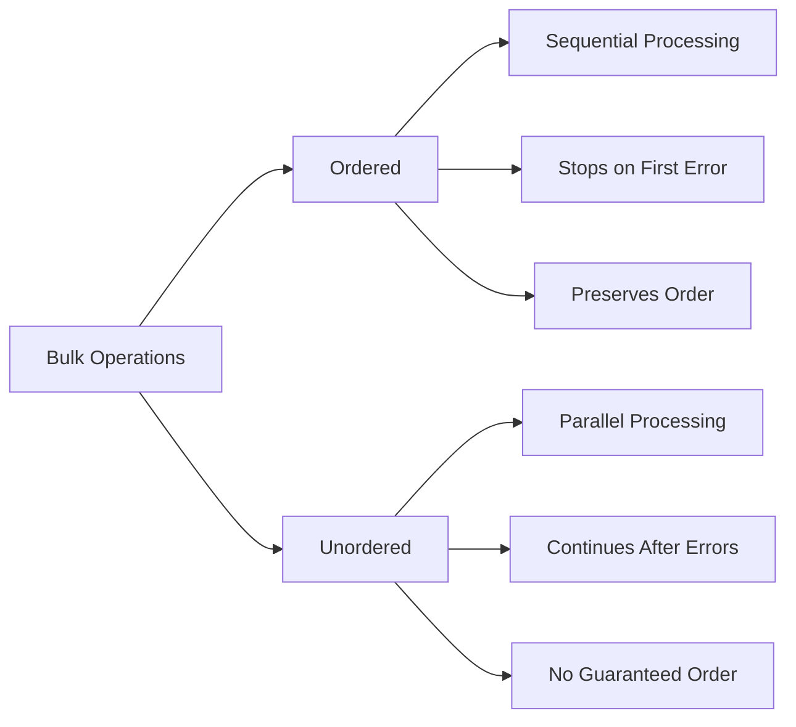

# MongoDB Unordered Operations

## Introduction

When working with MongoDB, you'll often need to perform multiple operations at once—whether it's inserting a batch of documents, updating multiple records, or deleting several items. By default, MongoDB processes these operations sequentially, stopping the entire batch if an error occurs. However, MongoDB offers an alternative approach called **unordered operations**, which can significantly improve performance and provide more flexible error handling.

In this tutorial, we'll explore what unordered operations are, how they differ from ordered operations, and when and how to use them effectively in your MongoDB applications.

## What Are Unordered Operations?

Unordered operations in MongoDB allow the database to process multiple write operations in parallel without guaranteeing the order of execution. When using unordered operations, MongoDB will continue processing the remaining operations even if some fail.

### Key Characteristics

- **Parallel Execution**: Operations may be executed in parallel and in any order
- **Error Handling**: Failures don't stop the processing of remaining operations
- **Performance**: Typically faster than ordered operations for large batches
- **Use Case**: Ideal when order doesn't matter and maximum throughput is desired

## Ordered vs. Unordered Operations

Before diving deeper, let's understand the differences between ordered and unordered operations:



| Feature | Ordered Operations | Unordered Operations |
|---------|-------------------|---------------------|
| Default behavior | Yes | No |
| Execution order | Sequential | Parallel/Any order |
| Error handling | Stops on first error | Continues after errors |
| Performance | Slower for large batches | Faster for large batches |
| Use case | When order matters | When maximum throughput is needed |

## How to Use Unordered Operations

Let's look at how to implement unordered operations across different MongoDB write operations.

### Bulk Inserts with Unordered Option

When inserting multiple documents at once, you can specify the `ordered: false` option:

```javascript
db.products.insertMany([
  { name: "Laptop", price: 999.99, stock: 50 },
  { name: "Mouse", price: 29.99, stock: 100 },
  { name: "Keyboard", price: 59.99, stock: 75 },
  { name: "Monitor", price: 249.99, stock: 30 }
], { ordered: false });
```

With this option, if one document fails to insert (perhaps due to a duplicate key), MongoDB will still attempt to insert the other documents.

### Example Output

```javascript
{
  "acknowledged": true,
  "insertedIds": {
    "0": ObjectId("5f8d5b9c1c9d440000c1e0a1"),
    "1": ObjectId("5f8d5b9c1c9d440000c1e0a2"),
    "3": ObjectId("5f8d5b9c1c9d440000c1e0a4")
  },
  "writeConcernErrors": [],
  "nInserted": 3,
  "nUpserted": 0,
  "nMatched": 0,
  "nModified": 0,
  "nRemoved": 0,
  "writeErrors": [
    {
      "index": 2,
      "code": 11000,
      "errmsg": "E11000 duplicate key error...",
      "op": {
        "_id": ObjectId("existing_id"),
        "name": "Keyboard",
        "price": 59.99,
        "stock": 75
      }
    }
  ]
}
```

In the output above, MongoDB successfully inserted documents at index 0, 1, and 3, despite the error at index 2.

### Bulk Updates with Unordered Option

Similarly, you can perform unordered updates:

```javascript
db.products.bulkWrite([
  { 
    updateOne: { 
      filter: { name: "Laptop" }, 
      update: { $set: { price: 899.99 } } 
    } 
  },
  { 
    updateOne: { 
      filter: { name: "NonExistentProduct" }, 
      update: { $set: { price: 199.99 } } 
    } 
  },
  { 
    updateOne: { 
      filter: { name: "Mouse" }, 
      update: { $set: { price: 24.99 } } 
    } 
  }
], { ordered: false });
```

### Bulk Delete with Unordered Option

For deletions, the approach is the same:

```javascript
db.products.bulkWrite([
  { deleteOne: { filter: { name: "Laptop" } } },
  { deleteOne: { filter: { name: "NonExistentProduct" } } },
  { deleteOne: { filter: { name: "Mouse" } } }
], { ordered: false });
```

## Practical Use Cases

### 1. Data Migration

When migrating large datasets, unordered operations can significantly improve performance:

```javascript
// Helper function to chunk data for bulk operations
function migrateData(sourceCollection, targetCollection, batchSize = 1000) {
  const totalDocs = db[sourceCollection].count();
  let processedDocs = 0;
  
  while (processedDocs < totalDocs) {
    const docs = db[sourceCollection].find().skip(processedDocs).limit(batchSize).toArray();
    
    // Perform unordered bulk insert
    db[targetCollection].insertMany(docs, { ordered: false });
    
    processedDocs += docs.length;
    print(`Migrated ${processedDocs}/${totalDocs} documents`);
  }
}

// Usage
migrateData('old_products', 'new_products', 5000);
```

### 2. Data Cleanup Operations

When cleaning up data, you might want to delete documents that match various criteria:

```javascript
db.logs.bulkWrite([
  { deleteMany: { filter: { timestamp: { $lt: new Date("2023-01-01") } } } },
  { deleteMany: { filter: { level: "DEBUG" } } },
  { deleteMany: { filter: { source: "test-environment" } } }
], { ordered: false });
```

### 3. Batch Processing External Data

When processing data from external sources, some records might fail validation:

```javascript
function processBatchData(records) {
  const operations = records.map(record => {
    try {
      // Validate record
      if (!record.name || !record.email) {
        console.log(`Skipping invalid record: ${JSON.stringify(record)}`);
        return null;
      }
      
      return {
        insertOne: {
          document: {
            name: record.name,
            email: record.email,
            createdAt: new Date()
          }
        }
      };
    } catch (error) {
      console.error(`Error processing record: ${error.message}`);
      return null;
    }
  }).filter(op => op !== null);
  
  if (operations.length > 0) {
    const result = db.users.bulkWrite(operations, { ordered: false });
    console.log(`Processed ${result.insertedCount} records successfully`);
    if (result.writeErrors && result.writeErrors.length > 0) {
      console.log(`${result.writeErrors.length} errors occurred`);
    }
  }
}
```

## Performance Considerations

Unordered operations typically perform better than ordered ones, especially in these scenarios:

1. **Large batches**: When inserting thousands of documents
2. **Distributed systems**: When writing to sharded clusters
3. **Independent data**: When operations don't depend on each other

Let's look at a simple performance comparison:

```javascript
// Test function to compare ordered vs unordered performance
function performanceTest(collection, docCount) {
  const docs = [];
  for (let i = 0; i < docCount; i++) {
    docs.push({ index: i, value: `test-${i}`, createdAt: new Date() });
  }
  
  // Time ordered operation
  const orderedStart = new Date();
  db[collection].insertMany(docs, { ordered: true });
  const orderedTime = new Date() - orderedStart;
  
  // Clear collection
  db[collection].drop();
  
  // Time unordered operation
  const unorderedStart = new Date();
  db[collection].insertMany(docs, { ordered: false });
  const unorderedTime = new Date() - unorderedStart;
  
  return {
    ordered: orderedTime,
    unordered: unorderedTime,
    improvement: ((orderedTime - unorderedTime) / orderedTime * 100).toFixed(2) + '%'
  };
}

// Example usage:
// performanceTest('performance_test', 10000);
```

## Error Handling with Unordered Operations

When using unordered operations, it's important to properly handle the result object to identify which operations succeeded and which failed:

```javascript
try {
  const result = db.customers.bulkWrite([
    // Various operations
    { insertOne: { document: { _id: 1, name: "Alice" } } },
    { insertOne: { document: { _id: 1, name: "Duplicate" } } }, // Will fail
    { updateOne: { filter: { _id: 2 }, update: { $set: { name: "Bob" } } } }
  ], { ordered: false });
  
  console.log(`Inserted: ${result.insertedCount}`);
  console.log(`Updated: ${result.modifiedCount}`);
  
  // Check for errors
  if (result.hasWriteErrors()) {
    console.log("Some operations failed:");
    result.getWriteErrors().forEach(error => {
      console.log(`Operation at index ${error.index} failed: ${error.errmsg}`);
    });
  }
} catch (e) {
  console.error("Bulk write failed completely:", e);
}
```

## Best Practices

1. **Use unordered operations when**:
   - Order doesn't matter
   - You want maximum performance
   - You need to continue processing despite some errors

2. **Stick with ordered operations when**:
   - Sequential processing is required
   - Operations depend on previous ones
   - All operations must succeed or none should

3. **Error handling**:
   - Always check the result object for errors
   - Log failed operations for later review
   - Consider retry mechanisms for failed operations

4. **Batch size**:
   - Break very large operations into manageable batches (1,000-10,000 documents)
   - Balance between too many small batches and too few large ones

## Summary

Unordered operations in MongoDB provide a powerful way to optimize bulk write operations by allowing parallel processing and continuing despite errors. They're particularly valuable for:

- Data migrations and imports
- Batch processing
- Performance-critical applications
- Scenarios where some operations failing is acceptable

By understanding when and how to use unordered operations, you can significantly improve your application's performance and resilience when working with MongoDB.

## Additional Resources

- MongoDB official documentation on [Bulk Write Operations](https://docs.mongodb.com/manual/core/bulk-write-operations/)
- [MongoDB Performance Best Practices](https://docs.mongodb.com/manual/core/bulk-write-operations/#performance-considerations)
- [Error Handling with the MongoDB Driver](https://docs.mongodb.com/drivers/node/current/fundamentals/crud/write-operations/bulk/)

## Exercises

1. Create a collection with 10 documents, then write a script that attempts to update all of them with unordered operations, including some updates that will fail.

2. Compare the performance of ordered vs. unordered operations when inserting 10,000 documents into a collection.

3. Write a data migration script that uses unordered operations to copy data from one collection to another, transforming the data structure in the process.

4. Implement error handling for unordered bulk operations that logs failed operations and attempts to retry them with modified parameters.