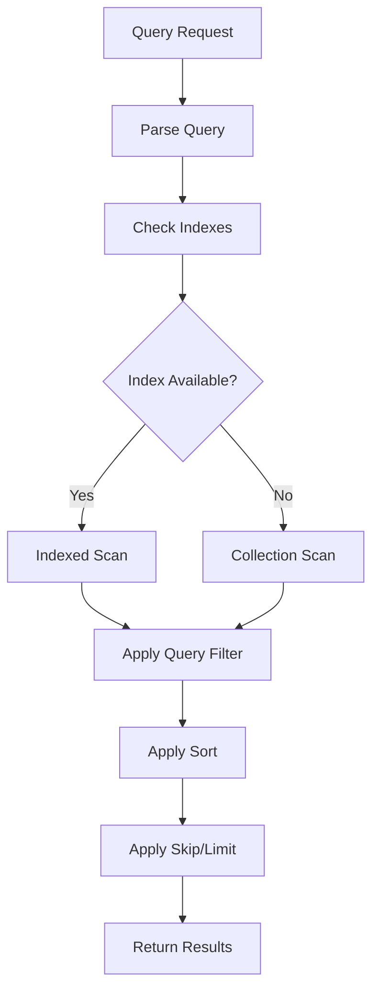

# MongoDB Query Syntax

MongoDB provides a powerful and flexible query language that allows you to search and manipulate data in your collections. In this guide, we'll explore the fundamentals of MongoDB query syntax to help you effectively retrieve and filter data in your MongoDB databases.

## Introduction to MongoDB Query Language

MongoDB uses a JSON-like query language called MongoDB Query Language (MQL). Unlike SQL databases that use structured query language, MongoDB's query syntax is based on documents and reflects the structure of the data being stored.

The basic syntax for querying documents in MongoDB follows this pattern:

```javascript
db.collection.find(query, projection)
```

Where:
- `db.collection` refers to your database and collection
- `find()` is the method to retrieve documents
- `query` (optional) contains the selection criteria
- `projection` (optional) specifies which fields to return

## Basic Query Operations

### Finding All Documents

To retrieve all documents in a collection:

```javascript
db.users.find()
```

This will return all documents in the `users` collection.

### Finding the First Document

If you only want to retrieve a single document that matches your query:

```javascript
db.users.find().limit(1)
// OR
db.users.findOne()
```

### Formatting Query Results

To display results in a more readable format:

```javascript
db.users.find().pretty()
```

## Querying with Specific Criteria

### Equality Conditions

To find documents that match a specific field value:

```javascript
db.users.find({ username: "john_doe" })
```

**Output:**
```json
{
  "_id": ObjectId("60d21b4667d0d8992e610c85"),
  "username": "john_doe",
  "email": "john@example.com",
  "age": 28
}
```

### Comparison Query Operators

MongoDB provides various operators for comparison operations:

| Operator | Description                |
|----------|----------------------------|
| `$eq`    | Equal to                   |
| `$ne`    | Not equal to               |
| `$gt`    | Greater than               |
| `$gte`   | Greater than or equal to   |
| `$lt`    | Less than                  |
| `$lte`   | Less than or equal to      |
| `$in`    | Matches any value in array |
| `$nin`   | Doesn't match any value in array |

Examples:

```javascript
// Find users older than 25
db.users.find({ age: { $gt: 25 } })

// Find users between 18 and 30
db.users.find({ age: { $gte: 18, $lte: 30 } })

// Find users with specific usernames
db.users.find({ username: { $in: ["john_doe", "jane_smith", "bob123"] } })
```

## Logical Operators

MongoDB supports logical operators to combine multiple conditions:

| Operator | Description                       |
|----------|-----------------------------------|
| `$and`   | Joins query clauses with AND      |
| `$or`    | Joins query clauses with OR       |
| `$not`   | Inverts the effect of a query     |
| `$nor`   | Joins query clauses with NOR      |

Examples:

```javascript
// Users who are either under 18 OR over 60
db.users.find({
  $or: [
    { age: { $lt: 18 } },
    { age: { $gt: 60 } }
  ]
})

// Adult users with premium accounts
db.users.find({
  $and: [
    { age: { $gte: 18 } },
    { accountType: "premium" }
  ]
})
```

### Implicit AND

Multiple conditions in a MongoDB query are implicitly combined with AND:

```javascript
// These two queries are equivalent
db.users.find({ age: { $gte: 18 }, accountType: "premium" })

db.users.find({
  $and: [
    { age: { $gte: 18 } },
    { accountType: "premium" }
  ]
})
```

## Querying Embedded Documents

For nested documents, you can use dot notation to access fields:

```javascript
// Sample document
// {
//   name: "John",
//   address: {
//     city: "New York",
//     zipCode: "10001",
//     country: "USA"
//   }
// }

// Find users in New York
db.users.find({ "address.city": "New York" })
```

## Querying Arrays

### Exact Match

To find documents with an exact array match:

```javascript
// Find documents with exactly these tags in this order
db.articles.find({ tags: ["mongodb", "database", "nosql"] })
```

### Array Element Match

To find documents where the array contains a specific element:

```javascript
// Find articles tagged with "mongodb" (regardless of other tags)
db.articles.find({ tags: "mongodb" })
```

### Array Operators

MongoDB provides operators for more complex array queries:

| Operator | Description                                          |
|----------|------------------------------------------------------|
| `$all`   | Matches arrays with all specified elements           |
| `$size`  | Matches arrays of the specified size                 |
| `$elemMatch` | Matches documents with array elements meeting criteria |

Examples:

```javascript
// Find articles with all three tags (in any order)
db.articles.find({ tags: { $all: ["mongodb", "database", "nosql"] } })

// Find articles with exactly 3 tags
db.articles.find({ tags: { $size: 3 } })

// Find users with at least one comment that has more than 10 likes
db.users.find({
  comments: {
    $elemMatch: {
      text: { $exists: true },
      likes: { $gt: 10 }
    }
  }
})
```

## Query Projection

By default, MongoDB returns all fields in matching documents. You can specify which fields to include or exclude using projection:

```javascript
// Return only username and email fields (plus _id by default)
db.users.find({}, { username: 1, email: 1 })

// Exclude password and sensitive fields
db.users.find({}, { password: 0, ssn: 0 })

// Return only username and email without _id
db.users.find({}, { _id: 0, username: 1, email: 1 })
```

:::note
You cannot mix inclusion (1) and exclusion (0) in the same projection document, except for the `_id` field.
:::

## Regular Expressions

MongoDB supports regex pattern matching using the `$regex` operator:

```javascript
// Find usernames starting with "john"
db.users.find({ username: { $regex: "^john", $options: "i" } })
```

The `$options` parameter can include:
- `i` - case insensitivity
- `m` - multiline matching
- `x` - ignore whitespace in regex pattern
- `s` - allows dot to match newline characters

## Querying by Document ID

MongoDB's `_id` field provides a unique identifier for each document:

```javascript
// Find a document by its ObjectId
db.users.find({ _id: ObjectId("60d21b4667d0d8992e610c85") })
```

## Limiting, Skipping, and Sorting Results

### Limiting Results

To limit the number of returned documents:

```javascript
// Return only 5 users
db.users.find().limit(5)
```

### Skipping Results

To skip a certain number of documents (useful for pagination):

```javascript
// Skip the first 20 results and return the next 10
db.users.find().skip(20).limit(10)
```

### Sorting Results

To sort results by specific fields:

```javascript
// Sort users by age (ascending)
db.users.find().sort({ age: 1 })

// Sort users by registration date (descending) and then name (ascending)
db.users.find().sort({ registrationDate: -1, name: 1 })
```

Sort values:
- `1` for ascending order
- `-1` for descending order

## Real-World Examples

### Example 1: E-Commerce Product Search

Imagine you have an e-commerce application with a products collection:

```javascript
// Find in-stock products in the "electronics" category with price between $100 and $500
db.products.find({
  category: "electronics",
  price: { $gte: 100, $lte: 500 },
  inStock: true
}).sort({ rating: -1 })
```

### Example 2: Blog Post Filtering

For a blog application with posts and comments:

```javascript
// Find published blog posts with the tag "mongodb" and at least 5 comments
db.posts.find({
  status: "published",
  tags: "mongodb",
  commentsCount: { $gte: 5 }
}).sort({ publishDate: -1 }).limit(10)
```

### Example 3: User Analytics

For user analytics and segmentation:

```javascript
// Find active premium users who haven't logged in for the past 30 days
const thirtyDaysAgo = new Date();
thirtyDaysAgo.setDate(thirtyDaysAgo.getDate() - 30);

db.users.find({
  accountType: "premium",
  status: "active",
  lastLogin: { $lt: thirtyDaysAgo }
}).sort({ lastLogin: 1 })
```

## MongoDB Query Flow

The overall process of MongoDB query evaluation can be visualized as:



## Summary

In this guide, we've covered the fundamental aspects of MongoDB's query syntax:

- Basic query structure using `find()`
- Comparison and logical operators for filtering
- Querying embedded documents and arrays
- Projection to control returned fields
- Result manipulation with sorting, limiting, and skipping
- Real-world query examples

MongoDB's query language is powerful and flexible, allowing you to craft complex queries that match your application's needs. As you become more familiar with these patterns, you'll be able to efficiently retrieve exactly the data you need from your collections.

## Additional Resources

To further develop your MongoDB query skills:

- Practice building and optimizing queries for different data structures
- Learn about query performance and indexing strategies
- Explore MongoDB aggregation pipeline for more advanced data processing

## Exercises

1. Write a query to find all users between ages 25 and 40 who live in either "New York" or "San Francisco"
2. Create a query to find blog posts that have the tags "mongodb" and "database" with more than 10 comments
3. Write a query to find products that are low in stock (less than 5 items) and have a high popularity rating (greater than 8)
4. Design a query to find active premium users who registered in the last 3 months

After practicing these exercises, you'll have a stronger grasp of MongoDB's query capabilities and how to apply them to real-world problems.