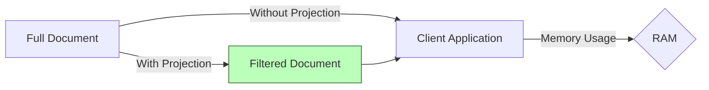

# MongoDB Projection

In MongoDB, when you query a collection, by default, all fields of the documents matching your query criteria are returned. However, in many real-world scenarios, you may only need specific fields from these documents. This is where **projection** comes in - a powerful feature that allows you to control which fields are returned in query results.

## What is Projection?

Projection in MongoDB is like using a filter on your query results. It lets you specify which fields to include or exclude from the returned documents, thereby:

- Reducing network overhead by transferring less data
- Decreasing memory usage in your application
- Improving overall performance of your application
- Making your code more maintainable by focusing on relevant data

## Basic Syntax

Projection is specified as the second parameter in the `find()` method:

```javascript
db.collection.find(query, projection)
```

Where:
- `query`: The selection criteria for the query (first parameter)
- `projection`: The specification of fields to include or exclude (second parameter)

## Including Fields

To include specific fields, set their value to `1` in the projection document:

```javascript
db.users.find({}, { name: 1, email: 1 })
```

This query will return only the `name` and `email` fields, along with the `_id` field (which is included by default).

### Example Input and Output

Input:
```javascript
// Sample collection data
db.users.insertMany([
  { name: "Alice", email: "alice@example.com", age: 28, city: "New York" },
  { name: "Bob", email: "bob@example.com", age: 34, city: "Boston" }
])

// Query with projection
db.users.find({}, { name: 1, email: 1 })
```

Output:
```javascript
[
  { "_id": ObjectId("..."), "name": "Alice", "email": "alice@example.com" },
  { "_id": ObjectId("..."), "name": "Bob", "email": "bob@example.com" }
]
```

## Excluding Fields

To exclude specific fields, set their value to `0` in the projection document:

```javascript
db.users.find({}, { age: 0, city: 0 })
```

This query will return all fields except for `age` and `city`.

### Example Input and Output

Input:
```javascript
// Query with exclusion projection
db.users.find({}, { age: 0, city: 0 })
```

Output:
```javascript
[
  { "_id": ObjectId("..."), "name": "Alice", "email": "alice@example.com" },
  { "_id": ObjectId("..."), "name": "Bob", "email": "bob@example.com" }
]
```

## Excluding the _id Field

The `_id` field is included by default when using projection. To exclude it, you must explicitly set it to `0`:

```javascript
db.users.find({}, { name: 1, email: 1, _id: 0 })
```

### Example Input and Output

Input:
```javascript
db.users.find({}, { name: 1, email: 1, _id: 0 })
```

Output:
```javascript
[
  { "name": "Alice", "email": "alice@example.com" },
  { "name": "Bob", "email": "bob@example.com" }
]
```

## Important Rules

1. **You cannot mix inclusion and exclusion** in the same projection document, except for the `_id` field. This means you can't do:

```javascript
// This will cause an error
db.users.find({}, { name: 1, age: 0 })
```

2. In inclusion mode (using `1`), only the specified fields plus `_id` are returned.
3. In exclusion mode (using `0`), all fields except the specified ones are returned.

## Projection in Nested Documents

MongoDB projection also works with nested documents and arrays. To access nested fields, use dot notation:

```javascript
db.students.find({}, { "name": 1, "grades.math": 1 })
```

### Example with Nested Documents

Input:
```javascript
// Sample nested document
db.students.insertMany([
  { 
    name: "Alice", 
    grades: { 
      math: 90, 
      science: 85, 
      history: 78 
    },
    hobbies: ["reading", "swimming"]
  },
  { 
    name: "Bob", 
    grades: { 
      math: 76, 
      science: 92, 
      history: 88 
    },
    hobbies: ["gaming", "basketball"]
  }
])

// Query with projection on nested fields
db.students.find({}, { name: 1, "grades.math": 1 })
```

Output:
```javascript
[
  { "_id": ObjectId("..."), "name": "Alice", "grades": { "math": 90 } },
  { "_id": ObjectId("..."), "name": "Bob", "grades": { "math": 76 } }
]
```

## Projection in Arrays: The $slice Operator

For array fields, you can use the `$slice` operator to control how many elements are returned:

```javascript
db.students.find({}, { name: 1, hobbies: { $slice: 1 } })
```

This returns only the first element of the `hobbies` array for each document.

### Example Using $slice

Input:
```javascript
// Query to get only the first hobby
db.students.find({}, { name: 1, hobbies: { $slice: 1 } })
```

Output:
```javascript
[
  { "_id": ObjectId("..."), "name": "Alice", "hobbies": ["reading"] },
  { "_id": ObjectId("..."), "name": "Bob", "hobbies": ["gaming"] }
]
```

You can also specify a range with `$slice`:

```javascript
// Get 2 elements starting from position 1 (zero-based index)
db.students.find({}, { name: 1, hobbies: { $slice: [1, 2] } })
```

## Projection with Aggregation Framework

For more advanced projections, MongoDB offers the Aggregation Framework with the `$project` stage:

```javascript
db.users.aggregate([
  { $match: { age: { $gt: 25 } } },
  { $project: { 
      name: 1, 
      email: 1, 
      isAdult: { $gte: ["$age", 18] }
  }}
])
```

This query not only projects `name` and `email` fields but also creates a new computed field `isAdult` that evaluates to a boolean.

### Example with Aggregation

Input:
```javascript
db.users.aggregate([
  { $project: { 
      name: 1,
      firstInitial: { $substr: ["$name", 0, 1] },
      emailDomain: { $arrayElemAt: [{ $split: ["$email", "@"] }, 1] }
  }}
])
```

Output:
```javascript
[
  { "_id": ObjectId("..."), "name": "Alice", "firstInitial": "A", "emailDomain": "example.com" },
  { "_id": ObjectId("..."), "name": "Bob", "firstInitial": "B", "emailDomain": "example.com" }
]
```

## Real-World Example: User Dashboard

Let's create a more realistic example of how projection can be used in a web application user dashboard:

```javascript
// Query to retrieve only necessary user information for a dashboard
db.users.find(
  { active: true }, 
  { 
    name: 1,
    email: 1, 
    profileImage: 1,
    lastLogin: 1,
    notifications: { $slice: -5 }, // Only the 5 most recent notifications
    _id: 0
  }
)
```

This query:
1. Filters for active users
2. Returns only the fields needed for the dashboard
3. Limits notifications to just the 5 most recent ones
4. Excludes the _id field to reduce data size

## Performance Benefits

Projection can significantly improve performance, especially when:

1. **Documents are large** - Retrieving fewer fields means less data transfer
2. **Reading over a network** - Reduces latency when MongoDB is hosted remotely
3. **Working with high-volume collections** - Memory usage is optimized



## When to Use Projection

- **DO** use projection whenever you don't need all fields in a document
- **DO** use it when working with large documents to optimize performance
- **DO** use it when creating APIs where clients might need specific fields
- **DON'T** use mixed inclusion and exclusion (except with _id)
- **CONSIDER** the aggregation framework for more complex transformations

## Summary

MongoDB projection is a powerful feature that allows you to:

- Selectively include or exclude fields from query results
- Reduce network bandwidth and memory usage
- Work efficiently with nested documents and arrays
- Create more focused and efficient queries

By mastering projection, you can make your MongoDB applications more efficient and responsive, especially when dealing with large documents or high-volume collections.

## Exercises

1. Write a query that returns only the title and publication year of all books in a collection.
2. Create a projection that returns user documents without sensitive information like passwords and personal identification.
3. Use the `$slice` operator to return only the 3 most recent comments from a blog post document.
4. Write an aggregation query that projects user names in all uppercase and calculates their membership duration in days.

## Additional Resources

- [MongoDB Documentation on Projection](https://www.mongodb.com/docs/manual/tutorial/project-fields-from-query-results/)
- [MongoDB Aggregation Pipeline](https://www.mongodb.com/docs/manual/core/aggregation-pipeline/)
- [Query Optimization Best Practices](https://www.mongodb.com/docs/manual/core/query-optimization/)