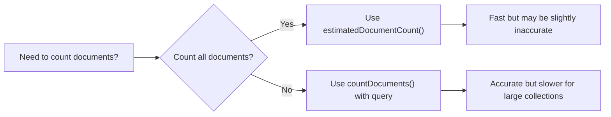

# MongoDB Count Operations

## Introduction

Counting documents is a fundamental operation when working with databases. Whether you need to know the total number of users in your system, how many products are out of stock, or how many blog posts were published last month, the ability to count documents is essential.

MongoDB provides several methods to count documents in a collection. In this guide, we'll explore different counting methods, their syntax, use cases, and when to use each one.

## Basic Count Operations

### The count() Method (Deprecated)

The `count()` method was the original way to count documents in MongoDB but has been deprecated since MongoDB 4.0. It's still available for compatibility reasons, but you should avoid using it in new applications.

```javascript
// Deprecated count() method
db.collection.count(query, options)
```

### The countDocuments() Method

The `countDocuments()` method is the recommended way to count documents that match a specific query.

```javascript
db.collection.countDocuments(query, options)
```

### The estimatedDocumentCount() Method

The `estimatedDocumentCount()` method is optimized for counting all documents in a collection.

```javascript
db.collection.estimatedDocumentCount(options)
```

## Counting All Documents in a Collection

Let's start with the simplest case: counting all documents in a collection.

### Using countDocuments()

```javascript
// Count all documents in a collection
db.products.countDocuments({})

// Output: 1000 (The total number of documents in the products collection)
```

### Using estimatedDocumentCount()

```javascript
// Get an estimated count of all documents in a collection
db.products.estimatedDocumentCount()

// Output: 1000 (The total number of documents in the products collection)
```

:::tip
For counting all documents in a collection, `estimatedDocumentCount()` is more efficient than `countDocuments({})` because it uses collection metadata instead of scanning documents.
:::

## Counting Documents with Query Conditions

To count documents that match specific criteria, use the `countDocuments()` method with a query document.

### Count with Simple Queries

```javascript
// Count products with price greater than 50
db.products.countDocuments({ price: { $gt: 50 } })

// Output: 285 (Number of products with price greater than 50)

// Count active users
db.users.countDocuments({ status: "active" })

// Output: 750 (Number of active users)

// Count inactive users
db.users.countDocuments({ status: "inactive" })

// Output: 250 (Number of inactive users)
```

### Count with Multiple Conditions

```javascript
// Count electronics that are in stock
db.products.countDocuments({ 
  category: "electronics", 
  inStock: true 
})

// Output: 125 (Number of electronics products in stock)

// Count premium users who joined after 2022
db.users.countDocuments({ 
  userType: "premium",
  joinDate: { $gt: new Date("2022-01-01") }
})

// Output: 87 (Number of premium users who joined after Jan 1, 2022)
```

## Advanced Counting Techniques

### Using Logical Operators

MongoDB supports logical operators like `$and`, `$or`, `$not`, and `$nor` in count queries.

```javascript
// Count products that are either electronics OR price > 100
db.products.countDocuments({
  $or: [
    { category: "electronics" },
    { price: { $gt: 100 } }
  ]
})

// Output: 350 (Number of products that are either electronics or priced above 100)

// Count users who are both premium AND active
db.users.countDocuments({
  $and: [
    { userType: "premium" },
    { status: "active" }
  ]
})

// Output: 175 (Number of users who are both premium and active)
```

### Counting with Array Fields

MongoDB provides operators like `$size`, `$all`, `$elemMatch` for working with arrays.

```javascript
// Count products with exactly 3 tags
db.products.countDocuments({ tags: { $size: 3 } })

// Output: 72 (Number of products with exactly 3 tags)

// Count products that have both "bestseller" and "discount" tags
db.products.countDocuments({
  tags: { $all: ["bestseller", "discount"] }
})

// Output: 45 (Number of products tagged as both bestseller and discount)

// Count users who have at least one address in "New York"
db.users.countDocuments({
  addresses: {
    $elemMatch: { city: "New York" }
  }
})

// Output: 210 (Number of users with at least one address in New York)
```

## Performance Considerations

### Indexes and Count Performance

Indexes can significantly improve the performance of count operations, especially when working with large collections.

```javascript
// Create an index to optimize counting by status
db.users.createIndex({ status: 1 })

// Create a compound index to optimize filtering by category and inStock
db.products.createIndex({ category: 1, inStock: 1 })
```

### countDocuments() vs estimatedDocumentCount()

- Use `countDocuments()` when you need to count documents matching specific criteria.
- Use `estimatedDocumentCount()` when you need to count all documents in a collection, as it's more efficient for this use case.



## Real-World Applications

### Pagination

Count operations are essential for implementing pagination in applications:

```javascript
const pageSize = 10;
const pageNumber = 2; // 2nd page
const skip = pageSize * (pageNumber - 1);

// Get total count for pagination
const totalProducts = await db.products.countDocuments({ category: "electronics" });
const totalPages = Math.ceil(totalProducts / pageSize);

// Get products for the current page
const products = await db.products.find({ category: "electronics" })
  .skip(skip)
  .limit(pageSize)
  .toArray();

// Output object for API response
const result = {
  products,
  pagination: {
    currentPage: pageNumber,
    totalPages,
    totalItems: totalProducts,
    pageSize
  }
}

// Output:
// {
//   products: [...], // 10 electronics products
//   pagination: {
//     currentPage: 2,
//     totalPages: 25,
//     totalItems: 250,
//     pageSize: 10
//   }
// }
```

### Analytics Dashboard

Count operations can power analytics dashboards:

```javascript
// Get product statistics for a dashboard
async function getProductStats() {
  const totalProducts = await db.products.countDocuments({});
  const inStockProducts = await db.products.countDocuments({ inStock: true });
  const lowStockProducts = await db.products.countDocuments({ 
    inStock: true, 
    stockCount: { $lt: 10 } 
  });
  
  const categoryStats = await db.products.aggregate([
    { $group: { _id: "$category", count: { $sum: 1 } } },
    { $sort: { count: -1 } }
  ]).toArray();
  
  return {
    totalProducts,
    inStockProducts,
    lowStockProducts,
    categoryStats
  };
}

// Output:
// {
//   totalProducts: 1000,
//   inStockProducts: 875,
//   lowStockProducts: 42,
//   categoryStats: [
//     { _id: "electronics", count: 250 },
//     { _id: "clothing", count: 200 },
//     { _id: "books", count: 180 },
//     ...
//   ]
// }
```

### User Activity Monitoring

Count operations can help track user activity statistics:

```javascript
// Get user activity statistics
async function getUserActivityStats() {
  const now = new Date();
  const oneDayAgo = new Date(now - 24 * 60 * 60 * 1000);
  const oneWeekAgo = new Date(now - 7 * 24 * 60 * 60 * 1000);
  
  const totalUsers = await db.users.countDocuments({});
  const activeToday = await db.users.countDocuments({
    lastLoginDate: { $gte: oneDayAgo }
  });
  const activeThisWeek = await db.users.countDocuments({
    lastLoginDate: { $gte: oneWeekAgo }
  });
  const premiumUsers = await db.users.countDocuments({
    userType: "premium"
  });
  
  return {
    totalUsers,
    activeToday,
    activeThisWeek,
    premiumUsers,
    activeTodayPercentage: (activeToday / totalUsers * 100).toFixed(2) + "%",
    premiumPercentage: (premiumUsers / totalUsers * 100).toFixed(2) + "%"
  };
}

// Output:
// {
//   totalUsers: 1000,
//   activeToday: 250,
//   activeThisWeek: 650,
//   premiumUsers: 200,
//   activeTodayPercentage: "25.00%",
//   premiumPercentage: "20.00%"
// }
```

## Summary

In this guide, we've explored MongoDB's counting methods:

1. `countDocuments()` - The recommended method for counting documents that match a specific query
2. `estimatedDocumentCount()` - The efficient method for counting all documents in a collection
3. `count()` - The deprecated method that should be avoided in new applications

We've also covered:
- How to count documents with various query conditions
- Advanced counting techniques with logical operators and array operators
- Performance considerations and the importance of indexes
- Real-world applications of count operations in pagination, analytics, and monitoring

## Additional Resources and Exercises

### Practice Exercises

1. **Basic Counting**: Create a collection of books and practice counting:
   - Count all books
   - Count books by a specific author
   - Count books published after 2020

2. **Advanced Filtering**: Create a products collection and practice:
   - Count products in a specific price range
   - Count products with specific tags
   - Count products that match multiple criteria

3. **Performance Testing**: Create a large collection and compare performance:
   - Time the execution of `countDocuments({})` vs `estimatedDocumentCount()`
   - Test the impact of indexes on count queries

### Further Reading

- [MongoDB Documentation on countDocuments()](https://www.mongodb.com/docs/manual/reference/method/db.collection.countDocuments/)
- [MongoDB Documentation on estimatedDocumentCount()](https://www.mongodb.com/docs/manual/reference/method/db.collection.estimatedDocumentCount/)
- [MongoDB Query Operators](https://www.mongodb.com/docs/manual/reference/operator/query/)
- [MongoDB Indexes](https://www.mongodb.com/docs/manual/indexes/)

By mastering MongoDB count operations, you'll be able to efficiently retrieve valuable insights from your data and build more responsive applications.