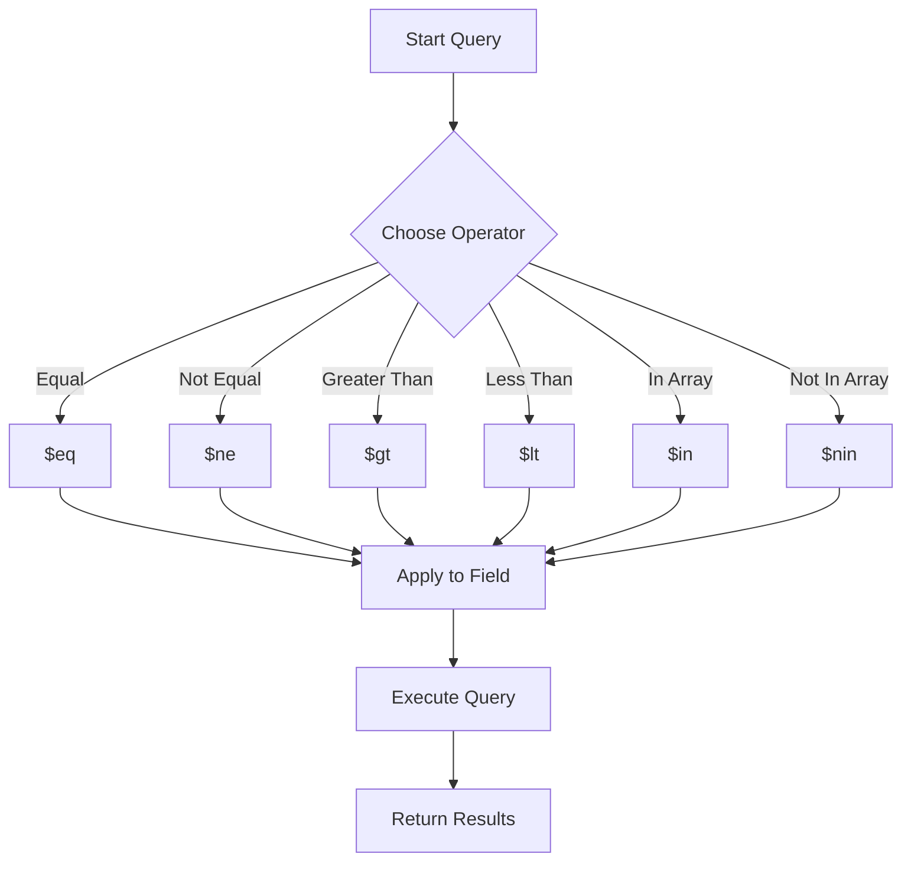

# MongoDB Comparison Operators

## Introduction

When querying documents in MongoDB, you often need to filter data based on certain conditions, such as finding values that are greater than, less than, or equal to specific values. This is where MongoDB comparison operators come into play.

Comparison operators allow you to specify conditions for comparing values. They form a fundamental part of MongoDB queries, enabling you to extract precisely the documents you need from your collections.

In this tutorial, we'll explore the various comparison operators available in MongoDB, understand their syntax, and see how they can be applied in real-world scenarios.

## Basic Syntax

MongoDB comparison operators are used within the query document and have the following general syntax:

```javascript
{ field: { $operator: value } }
```

Where:
- `field` is the document field you want to evaluate
- `$operator` is the comparison operator you want to use
- `value` is what you want to compare the field against

## Common Comparison Operators

MongoDB provides several comparison operators to facilitate different types of value comparisons. Let's explore each of them:

### 1. `$eq` - Equal to

The `$eq` operator matches documents where the field value equals the specified value.

**Syntax:**
```javascript
{ field: { $eq: value } }
```

**Simplified syntax:**
```javascript
{ field: value }
```

**Example:**
Let's find all students who scored exactly 90 in their exam:

```javascript
db.students.find({ score: { $eq: 90 } })

// Simplified version
db.students.find({ score: 90 })
```

**Output:**
```javascript
[
  { "_id": ObjectId("..."), "name": "Alice", "score": 90 },
  { "_id": ObjectId("..."), "name": "Bob", "score": 90 }
]
```

### 2. `$ne` - Not equal to

The `$ne` operator selects documents where the field value is not equal to the specified value.

**Syntax:**
```javascript
{ field: { $ne: value } }
```

**Example:**
Find all products except those priced at $25:

```javascript
db.products.find({ price: { $ne: 25 } })
```

**Output:**
```javascript
[
  { "_id": ObjectId("..."), "name": "Keyboard", "price": 45 },
  { "_id": ObjectId("..."), "name": "Monitor", "price": 150 },
  { "_id": ObjectId("..."), "name": "Mouse", "price": 15 }
]
```

### 3. `$gt` - Greater than

The `$gt` operator selects documents where the field value is greater than the specified value.

**Syntax:**
```javascript
{ field: { $gt: value } }
```

**Example:**
Find all products priced over $50:

```javascript
db.products.find({ price: { $gt: 50 } })
```

**Output:**
```javascript
[
  { "_id": ObjectId("..."), "name": "Monitor", "price": 150 },
  { "_id": ObjectId("..."), "name": "Printer", "price": 120 },
  { "_id": ObjectId("..."), "name": "Webcam", "price": 60 }
]
```

### 4. `$gte` - Greater than or equal to

The `$gte` operator selects documents where the field value is greater than or equal to the specified value.

**Syntax:**
```javascript
{ field: { $gte: value } }
```

**Example:**
Find all students who scored 75 or higher:

```javascript
db.students.find({ score: { $gte: 75 } })
```

**Output:**
```javascript
[
  { "_id": ObjectId("..."), "name": "Alice", "score": 90 },
  { "_id": ObjectId("..."), "name": "Bob", "score": 90 },
  { "_id": ObjectId("..."), "name": "Charlie", "score": 75 }
]
```

### 5. `$lt` - Less than

The `$lt` operator selects documents where the field value is less than the specified value.

**Syntax:**
```javascript
{ field: { $lt: value } }
```

**Example:**
Find all products priced under $30:

```javascript
db.products.find({ price: { $lt: 30 } })
```

**Output:**
```javascript
[
  { "_id": ObjectId("..."), "name": "Mouse", "price": 15 },
  { "_id": ObjectId("..."), "name": "USB Cable", "price": 8 }
]
```

### 6. `$lte` - Less than or equal to

The `$lte` operator selects documents where the field value is less than or equal to the specified value.

**Syntax:**
```javascript
{ field: { $lte: value } }
```

**Example:**
Find all students who scored 70 or below:

```javascript
db.students.find({ score: { $lte: 70 } })
```

**Output:**
```javascript
[
  { "_id": ObjectId("..."), "name": "Dave", "score": 65 },
  { "_id": ObjectId("..."), "name": "Eve", "score": 70 }
]
```

### 7. `$in` - In an array

The `$in` operator selects documents where the field value equals any value in the specified array.

**Syntax:**
```javascript
{ field: { $in: [value1, value2, ...] } }
```

**Example:**
Find all products that are either keyboards, mice, or monitors:

```javascript
db.products.find({ category: { $in: ["keyboard", "mouse", "monitor"] } })
```

**Output:**
```javascript
[
  { "_id": ObjectId("..."), "name": "Wireless Keyboard", "category": "keyboard", "price": 45 },
  { "_id": ObjectId("..."), "name": "Gaming Mouse", "category": "mouse", "price": 35 },
  { "_id": ObjectId("..."), "name": "LCD Monitor", "category": "monitor", "price": 150 }
]
```

### 8. `$nin` - Not in an array

The `$nin` operator selects documents where the field value is not in the specified array or the field does not exist.

**Syntax:**
```javascript
{ field: { $nin: [value1, value2, ...] } }
```

**Example:**
Find all products that are not keyboards, mice, or monitors:

```javascript
db.products.find({ category: { $nin: ["keyboard", "mouse", "monitor"] } })
```

**Output:**
```javascript
[
  { "_id": ObjectId("..."), "name": "Webcam", "category": "camera", "price": 60 },
  { "_id": ObjectId("..."), "name": "USB Hub", "category": "accessory", "price": 25 }
]
```

## Combining Comparison Operators

You can combine multiple comparison operators to create more complex queries:

**Example:** Find products priced between $20 and $100:

```javascript
db.products.find({
  price: {
    $gte: 20,
    $lte: 100
  }
})
```

**Output:**
```javascript
[
  { "_id": ObjectId("..."), "name": "Keyboard", "price": 45 },
  { "_id": ObjectId("..."), "name": "Gaming Mouse", "price": 35 },
  { "_id": ObjectId("..."), "name": "USB Hub", "price": 25 },
  { "_id": ObjectId("..."), "name": "Webcam", "price": 60 }
]
```

## Real-World Applications

### E-commerce Product Filtering

One common application of comparison operators is in e-commerce websites for product filtering:

```javascript
// Find products in a specific price range
db.products.find({
  category: "laptop",
  price: {
    $gte: 500,
    $lte: 1200
  },
  rating: { $gte: 4.0 }
})
```

### Date Range Queries

Comparison operators are useful for querying data within date ranges:

```javascript
// Find orders placed in the last 30 days
const thirtyDaysAgo = new Date();
thirtyDaysAgo.setDate(thirtyDaysAgo.getDate() - 30);

db.orders.find({
  orderDate: {
    $gte: thirtyDaysAgo,
    $lte: new Date()
  }
})
```

### Dashboard Analytics

For analytics dashboards, you may need to identify outliers or anomalies:

```javascript
// Find transactions that are unusually large
db.transactions.find({
  amount: { $gt: 10000 }
})

// Find users with login activity outside normal hours
db.logins.find({
  "time.hour": { $lt: 6, $gt: 22 }
})
```

## Comparison Operators with Array Fields

When used with array fields, comparison operators have special behavior:

```javascript
// Sample document
// { "_id": 1, "scores": [85, 90, 78] }

// Find documents where any array element meets the condition
db.students.find({ scores: { $gt: 80 } })
// Returns the document because 85 and 90 are > 80

// Find documents where ALL array elements match the condition
db.students.find({ 
  scores: { $elemMatch: { $gt: 80 } } 
})
```

## Flow Diagram of Comparison Operator Usage

Here's a simplified flow diagram of how the comparison operators work in a MongoDB query:



## Summary

MongoDB comparison operators are powerful tools for filtering documents based on specific conditions:

- `$eq`: Equal to
- `$ne`: Not equal to
- `$gt`: Greater than
- `$gte`: Greater than or equal to
- `$lt`: Less than
- `$lte`: Less than or equal to
- `$in`: In an array of values
- `$nin`: Not in an array of values

These operators can be combined to create complex queries and work across various data types including numbers, strings, dates, and arrays.

## Additional Resources and Exercises

### Exercises

1. Create a collection of `users` with fields for `name`, `age`, `membership` (basic/premium), and `lastLogin` (date).
   
2. Write a query to find all premium users over 30 years old.
   
3. Write a query to find users who have not logged in within the last 7 days.
   
4. Create a query that finds users who are either under 25 or over 60 years old.
   
5. Write a query to find premium users who have logged in between two specific dates.

### Further Reading

- [MongoDB Query Operators Documentation](https://www.mongodb.com/docs/manual/reference/operator/query/)
- [MongoDB Query and Projection Operators](https://www.mongodb.com/docs/manual/reference/operator/query-comparison/)

By mastering comparison operators, you'll have the foundation for writing powerful and precise MongoDB queries, allowing you to efficiently extract exactly the data you need from your collections.