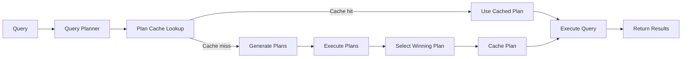

# MongoDB Query Planning

MongoDB's query planner is a critical component that determines how your database executes queries. Understanding how it works can help you write more efficient queries and troubleshoot performance issues. This guide will walk you through the fundamentals of MongoDB query planning and how to optimize your queries for better performance.

## Introduction to Query Planning

When you send a query to MongoDB, the database doesn't immediately retrieve the data. Instead, it first analyzes the query and creates an execution plan that determines the most efficient way to retrieve the requested data. This process is known as **query planning**.



The query planner is responsible for:
1. Determining which indexes (if any) to use
2. Deciding how to navigate those indexes
3. Choosing how to access and return the documents

## The Query Optimization Process

### Step 1: Query Analysis

When MongoDB receives a query, it first analyzes the query structure to understand what data needs to be retrieved and what conditions need to be met.

For example, let's consider a simple query:

```javascript
db.products.find({ category: "electronics", price: { $lt: 500 } })
```

MongoDB needs to find all documents in the `products` collection where the `category` field equals "electronics" and the `price` field is less than 500.

### Step 2: Plan Generation

After analyzing the query, MongoDB generates one or more candidate query plans. Each plan represents a different approach to executing the query, often using different indexes or combinations of indexes.

### Step 3: Plan Selection and Execution

MongoDB uses an empirical approach to select the best plan:

1. **Trial Period**: MongoDB executes each candidate plan for a small subset of data
2. **Performance Measurement**: It measures the performance of each plan
3. **Winner Selection**: The plan that returns results most efficiently is selected as the "winning plan"
4. **Plan Caching**: The winning plan is stored in the plan cache for future similar queries

## Exploring Query Plans with `explain()`

MongoDB provides the `explain()` method to help you understand how your queries are executed. This powerful tool shows you the query plan selected by MongoDB.

### Basic Usage

```javascript
db.products.find({ category: "electronics", price: { $lt: 500 } }).explain()
```

### Verbosity Modes

`explain()` supports different verbosity modes:

```javascript
// Default mode - queryPlanner
db.products.find(...).explain()

// Execution statistics
db.products.find(...).explain("executionStats")

// All plans execution statistics
db.products.find(...).explain("allPlansExecution")
```

### Understanding Explain Output

Let's look at a sample explain output:

```javascript
db.products.find({ category: "electronics", price: { $lt: 500 } }).explain("executionStats")
```

Output:

```javascript
{
  "queryPlanner": {
    "plannerVersion": 1,
    "namespace": "store.products",
    "indexFilterSet": false,
    "parsedQuery": {
      "$and": [
        { "category": { "$eq": "electronics" } },
        { "price": { "$lt": 500 } }
      ]
    },
    "winningPlan": {
      "stage": "FETCH",
      "inputStage": {
        "stage": "IXSCAN",
        "keyPattern": { "category": 1, "price": 1 },
        "indexName": "category_1_price_1",
        "direction": "forward",
        "indexBounds": {
          "category": ["[\"electronics\", \"electronics\"]"],
          "price": ["[-Infinity, 500)"]
        }
      }
    },
    "rejectedPlans": [/* ... */]
  },
  "executionStats": {
    "executionSuccess": true,
    "nReturned": 42,
    "executionTimeMillis": 5,
    "totalKeysExamined": 42,
    "totalDocsExamined": 42,
    "executionStages": {/* ... */}
  },
  "serverInfo": {/* ... */}
}
```

Key parts to focus on:
- **winningPlan**: Shows the execution plan MongoDB selected
- **stage**: Indicates the type of operation (FETCH, IXSCAN, COLLSCAN, etc.)
- **nReturned**: Number of documents returned
- **totalKeysExamined**: Number of index entries examined
- **totalDocsExamined**: Number of documents examined

## Common Query Stages

Understanding the different stages in a query plan helps you identify potential performance issues:

1. **COLLSCAN**: Collection scan - examines every document in a collection (typically slow for large collections)
2. **IXSCAN**: Index scan - uses an index to find matching documents (typically faster)
3. **FETCH**: Retrieves documents identified by a previous stage
4. **SORT**: Sorts results in memory (can be expensive if not using an index)
5. **LIMIT**: Limits the number of documents returned
6. **SKIP**: Skips a specified number of documents

## The Query Plan Cache

MongoDB maintains a cache of query plans for recently executed queries. This cache improves performance by avoiding the need to recompute the optimal plan for identical queries.

### Viewing the Plan Cache

```javascript
db.products.getPlanCache().list()
```

### Clearing the Plan Cache

```javascript
// Clear cache for a specific query
db.products.getPlanCache().clearPlansByQuery({ category: "electronics" })

// Clear entire plan cache for a collection
db.products.getPlanCache().clear()
```

## Real-World Query Optimization Example

Let's walk through optimizing a slow query in a real-world scenario.

### Scenario: E-commerce Product Search

Imagine you have a products collection with millions of documents:

```javascript
// Sample document
{
  "_id": ObjectId("5f8d0e3e1c9d440000f7e45c"),
  "name": "Ultra HD Smart TV",
  "category": "electronics",
  "subcategory": "televisions",
  "price": 699.99,
  "brand": "TechVision",
  "inStock": true,
  "tags": ["smart tv", "ultra hd", "wifi enabled"]
}
```

### Problem Query

Users need to search for products by category, price range, and in-stock status:

```javascript
db.products.find({
  category: "electronics",
  subcategory: "televisions",
  price: { $gte: 500, $lte: 1000 },
  inStock: true
})
```

### Step 1: Analyze the Current Performance

First, let's use `explain()` to see how MongoDB is executing this query:

```javascript
db.products.find({
  category: "electronics",
  subcategory: "televisions",
  price: { $gte: 500, $lte: 1000 },
  inStock: true
}).explain("executionStats")
```

Assuming the output shows:
- `"stage": "COLLSCAN"`
- `"totalDocsExamined": 2000000`
- `"executionTimeMillis": 500`

This indicates a full collection scan, which is inefficient for a large collection.

### Step 2: Create an Appropriate Index

Based on the query pattern, we can create a compound index:

```javascript
db.products.createIndex({
  category: 1,
  subcategory: 1,
  price: 1,
  inStock: 1
})
```

### Step 3: Verify Improvement

After creating the index, we can run the explain again:

```javascript
db.products.find({
  category: "electronics",
  subcategory: "televisions",
  price: { $gte: 500, $lte: 1000 },
  inStock: true
}).explain("executionStats")
```

Now the output should show:
- `"stage": "FETCH"`
- `"inputStage": { "stage": "IXSCAN", ... }`
- `"totalKeysExamined": 120`
- `"totalDocsExamined": 120`
- `"executionTimeMillis": 5`

This is a significant improvement - examining just 120 documents instead of 2 million!

## Best Practices for Query Planning

1. **Create indexes that match your query patterns**
   - Consider which fields are most commonly used in query conditions
   - Think about the order of fields in compound indexes

2. **Use covered queries when possible**
   - A covered query is one where all fields in the query are part of an index
   - MongoDB can satisfy the query using only the index without examining documents

3. **Be aware of index size trade-offs**
   - Indexes speed up queries but slow down writes and consume storage
   - Don't create indexes you don't need

4. **Monitor query performance regularly**
   - Use MongoDB's Database Profiler
   - Check for queries with high execution times

5. **Review and update your indexes periodically**
   - Query patterns may change as your application evolves
   - Remove unused indexes to improve write performance

## Common Query Planning Challenges

### Problem: Range Queries on Multiple Fields

When your query includes range conditions (`$gt`, `$lt`, etc.) on multiple fields, MongoDB can only use one for an efficient index scan.

```javascript
// This query has range conditions on both price and date
db.products.find({
  category: "electronics",
  price: { $lt: 500 },
  created: { $gt: ISODate("2023-01-01") }
})
```

**Solution**: Create an index with equality fields first, then the most selective range field:

```javascript
db.products.createIndex({ category: 1, price: 1, created: 1 })
// OR
db.products.createIndex({ category: 1, created: 1, price: 1 })
```

### Problem: Sort Operations Without Indexes

Sorting large result sets without an index can cause performance issues or even fail with a "sort exceeded memory limit" error.

**Solution**: Create an index that supports both the query conditions and sort pattern:

```javascript
// For a query with sort
db.products.find({ category: "electronics" }).sort({ price: -1 })

// Create an index that supports both the query and sort
db.products.createIndex({ category: 1, price: -1 })
```

## Summary

Query planning in MongoDB is a sophisticated process that significantly impacts the performance of your database operations. Understanding how the MongoDB query planner works allows you to:

- Write more efficient queries
- Create appropriate indexes
- Analyze and troubleshoot performance issues
- Make informed decisions about database design

Remember that effective query planning is not a one-time task but an ongoing process that requires monitoring, analysis, and periodic optimization as your application evolves and grows.

## Practice Exercises

1. Create a sample collection with at least 1000 documents and experiment with different query patterns.
2. Use `explain()` to analyze how your queries are executed with and without indexes.
3. Try creating different indexes and observe how they affect query performance.
4. Experiment with covered queries by including only indexed fields in your query projection.
5. Test the performance impact of sorting with and without supporting indexes.

## Additional Resources

- [MongoDB Official Documentation on Query Plans](https://www.mongodb.com/docs/manual/core/query-plans/)
- [Indexing Strategies](https://www.mongodb.com/docs/manual/applications/indexes/)
- [Query Optimization](https://www.mongodb.com/docs/manual/core/query-optimization/)
- [MongoDB University Courses on Performance](https://university.mongodb.com/courses/M201/about)

Understanding query planning is essential for building efficient and scalable applications with MongoDB. With the knowledge gained from this guide, you'll be better equipped to optimize your database queries and provide a better experience for your users.