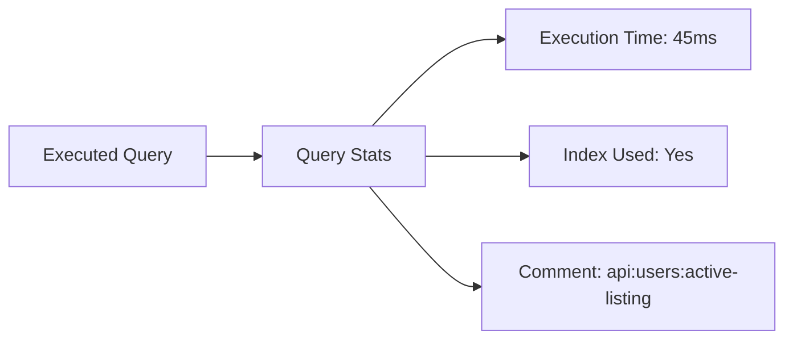

# MongoDB Comment Operator

## Introduction

When working with complex MongoDB queries, especially in production environments, it can be challenging to trace and debug performance issues. The `$comment` operator provides a solution by allowing developers to attach annotations to queries. These annotations don't affect query execution but appear in various MongoDB logs and profiling tools, making it easier to identify and troubleshoot problematic queries.

The `$comment` operator is particularly useful when:
- Debugging performance bottlenecks
- Tracking query usage across applications
- Annotating complex queries for better understanding
- Analyzing query patterns in production systems

## Syntax

The basic syntax for using the `$comment` operator is:

```js
db.collection.find({ <query> }).comment(<string>)
```

Or as part of a query expression:

```js
db.collection.find({
  $query: { <query> },
  $comment: <string>
})
```

## How the $comment Operator Works

When you add a comment to a query:

1. MongoDB executes the query normally (comments don't change query behavior)
2. The comment string gets recorded in query logs and profiling output
3. Monitoring tools that analyze database performance can display these comments

This creates a convenient breadcrumb trail for tracking query performance without modifying actual query logic.

## Basic Usage Examples

### Example 1: Adding a simple comment to a query

```js
db.products.find({ category: "electronics" }).comment("Finding all electronic products")
```

### Example 2: Using $comment with complex queries

```js
db.orders.find({
  $and: [
    { status: "processing" },
    { orderDate: { $gt: new Date("2023-01-01") } }
  ]
}).comment("Finding processing orders from 2023")
```

### Example 3: Using $comment with aggregation framework

```js
db.sales.aggregate([
  { $match: { date: { $gte: new Date("2023-01-01") } } },
  { $group: { _id: "$region", totalSales: { $sum: "$amount" } } },
  { $sort: { totalSales: -1 } }
], { 
  comment: "Regional sales report for 2023"
})
```

## Viewing Comments in Logs and Profiler

To see your comments in action, you can enable MongoDB's profiler:

```js
// Enable profiling for all operations that take longer than 100ms
db.setProfilingLevel(1, 100)

// Or enable profiling for all operations
db.setProfilingLevel(2)
```

After running some commented queries, you can check the system.profile collection:

```js
db.system.profile.find({}, { query: 1, comment: 1, millis: 1 }).sort({ ts: -1 })
```

Output might look like:

```
{
  "query": { "category": "electronics" },
  "comment": "Finding all electronic products",
  "millis": 25
}
```

## Practical Applications

### Application 1: Tracking Query Usage Across Microservices

In a system with multiple services accessing the same database, you can use `$comment` to identify which service is generating specific queries:

```js
db.users.find({ status: "active" })
  .comment("user-service:get-active-users:v2")
```

This helps identify which service might be causing performance issues by using a standard format like `service:operation:version`.

### Application 2: Query Performance Analysis

When optimizing performance, you can mark queries before and after optimization:

```js
// Before adding index
db.orders.find({ 
  customer: "acme-corp",
  status: "pending" 
}).comment("orders-query:without-compound-index")

// Add index
db.orders.createIndex({ customer: 1, status: 1 })

// After adding index
db.orders.find({ 
  customer: "acme-corp",
  status: "pending" 
}).comment("orders-query:with-compound-index")
```

Then you can compare performance in the profiler logs.

### Application 3: Identifying Automated vs. Manual Queries

You can distinguish between queries generated by your application versus ad-hoc queries:

```js
// Application-generated query
db.logs.find({ 
  level: "ERROR",
  timestamp: { $gt: new Date() - 24*60*60*1000 } 
}).comment("monitoring:daily-error-check")

// Manual query (might be run by a developer)
db.logs.find({ 
  level: "ERROR",
  component: "payment-processor" 
}).comment("manual:alice:debugging-payment-issues")
```

## Best Practices

1. **Use consistent naming conventions** - Structure your comments in a way that makes them easily searchable and categorizable.

2. **Include relevant metadata** - Consider including information like:
   - Service/application name
   - Feature/endpoint
   - Developer name (for debugging sessions)
   - Version information

3. **Don't include sensitive data** - Comments might be logged, so avoid including:
   - Personal user information 
   - Authentication details
   - Business-sensitive metrics

4. **Use comments in development** - Even if you don't need them in production, comments help team members understand query purposes.

5. **Consider automated comment injection** - Use middleware or query builders to automatically inject relevant metadata.

## Integration with MongoDB Monitoring Tools

Many MongoDB monitoring tools (like MongoDB Atlas, MongoDB Compass, and third-party solutions) display the `$comment` field in their query analysis interfaces, making it easier to:

- Filter queries by purpose
- Group similar queries together
- Identify problematic query patterns

For example, in MongoDB Compass's Performance tab, you can see comments alongside executed queries:



## Summary

The MongoDB `$comment` operator is a simple yet powerful tool for adding metadata to your queries. While it doesn't affect query execution, it provides valuable context for debugging, performance optimization, and query management. By adopting consistent commenting practices, you can make your database operations more transparent and easier to troubleshoot.

Key points to remember:
- Comments don't affect query execution or results
- Comments appear in profiler output and logs
- Use structured comment formats for better organization
- Avoid including sensitive information in comments
- Comments work with both basic queries and aggregations

## Additional Resources and Exercises

### Resources
- MongoDB Documentation: [Query Operator Reference](https://www.mongodb.com/docs/manual/reference/operator/meta/comment/)
- MongoDB Blog: [Profiling MongoDB Queries](https://www.mongodb.com/blog/post/profiling-mongodb-queries)

### Exercises

1. **Basic Comment Implementation**
   - Add comments to 5 different queries in your application using a consistent naming convention
   - Run the queries and check the system.profile collection to view your comments

2. **Performance Analysis**
   - Choose a slow-running query in your application
   - Add a comment to mark it
   - Add an appropriate index
   - Run the query again with a new comment
   - Compare the execution times using the profiler

3. **Comment Integration**
   - Create a simple middleware function in your application that automatically adds comments to MongoDB queries based on:
     - The current user or service making the request
     - The API endpoint being accessed
     - A timestamp or request ID