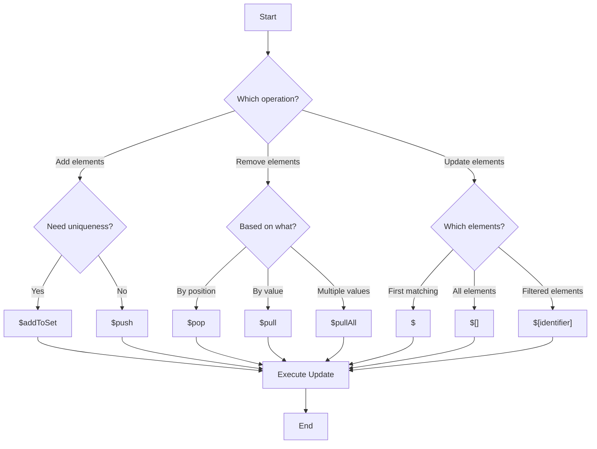

# MongoDB Array Update Operators

Arrays are a fundamental data type in MongoDB that allow you to store lists of values within a single document field. When working with arrays in MongoDB, you'll often need to add, remove, or modify elements within them. MongoDB provides specialized array update operators that make these operations efficient and straightforward.

## Introduction to Array Update Operators

MongoDB's array update operators allow you to:
- Add elements to an array
- Remove elements from an array
- Update specific elements in an array
- Modify arrays based on specific conditions

These operators are especially useful when you need to update array fields without retrieving and sending the entire document back to the server, making them both efficient and convenient.

## Common MongoDB Array Update Operators

Let's explore the most frequently used array update operators in MongoDB:

### 1. `$push` - Adding Elements to an Array

The `$push` operator adds an element to the end of an array.

#### Basic Syntax

```javascript
db.collection.updateOne(
  { <query> },
  { $push: { <field>: <value> } }
)
```

#### Example: Adding a Tag to a Blog Post

```javascript
// Initial document
{
  _id: ObjectId("5f8d0d55b54764421e5331a1"),
  title: "Introduction to MongoDB",
  tags: ["database", "nosql"]
}

// Update operation
db.posts.updateOne(
  { _id: ObjectId("5f8d0d55b54764421e5331a1") },
  { $push: { tags: "mongodb" } }
)

// Result
{
  _id: ObjectId("5f8d0d55b54764421e5331a1"),
  title: "Introduction to MongoDB",
  tags: ["database", "nosql", "mongodb"]
}
```

#### Pushing Multiple Values with `$each`

To add multiple elements at once, combine `$push` with the `$each` modifier:

```javascript
db.posts.updateOne(
  { _id: ObjectId("5f8d0d55b54764421e5331a1") },
  { $push: { tags: { $each: ["tutorial", "beginner"] } } }
)

// Result
{
  _id: ObjectId("5f8d0d55b54764421e5331a1"),
  title: "Introduction to MongoDB",
  tags: ["database", "nosql", "mongodb", "tutorial", "beginner"]
}
```

#### Additional `$push` Modifiers

You can combine `$push` with several modifiers for more complex operations:

- `$slice`: Limits the array to a specified number of elements
- `$sort`: Sorts the array elements
- `$position`: Specifies the position to insert elements

```javascript
// Add elements, sort them, and keep only the top 3
db.posts.updateOne(
  { _id: ObjectId("5f8d0d55b54764421e5331a1") },
  { 
    $push: { 
      tags: { 
        $each: ["advanced", "guide"],
        $sort: 1,  // 1 for ascending, -1 for descending
        $slice: 3  // Keep only the first 3 elements
      } 
    } 
  }
)
```

### 2. `$addToSet` - Adding Unique Elements

The `$addToSet` operator adds elements to an array only if they don't already exist, preventing duplicates.

#### Basic Syntax

```javascript
db.collection.updateOne(
  { <query> },
  { $addToSet: { <field>: <value> } }
)
```

#### Example: Adding Unique Categories

```javascript
// Initial document
{
  _id: ObjectId("5f8d0d55b54764421e5331a2"),
  name: "JavaScript Fundamentals",
  categories: ["programming", "web development"]
}

// Update operation - "programming" already exists, so it won't be added again
db.courses.updateOne(
  { _id: ObjectId("5f8d0d55b54764421e5331a2") },
  { $addToSet: { categories: "programming" } }
)

// Result - no change since "programming" was already in the array
{
  _id: ObjectId("5f8d0d55b54764421e5331a2"),
  name: "JavaScript Fundamentals",
  categories: ["programming", "web development"]
}

// Adding a new category
db.courses.updateOne(
  { _id: ObjectId("5f8d0d55b54764421e5331a2") },
  { $addToSet: { categories: "frontend" } }
)

// Result
{
  _id: ObjectId("5f8d0d55b54764421e5331a2"),
  name: "JavaScript Fundamentals",
  categories: ["programming", "web development", "frontend"]
}
```

#### Adding Multiple Unique Values with `$each`

```javascript
db.courses.updateOne(
  { _id: ObjectId("5f8d0d55b54764421e5331a2") },
  { $addToSet: { categories: { $each: ["javascript", "frontend", "programming"] } } }
)

// Result - only "javascript" is added since "frontend" and "programming" already exist
{
  _id: ObjectId("5f8d0d55b54764421e5331a2"),
  name: "JavaScript Fundamentals",
  categories: ["programming", "web development", "frontend", "javascript"]
}
```

### 3. `$pull` - Removing Elements from an Array

The `$pull` operator removes all array elements that match a specified condition.

#### Basic Syntax

```javascript
db.collection.updateOne(
  { <query> },
  { $pull: { <field>: <value or condition> } }
)
```

#### Example: Removing a Tag from a Post

```javascript
// Initial document
{
  _id: ObjectId("5f8d0d55b54764421e5331a1"),
  title: "Introduction to MongoDB",
  tags: ["database", "nosql", "mongodb", "tutorial", "beginner"]
}

// Update operation
db.posts.updateOne(
  { _id: ObjectId("5f8d0d55b54764421e5331a1") },
  { $pull: { tags: "beginner" } }
)

// Result
{
  _id: ObjectId("5f8d0d55b54764421e5331a1"),
  title: "Introduction to MongoDB",
  tags: ["database", "nosql", "mongodb", "tutorial"]
}
```

#### Removing Elements Based on a Condition

```javascript
// Initial document
{
  _id: ObjectId("5f8d0d55b54764421e5331a3"),
  product: "Smartphone",
  reviews: [
    { rating: 5, comment: "Great product!" },
    { rating: 2, comment: "Disappointed" },
    { rating: 3, comment: "Average experience" }
  ]
}

// Remove all reviews with a rating less than 3
db.products.updateOne(
  { _id: ObjectId("5f8d0d55b54764421e5331a3") },
  { $pull: { reviews: { rating: { $lt: 3 } } } }
)

// Result
{
  _id: ObjectId("5f8d0d55b54764421e5331a3"),
  product: "Smartphone",
  reviews: [
    { rating: 5, comment: "Great product!" },
    { rating: 3, comment: "Average experience" }
  ]
}
```

### 4. `$pop` - Removing Elements by Position

The `$pop` operator removes the first or last element of an array.

#### Basic Syntax

```javascript
db.collection.updateOne(
  { <query> },
  { $pop: { <field>: <1 or -1> } }
)
```

Where:
- `1` removes the last element
- `-1` removes the first element

#### Example: Removing the Last Notification

```javascript
// Initial document
{
  _id: ObjectId("5f8d0d55b54764421e5331a4"),
  username: "johndoe",
  notifications: [
    { message: "Welcome!", read: true },
    { message: "New friend request", read: false },
    { message: "Your post was liked", read: false }
  ]
}

// Remove the most recent notification (last element)
db.users.updateOne(
  { _id: ObjectId("5f8d0d55b54764421e5331a4") },
  { $pop: { notifications: 1 } }
)

// Result
{
  _id: ObjectId("5f8d0d55b54764421e5331a4"),
  username: "johndoe",
  notifications: [
    { message: "Welcome!", read: true },
    { message: "New friend request", read: false }
  ]
}

// Remove the oldest notification (first element)
db.users.updateOne(
  { _id: ObjectId("5f8d0d55b54764421e5331a4") },
  { $pop: { notifications: -1 } }
)

// Result
{
  _id: ObjectId("5f8d0d55b54764421e5331a4"),
  username: "johndoe",
  notifications: [
    { message: "New friend request", read: false }
  ]
}
```

### 5. `$pullAll` - Removing Multiple Elements

The `$pullAll` operator removes all instances of specified values from an array.

#### Basic Syntax

```javascript
db.collection.updateOne(
  { <query> },
  { $pullAll: { <field>: [ <value1>, <value2>, ... ] } }
)
```

#### Example: Removing Multiple Tags

```javascript
// Initial document
{
  _id: ObjectId("5f8d0d55b54764421e5331a5"),
  article: "MongoDB Advanced Features",
  tags: ["database", "mongodb", "advanced", "nosql", "tutorial", "mongodb"]
}

// Remove "mongodb" and "tutorial" tags
db.articles.updateOne(
  { _id: ObjectId("5f8d0d55b54764421e5331a5") },
  { $pullAll: { tags: ["mongodb", "tutorial"] } }
)

// Result - notice all instances of "mongodb" are removed
{
  _id: ObjectId("5f8d0d55b54764421e5331a5"),
  article: "MongoDB Advanced Features",
  tags: ["database", "advanced", "nosql"]
}
```

### 6. Array Element Updates with Positional Operators

MongoDB provides several positional operators to update specific elements within arrays:

#### The `$` Positional Operator

The `$` operator identifies the position of the element that matched the query condition.

```javascript
// Initial document
{
  _id: ObjectId("5f8d0d55b54764421e5331a6"),
  username: "alice",
  tasks: [
    { id: 1, description: "Learn MongoDB", completed: false },
    { id: 2, description: "Practice queries", completed: false },
    { id: 3, description: "Build a demo app", completed: false }
  ]
}

// Mark the "Learn MongoDB" task as completed
db.users.updateOne(
  { "username": "alice", "tasks.description": "Learn MongoDB" },
  { $set: { "tasks.$.completed": true } }
)

// Result
{
  _id: ObjectId("5f8d0d55b54764421e5331a6"),
  username: "alice",
  tasks: [
    { id: 1, description: "Learn MongoDB", completed: true },
    { id: 2, description: "Practice queries", completed: false },
    { id: 3, description: "Build a demo app", completed: false }
  ]
}
```

#### The `$[]` All Positional Operator

The `$[]` operator updates all elements in an array.

```javascript
// Mark all tasks as completed
db.users.updateOne(
  { "username": "alice" },
  { $set: { "tasks.$[].completed": true } }
)

// Result
{
  _id: ObjectId("5f8d0d55b54764421e5331a6"),
  username: "alice",
  tasks: [
    { id: 1, description: "Learn MongoDB", completed: true },
    { id: 2, description: "Practice queries", completed: true },
    { id: 3, description: "Build a demo app", completed: true }
  ]
}
```

#### The `$[<identifier>]` Filtered Positional Operator

The `$[<identifier>]` operator updates elements that match the `arrayFilters` condition.

```javascript
// Mark only tasks with id > 1 as important
db.users.updateOne(
  { "username": "alice" },
  { $set: { "tasks.$[task].important": true } },
  { arrayFilters: [{ "task.id": { $gt: 1 } }] }
)

// Result
{
  _id: ObjectId("5f8d0d55b54764421e5331a6"),
  username: "alice",
  tasks: [
    { id: 1, description: "Learn MongoDB", completed: true },
    { id: 2, description: "Practice queries", completed: true, important: true },
    { id: 3, description: "Build a demo app", completed: true, important: true }
  ]
}
```

## Real-world Applications

Let's explore some practical applications of array update operators:

### 1. Managing a Shopping Cart

```javascript
// Add a product to a shopping cart
db.carts.updateOne(
  { userId: "user123" },
  { 
    $push: { 
      items: {
        productId: "prod456",
        name: "Wireless Headphones",
        price: 99.99,
        quantity: 1
      }
    } 
  }
)

// Increment the quantity of a product already in the cart
db.carts.updateOne(
  { userId: "user123", "items.productId": "prod456" },
  { $inc: { "items.$.quantity": 1 } }
)

// Remove a product from the cart
db.carts.updateOne(
  { userId: "user123" },
  { $pull: { items: { productId: "prod456" } } }
)
```

### 2. Comment System for Blog Posts

```javascript
// Add a new comment
db.posts.updateOne(
  { _id: ObjectId("5f8d0d55b54764421e5331a7") },
  { 
    $push: { 
      comments: {
        userId: "user789",
        username: "commentor",
        text: "Great article!",
        createdAt: new Date(),
        likes: 0
      }
    } 
  }
)

// Like a specific comment
db.posts.updateOne(
  { _id: ObjectId("5f8d0d55b54764421e5331a7"), "comments.userId": "user789" },
  { $inc: { "comments.$.likes": 1 } }
)

// Remove inappropriate comments
db.posts.updateOne(
  { _id: ObjectId("5f8d0d55b54764421e5331a7") },
  { $pull: { comments: { flagged: true } } }
)
```

### 3. User Skill Management

```javascript
// Add unique skills to a user profile
db.users.updateOne(
  { username: "developer123" },
  { $addToSet: { skills: { $each: ["JavaScript", "MongoDB", "React"] } } }
)

// Update skill proficiency
db.users.updateOne(
  { username: "developer123", "skills.name": "JavaScript" },
  { $set: { "skills.$.proficiency": "Advanced" } }
)

// Remove outdated skills
db.users.updateOne(
  { username: "developer123" },
  { $pull: { skills: { name: { $in: ["jQuery", "AngularJS"] } } } }
)
```

## Common Pitfalls and Best Practices

When working with MongoDB array update operators, keep these tips in mind:

1. **Array Creation**: If the field doesn't exist, operators like `$push` and `$addToSet` will create the array automatically.

2. **Be Careful with `$pull`**: The `$pull` operator removes all matching elements, not just the first occurrence.

3. **Document Size Limits**: MongoDB documents have a 16MB size limit. Large arrays can cause issues if they grow too big.

4. **Performance Considerations**: 
   - Updating elements at the end of an array (with `$push`) is faster than inserting at the beginning.
   - For very large arrays, consider alternative data models.

5. **Atomicity**: Array update operations are atomic at the document level—either all specified operations succeed or none do.

## Array Update Operators Flow



## Summary

MongoDB's array update operators provide powerful tools for manipulating array data within documents:

- `$push` adds elements to the end of an array
- `$addToSet` adds unique elements to an array
- `$pull` removes elements matching a condition
- `$pop` removes elements from either end of an array
- `$pullAll` removes specified values from an array
- Positional operators (`$`, `$[]`, `$[<identifier>]`) allow for targeted updates within arrays

These operators enable efficient updates without having to retrieve and send entire documents, making them essential tools for any MongoDB developer.

## Additional Resources and Exercises

### Further Reading

- [MongoDB Official Documentation on Array Update Operators](https://www.mongodb.com/docs/manual/reference/operator/update-array/)
- [MongoDB University: M001 MongoDB Basics](https://learn.mongodb.com/courses/m001-mongodb-basics)

### Practice Exercises

1. **Shopping Cart Manager**: Create a shopping cart system where you can add items, update quantities, and remove items using array operators.

2. **Tag Management**: Build a document tagging system that allows adding unique tags, removing tags, and categorizing them.

3. **Leaderboard System**: Create a leaderboard that stores player scores in an array, keeps only the top 10 scores sorted by value, and allows updating player information.

4. **Comment Moderation**: Implement a system where comments can be added to posts and flagged for moderation, with the ability to filter out flagged comments.

5. **Skill Tracker**: Build a user skill tracking system where users can add skills with proficiency levels and update them as they improve.

By mastering MongoDB's array update operators, you'll be able to efficiently handle complex data structures and create more dynamic applications with MongoDB.