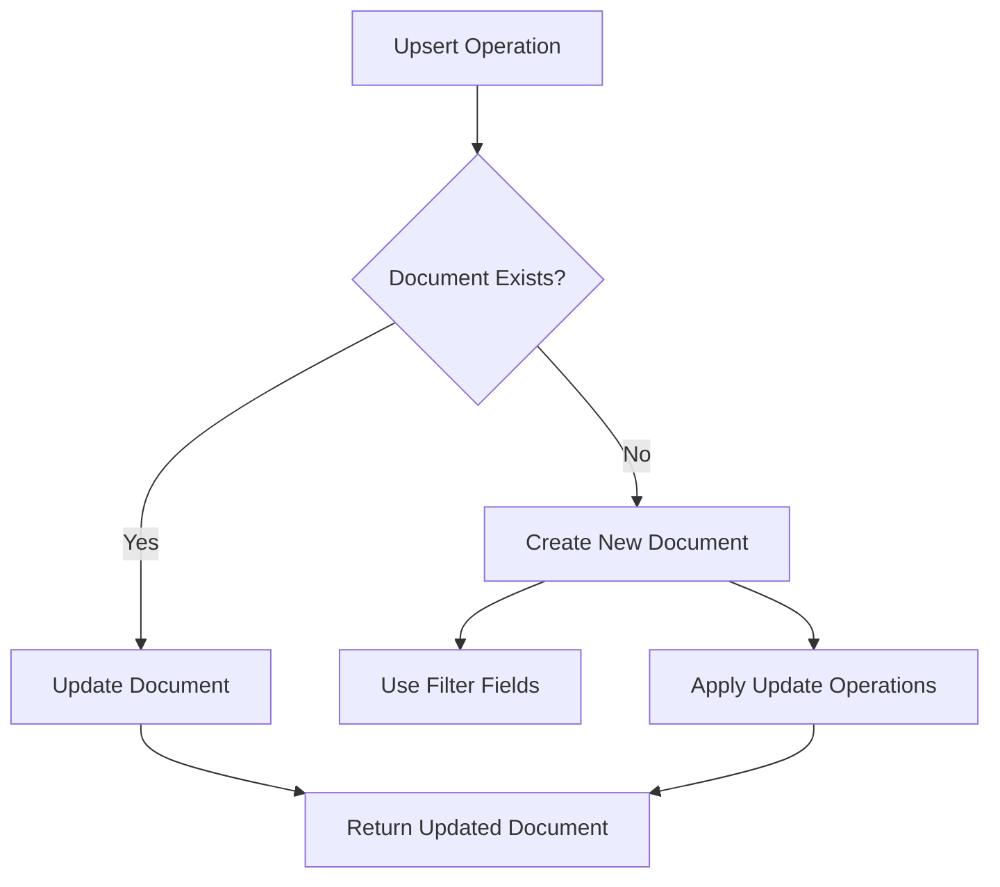

# MongoDB Upsert Operations

## Introduction

When working with MongoDB, there are situations where you need to update a document if it exists, but create it if it doesn't. This common operation pattern could be implemented using a find-then-update or find-then-insert approach, but MongoDB offers a more elegant solution: **upsert**.

An **upsert** (update + insert) is a special type of update operation that:
- Updates the document if it matches the filter criteria
- Creates a new document if no document matches the filter criteria

This functionality simplifies your code and makes your database operations more efficient by eliminating the need for separate find and conditional update/insert logic.

## Understanding Upserts in MongoDB

Upsert operations are executed using the same methods as regular updates but with a special option enabled. The two main methods for performing upserts are:

1. `updateOne()` with `upsert: true` - Updates a single document or creates one if none exist
2. `updateMany()` with `upsert: true` - Updates multiple documents matching the criteria, or creates one if none exist

Let's explore how upserts work with some examples.

## Basic Upsert Example

Let's say we have a product inventory system and want to either update an existing product or add it if it doesn't exist.

```javascript
// Upsert operation for a product
db.products.updateOne(
  { productCode: "P1001" },    // filter criteria
  {                           // update operations
    $set: { 
      name: "Wireless Keyboard",
      price: 59.99,
      category: "Computer Accessories",
      inStock: 45
    }
  },
  { upsert: true }            // enables upsert
);
```

This operation will:
- Look for a document with `productCode: "P1001"`
- If found, update its fields with the values in `$set`
- If not found, create a new document with `productCode: "P1001"` and all the fields specified in `$set`

## How Upsert Creates New Documents

When an upsert creates a new document, two sources of data are used:

1. The filter criteria - fields and values from the query filter
2. The update operations - fields and values from update operators like `$set`

For example:

```javascript
// No document with productCode "P2002" exists yet
db.products.updateOne(
  { productCode: "P2002", category: "Electronics" },
  { $set: { name: "Bluetooth Speaker", price: 89.99 } },
  { upsert: true }
);
```

If this creates a new document, it will contain:
- `productCode: "P2002"` (from the filter)
- `category: "Electronics"` (from the filter)
- `name: "Bluetooth Speaker"` (from the update operation)
- `price: 89.99` (from the update operation)

## Using Update Operators with Upserts

Upserts work with all MongoDB update operators. Here are examples with some common operators:

### Using $set with Upsert

```javascript
// Update a user's address or create the user if they don't exist
db.users.updateOne(
  { email: "john.doe@example.com" },
  { 
    $set: { 
      "address.street": "123 Main St",
      "address.city": "Boston",
      "address.state": "MA",
      "address.zip": "02101"
    }
  },
  { upsert: true }
);
```

### Using $inc with Upsert

```javascript
// Increment a product's view count or create it with initial count
db.products.updateOne(
  { productCode: "P3003" },
  { 
    $inc: { viewCount: 1 },
    $set: { lastViewed: new Date() }
  },
  { upsert: true }
);
```

This is particularly useful for counters and statistics, as you don't need to check if the document exists first.

### Using $push with Upsert

```javascript
// Add a comment to an article or create the article with initial comment
db.articles.updateOne(
  { slug: "mongodb-upsert-guide" },
  { 
    $push: { 
      comments: {
        user: "user123",
        text: "Great article!",
        createdAt: new Date()
      }
    },
    $setOnInsert: { 
      title: "MongoDB Upsert Guide",
      createdAt: new Date()
    }
  },
  { upsert: true }
);
```

## Special Operator: $setOnInsert

The `$setOnInsert` operator is especially useful with upserts. It sets values for fields **only** when an insert occurs, not during updates.

```javascript
// Update a user's last login, or create a new user with registration date
db.users.updateOne(
  { username: "newuser" },
  { 
    $set: { lastLogin: new Date() },
    $setOnInsert: { 
      registeredAt: new Date(),
      accountStatus: "active",
      roles: ["user"]
    }
  },
  { upsert: true }
);
```

In this example:
- If the user exists, only `lastLogin` is updated
- If the user doesn't exist, all fields are set including the ones in `$setOnInsert`

This is very useful for setting initialization values or creation timestamps that should never be modified during updates.

## Real-World Application: Session Management

Let's look at a practical example of using upserts for managing user sessions in a web application:

```javascript
// Function to track user sessions
async function trackUserSession(userId, sessionData) {
  const result = await db.sessions.updateOne(
    { userId: userId },
    { 
      $set: {
        lastActive: new Date(),
        ipAddress: sessionData.ip,
        userAgent: sessionData.userAgent
      },
      $setOnInsert: {
        createdAt: new Date(),
        firstIp: sessionData.ip
      },
      $addToSet: {
        visitedPages: sessionData.currentPage
      }
    },
    { upsert: true }
  );
  
  return result;
}
```

This function:
1. Updates the existing session if the user already has one
2. Creates a new session if this is the user's first visit
3. Tracks the pages they visit without duplicates (using `$addToSet`)
4. Always maintains the original creation time and first IP

## Performance Considerations

Upserts are generally more efficient than separate find-then-insert/update operations because:
- They require only one round-trip to the server
- They eliminate race conditions where documents might be created twice
- They reduce code complexity by handling both cases in a single operation

However, be aware that:
- Upserts perform additional work to check if a document exists
- Large upserts with complex criteria might be slower than direct inserts when you know the document doesn't exist

## When to Use Upserts

Upserts are ideal for:

1. **Idempotent operations** - operations that can be applied multiple times without changing the result
2. **First-time initialization** - create documents with default values on first access
3. **Counters and statistics** - increment counters without checking if they exist first
4. **Caching operations** - store computed data with a lookup key
5. **Config systems** - ensure configuration exists with defaults

## Upsert Flow Diagram



## Common Pitfalls and How to Avoid Them

### 1. Unexpected Document Creation

When using complex queries with upsert, be careful about which fields end up in the created document.

```javascript
// This might create documents with unexpected field values
db.inventory.updateOne(
  { quantity: { $lt: 10 } },  // Problematic for new documents!
  { $set: { reorder: true } },
  { upsert: true }
);
```

If no document with `quantity < 10` exists, this creates a document with `{ quantity: { $lt: 10 }, reorder: true }`, which isn't valid for comparisons.

**Solution**: Always use equality conditions in filters for upserts.

### 2. Missing Required Fields

If your schema requires certain fields, an upsert might create incomplete documents.

**Solution**: Use `$setOnInsert` to provide all required fields.

```javascript
db.users.updateOne(
  { email: "new@example.com" },
  {
    $set: { lastActive: new Date() },
    $setOnInsert: {
      username: "new_user",
      createdAt: new Date(),
      status: "pending"
      // Include all required fields
    }
  },
  { upsert: true }
);
```

## Summary

MongoDB's upsert operations provide an elegant solution to the common pattern of updating existing documents or creating new ones when needed. By using the `upsert: true` option with update methods, you can:

- Write more concise, efficient code
- Eliminate race conditions in find-then-update patterns
- Reduce database round-trips
- Handle both new and existing documents in a single operation

The `$setOnInsert` operator further enhances upserts by allowing you to specify fields that should only be set when creating new documents, making this feature even more powerful for real-world applications.

## Exercises

1. **Basic Upsert**: Write an upsert operation that updates a product's price if it exists or creates it with default values if it doesn't.

2. **Counter Implementation**: Create a page view counter that increments each time a page is viewed, using upserts to handle new pages.

3. **User Preferences**: Implement a function that saves user preferences, creating default preferences for new users while preserving existing ones.

4. **Advanced**: Write an upsert operation that tracks daily login statistics, creating a new document for each day and incrementing counters for returning users.

## Additional Resources

- [MongoDB Update Methods Documentation](https://docs.mongodb.com/manual/reference/method/db.collection.updateOne/)
- [MongoDB Update Operators](https://docs.mongodb.com/manual/reference/operator/update/)
- [MongoDB Data Modeling Patterns](https://docs.mongodb.com/manual/applications/data-models/)

Happy coding with MongoDB upserts!