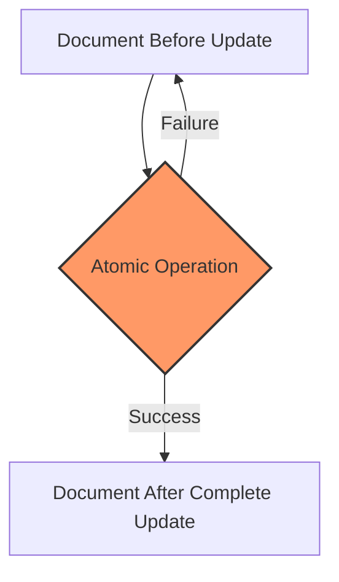

# MongoDB Atomic Updates

## Introduction

When working with a database, ensuring data consistency and integrity is paramount. MongoDB provides a powerful feature called **atomic updates** that allows you to modify documents in a safe and consistent manner. In this article, we'll explore what atomic operations are, why they're important, and how to use MongoDB's update operators to perform atomic updates.

## What Are Atomic Operations?

An atomic operation is an operation that either:
- Completes entirely
- Doesn't happen at all

There's no intermediate state where only part of the operation has been applied. This is crucial for maintaining data consistency, especially in applications with concurrent users.



In MongoDB, all operations that modify a single document are atomic. This means that if an update touches multiple fields within the same document, either all fields are updated successfully, or none of them are.

## Why Are Atomic Operations Important?

Consider this scenario without atomic operations:

1. Two users retrieve the same document.
2. User A updates field X.
3. User B updates field Y (without knowing about A's update).
4. User B saves their changes, overwriting User A's update to field X.

This is known as the "lost update" problem. Atomic operations help prevent these scenarios by ensuring that updates are applied consistently.

## MongoDB Update Operators for Atomic Operations

MongoDB provides various update operators that allow for atomic modifications to fields within documents. Let's explore some of the most commonly used ones:

### The `$set` Operator

The `$set` operator replaces the value of a field with the specified value.

```javascript
// Original document
{
  _id: ObjectId("123"),
  name: "John Doe",
  age: 30,
  address: {
    city: "New York",
    zipcode: "10001"
  }
}

// Update operation
db.users.updateOne(
  { _id: ObjectId("123") },
  { $set: { age: 31, "address.city": "Boston" } }
)

// Result after update
{
  _id: ObjectId("123"),
  name: "John Doe",
  age: 31,
  address: {
    city: "Boston",
    zipcode: "10001"
  }
}
```

Both fields are updated atomically in a single operation.

### The `$inc` Operator

The `$inc` operator increments a field's value by a specified amount.

```javascript
// Original document
{
  _id: ObjectId("456"),
  product: "Widget",
  inStock: 10,
  sold: 5
}

// Update operation
db.inventory.updateOne(
  { _id: ObjectId("456") },
  { $inc: { inStock: -2, sold: 2 } }
)

// Result after update
{
  _id: ObjectId("456"),
  product: "Widget",
  inStock: 8,
  sold: 7
}
```

This is particularly useful for inventory management or counters.

### The `$push` and `$pull` Operators

These operators atomically modify arrays within documents.

```javascript
// Original document
{
  _id: ObjectId("789"),
  username: "jane_doe",
  tags: ["mongodb", "database"]
}

// Add a tag
db.users.updateOne(
  { _id: ObjectId("789") },
  { $push: { tags: "nosql" } }
)

// Result after update
{
  _id: ObjectId("789"),
  username: "jane_doe",
  tags: ["mongodb", "database", "nosql"]
}

// Remove a tag
db.users.updateOne(
  { _id: ObjectId("789") },
  { $pull: { tags: "database" } }
)

// Result after second update
{
  _id: ObjectId("789"),
  username: "jane_doe",
  tags: ["mongodb", "nosql"]
}
```

### Compound Update Operations

Multiple update operators can be combined in a single operation, and the entire operation remains atomic:

```javascript
// Original document
{
  _id: ObjectId("abc"),
  product: "Smartphone",
  price: 500,
  specs: {
    storage: "64GB",
    camera: "12MP"
  },
  reviews: []
}

// Combined update operation
db.products.updateOne(
  { _id: ObjectId("abc") },
  { 
    $set: { "specs.storage": "128GB" },
    $inc: { price: 100 },
    $push: { reviews: { user: "user123", rating: 5 } }
  }
)

// Result after update
{
  _id: ObjectId("abc"),
  product: "Smartphone",
  price: 600,
  specs: {
    storage: "128GB",
    camera: "12MP"
  },
  reviews: [
    { user: "user123", rating: 5 }
  ]
}
```

## Real-world Applications of Atomic Updates

### Example 1: User Profile Updates

When users update their profiles, you want to ensure all fields are updated together:

```javascript
db.users.updateOne(
  { _id: userId },
  {
    $set: {
      name: updatedName,
      email: updatedEmail,
      "profile.bio": updatedBio,
      lastUpdated: new Date()
    }
  }
)
```

### Example 2: E-commerce Inventory Management

When processing an order, you need to atomically decrease inventory and increase sales counts:

```javascript
db.products.updateOne(
  { _id: productId, inventory: { $gte: quantityOrdered } },
  {
    $inc: { 
      inventory: -quantityOrdered,
      sold: quantityOrdered
    },
    $push: {
      recentSales: {
        date: new Date(),
        quantity: quantityOrdered
      }
    }
  }
)
```

The query condition `inventory: { $gte: quantityOrdered }` ensures we only update if there's enough inventory.

### Example 3: Atomic Find and Modify

Sometimes you need to get the document before or after the update. The `findOneAndUpdate` method provides this functionality while maintaining atomicity:

```javascript
// Atomically increment a counter and get the new value
const result = db.counters.findOneAndUpdate(
  { _id: "user_id" },
  { $inc: { sequence_value: 1 } },
  { returnDocument: "after" }
)

const newUserId = result.value.sequence_value
```

## Limitations of Atomic Updates

While MongoDB's atomic operations are powerful, they have limitations:

1. **Single Document Only**: Atomic operations in MongoDB only apply to a single document. Operations across multiple documents are not atomic by default.

2. **Transaction Support**: For multi-document transactions, you need to use MongoDB's transaction API (available since version 4.0 for replica sets and 4.2 for sharded clusters).

## Best Practices for Atomic Updates

1. **Design Data Models for Atomicity**: Structure your data so that related information that needs to be updated together is in the same document.

2. **Use Update Operators**: Always use update operators instead of replacing entire documents to ensure atomicity.

3. **Use Query Conditions**: Include conditions in your update queries to ensure updates happen only when appropriate.

```javascript
// Only update if user is active
db.users.updateOne(
  { _id: userId, status: "active" },
  { $set: { lastActivity: new Date() } }
)
```

4. **Consider Using Transactions**: For operations that must modify multiple documents atomically, use transactions.

## Summary

MongoDB's atomic updates provide a powerful way to ensure data consistency when modifying documents. By using update operators like `$set`, `$inc`, `$push`, and others, you can perform complex updates in a safe, atomic manner. This is essential for applications where data integrity is critical, such as financial systems, inventory management, or user profile updates.

Understanding how to leverage atomic operations in MongoDB will help you build more robust, reliable applications that properly handle concurrent access and updates.

## Practice Exercises

1. Create a blog post system where users can like posts. Implement an atomic update that increments the like count and adds the user to the list of users who liked the post.

2. Design a banking system where transferring money between accounts requires atomic operations. How would you implement this with MongoDB?

3. Implement a user authentication system where failed login attempts are tracked. After five failed attempts, the account should be temporarily locked.

## Additional Resources

- [MongoDB Official Documentation on Update Operators](https://docs.mongodb.com/manual/reference/operator/update/)
- [MongoDB Transactions Documentation](https://docs.mongodb.com/manual/core/transactions/)
- [Database Atomicity Design Patterns](https://www.mongodb.com/blog/post/building-with-patterns-the-document-versioning-pattern)

By mastering MongoDB's atomic update operations, you'll be better equipped to handle complex data modification scenarios while maintaining data integrity in your applications.