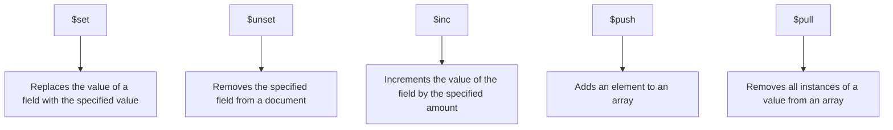

# MongoDB $set Operator

The `$set` operator is one of the most commonly used update operators in MongoDB. It allows you to modify existing fields or add new fields to documents in your collections. Understanding how to effectively use `$set` is essential for managing data in MongoDB applications.

## Introduction to $set

When working with MongoDB, you'll frequently need to update your documents. The `$set` operator provides a straightforward way to:
- Modify the value of an existing field
- Add a new field to a document if the field doesn't already exist
- Update values within embedded documents
- Set elements within arrays by position

## Basic Syntax

The basic syntax for the `$set` operator is:

```javascript
db.collection.updateOne(
   { <query criteria> },
   { $set: { <field1>: <value1>, <field2>: <value2>, ... } }
)
```

For updating multiple documents:

```javascript
db.collection.updateMany(
   { <query criteria> },
   { $set: { <field1>: <value1>, <field2>: <value2>, ... } }
)
```

## Simple Examples

Let's explore some basic examples of using the `$set` operator:

### Example 1: Update a Single Field

Imagine we have a `users` collection with the following document:

```javascript
{
  _id: ObjectId("507f1f77bcf86cd799439011"),
  name: "John Doe",
  email: "john.doe@example.com",
  age: 30
}
```

To update the user's age to 31:

```javascript
db.users.updateOne(
  { _id: ObjectId("507f1f77bcf86cd799439011") },
  { $set: { age: 31 } }
)
```

**Result:**
```javascript
{
  _id: ObjectId("507f1f77bcf86cd799439011"),
  name: "John Doe",
  email: "john.doe@example.com",
  age: 31  // Updated from 30 to 31
}
```

### Example 2: Add a New Field

To add a `phone` field to the same document:

```javascript
db.users.updateOne(
  { _id: ObjectId("507f1f77bcf86cd799439011") },
  { $set: { phone: "+1-555-123-4567" } }
)
```

**Result:**
```javascript
{
  _id: ObjectId("507f1f77bcf86cd799439011"),
  name: "John Doe",
  email: "john.doe@example.com",
  age: 31,
  phone: "+1-555-123-4567"  // New field added
}
```

### Example 3: Update Multiple Fields at Once

You can update several fields in a single operation:

```javascript
db.users.updateOne(
  { _id: ObjectId("507f1f77bcf86cd799439011") },
  { 
    $set: { 
      age: 32,
      email: "johndoe@newdomain.com",
      status: "active"
    } 
  }
)
```

**Result:**
```javascript
{
  _id: ObjectId("507f1f77bcf86cd799439011"),
  name: "John Doe",
  email: "johndoe@newdomain.com",  // Updated
  age: 32,  // Updated
  phone: "+1-555-123-4567",
  status: "active"  // New field added
}
```

## Working with Embedded Documents

The `$set` operator can also update fields within embedded documents using dot notation.

### Example 4: Update Fields in Embedded Documents

Consider a document with an embedded `address` object:

```javascript
{
  _id: ObjectId("507f1f77bcf86cd799439011"),
  name: "John Doe",
  address: {
    street: "123 Main St",
    city: "Anytown",
    state: "CA",
    zip: "12345"
  }
}
```

To update the street address:

```javascript
db.users.updateOne(
  { _id: ObjectId("507f1f77bcf86cd799439011") },
  { $set: { "address.street": "456 Oak Ave" } }
)
```

**Result:**
```javascript
{
  _id: ObjectId("507f1f77bcf86cd799439011"),
  name: "John Doe",
  address: {
    street: "456 Oak Ave",  // Updated
    city: "Anytown",
    state: "CA",
    zip: "12345"
  }
}
```

## Working with Arrays

The `$set` operator can also be used to update elements in arrays, either by position or using array operators.

### Example 5: Update Array Elements by Position

Consider a document with an array of skills:

```javascript
{
  _id: ObjectId("507f1f77bcf86cd799439011"),
  name: "John Doe",
  skills: ["JavaScript", "Python", "HTML", "CSS"]
}
```

To update the second skill (index 1) from "Python" to "Node.js":

```javascript
db.users.updateOne(
  { _id: ObjectId("507f1f77bcf86cd799439011") },
  { $set: { "skills.1": "Node.js" } }
)
```

**Result:**
```javascript
{
  _id: ObjectId("507f1f77bcf86cd799439011"),
  name: "John Doe",
  skills: ["JavaScript", "Node.js", "HTML", "CSS"]  // Python changed to Node.js
}
```

### Example 6: Update Elements in Array of Objects

Consider a document with an array of contact methods:

```javascript
{
  _id: ObjectId("507f1f77bcf86cd799439011"),
  name: "John Doe",
  contacts: [
    { type: "email", value: "john@example.com" },
    { type: "phone", value: "555-123-4567" }
  ]
}
```

To update the phone number:

```javascript
db.users.updateOne(
  { _id: ObjectId("507f1f77bcf86cd799439011"), "contacts.type": "phone" },
  { $set: { "contacts.$.value": "555-987-6543" } }
)
```

In this example, `contacts.$` refers to the matched element in the array where `type` equals "phone".

**Result:**
```javascript
{
  _id: ObjectId("507f1f77bcf86cd799439011"),
  name: "John Doe",
  contacts: [
    { type: "email", value: "john@example.com" },
    { type: "phone", value: "555-987-6543" }  // Updated
  ]
}
```

## Real-World Applications

Let's explore some practical applications of the `$set` operator in real-world scenarios:

### User Profile Updates

A common scenario in web applications is allowing users to update their profiles:

```javascript
db.users.updateOne(
  { username: "johndoe" },
  { 
    $set: { 
      "profile.displayName": "John D.",
      "profile.bio": "Software developer with 5 years of experience",
      "profile.lastUpdated": new Date()
    } 
  }
)
```

### Setting Default Values for New Features

When adding a new feature to your app that requires a new field:

```javascript
db.users.updateMany(
  { notificationPreferences: { $exists: false } },
  { $set: { notificationPreferences: { email: true, push: true, sms: false } } }
)
```

### Tracking Status Changes

When updating the status of an order:

```javascript
db.orders.updateOne(
  { orderId: "ORD-12345" },
  { 
    $set: { 
      status: "shipped",
      shippedAt: new Date(),
      trackingNumber: "TRK9876543210",
      lastUpdated: new Date()
    } 
  }
)
```

## Best Practices

1. **Be Specific with Queries**: Target only the documents you need to update to optimize performance.

2. **Update Only Necessary Fields**: Instead of replacing an entire document, use `$set` to modify only the fields that need updating.

3. **Use Dot Notation for Nested Updates**: When updating fields in embedded documents or arrays, dot notation is more efficient than replacing the entire object.

4. **Consider Using `updateMany()` for Bulk Updates**: When the same change needs to be applied to multiple documents.

5. **Add Validation**: Before updating, verify that your new values are valid to maintain data integrity.

## Common Pitfalls and Solutions

### Pitfall 1: Overwriting Entire Objects

**Problem**: 
```javascript
// This will replace the entire address object
db.users.updateOne(
  { _id: ObjectId("507f1f77bcf86cd799439011") },
  { $set: { address: { street: "456 Oak Ave" } } }
)
```

**Solution**: 
```javascript
// This preserves other address fields
db.users.updateOne(
  { _id: ObjectId("507f1f77bcf86cd799439011") },
  { $set: { "address.street": "456 Oak Ave" } }
)
```

### Pitfall 2: Array Index Out of Bounds

**Problem**: Trying to set a value at an index that doesn't exist in the array will extend the array with null values.

**Solution**: Check the array length first or use array operators like `$push` instead if you're adding new elements.

## Comparing $set with Other Update Operators

Here's a quick comparison of `$set` with other common update operators:



## Summary

The `$set` operator is a powerful tool in MongoDB for updating document fields. It allows you to modify existing fields, add new ones, and update nested structures within documents.

Key takeaways:
- Use `$set` to modify fields without replacing entire documents
- It can add new fields if they don't already exist
- Use dot notation to update fields in embedded documents and arrays
- You can update multiple fields in a single operation
- It works well in conjunction with other MongoDB operators

## Practice Exercises

1. Create a collection of books and use `$set` to update the publication year for a specific book.
2. Add a "reviews" array to a book document using `$set`.
3. Update the price field in all books by a specific author.
4. Update a nested object like "publisher" information for a book.
5. Create a user profile system and implement methods to update different parts of the profile using `$set`.

## Additional Resources

- [MongoDB Official Documentation on $set](https://www.mongodb.com/docs/manual/reference/operator/update/set/)
- [MongoDB Update Operators Overview](https://www.mongodb.com/docs/manual/reference/operator/update/)
- [Data Modeling with MongoDB](https://www.mongodb.com/docs/manual/core/data-modeling-introduction/)

By mastering the `$set` operator, you've taken an important step in becoming proficient with MongoDB document updates. This skill will serve you well as you build and maintain MongoDB-powered applications.