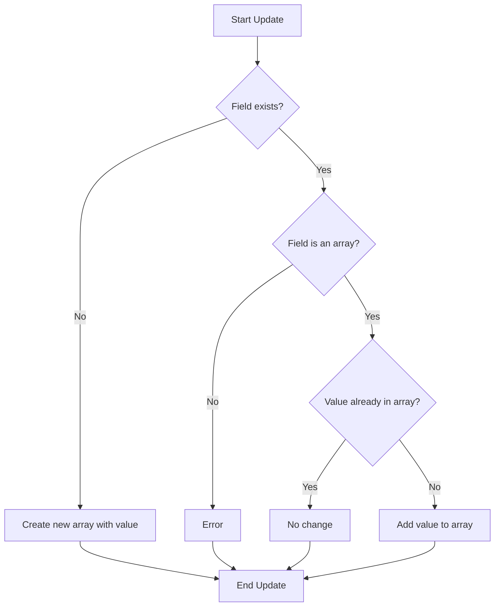

# MongoDB $addToSet Operator

When working with arrays in MongoDB, it's often necessary to add elements while ensuring you don't create duplicates. The `$addToSet` operator provides an elegant solution for this common requirement by adding elements to an array only if they don't already exist.

## What is the $addToSet Operator?

The `$addToSet` operator is an update operator that adds a value to an array field, but only if the value doesn't already exist in the array. This makes it perfect for maintaining sets of unique values.

### Syntax

```javascript
{ $addToSet: { <field>: <value> } }
```

Where:
- `<field>` is the name of the array field you want to update
- `<value>` is the element you want to add to the array if it doesn't already exist

## Basic Usage

Let's start with a simple example to understand how `$addToSet` works.

### Example 1: Adding a Single Element

Consider a collection of user documents, each with a `tags` array:

```javascript
// Initial document
{
  _id: 1,
  username: "john_doe",
  tags: ["javascript", "mongodb", "web"]
}
```

Now, let's add a new tag "database" to the user's tags:

```javascript
db.users.updateOne(
  { _id: 1 },
  { $addToSet: { tags: "database" } }
)
```

After this operation, the document will look like:

```javascript
{
  _id: 1,
  username: "john_doe",
  tags: ["javascript", "mongodb", "web", "database"]
}
```

If we try to add "mongodb" again, which already exists in the array:

```javascript
db.users.updateOne(
  { _id: 1 },
  { $addToSet: { tags: "mongodb" } }
)
```

The document remains unchanged because "mongodb" already exists in the array:

```javascript
{
  _id: 1,
  username: "john_doe",
  tags: ["javascript", "mongodb", "web", "database"]
}
```

## Adding Multiple Elements Using $each

The `$addToSet` operator can be combined with the `$each` modifier to add multiple elements at once.

### Syntax

```javascript
{ $addToSet: { <field>: { $each: [ <value1>, <value2>, ... ] } } }
```

### Example 2: Adding Multiple Elements

Let's add multiple tags to our user document:

```javascript
db.users.updateOne(
  { _id: 1 },
  { 
    $addToSet: { 
      tags: { 
        $each: ["python", "database", "nosql", "backend"] 
      } 
    } 
  }
)
```

After this operation, the document will look like:

```javascript
{
  _id: 1,
  username: "john_doe",
  tags: ["javascript", "mongodb", "web", "database", "python", "nosql", "backend"]
}
```

Notice that "database" wasn't added again since it was already in the array.

## Behavior with Complex Values

When working with complex values like objects, `$addToSet` compares the entire object structure for equality.

### Example 3: Adding Objects to an Array

Consider a collection of courses, each with an array of students:

```javascript
// Initial document
{
  _id: 101,
  course: "MongoDB Basics",
  students: [
    { name: "John", grade: "A" },
    { name: "Mary", grade: "B+" }
  ]
}
```

Let's try adding students to this course:

```javascript
db.courses.updateOne(
  { _id: 101 },
  {
    $addToSet: {
      students: [
        { name: "John", grade: "A" },  // Existing student
        { name: "Peter", grade: "B" }  // New student
      ]
    }
  }
)
```

After this operation, the document will look like:

```javascript
{
  _id: 101,
  course: "MongoDB Basics",
  students: [
    { name: "John", grade: "A" },
    { name: "Mary", grade: "B+" },
    [
      { name: "John", grade: "A" },
      { name: "Peter", grade: "B" }
    ]
  ]
}
```

Wait, that's not what we expected! The problem is that we didn't use `$each` for multiple values. The entire array was considered as a single element.

Let's correct it:

```javascript
db.courses.updateOne(
  { _id: 101 },
  {
    $addToSet: {
      students: {
        $each: [
          { name: "John", grade: "A" },
          { name: "Peter", grade: "B" }
        ]
      }
    }
  }
)
```

Now the result will be:

```javascript
{
  _id: 101,
  course: "MongoDB Basics",
  students: [
    { name: "John", grade: "A" },
    { name: "Mary", grade: "B+" },
    { name: "Peter", grade: "B" }
  ]
}
```

The object `{ name: "John", grade: "A" }` wasn't added because an identical object already exists in the array.

## Important Considerations

1. **Exact Matches Only**: `$addToSet` only prevents duplicates if the values are exactly the same. For objects, field order matters.

2. **Array Initialization**: If the field doesn't exist, `$addToSet` creates a new array with the specified value.

3. **Non-array Fields**: If the field exists but isn't an array, `$addToSet` returns an error.

4. **Comparison Method**: MongoDB uses the BSON comparison rules to determine if values are equal.

## Real-World Applications

### Example 4: User Skill Tracking System

Let's build a simple skill tracking system where users can add skills to their profile:

```javascript
// Initial user document
{
  _id: 201,
  name: "Alice Johnson",
  email: "alice@example.com",
  skills: ["JavaScript", "HTML", "CSS"]
}
```

When Alice learns a new skill, we update her document:

```javascript
db.profiles.updateOne(
  { _id: 201 },
  { $addToSet: { skills: "React" } }
)
```

If she tries to add a skill she already has:

```javascript
db.profiles.updateOne(
  { _id: 201 },
  { $addToSet: { skills: "JavaScript" } }
)
```

Her profile remains updated without duplicates:

```javascript
{
  _id: 201,
  name: "Alice Johnson",
  email: "alice@example.com",
  skills: ["JavaScript", "HTML", "CSS", "React"]
}
```

### Example 5: Product Tagging System

Consider an e-commerce platform with product documents:

```javascript
{
  _id: 301,
  name: "Smartphone X",
  price: 699.99,
  categories: ["electronics", "gadgets"],
  tags: ["smartphone", "touchscreen"]
}
```

When we want to add new tags based on user input:

```javascript
db.products.updateOne(
  { _id: 301 },
  {
    $addToSet: {
      tags: {
        $each: ["smartphone", "android", "5G", "camera"]
      }
    }
  }
)
```

The product document is updated with only the new unique tags:

```javascript
{
  _id: 301,
  name: "Smartphone X",
  price: 699.99,
  categories: ["electronics", "gadgets"],
  tags: ["smartphone", "touchscreen", "android", "5G", "camera"]
}
```

## Comparison with Other Array Update Operators

To better understand `$addToSet`, let's compare it with `$push`:

| Operator | Function | Duplicates Handling |
|----------|----------|---------------------|
| `$addToSet` | Adds elements to an array | Prevents duplicates |
| `$push` | Adds elements to an array | Allows duplicates |

### When to use $addToSet vs $push

- Use `$addToSet` when you need to ensure uniqueness in an array, such as for tags, categories, or set-like data.
- Use `$push` when you want to append elements to an array regardless of duplicates, such as for logs, comments, or time-series data.

## Visualizing $addToSet Behavior



## Best Practices

1. **Use $each for multiple values**: Always use the `$each` modifier when adding multiple elements.

2. **Be careful with object equality**: Remember that objects are compared by exact structure, including field order.

3. **Index for performance**: If you perform frequent updates on large arrays, consider indexing the array field.

4. **Limit array size**: Be cautious about unbounded growth of arrays, as it can impact performance.

5. **Consider atomic operations**: `$addToSet` operations are atomic, making them safe for concurrent updates.

## Summary

The `$addToSet` operator is a powerful tool in MongoDB for maintaining unique elements in array fields. It efficiently adds new elements while preventing duplicates, making it ideal for scenarios like tagging systems, user preferences, or any situation where you need to maintain a set of unique values.

Key points to remember:
- `$addToSet` adds elements to an array only if they don't already exist
- Use the `$each` modifier to add multiple elements at once
- Object comparison is based on exact structure equality
- The operation is atomic, ensuring data consistency

## Exercises for Practice

1. Create a blog post document with an array of tags, then use `$addToSet` to add new tags without duplicates.

2. Build a user preferences document, then use `$addToSet` with `$each` to add multiple preferences at once.

3. Create a document with an array of object elements, then practice adding new objects with `$addToSet` to understand object equality.

4. Implement a comment system where each user can only add one reaction (like, love, laugh) to a post.

5. Compare the behavior of `$addToSet` and `$push` on the same document to visualize the difference.

## Additional Resources

- [MongoDB Documentation on $addToSet](https://www.mongodb.com/docs/manual/reference/operator/update/addToSet/)
- [MongoDB Array Update Operators](https://www.mongodb.com/docs/manual/reference/operator/update-array/)
- [BSON Types and Comparison Order](https://www.mongodb.com/docs/manual/reference/bson-type-comparison-order/)