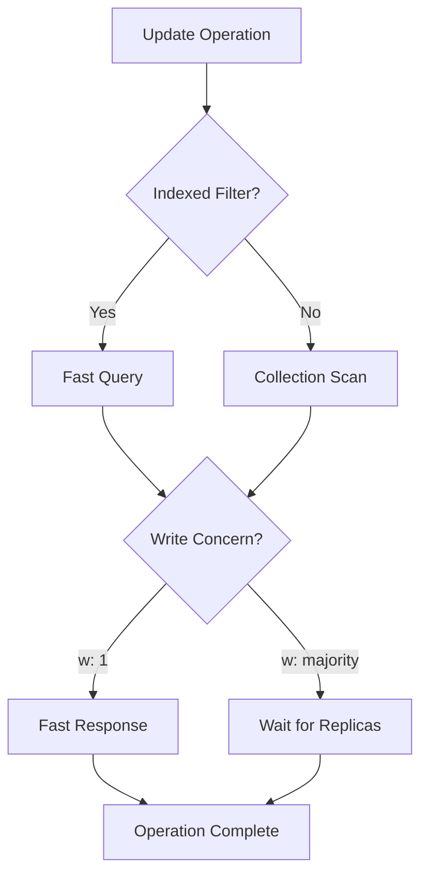

# MongoDB Update Options

When updating documents in MongoDB, you have several options that control how the update operation behaves. These options provide flexibility and precision in how your updates are applied to your database.

## Introduction

MongoDB's update operations (`updateOne()`, `updateMany()`, and `findAndModify()`) accept a set of options that modify their behavior beyond the basic update functionality. These options let you:

- Create new documents if matching ones don't exist
- Update multiple documents in a single operation
- Control the write acknowledgment process
- Return specific information about the updated documents
- And more!

Understanding these options will help you write more efficient and powerful MongoDB operations.

## Common Update Options

### The Upsert Option

The `upsert` option is one of the most commonly used update options. When set to `true`, it creates a new document if no document matches the query criteria.

#### Syntax

```javascript
db.collection.updateOne(
  <filter>,
  <update>,
  { upsert: <boolean> }
)
```

#### Example: Basic Upsert

Let's say we have a products collection and want to update a product with ID "P1001", but we're not sure if it exists yet:

```javascript
// Without any documents matching "P1001"
db.products.updateOne(
  { product_id: "P1001" },
  { $set: { name: "Smartphone", price: 499.99 } },
  { upsert: true }
)
```

**Output:**
```javascript
{
  "acknowledged": true,
  "matchedCount": 0,
  "modifiedCount": 0,
  "upsertedId": ObjectId("5f7b1a9e9d3b2c1a2b3c4d5e")
}
```

Notice that `matchedCount` is 0 (no documents matched), but a new document was created with the ID shown in `upsertedId`.

#### Example: Upsert with Update Operators

Upsert becomes even more powerful when combined with update operators:

```javascript
db.inventory.updateOne(
  { item: "sketch pad" },
  {
    $set: { qty: 25, tags: ["art", "supplies"] },
    $currentDate: { lastModified: true }
  },
  { upsert: true }
)
```

If the item "sketch pad" doesn't exist, MongoDB creates a new document containing all the fields in the update operation, plus the `_id` and `item` fields.

### Multi-Update Option

In MongoDB, the `updateOne()` method updates a single document by default. To update multiple documents matching your filter, you need to use `updateMany()`.

```javascript
db.collection.updateMany(
  <filter>,
  <update>,
  <options>
)
```

#### Example: Updating Multiple Documents

```javascript
// Update all products with price less than 100
db.products.updateMany(
  { price: { $lt: 100 } },
  { $mul: { price: 1.1 } } // Increase prices by 10%
)
```

**Output:**
```javascript
{
  "acknowledged": true,
  "matchedCount": 5,
  "modifiedCount": 5
}
```

### Write Concern

Write concern describes the level of acknowledgment requested from MongoDB for write operations.

```javascript
db.collection.updateOne(
  <filter>,
  <update>,
  {
    writeConcern: <document>
  }
)
```

#### Example: Using Write Concern

```javascript
db.orders.updateOne(
  { order_id: "12345" },
  { $set: { status: "shipped" } },
  {
    writeConcern: { w: "majority", wtimeout: 5000 }
  }
)
```

This operation will:
- Wait for acknowledgment from a majority of replica set members
- Time out after 5000 milliseconds if adequate acknowledgment isn't received

### Collation Option

Collation allows you to specify language-specific rules for string comparison.

```javascript
db.collection.updateOne(
  <filter>,
  <update>,
  {
    collation: {
      locale: <string>,
      caseLevel: <boolean>,
      // other collation options...
    }
  }
)
```

#### Example: Case-Insensitive Update

```javascript
// Update user regardless of case in username
db.users.updateOne(
  { username: "john_doe" },
  { $set: { status: "active" } },
  {
    collation: { locale: "en", strength: 2 } // Case-insensitive
  }
)
```

This will match documents with username values like "john_doe", "John_Doe", "JOHN_DOE", etc.

### arrayFilters

The `arrayFilters` option allows you to update specific elements within arrays.

```javascript
db.collection.updateOne(
  <filter>,
  <update>,
  { arrayFilters: [ <filterdocument1>, ... ] }
)
```

#### Example: Updating Specific Array Elements

Let's say we have a students collection with grades for different subjects:

```javascript
// Sample document
{
  _id: 1,
  name: "Alice",
  grades: [
    { subject: "math", score: 85 },
    { subject: "english", score: 92 },
    { subject: "science", score: 78 }
  ]
}
```

To increase all failing grades (below 80) by 5 points:

```javascript
db.students.updateOne(
  { _id: 1 },
  { $inc: { "grades.$[element].score": 5 } },
  { arrayFilters: [ { "element.score": { $lt: 80 } } ] }
)
```

**Result:** Only the science score will be increased to 83, while math and english remain unchanged.

### returnDocument Option

When using `findOneAndUpdate()`, you can specify whether to return the document before or after the update.

```javascript
db.collection.findOneAndUpdate(
  <filter>,
  <update>,
  {
    returnDocument: <string> // "before" or "after"
  }
)
```

#### Example: Return Updated Document

```javascript
const result = db.products.findOneAndUpdate(
  { product_id: "P1001" },
  { $inc: { stock: -1 } },
  { returnDocument: "after" }
)

console.log(result) // Shows the document after stock was decremented
```

## Real-World Applications

### Inventory Management System

Let's build a simple inventory management system that uses update options effectively:

```javascript
function processOrder(productId, quantity) {
  // Update stock and track order in one operation
  const result = db.products.findOneAndUpdate(
    { product_id: productId, stock: { $gte: quantity } },
    { 
      $inc: { stock: -quantity },
      $push: { 
        orders: {
          date: new Date(),
          quantity: quantity
        }
      }
    },
    {
      returnDocument: "after"
    }
  );
  
  if (result) {
    console.log(`Order processed. Remaining stock: ${result.stock}`);
    return true;
  } else {
    console.log("Order failed - insufficient stock");
    return false;
  }
}
```

### User Settings with Upsert

For applications where you want to ensure user settings always exist:

```javascript
function saveUserSettings(userId, settings) {
  return db.settings.updateOne(
    { user_id: userId },
    { 
      $set: settings,
      $setOnInsert: { created_at: new Date() },
      $currentDate: { last_modified: true }
    },
    { upsert: true }
  );
}

// Usage
saveUserSettings("user123", {
  theme: "dark",
  notifications: true,
  language: "en"
});
```

This function:
1. Updates settings if the user already has a record
2. Creates settings if no record exists
3. Sets a creation timestamp only for new records
4. Always updates the last_modified field

### Bulk Write with Different Options

MongoDB allows you to perform bulk operations with different options:

```javascript
db.products.bulkWrite([
  {
    updateOne: {
      filter: { item: "paper" },
      update: { $inc: { stock: 100 } },
      upsert: true
    }
  },
  {
    updateMany: {
      filter: { category: "office" },
      update: { $set: { department: "stationery" } }
    }
  },
  {
    updateOne: {
      filter: { item: "planner" },
      update: { $inc: { popularity: 1 } },
      arrayFilters: [{ "qty": { $lt: 20 } }]
    }
  }
], { ordered: false });
```

This performs multiple write operations with different update options in a single database request.

## Performance Considerations

When using update options, keep these performance tips in mind:

1. **Indexes matter**: Ensure your filter fields are indexed, especially for large collections.
2. **Write concern balance**: Higher levels of write concern (like `majority`) provide more durability but at the cost of performance.
3. **Avoid updating unnecessary fields**: Only include fields that need updating to minimize overhead.
4. **Bulk operations**: Group related updates with `bulkWrite()` for better performance.



## Common Mistakes and Troubleshooting

### Mistake 1: Using `$set` with Upsert Incorrectly

When using upsert, remember that MongoDB only includes the filter field if it's not using an operator expression:

```javascript
// This creates a document without a "name" field
db.users.updateOne(
  { name: { $eq: "John" } },
  { $set: { age: 30 } },
  { upsert: true }
)

// Better approach to ensure "name" is included
db.users.updateOne(
  { name: "John" },
  { $set: { age: 30 } },
  { upsert: true }
)
```

### Mistake 2: Forgetting to Check Result

Always check the result of update operations:

```javascript
const result = db.products.updateOne(
  { _id: productId }, 
  { $set: updatedData }
);

if (result.matchedCount === 0) {
  console.log("No documents matched the filter. Update failed.");
}
if (result.modifiedCount === 0 && result.matchedCount > 0) {
  console.log("Document matched but nothing was changed.");
}
```

## Summary

MongoDB update options provide powerful capabilities for controlling how your update operations behave:

- **Upsert**: Creates new documents when no matches exist
- **Multi-document updates**: Change multiple documents with one command
- **Write concern**: Control acknowledgment requirements for reliability
- **Collation**: Apply language-specific string comparison rules
- **arrayFilters**: Target specific elements within arrays
- **returnDocument**: Control which version of a document is returned

Mastering these options will help you write more efficient, precise, and powerful MongoDB operations that can handle a wide variety of real-world scenarios.

## Practice Exercises

1. Write an update operation that increases the price of all products in the "electronics" category by 5%, but only if they currently cost less than $500.

2. Create a function that safely increments a counter field, ensuring the document exists first (hint: use upsert).

3. Write an update operation that modifies only weekend dates in an array of event dates.

4. Build an update operation that changes the status of all "pending" tasks to "in progress", but makes sure to update the "modified_date" field and returns the updated documents.

## Additional Resources

- [MongoDB Update Methods Documentation](https://www.mongodb.com/docs/manual/reference/method/db.collection.updateOne/)
- [Write Concern Documentation](https://www.mongodb.com/docs/manual/reference/write-concern/)
- [Collation Documentation](https://www.mongodb.com/docs/manual/reference/collation/)
- [MongoDB Bulk Operations](https://www.mongodb.com/docs/manual/core/bulk-write-operations/)