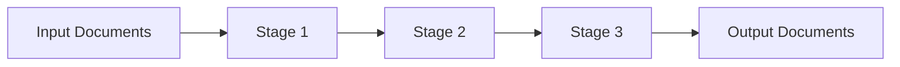

# MongoDB Aggregation Introduction

## What is MongoDB Aggregation?

MongoDB's aggregation framework is a powerful tool for data processing and analysis that allows you to perform complex operations on your data. Think of it as MongoDB's equivalent to SQL's GROUP BY and complex query capabilities, but with much more flexibility and power.

The aggregation framework lets you:
- Transform and combine documents
- Perform calculations on groups of documents
- Analyze data changes over time
- Execute complex data manipulations

If you've been using MongoDB's basic CRUD operations (`find()`, `update()`, etc.) and find yourself needing more advanced data processing capabilities, the aggregation framework is your next step.

## The Aggregation Pipeline Concept

At the heart of MongoDB's aggregation capabilities is the **pipeline** concept. A pipeline consists of multiple stages that process documents sequentially:



Each stage transforms the documents as they pass through the pipeline:
1. Documents enter the pipeline
2. Each stage performs an operation that modifies the documents
3. Documents from one stage flow into the next stage
4. The final stage produces the output results

This approach allows you to break down complex data manipulations into a series of simpler, discrete steps.

## Basic Syntax

Here's the basic syntax for using the aggregation framework:

```js
db.collection.aggregate([
  { $stage1: { <stage1 options> } },
  { $stage2: { <stage2 options> } },
  // ... more stages
])
```

Each stage in the pipeline is a JSON object prefixed with a `$` operator that defines what operation to perform.

## Common Aggregation Stages

Let's look at some of the most commonly used aggregation stages:

### 1. `$match`: Filtering Documents

Similar to the `find()` method, `$match` selects documents that match specific criteria.

```js
db.orders.aggregate([
  { $match: { status: "completed" } }
])
```

This would return only the orders with status "completed".

### 2. `$group`: Grouping Documents

The `$group` stage groups documents by a specified expression and can apply accumulator expressions.

```js
db.sales.aggregate([
  {
    $group: {
      _id: "$region",
      totalSales: { $sum: "$amount" }
    }
  }
])
```

This aggregation groups sales by region and calculates the total amount for each region.

### 3. `$sort`: Sorting Documents

The `$sort` stage sorts all documents in the pipeline by the specified fields.

```js
db.products.aggregate([
  { $sort: { price: -1 } }  // Sort by price in descending order
])
```

### 4. `$project`: Reshaping Documents

The `$project` stage reshapes documents by including, excluding, or computing new fields.

```js
db.users.aggregate([
  {
    $project: {
      fullName: { $concat: ["$firstName", " ", "$lastName"] },
      email: 1,
      _id: 0  // Exclude _id field
    }
  }
])
```

This creates a new field `fullName` by concatenating `firstName` and `lastName` fields, includes the `email` field, and excludes the `_id` field.

### 5. `$limit` and `$skip`: Pagination

These stages help with pagination:

```js
db.blogs.aggregate([
  { $sort: { publishDate: -1 } },
  { $skip: 10 },  // Skip the first 10 documents
  { $limit: 5 }   // Limit to 5 documents
])
```

## A Complete Example

Let's put these stages together in a more practical example. Imagine we have a collection of sales data:

```js
// Example documents in 'sales' collection
{
  _id: ObjectId("..."),
  product: "Laptop",
  category: "Electronics",
  price: 1200,
  quantity: 1,
  date: ISODate("2023-06-15"),
  customer: {
    name: "John Doe",
    city: "New York"
  }
},
// ... more documents
```

We want to analyze sales data to find the top 3 cities by total revenue for electronics products in 2023:

```js
db.sales.aggregate([
  // Stage 1: Filter for electronics products in 2023
  {
    $match: {
      category: "Electronics",
      date: { $gte: ISODate("2023-01-01"), $lt: ISODate("2024-01-01") }
    }
  },
  
  // Stage 2: Calculate revenue for each sale
  {
    $project: {
      city: "$customer.city",
      revenue: { $multiply: ["$price", "$quantity"] }
    }
  },
  
  // Stage 3: Group by city and sum revenues
  {
    $group: {
      _id: "$city",
      totalRevenue: { $sum: "$revenue" },
      count: { $sum: 1 }
    }
  },
  
  // Stage 4: Sort by total revenue (highest first)
  {
    $sort: { totalRevenue: -1 }
  },
  
  // Stage 5: Get only the top 3 cities
  {
    $limit: 3
  },
  
  // Stage 6: Reshape the output for better readability
  {
    $project: {
      _id: 0,
      city: "$_id",
      totalRevenue: 1,
      numberOfSales: "$count"
    }
  }
])
```

Output:

```js
[
  { city: "New York", totalRevenue: 23500, numberOfSales: 18 },
  { city: "San Francisco", totalRevenue: 18750, numberOfSales: 15 },
  { city: "Chicago", totalRevenue: 16200, numberOfSales: 12 }
]
```

This example demonstrates how we can chain multiple stages to process data in steps:
1. First, we filter the documents
2. Then calculate the revenue for each sale
3. Group the data by city and calculate totals
4. Sort the results
5. Limit to the top 3 entries
6. Finally, reshape the output for better readability

## Aggregation vs. Simple Queries

You might wonder when to use aggregation instead of simple queries:

| Simple Queries (`find()`) | Aggregation Framework |
|--------------------------|----------------------|
| Good for basic data retrieval | Powerful for data analysis and transformation |
| Easy to use and understand | More complex but more flexible |
| Limited data manipulation | Advanced data processing capabilities |
| Can't perform complex calculations | Can perform arithmetic, date manipulations, etc. |
| No multi-stage processing | Pipeline approach for complex processing |

Use aggregation when you need to:
- Transform data structure significantly
- Perform calculations across groups of documents
- Apply multiple operations in sequence
- Generate statistical results
- Reshape output data

## Performance Considerations

When working with the aggregation framework, keep these performance tips in mind:

1. **Use indexes effectively**: The `$match` and `$sort` stages can use indexes if placed early in the pipeline
2. **Filter early**: Place `$match` stages as early as possible to reduce the number of documents processed
3. **Limit memory usage**: Large datasets might hit the 100MB memory limit; use `$limit` or `{ allowDiskUse: true }` option
4. **Project only needed fields**: Use `$project` to include only necessary fields for better performance

## Summary

MongoDB's aggregation framework offers a powerful way to process, transform, and analyze your data through a flexible pipeline system. In this introduction, we've covered:

- The pipeline concept of sequential document processing
- Common aggregation stages like `$match`, `$group`, `$sort`, `$project`, and `$limit`
- A practical example showing multiple stages working together
- When to choose aggregation over simple queries
- Performance considerations

The examples provided are just scratching the surface of what's possible with MongoDB aggregation. As you become more comfortable with the basic concepts, you can explore more advanced operators and techniques.

## Practice Exercises

To solidify your understanding, try these exercises:

1. Write an aggregation pipeline that finds the average price of products in each category
2. Create a pipeline that shows the number of orders per customer, sorted from highest to lowest
3. Implement a pipeline that groups blog posts by tags and counts how many posts have each tag
4. Write an aggregation that finds the sales data for each month of a given year

## Additional Resources

- [MongoDB Aggregation Documentation](https://www.mongodb.com/docs/manual/aggregation/)
- [MongoDB Aggregation Pipeline Operators](https://www.mongodb.com/docs/manual/reference/operator/aggregation-pipeline/)
- [MongoDB Aggregation Accumulator Operators](https://www.mongodb.com/docs/manual/reference/operator/aggregation/group/#accumulator-operators)

In the next lessons, we'll explore more complex aggregation operations and learn about specialized operators like `$lookup` for joining collections, `$unwind` for working with arrays, and much more.