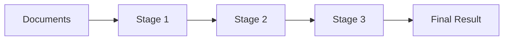

# MongoDB Aggregation Pipeline

## Introduction

The MongoDB Aggregation Pipeline is a powerful framework for data transformation and analysis that processes data records (documents) and returns computed results. It's like an assembly line where each stage performs a specific operation on the data, and the output of one stage becomes the input for the next stage.

Think of it as a series of data processing steps that transform your documents into aggregated results. This concept is particularly important for data analysis, reporting, and complex queries that go beyond what simple CRUD operations can achieve.

## Understanding the Aggregation Pipeline

### What is the Aggregation Pipeline?

The aggregation pipeline consists of "stages," where each stage transforms the documents as they pass through. Each stage performs a specific operation on the input documents, such as:

- Filtering
- Grouping
- Sorting
- Transforming
- Computing values

The pipeline processes documents sequentially, applying transformations at each stage until the final result is achieved.



### Basic Syntax

The basic syntax for MongoDB's aggregation pipeline is:

```javascript
db.collection.aggregate([
  { $stage1: { <stage1 specifications> } },
  { $stage2: { <stage2 specifications> } },
  // ... more stages
])
```

Each stage in the pipeline begins with a dollar sign ($) followed by the stage name and its specifications.

## Common Aggregation Pipeline Stages

Let's explore some of the most frequently used stages in the aggregation pipeline:

### 1. $match - Filtering Documents

The `$match` stage filters documents, similar to the `find()` method. It uses the same query syntax as regular MongoDB queries.

```javascript
db.orders.aggregate([
  { $match: { status: "completed", total: { $gt: 100 } } }
])
```

This pipeline stage will filter documents where the `status` is "completed" and the `total` is greater than 100.

### 2. $group - Grouping Documents

The `$group` stage groups documents by a specified expression and can apply accumulator expressions to the grouped documents.

```javascript
db.orders.aggregate([
  { 
    $group: {
      _id: "$customerId",
      totalSpent: { $sum: "$total" },
      orderCount: { $sum: 1 },
      averageOrderValue: { $avg: "$total" }
    } 
  }
])
```

This groups orders by `customerId` and calculates the total spent, number of orders, and average order value for each customer.

### 3. $sort - Sorting Documents

The `$sort` stage sorts the documents based on specified fields. Use `1` for ascending and `-1` for descending order.

```javascript
db.orders.aggregate([
  { $sort: { date: -1, total: -1 } }
])
```

This sorts the orders by date in descending order, and for orders with the same date, by total in descending order.

### 4. $project - Reshaping Documents

The `$project` stage reshapes documents by including, excluding, or adding new fields.

```javascript
db.customers.aggregate([
  { 
    $project: {
      fullName: { $concat: ["$firstName", " ", "$lastName"] },
      contactInfo: {
        email: "$email",
        phone: "$phoneNumber"
      },
      _id: 0 // exclude the _id field
    } 
  }
])
```

This creates a new document structure with a `fullName` field and a nested `contactInfo` object, while excluding the `_id` field.

### 5. $limit and $skip - Pagination

These stages are useful for pagination:

```javascript
db.products.aggregate([
  { $sort: { price: -1 } },
  { $skip: 10 }, // Skip the first 10 documents
  { $limit: 5 }  // Limit to 5 documents
])
```

This returns 5 products, starting after the first 10 most expensive products.

### 6. $unwind - Expanding Arrays

The `$unwind` stage deconstructs an array field, creating a new document for each element.

```javascript
db.inventory.aggregate([
  { $unwind: "$tags" }
])
```

If a document has `tags: ["electronics", "gadgets"]`, `$unwind` will create two documents, one with `tags: "electronics"` and another with `tags: "gadgets"`.

## Building a Complete Pipeline

Now let's put these stages together to solve a common business problem. Imagine we have an e-commerce dataset with collections for orders and products.

**Problem**: Find the top 3 best-selling product categories by revenue for the year 2023.

```javascript
db.orders.aggregate([
  // Stage 1: Filter orders from 2023
  {
    $match: {
      orderDate: { 
        $gte: new Date("2023-01-01"), 
        $lt: new Date("2024-01-01") 
      },
      status: "completed"
    }
  },
  
  // Stage 2: Unwind the items array to process each item
  {
    $unwind: "$items"
  },
  
  // Stage 3: Look up product details
  {
    $lookup: {
      from: "products",
      localField: "items.productId",
      foreignField: "_id",
      as: "productDetails"
    }
  },
  
  // Stage 4: Unwind the productDetails array
  {
    $unwind: "$productDetails"
  },
  
  // Stage 5: Group by category and calculate total revenue
  {
    $group: {
      _id: "$productDetails.category",
      totalRevenue: { 
        $sum: { $multiply: ["$items.quantity", "$items.price"] } 
      },
      totalItems: { $sum: "$items.quantity" }
    }
  },
  
  // Stage 6: Sort by revenue in descending order
  {
    $sort: { totalRevenue: -1 }
  },
  
  // Stage 7: Limit to top 3 categories
  {
    $limit: 3
  },
  
  // Stage 8: Format the final output
  {
    $project: {
      category: "$_id",
      totalRevenue: { $round: ["$totalRevenue", 2] },
      totalItems: 1,
      _id: 0
    }
  }
])
```

**Output:**

```javascript
[
  {
    "category": "Electronics",
    "totalRevenue": 58934.75,
    "totalItems": 423
  },
  {
    "category": "Home & Kitchen",
    "totalRevenue": 32150.22,
    "totalItems": 512
  },
  {
    "category": "Sports & Outdoors",
    "totalRevenue": 27489.50,
    "totalItems": 318
  }
]
```

## Performance Considerations

When working with aggregation pipelines, keep these performance tips in mind:

1. **Place `$match` and `$limit` stages as early as possible** to reduce the amount of data flowing through the pipeline.
2. **Use indexes to support the `$match` and `$sort` stages** for better performance.
3. **Be aware of memory limitations** - aggregation operations have a 100MB memory limit by default. Use `{ allowDiskUse: true }` for larger datasets.
4. **Monitor the performance** using `explain()` to understand how your pipeline executes.

```javascript
db.orders.aggregate([
  // Pipeline stages
], { allowDiskUse: true }).explain()
```

## Real-world Applications

### 1. Financial Reporting

Calculate monthly revenue and transactions:

```javascript
db.transactions.aggregate([
  {
    $match: { 
      transactionDate: { $gte: new Date("2023-01-01"), $lt: new Date("2024-01-01") }
    }
  },
  {
    $group: {
      _id: { 
        month: { $month: "$transactionDate" },
        year: { $year: "$transactionDate" }
      },
      revenue: { $sum: "$amount" },
      transactionCount: { $sum: 1 }
    }
  },
  {
    $sort: { "_id.year": 1, "_id.month": 1 }
  },
  {
    $project: {
      month: "$_id.month",
      year: "$_id.year",
      revenue: { $round: ["$revenue", 2] },
      transactionCount: 1,
      _id: 0
    }
  }
])
```

### 2. User Analytics

Analyze user activity by demographics:

```javascript
db.users.aggregate([
  {
    $match: { lastActive: { $gte: new Date("2023-06-01") } }
  },
  {
    $group: {
      _id: { 
        ageGroup: {
          $switch: {
            branches: [
              { case: { $lte: ["$age", 18] }, then: "Under 18" },
              { case: { $lte: ["$age", 25] }, then: "18-25" },
              { case: { $lte: ["$age", 35] }, then: "26-35" },
              { case: { $lte: ["$age", 50] }, then: "36-50" }
            ],
            default: "Over 50"
          }
        },
        gender: "$gender"
      },
      userCount: { $sum: 1 },
      avgSessionDuration: { $avg: "$avgSessionMinutes" },
      totalSessions: { $sum: "$sessionCount" }
    }
  },
  {
    $sort: { userCount: -1 }
  }
])
```

### 3. Inventory Management

Find products that need restocking:

```javascript
db.inventory.aggregate([
  {
    $match: { quantity: { $lt: "$reorderThreshold" } }
  },
  {
    $lookup: {
      from: "suppliers",
      localField: "supplierId",
      foreignField: "_id",
      as: "supplierInfo"
    }
  },
  {
    $unwind: "$supplierInfo"
  },
  {
    $project: {
      productName: 1,
      currentStock: "$quantity",
      reorderThreshold: 1,
      amountToOrder: { $subtract: ["$idealStock", "$quantity"] },
      supplier: "$supplierInfo.name",
      supplierContact: "$supplierInfo.contactEmail",
      _id: 0
    }
  },
  {
    $sort: { amountToOrder: -1 }
  }
])
```

## Summary

The MongoDB Aggregation Pipeline is a powerful tool for data processing and analysis. By combining different stages, you can transform your data in various ways to extract meaningful insights. Here's what we've covered:

- **Basic Structure**: A series of stages where each stage transforms data and passes it to the next
- **Common Stages**: `$match`, `$group`, `$sort`, `$project`, `$limit`, `$skip`, and `$unwind`
- **Complex Examples**: Building pipelines for business analytics
- **Performance Tips**: How to optimize your aggregation pipelines
- **Real-world Applications**: Financial reporting, user analytics, and inventory management

With the aggregation pipeline, you can perform complex data operations within MongoDB instead of having to extract the data and process it in your application code, making your data operations more efficient and less resource-intensive.

## Exercises

1. Create an aggregation pipeline to find the average rating for each product category.
2. Build a pipeline that identifies customers who haven't made a purchase in the last 3 months.
3. Develop a pipeline to calculate the month-over-month growth in sales.
4. Create a report showing the distribution of order values in different price ranges.
5. Build an aggregation pipeline that finds the most common words in product reviews.

## Additional Resources

- MongoDB's official documentation on the aggregation pipeline
- MongoDB University's free course on data aggregation
- MongoDB Compass, a GUI tool that includes a visual aggregation pipeline builder
- MongoDB Charts for visualizing the results of your aggregation pipelines

The MongoDB Aggregation Pipeline is a skill that improves with practice. Start with simple pipelines and gradually add complexity as you become more comfortable with the syntax and capabilities.