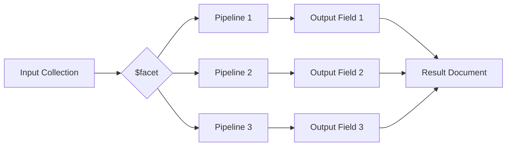

# MongoDB $facet Stage

## Introduction

When working with MongoDB's aggregation framework, you sometimes need to perform multiple operations on the same dataset simultaneously. This is where the `$facet` stage comes in handy. The `$facet` stage allows you to create multi-faceted aggregations that process multiple aggregation pipelines within a single stage. Each pipeline you define within a `$facet` stage produces its own output field in the result document.

Think of `$facet` as running multiple separate aggregation pipelines in parallel but on the same input data, then combining their results into a single output document.

## Syntax

The basic syntax for the `$facet` stage is:

```javascript
{
  $facet: {
    <outputField1>: [ <pipeline1> ],
    <outputField2>: [ <pipeline2> ],
    ...
  }
}
```

Where:
- `<outputField>` is the name of the output field that will contain the results of the corresponding pipeline
- `<pipeline>` is an array of aggregation stages that will be executed

## Basic Usage

Let's start with a simple example. Imagine we have a collection of products, and we want to get:
1. The total count of products
2. The top 5 most expensive products
3. Products categorized by their price range

Here's how we can do this using the `$facet` stage:

```javascript
db.products.aggregate([
  {
    $facet: {
      "totalCount": [
        { $count: "count" }
      ],
      "topExpensive": [
        { $sort: { price: -1 } },
        { $limit: 5 },
        { $project: { _id: 0, name: 1, price: 1 } }
      ],
      "priceRanges": [
        {
          $bucket: {
            groupBy: "$price",
            boundaries: [0, 50, 100, 200, 500, 1000],
            default: "1000+",
            output: {
              "count": { $sum: 1 },
              "products": { $push: "$name" }
            }
          }
        }
      ]
    }
  }
])
```

### Sample Output

```javascript
{
  "totalCount": [
    { "count": 150 }
  ],
  "topExpensive": [
    { "name": "Laptop", "price": 999 },
    { "name": "Smartphone", "price": 899 },
    { "name": "Camera", "price": 799 },
    { "name": "Tablet", "price": 499 },
    { "name": "Smartwatch", "price": 299 }
  ],
  "priceRanges": [
    { "_id": 0, "count": 10, "products": ["Mouse", "Keyboard", "USB Cable", ...] },
    { "_id": 50, "count": 25, "products": ["Headphones", "External HDD", ...] },
    // ... other price ranges
  ]
}
```

## Advantages of Using $facet

1. **Performance**: Instead of running multiple separate queries, you can get all the data you need in a single database request.
   
2. **Atomicity**: All facets see the same input documents at the same point in time, ensuring that the results are consistent.
   
3. **Reduced network overhead**: You only need one round trip to the database to get multiple views of your data.
   
4. **Structured output**: Results are organized into clearly labeled fields, making it easier to work with the returned data.

## Limitations and Considerations

When using `$facet`, be aware of the following limitations:

1. **Memory Constraints**: Each sub-pipeline within a `$facet` stage operates independently and maintains its own memory footprint. Complex operations within multiple pipelines can consume significant memory.

2. **No Cross-Pipeline References**: You cannot reference the output of one facet pipeline from another within the same `$facet` stage. To use the results of one facet in another operation, you would need a subsequent stage after the `$facet`.

3. **Cannot Use $out or $merge**: You cannot use these stages within a `$facet` pipeline as they attempt to write to a collection.

4. **Performance Considerations**: While `$facet` can be efficient for combining queries, very complex operations within each facet should be carefully monitored for performance impacts.

## Real-World Examples

### E-commerce Dashboard Statistics

Imagine building a dashboard for an e-commerce platform. You need various metrics from the orders collection:

```javascript
db.orders.aggregate([
  {
    $facet: {
      "revenueByDay": [
        { $match: { orderDate: { $gte: new Date(Date.now() - 7 * 24 * 60 * 60 * 1000) } } },
        { $group: { _id: { $dateToString: { format: "%Y-%m-%d", date: "$orderDate" } }, 
                   revenue: { $sum: "$totalAmount" } } },
        { $sort: { _id: 1 } }
      ],
      "topSellingProducts": [
        { $unwind: "$items" },
        { $group: { _id: "$items.productId", totalSold: { $sum: "$items.quantity" } } },
        { $sort: { totalSold: -1 } },
        { $limit: 5 },
        {
          $lookup: {
            from: "products",
            localField: "_id",
            foreignField: "_id",
            as: "productDetails"
          }
        },
        { $project: { _id: 0, name: { $arrayElemAt: ["$productDetails.name", 0] }, totalSold: 1 } }
      ],
      "customerMetrics": [
        { $group: { _id: "$customerId", orderCount: { $sum: 1 }, totalSpent: { $sum: "$totalAmount" } } },
        {
          $facet: {
            "averageOrderValue": [
              { $group: { _id: null, avg: { $avg: "$totalSpent" } } }
            ],
            "topCustomers": [
              { $sort: { totalSpent: -1 } },
              { $limit: 10 }
            ]
          }
        }
      ]
    }
  }
])
```

This single query generates daily revenue figures, identifies top-selling products, and provides customer metrics - all data needed for a comprehensive dashboard.

### Content Analysis Platform

For a content analysis platform that tracks articles:

```javascript
db.articles.aggregate([
  {
    $facet: {
      "categoryBreakdown": [
        { $group: { _id: "$category", count: { $sum: 1 } } },
        { $sort: { count: -1 } }
      ],
      "publishingTrends": [
        { $group: { 
          _id: { 
            year: { $year: "$publishDate" }, 
            month: { $month: "$publishDate" } 
          },
          articleCount: { $sum: 1 }
        }},
        { $sort: { "_id.year": 1, "_id.month": 1 } }
      ],
      "engagementMetrics": [
        { $project: {
          title: 1,
          commentCount: { $size: "$comments" },
          likeCount: "$likes",
          shareCount: "$shares"
        }},
        { $addFields: { 
          engagementScore: { 
            $add: ["$commentCount", "$likeCount", { $multiply: ["$shareCount", 2] }] 
          } 
        }},
        { $sort: { engagementScore: -1 } },
        { $limit: 10 }
      ],
      "authorPerformance": [
        { $group: { 
          _id: "$author", 
          articles: { $sum: 1 }, 
          avgComments: { $avg: { $size: "$comments" } },
          totalLikes: { $sum: "$likes" }
        }},
        { $sort: { articles: -1 } },
        { $limit: 5 }
      ]
    }
  }
])
```

## Nested $facet Operations

You can even nest `$facet` stages within other `$facet` pipelines for more complex data processing. However, be careful with this approach as it can lead to performance issues and make your aggregation harder to maintain.

```javascript
db.sales.aggregate([
  {
    $facet: {
      "overallMetrics": [
        { 
          $facet: {
            "dailyRevenue": [ /* pipeline */ ],
            "weeklyRevenue": [ /* pipeline */ ]
          }
        }
      ],
      "productMetrics": [
        { 
          $facet: {
            "byCategory": [ /* pipeline */ ],
            "byBrand": [ /* pipeline */ ]
          }
        }
      ]
    }
  }
])
```

## Processing $facet Results

Often, you'll want to process the results of a `$facet` stage further. Here's how you can do that using the `$project` stage:

```javascript
db.orders.aggregate([
  {
    $facet: {
      "countByStatus": [
        { $group: { _id: "$status", count: { $sum: 1 } } }
      ],
      "totalAmount": [
        { $group: { _id: null, total: { $sum: "$amount" } } }
      ]
    }
  },
  {
    $project: {
      countByStatus: 1,
      totalAmount: { $arrayElemAt: ["$totalAmount.total", 0] }
    }
  }
])
```

In this example, we're extracting the total amount value from the array returned by the "totalAmount" facet.

## Visualizing the $facet Workflow



## Summary

The `$facet` stage is a powerful tool in MongoDB's aggregation framework that allows you to run multiple aggregation pipelines on the same input documents simultaneously. It's particularly useful for:

- Building dashboards that require multiple views of the same data
- Generating reports with different metrics
- Reducing the number of database queries by combining them into one
- Creating structured responses with clearly labeled sections of data

Using `$facet` effectively can significantly improve your application's performance and simplify your code by reducing the need for multiple queries.

## Additional Resources

- [MongoDB Official Documentation on $facet](https://www.mongodb.com/docs/manual/reference/operator/aggregation/facet/)
- [MongoDB University - Aggregation Framework Course](https://learn.mongodb.com/)

## Practice Exercises

1. Create a `$facet` query that analyzes a user collection to produce:
   - Distribution of users by country
   - Distribution of users by age group
   - Top 5 active users based on login counts

2. For a movie database, write a `$facet` aggregation that returns:
   - Movies grouped by genre with average ratings
   - Distribution of movies by release year (in decades)
   - Top rated directors based on average movie ratings

3. For an e-commerce dataset, create a `$facet` query that returns monthly sales data, product category performance, and customer retention metrics in a single aggregation.

By mastering the `$facet` stage, you'll be able to create more efficient and elegant MongoDB aggregations for your applications.