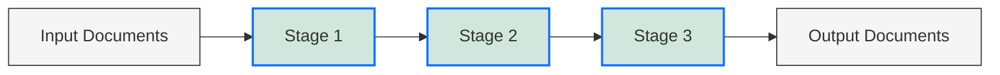

# MongoDB Pipeline Optimization

## Introduction

When working with MongoDB's aggregation framework, you might find your queries running slowly as your data grows or your pipelines become more complex. Pipeline optimization is the process of restructuring and fine-tuning your aggregation pipelines to improve performance, reduce memory usage, and make your database operations more efficient.

In this tutorial, you'll learn how to identify performance bottlenecks in your aggregation pipelines and apply optimization techniques that can dramatically improve response times and resource utilization.

## Why Optimize Aggregation Pipelines?

Before diving into specific techniques, let's understand why optimization matters:

1. **Improved response times** - Users experience faster query results
2. **Reduced server load** - Optimized pipelines consume fewer server resources
3. **Better scalability** - Efficiently handle growing datasets
4. **Lower operational costs** - Less computational resources means lower infrastructure expenses

## Understanding Pipeline Performance



MongoDB processes aggregation pipelines as a sequence of stages. Each stage:
- Receives documents from the previous stage
- Performs operations on those documents
- Passes the results to the next stage

The efficiency of your pipeline depends on:
- Document size and count at each stage
- Types of operations performed
- Order of stages
- Available indexes

## Key Optimization Techniques

### 1. Use Indexes Effectively

One of the most impactful optimizations is ensuring your pipeline can leverage existing indexes.

#### Example: Unoptimized Query

```javascript
db.orders.aggregate([
  { $match: { status: "completed" } },
  { $sort: { orderDate: -1 } },
  { $limit: 100 }
]);
```

If you have no indexes on `status` or `orderDate`, MongoDB must scan all documents, sort in memory, and then return results.

#### Optimized Query with Indexes

First, create appropriate indexes:

```javascript
db.orders.createIndex({ status: 1, orderDate: -1 });
```

Now your query can use this index for both filtering and sorting:

```javascript
db.orders.aggregate([
  { $match: { status: "completed" } },
  { $sort: { orderDate: -1 } },
  { $limit: 100 }
]);
```

With the index in place, MongoDB can:
1. Use the index to find documents where `status` is "completed"
2. Use the index to retrieve those documents in order by `orderDate`
3. Return only the first 100 documents

### 2. Place `$match` and `$limit` Stages Early

Filtering and limiting documents early in the pipeline reduces the amount of data processed by later stages.

#### Inefficient Pipeline

```javascript
db.products.aggregate([
  { $project: { name: 1, category: 1, price: 1, tax: { $multiply: ["$price", 0.08] } } },
  { $match: { category: "electronics" } },
  { $limit: 20 }
]);
```

This pipeline calculates tax for all products before filtering by category.

#### Optimized Pipeline

```javascript
db.products.aggregate([
  { $match: { category: "electronics" } },
  { $limit: 20 },
  { $project: { name: 1, category: 1, price: 1, tax: { $multiply: ["$price", 0.08] } } }
]);
```

In the optimized version, we:
1. Filter by category first, reducing the dataset
2. Limit to 20 documents
3. Calculate tax only for those 20 documents

### 3. Use `$project` and Field Inclusion Wisely

Carrying unnecessary fields through your pipeline increases memory usage. Only include the fields you need.

#### Memory-Intensive Pipeline

```javascript
db.inventory.aggregate([
  { $match: { inStock: true } },
  // No field projection, all fields are passed through
  { $group: { _id: "$warehouse", count: { $sum: 1 } } }
]);
```

#### Optimized Pipeline with Projection

```javascript
db.inventory.aggregate([
  { $match: { inStock: true } },
  { $project: { warehouse: 1, _id: 0 } },
  { $group: { _id: "$warehouse", count: { $sum: 1 } } }
]);
```

The optimized pipeline only carries the `warehouse` field through to the grouping stage.

### 4. Use Aggregation Alternatives When Appropriate

Sometimes, simpler operations can replace complex aggregation pipelines.

#### Example: Counting Documents

Instead of:

```javascript
db.users.aggregate([
  { $match: { active: true } },
  { $count: "activeUsers" }
]);
```

Use the simpler and more efficient:

```javascript
db.users.countDocuments({ active: true });
```

### 5. Use `$addFields` Instead of `$project` for Adding Fields

When you want to add fields without removing existing ones, `$addFields` is more efficient than `$project`.

#### Using `$project` to Add Fields

```javascript
db.orders.aggregate([
  { $project: {
      // We need to explicitly include all fields we want to keep
      _id: 1,
      customer: 1,
      products: 1,
      orderDate: 1,
      status: 1,
      // New calculated field
      total: { $sum: "$products.price" }
    }
  }
]);
```

#### Optimized with `$addFields`

```javascript
db.orders.aggregate([
  { $addFields: {
      // Only specify the new field, all existing fields are preserved
      total: { $sum: "$products.price" }
    }
  }
]);
```

### 6. Use `allowDiskUse` for Large Result Sets

When working with large datasets that exceed MongoDB's memory limit (100MB by default), use the `allowDiskUse` option:

```javascript
db.largeCollection.aggregate([
  // Your pipeline stages
], { allowDiskUse: true });
```

This allows operations like sorting and grouping to use disk space when needed, preventing pipeline failures due to memory constraints.

## Real-World Optimization Example

Let's walk through optimizing a more complex pipeline that analyzes e-commerce sales data:

### Original Pipeline

```javascript
db.sales.aggregate([
  // Get all sales
  { $match: {} },
  // Unwinding creates one document per item in each sale
  { $unwind: "$items" },
  // Calculate some values
  { $project: {
      date: 1,
      storeLocation: 1,
      customer: 1,
      itemName: "$items.name",
      itemPrice: "$items.price",
      itemQuantity: "$items.quantity",
      itemTotal: { $multiply: ["$items.price", "$items.quantity"] }
    }
  },
  // Filter to only high-value items
  { $match: { itemTotal: { $gte: 100 } } },
  // Group by store
  { $group: {
      _id: "$storeLocation",
      totalSales: { $sum: "$itemTotal" },
      count: { $sum: 1 }
    }
  },
  // Sort by total sales
  { $sort: { totalSales: -1 } }
]);
```

### Optimized Pipeline

```javascript
db.sales.aggregate([
  // Filter by date range to reduce initial dataset
  { $match: { date: { $gte: new Date("2023-01-01"), $lt: new Date("2023-02-01") } } },
  // Only include fields we'll need
  { $project: {
      storeLocation: 1,
      items: 1
    }
  },
  // Unwinding after initial filtering reduces document multiplication
  { $unwind: "$items" },
  // Add calculated fields
  { $addFields: {
      itemTotal: { $multiply: ["$items.price", "$items.quantity"] }
    }
  },
  // Filter to only high-value items
  { $match: { itemTotal: { $gte: 100 } } },
  // Group by store
  { $group: {
      _id: "$storeLocation",
      totalSales: { $sum: "$itemTotal" },
      count: { $sum: 1 }
    }
  },
  // Sort by total sales
  { $sort: { totalSales: -1 } }
]);
```

The optimizations include:
1. Adding a date filter early to reduce the initial dataset
2. Projecting only needed fields before unwinding
3. Using `$addFields` for calculated values
4. Keeping the pipeline focused on required data

## Using `explain()` to Analyze Pipeline Performance

MongoDB provides the `explain()` method to help you understand how a pipeline executes:

```javascript
db.collection.aggregate([
  // Your pipeline stages
], { explain: true });
```

This returns a detailed explanation of how MongoDB plans to execute your pipeline, including:
- Whether indexes were used
- The execution plan for each stage
- Estimated number of documents at each stage

For example:

```javascript
db.orders.aggregate([
  { $match: { status: "completed" } },
  { $sort: { orderDate: -1 } },
  { $limit: 100 }
], { explain: true });
```

This will show whether MongoDB is using your indexes efficiently and help identify potential bottlenecks.

## Pipeline Optimization Checklist

Use this checklist when optimizing your aggregation pipelines:

1. ✅ Place `$match` stages as early as possible
2. ✅ Create appropriate indexes for `$match`, `$sort`, and `$lookup` operations
3. ✅ Limit fields using `$project` or field inclusion in `$match`
4. ✅ Use `$limit` and `$skip` stages early when possible
5. ✅ Use `$addFields` instead of `$project` when adding fields
6. ✅ Consider placing `$unwind` stages after filtering operations
7. ✅ Set `allowDiskUse: true` for memory-intensive operations
8. ✅ Use simpler alternatives to aggregation when appropriate
9. ✅ Use `explain()` to analyze and verify optimizations

## Summary

Optimizing MongoDB aggregation pipelines is a critical skill for building performant applications. By understanding how the aggregation framework processes data and applying the techniques covered in this tutorial, you can significantly reduce query times and resource consumption.

Remember these key principles:
- Filter early to reduce the dataset
- Only carry the fields you need
- Use indexes effectively
- Place operations in the most efficient order
- Use the right operators for each task
- Analyze performance with `explain()`

With regular attention to pipeline optimization, your MongoDB-powered applications can maintain high performance even as your data and user base grow.

## Additional Resources

- [MongoDB Aggregation Pipeline Optimization (Official Documentation)](https://docs.mongodb.com/manual/core/aggregation-pipeline-optimization/)
- [MongoDB Compass - A GUI tool with Aggregation Pipeline Builder](https://www.mongodb.com/products/compass)
- [MongoDB University - Free courses on MongoDB performance](https://university.mongodb.com/)

## Exercises

1. Take an existing aggregation pipeline from your project and analyze it with `explain()`. Identify at least two optimization opportunities.

2. Refactor the following pipeline to improve performance:
   ```javascript
   db.orders.aggregate([
     { $unwind: "$items" },
     { $project: { 
         customer: 1, 
         orderDate: 1, 
         item: "$items.name", 
         price: "$items.price" 
       } 
     },
     { $match: { price: { $gt: 50 }, orderDate: { $gte: new Date("2023-01-01") } } },
     { $sort: { orderDate: -1 } },
     { $limit: 10 }
   ]);
   ```

3. Create appropriate indexes for this pipeline and explain your choices:
   ```javascript
   db.restaurants.aggregate([
     { $match: { cuisine: "Italian", "address.zipcode": "10128" } },
     { $sort: { rating: -1 } },
     { $limit: 20 }
   ]);
   ```

Happy optimizing!