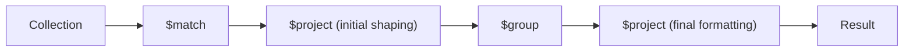

# MongoDB $project Stage

## Introduction

The `$project` stage is one of the most versatile and commonly used operators in MongoDB's aggregation pipeline. It allows you to reshape documents by including, excluding, or transforming fields to create the exact document structure you want in your results. Think of `$project` as a document sculptor that lets you shape your data to fit your application's needs.

In this tutorial, we'll explore how to use the `$project` stage effectively to:
- Include or exclude specific fields
- Rename fields
- Create computed fields
- Transform data types
- Work with arrays and nested objects

## Basic Syntax

The basic syntax of the `$project` stage is straightforward:

```javascript
{ $project: { <specification(s)> } }
```

Where `<specification(s)>` defines which fields to include, exclude, or transform in the output documents.

## Including and Excluding Fields

### Including Specific Fields

To include only specific fields in the output, set the field value to `1`:

```javascript
db.collection.aggregate([
  { $project: { 
      field1: 1,
      field2: 1,
      _id: 0  // Explicitly exclude _id field
    }
  }
])
```

**Note**: By default, the `_id` field is included in the output. To exclude it, you must explicitly set it to `0`.

### Example: Including Specific Fields

Let's say we have a collection of books:

```javascript
// Sample document in books collection
{
  _id: ObjectId("5f7d1bd0c36d9c2c6a4b9c01"),
  title: "MongoDB: The Definitive Guide",
  author: "Shannon Bradshaw",
  publishYear: 2019,
  pages: 514,
  category: "Database",
  publisher: "O'Reilly Media"
}
```

To create a simplified view with just the title and author:

```javascript
db.books.aggregate([
  {
    $project: {
      _id: 0,
      title: 1,
      author: 1
    }
  }
])
```

**Output**:
```javascript
{
  "title": "MongoDB: The Definitive Guide",
  "author": "Shannon Bradshaw"
}
```

### Excluding Specific Fields

To exclude specific fields, set them to `0`:

```javascript
db.collection.aggregate([
  { $project: { 
      fieldToExclude1: 0,
      fieldToExclude2: 0 
    }
  }
])
```

**Important**: You cannot mix inclusion and exclusion in the same `$project` stage, except for the `_id` field.

### Example: Excluding Fields

To keep all fields except publisher and pages from our books collection:

```javascript
db.books.aggregate([
  {
    $project: {
      publisher: 0,
      pages: 0
    }
  }
])
```

**Output**:
```javascript
{
  "_id": ObjectId("5f7d1bd0c36d9c2c6a4b9c01"),
  "title": "MongoDB: The Definitive Guide",
  "author": "Shannon Bradshaw",
  "publishYear": 2019,
  "category": "Database"
}
```

## Renaming Fields

To rename a field, you can use the following syntax:

```javascript
db.collection.aggregate([
  {
    $project: {
      newFieldName: "$oldFieldName"
    }
  }
])
```

### Example: Renaming Fields

Let's rename the `publishYear` field to `year` in our books collection:

```javascript
db.books.aggregate([
  {
    $project: {
      _id: 0,
      title: 1,
      author: 1,
      year: "$publishYear"
    }
  }
])
```

**Output**:
```javascript
{
  "title": "MongoDB: The Definitive Guide",
  "author": "Shannon Bradshaw",
  "year": 2019
}
```

## Creating Computed Fields

The `$project` stage can create computed fields using expressions:

```javascript
db.collection.aggregate([
  {
    $project: {
      computedField: { $expression }
    }
  }
])
```

### Example: Computing Fields with Arithmetic Operations

Let's calculate the book's age and add a boolean flag for books older than 5 years:

```javascript
db.books.aggregate([
  {
    $project: {
      _id: 0,
      title: 1,
      author: 1,
      yearPublished: "$publishYear",
      bookAge: { $subtract: [2023, "$publishYear"] },
      isOlderThan5Years: { $gt: [{ $subtract: [2023, "$publishYear"] }, 5] }
    }
  }
])
```

**Output**:
```javascript
{
  "title": "MongoDB: The Definitive Guide",
  "author": "Shannon Bradshaw",
  "yearPublished": 2019,
  "bookAge": 4,
  "isOlderThan5Years": false
}
```

### String Operations

The `$project` stage also supports string operations:

```javascript
db.books.aggregate([
  {
    $project: {
      _id: 0,
      title: 1,
      author: 1,
      publishYear: 1,
      titleLength: { $strLenCP: "$title" },
      titleUpperCase: { $toUpper: "$title" },
      authorInitials: {
        $concat: [
          { $substr: [{ $toUpper: "$author" }, 0, 1] },
          "."
        ]
      }
    }
  }
])
```

**Output**:
```javascript
{
  "title": "MongoDB: The Definitive Guide",
  "author": "Shannon Bradshaw",
  "publishYear": 2019,
  "titleLength": 29,
  "titleUpperCase": "MONGODB: THE DEFINITIVE GUIDE",
  "authorInitials": "S."
}
```

## Conditional Fields

You can use conditional expressions to determine field values:

```javascript
db.books.aggregate([
  {
    $project: {
      _id: 0,
      title: 1,
      author: 1,
      publishYear: 1,
      category: 1,
      ageCategory: {
        $cond: {
          if: { $lt: ["$publishYear", 2015] },
          then: "Older Book",
          else: "Recent Book"
        }
      },
      recommendationLevel: {
        $switch: {
          branches: [
            { case: { $eq: ["$category", "Database"] }, then: "Highly Recommended" },
            { case: { $eq: ["$category", "Programming"] }, then: "Recommended" }
          ],
          default: "Optional Reading"
        }
      }
    }
  }
])
```

**Output**:
```javascript
{
  "title": "MongoDB: The Definitive Guide",
  "author": "Shannon Bradshaw",
  "publishYear": 2019,
  "category": "Database",
  "ageCategory": "Recent Book",
  "recommendationLevel": "Highly Recommended"
}
```

## Working with Arrays

The `$project` stage provides powerful operators for array manipulation:

### Array Element Access

```javascript
db.courses.aggregate([
  {
    $project: {
      _id: 0,
      courseTitle: 1,
      firstTopic: { $arrayElemAt: ["$topics", 0] },
      lastTopic: { $arrayElemAt: ["$topics", -1] }
    }
  }
])
```

### Array Transformation

Let's say we have a collection of courses with an array of topics:

```javascript
// Sample document in courses collection
{
  _id: ObjectId("5f7d1c40c36d9c2c6a4b9c02"),
  courseTitle: "MongoDB Fundamentals",
  instructor: "John Doe",
  topics: ["Introduction", "CRUD Operations", "Aggregation", "Indexes", "Replication"],
  durationHours: 15
}
```

We can transform the topics array:

```javascript
db.courses.aggregate([
  {
    $project: {
      _id: 0,
      courseTitle: 1,
      instructor: 1,
      topicCount: { $size: "$topics" },
      topicsUpperCase: { $map: {
        input: "$topics",
        as: "topic",
        in: { $toUpper: "$$topic" }
      }},
      hasCRUDTopic: { $in: ["CRUD Operations", "$topics"] },
      firstThreeTopics: { $slice: ["$topics", 0, 3] }
    }
  }
])
```

**Output**:
```javascript
{
  "courseTitle": "MongoDB Fundamentals",
  "instructor": "John Doe",
  "topicCount": 5,
  "topicsUpperCase": ["INTRODUCTION", "CRUD OPERATIONS", "AGGREGATION", "INDEXES", "REPLICATION"],
  "hasCRUDTopic": true,
  "firstThreeTopics": ["Introduction", "CRUD Operations", "Aggregation"]
}
```

## Working with Nested Objects

You can access and transform fields in nested objects using dot notation:

```javascript
// Sample document in students collection
{
  _id: ObjectId("5f7d1c80c36d9c2c6a4b9c03"),
  name: "Alice Johnson",
  contact: {
    email: "alice@example.com",
    phone: "555-123-4567",
    address: {
      street: "123 Main St",
      city: "New York",
      zipcode: "10001"
    }
  },
  grades: [85, 92, 78, 95]
}
```

We can extract and transform nested fields:

```javascript
db.students.aggregate([
  {
    $project: {
      _id: 0,
      studentName: "$name",
      email: "$contact.email",
      city: "$contact.address.city",
      fullAddress: {
        $concat: [
          "$contact.address.street", ", ",
          "$contact.address.city", ", ",
          "$contact.address.zipcode"
        ]
      },
      averageGrade: { $avg: "$grades" }
    }
  }
])
```

**Output**:
```javascript
{
  "studentName": "Alice Johnson",
  "email": "alice@example.com",
  "city": "New York",
  "fullAddress": "123 Main St, New York, 10001",
  "averageGrade": 87.5
}
```

## Real-world Example: E-commerce Data Analysis

Let's look at how `$project` can be used in a real-world e-commerce application to prepare data for reports and analytics:

```javascript
// Sample document in orders collection
{
  _id: ObjectId("5f7d1cc0c36d9c2c6a4b9c04"),
  orderId: "ORD12345",
  customerId: "CUST987",
  orderDate: ISODate("2023-03-15T14:30:00Z"),
  items: [
    { product: "Laptop", price: 1299.99, quantity: 1 },
    { product: "Mouse", price: 24.99, quantity: 2 },
    { product: "Keyboard", price: 89.99, quantity: 1 }
  ],
  shippingAddress: {
    street: "456 Oak Ave",
    city: "San Francisco",
    state: "CA",
    zipcode: "94107"
  },
  paymentMethod: "Credit Card",
  shippingCost: 15.99,
  taxAmount: 114.95
}
```

Now, let's create a sales report with the `$project` stage:

```javascript
db.orders.aggregate([
  {
    $project: {
      _id: 0,
      orderId: 1,
      orderDate: 1,
      customer: "$customerId",
      location: {
        city: "$shippingAddress.city",
        state: "$shippingAddress.state"
      },
      itemCount: { $size: "$items" },
      itemsSold: {
        $map: {
          input: "$items",
          as: "item",
          in: {
            product: "$$item.product",
            subtotal: { $multiply: ["$$item.price", "$$item.quantity"] }
          }
        }
      },
      subtotal: {
        $reduce: {
          input: "$items",
          initialValue: 0,
          in: {
            $add: [
              "$$value", 
              { $multiply: ["$$this.price", "$$this.quantity"] }
            ]
          }
        }
      },
      totalAmount: {
        $add: [
          {
            $reduce: {
              input: "$items",
              initialValue: 0,
              in: {
                $add: [
                  "$$value", 
                  { $multiply: ["$$this.price", "$$this.quantity"] }
                ]
              }
            }
          },
          "$shippingCost",
          "$taxAmount"
        ]
      },
      orderMonth: { $month: "$orderDate" },
      orderYear: { $year: "$orderDate" }
    }
  }
])
```

**Output**:
```javascript
{
  "orderId": "ORD12345",
  "orderDate": ISODate("2023-03-15T14:30:00Z"),
  "customer": "CUST987",
  "location": {
    "city": "San Francisco",
    "state": "CA"
  },
  "itemCount": 3,
  "itemsSold": [
    { "product": "Laptop", "subtotal": 1299.99 },
    { "product": "Mouse", "subtotal": 49.98 },
    { "product": "Keyboard", "subtotal": 89.99 }
  ],
  "subtotal": 1439.96,
  "totalAmount": 1570.90,
  "orderMonth": 3,
  "orderYear": 2023
}
```

This transformed document is now perfect for generating sales reports, with calculated totals, extracted location information, and structured product data.

## Placement in Aggregation Pipeline

The `$project` stage can be used multiple times throughout an aggregation pipeline. This allows you to reshape documents progressively as they move through the pipeline.



For example:

```javascript
db.orders.aggregate([
  // Filter for orders from 2023
  { $match: { orderDate: { $gte: ISODate("2023-01-01"), $lt: ISODate("2024-01-01") } } },
  
  // First project stage: extract fields needed for grouping
  { $project: {
      customerId: 1,
      orderMonth: { $month: "$orderDate" },
      totalAmount: { $add: [
        { $sum: { $map: { input: "$items", as: "item", in: { $multiply: ["$$item.price", "$$item.quantity"] } } } },
        "$shippingCost",
        "$taxAmount"
      ]}
    }
  },
  
  // Group by customer and month
  { $group: {
      _id: { customer: "$customerId", month: "$orderMonth" },
      totalSpending: { $sum: "$totalAmount" },
      orderCount: { $sum: 1 }
    }
  },
  
  // Second project stage: final formatting
  { $project: {
      _id: 0,
      customerId: "$_id.customer",
      month: "$_id.month",
      totalSpending: { $round: ["$totalSpending", 2] },
      orderCount: 1,
      averageOrderValue: { $round: [{ $divide: ["$totalSpending", "$orderCount"] }, 2] }
    }
  },
  
  // Sort by customer and month
  { $sort: { customerId: 1, month: 1 } }
])
```

## Performance Considerations

1. **Use early in the pipeline**: Using `$project` early in the pipeline to reduce document size can improve performance by decreasing the amount of data processed by subsequent stages.

2. **Balance with readability**: Multiple `$project` stages might improve code readability but could impact performance. For complex transformations, consider combining multiple operations into a single `$project` stage.

3. **Avoid unnecessary projections**: Only include the fields you need for subsequent stages or your final result.

## Common Pitfalls

1. **Mixing inclusion and exclusion**: You cannot mix `1` and `0` values in the same `$project` stage, except for the `_id` field.

2. **Missing dollar signs**: When referencing a field, remember to use the dollar sign prefix (`$fieldName`).

3. **Overwriting fields**: Be careful when computing fields with the same name as existing fields, as they will be overwritten.

## Summary

The `$project` stage is a powerful tool in MongoDB's aggregation framework that allows you to reshape your documents in numerous ways:

- Include or exclude specific fields
- Rename fields for more meaningful output
- Create computed fields using various operators
- Perform string operations and conditional logic
- Transform arrays and nested objects

This flexibility makes `$project` essential for preparing your data for reporting, visualization, or further processing within your application.

## Exercises

1. Given a collection of products with fields `name`, `category`, `price`, and `stock`, use `$project` to create a document with the name, price, a boolean field `inStock` (true if stock > 0), and a string field `priceCategory` ("Budget" if price < 50, "Mid-range" if price is between 50 and 200, "Premium" otherwise).

2. For a collection of blog posts with fields `title`, `content`, `author`, and `tags` (an array), use `$project` to create a document with the title, author, tag count, and a `preview` field that contains the first 100 characters of the content followed by "...".

3. Create a `$project` stage that converts a document with temperatures in Celsius to Fahrenheit, using the formula F = C * 9/5 + 32.

## Additional Resources

- [Official MongoDB Documentation on $project](https://www.mongodb.com/docs/manual/reference/operator/aggregation/project/)
- [MongoDB University: M121 - The MongoDB Aggregation Framework](https://learn.mongodb.com/courses/m121-aggregation-framework)
- [MongoDB Blog: Advanced Data Transformations with $project](https://www.mongodb.com/blog/post/aggregation-pipeline-performance-best-practices)