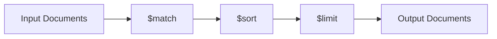

# MongoDB $sort Stage

## Introduction

The `$sort` stage is one of the most frequently used stages in MongoDB's Aggregation Framework. It allows you to control the order of documents as they flow through your aggregation pipeline. Whether you're building reports, displaying data in user interfaces, or preparing data for further processing, sorting is often a crucial step in your data manipulation process.

In this tutorial, we'll dive deep into the `$sort` stage, explaining its syntax, usage patterns, and providing practical examples to help you master document sorting in MongoDB.

## Understanding the $sort Stage

The `$sort` stage orders the documents in the aggregation pipeline based on the specified field(s). You can sort documents in either ascending (1) or descending (-1) order.

### Basic Syntax

```javascript
{
  $sort: {
    <field1>: <sort order>,
    <field2>: <sort order>,
    ...
  }
}
```

Where:
- `<field>` is the field name you want to sort by
- `<sort order>` is either:
  - `1` for ascending order (smallest to largest, A to Z)
  - `-1` for descending order (largest to smallest, Z to A)

## Basic Usage Examples

Let's start with a simple collection of products to demonstrate how `$sort` works:

```javascript
// Sample products collection
[
  { _id: 1, name: "Laptop", price: 1200, category: "Electronics" },
  { _id: 2, name: "Headphones", price: 150, category: "Electronics" },
  { _id: 3, name: "Coffee Mug", price: 15, category: "Kitchen" },
  { _id: 4, name: "Monitor", price: 300, category: "Electronics" },
  { _id: 5, name: "Desk Chair", price: 250, category: "Furniture" }
]
```

### Example 1: Sort by Price (Ascending)

```javascript
db.products.aggregate([
  { $sort: { price: 1 } }
])
```

**Output:**
```javascript
[
  { _id: 3, name: "Coffee Mug", price: 15, category: "Kitchen" },
  { _id: 2, name: "Headphones", price: 150, category: "Electronics" },
  { _id: 5, name: "Desk Chair", price: 250, category: "Furniture" },
  { _id: 4, name: "Monitor", price: 300, category: "Electronics" },
  { _id: 1, name: "Laptop", price: 1200, category: "Electronics" }
]
```

### Example 2: Sort by Price (Descending)

```javascript
db.products.aggregate([
  { $sort: { price: -1 } }
])
```

**Output:**
```javascript
[
  { _id: 1, name: "Laptop", price: 1200, category: "Electronics" },
  { _id: 4, name: "Monitor", price: 300, category: "Electronics" },
  { _id: 5, name: "Desk Chair", price: 250, category: "Furniture" },
  { _id: 2, name: "Headphones", price: 150, category: "Electronics" },
  { _id: 3, name: "Coffee Mug", price: 15, category: "Kitchen" }
]
```

### Example 3: Sorting by Multiple Fields

You can sort by multiple fields to handle ties in your primary sort field:

```javascript
db.products.aggregate([
  { $sort: { category: 1, price: -1 } }
])
```

**Output:**
```javascript
[
  { _id: 1, name: "Laptop", price: 1200, category: "Electronics" },
  { _id: 4, name: "Monitor", price: 300, category: "Electronics" },
  { _id: 2, name: "Headphones", price: 150, category: "Electronics" },
  { _id: 5, name: "Desk Chair", price: 250, category: "Furniture" },
  { _id: 3, name: "Coffee Mug", price: 15, category: "Kitchen" }
]
```

This example sorts documents first by category (alphabetically) and then by price (highest to lowest) within each category.

## Advanced Usage and Tips

### Sort Position in the Pipeline

The position of the `$sort` stage in your aggregation pipeline is important for both performance and functionality:



1. **Early sorting**: Place `$sort` early in the pipeline (after `$match` if possible) to:
   - Utilize indexes for better performance
   - Reduce the number of documents to sort if used after `$match`

2. **Late sorting**: Place `$sort` later in the pipeline when:
   - You need to sort on calculated fields
   - You want to sort on the results of previous transformations

### Using $sort with $limit

A common and efficient pattern is combining `$sort` with `$limit` to get the "top N" documents:

```javascript
// Get the 3 most expensive products
db.products.aggregate([
  { $sort: { price: -1 } },
  { $limit: 3 }
])
```

**Output:**
```javascript
[
  { _id: 1, name: "Laptop", price: 1200, category: "Electronics" },
  { _id: 4, name: "Monitor", price: 300, category: "Electronics" },
  { _id: 5, name: "Desk Chair", price: 250, category: "Furniture" }
]
```

### Memory Restrictions

By default, `$sort` has a 100MB memory limit. For sorting larger datasets:

1. Use the `allowDiskUse: true` option to enable disk-based sorting:

```javascript
db.products.aggregate([
  { $sort: { price: 1 } }
], 
{ allowDiskUse: true })
```

2. Use indexing strategies for optimal performance:

```javascript
// Create an index on the price field
db.products.createIndex({ price: 1 })
```

## Real-World Applications

### Example 1: E-commerce Product Listing

Creating a paginated product list with sorting options:

```javascript
// Parameters
const sortField = "price";
const sortOrder = -1; // descending
const pageSize = 10;
const pageNumber = 2;
const skip = (pageNumber - 1) * pageSize;

// Aggregation
db.products.aggregate([
  { $match: { inStock: true } },
  { $sort: { [sortField]: sortOrder } },
  { $skip: skip },
  { $limit: pageSize },
  {
    $project: {
      name: 1,
      price: 1,
      category: 1,
      rating: 1,
      thumbnail: 1
    }
  }
])
```

This pipeline:
1. Filters for in-stock products
2. Sorts by price (highest first)
3. Implements pagination
4. Returns only the necessary fields for display

### Example 2: Sales Reporting

Creating a report of top-selling products by revenue:

```javascript
db.orders.aggregate([
  { $match: { orderDate: { $gte: new Date("2023-01-01"), $lt: new Date("2024-01-01") } } },
  { $unwind: "$items" },
  {
    $group: {
      _id: "$items.productId",
      productName: { $first: "$items.name" },
      totalRevenue: { $sum: { $multiply: ["$items.price", "$items.quantity"] } },
      unitsSold: { $sum: "$items.quantity" }
    }
  },
  { $sort: { totalRevenue: -1 } },
  { $limit: 10 },
  {
    $project: {
      _id: 0,
      productId: "$_id",
      productName: 1,
      totalRevenue: { $round: ["$totalRevenue", 2] },
      unitsSold: 1
    }
  }
])
```

This aggregation:
1. Filters orders from 2023
2. Breaks down orders into individual items
3. Groups and calculates revenue by product
4. Sorts by total revenue (highest first)
5. Gets only the top 10 products
6. Formats the output for reporting

## Performance Considerations

When using the `$sort` stage, keep these performance tips in mind:

1. **Use indexes for sorting** whenever possible
   - Create indexes on frequently sorted fields
   - Compound indexes should match your sort patterns

2. **Limit documents before sorting**
   - Use `$match` before `$sort` to reduce the dataset
   - Filter data as early as possible in the pipeline

3. **Memory usage awareness**
   - `$sort` requires memory to hold all documents for sorting
   - Use `allowDiskUse: true` for large datasets
   - Monitor your MongoDB instance during heavy aggregations

4. **Avoid sorting unnecessarily**
   - Only sort when order matters for your application logic
   - Consider if sorting can happen on the client side for small datasets

## Common Challenges and Solutions

### Sorting on Embedded Fields

To sort on fields inside embedded documents, use the dot notation:

```javascript
// Sample user collection with embedded address
db.users.aggregate([
  { $sort: { "address.city": 1, "address.zipcode": 1 } }
])
```

### Sorting by Computed Values

If you need to sort by a computed value, create it first with `$addFields` or `$project`:

```javascript
db.products.aggregate([
  {
    $addFields: {
      discountedPrice: { $subtract: ["$price", "$discount"] }
    }
  },
  { $sort: { discountedPrice: 1 } }
])
```

### Sorting with Null Values

MongoDB places null values before non-null values in ascending sorts. If you need different behavior:

```javascript
// Put null values last in ascending sort
db.customers.aggregate([
  {
    $sort: {
      // If lastPurchaseDate is null, use a far future date, else use the actual date
      lastPurchaseDate: 1
    }
  }
])

// Alternative approach using $addFields
db.customers.aggregate([
  {
    $addFields: {
      sortField: { 
        $cond: { 
          if: { $eq: ["$lastPurchaseDate", null] }, 
          then: new Date("9999-12-31"), 
          else: "$lastPurchaseDate" 
        } 
      }
    }
  },
  { $sort: { sortField: 1 } },
  { $project: { sortField: 0 } } // Remove the temporary field
])
```

## Summary

The `$sort` stage is a fundamental tool in MongoDB's aggregation framework that allows you to control the order of documents in your results. Key takeaways from this tutorial:

- Use `1` for ascending order and `-1` for descending order
- You can sort on multiple fields for more complex ordering
- Position the `$sort` stage strategically in your pipeline for optimal performance
- Combine `$sort` with `$limit` for efficient "top N" queries
- Use `allowDiskUse: true` for sorting large datasets
- Leverage indexes to improve sorting performance

Mastering the `$sort` stage will help you create more organized and useful results in your MongoDB aggregations, whether for reporting, data analysis, or application data display.

## Exercises

To practice what you've learned, try these exercises:

1. Create a collection of at least 10 user documents with fields for name, age, registration date, and subscription tier. Write an aggregation that:
   - Sorts users by subscription tier (ascending) and age (descending)
   - Limits the result to the first 5 documents

2. Using a collection of movie documents with fields for title, release year, genres (array), and rating:
   - Sort movies by rating (descending) and release year (descending)
   - Group the results by genre and get the top rated movie for each genre

3. Using the products collection from the examples:
   - Add a computed field that represents a "value score" (price divided by rating)
   - Sort products by this value score to identify the best value products

## Additional Resources

- [MongoDB Official Documentation: $sort](https://docs.mongodb.com/manual/reference/operator/aggregation/sort/)
- [MongoDB Performance Best Practices](https://docs.mongodb.com/manual/core/aggregation-pipeline-optimization/)
- [MongoDB Indexing Strategies](https://docs.mongodb.com/manual/applications/indexes/)

Happy aggregating!