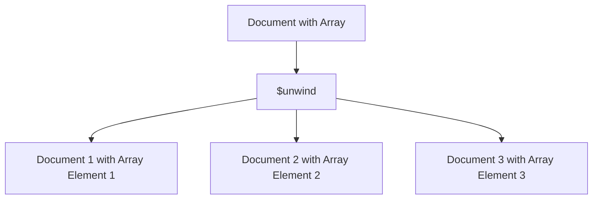

# MongoDB $unwind Stage

## Introduction

When working with MongoDB, you'll often encounter documents containing array fields. While arrays are powerful for storing related data together, there are scenarios where you need to work with each array element individually. That's where the `$unwind` aggregation stage comes in.

The `$unwind` stage deconstructs an array field from the input documents and outputs one document for each element in the array. It essentially "flattens" the array, creating a separate document for each array element while preserving all other fields from the original document.

## Basic Syntax

The basic syntax of the `$unwind` stage is:

```javascript
{ $unwind: <field path> }
```

Or with options:

```javascript
{
  $unwind: {
    path: <field path>,
    includeArrayIndex: <string>,
    preserveNullAndEmptyArrays: <boolean>
  }
}
```

## How $unwind Works

Let's visualize the process:



## Basic Example

Consider a collection of products with a `tags` array:

```javascript
db.products.insertMany([
  { _id: 1, name: "Laptop", tags: ["electronics", "computers", "office"] },
  { _id: 2, name: "Smartphone", tags: ["electronics", "mobile", "communication"] },
  { _id: 3, name: "Coffee Mug", tags: ["kitchen", "office"] }
])
```

To unwind the `tags` array:

```javascript
db.products.aggregate([
  { $unwind: "$tags" }
])
```

**Output:**

```javascript
{ "_id": 1, "name": "Laptop", "tags": "electronics" }
{ "_id": 1, "name": "Laptop", "tags": "computers" }
{ "_id": 1, "name": "Laptop", "tags": "office" }
{ "_id": 2, "name": "Smartphone", "tags": "electronics" }
{ "_id": 2, "name": "Smartphone", "tags": "mobile" }
{ "_id": 2, "name": "Smartphone", "tags": "communication" }
{ "_id": 3, "name": "Coffee Mug", "tags": "kitchen" }
{ "_id": 3, "name": "Coffee Mug", "tags": "office" }
```

Notice how each document with an array of tags has been transformed into multiple documents, each containing a single tag value.

## Advanced Options

### includeArrayIndex

The `includeArrayIndex` option lets you add a field to the output documents containing the array index of the element:

```javascript
db.products.aggregate([
  {
    $unwind: {
      path: "$tags",
      includeArrayIndex: "tagPosition"
    }
  }
])
```

**Output:**

```javascript
{ "_id": 1, "name": "Laptop", "tags": "electronics", "tagPosition": 0 }
{ "_id": 1, "name": "Laptop", "tags": "computers", "tagPosition": 1 }
{ "_id": 1, "name": "Laptop", "tags": "office", "tagPosition": 2 }
// ... and so on
```

### preserveNullAndEmptyArrays

By default, `$unwind` excludes documents where the specified path is null, missing, or an empty array. To include these documents in the output, set `preserveNullAndEmptyArrays` to `true`:

```javascript
// Add a product with no tags
db.products.insertOne({ _id: 4, name: "Desk", tags: [] })
db.products.insertOne({ _id: 5, name: "Pen" }) // No tags field

db.products.aggregate([
  {
    $unwind: {
      path: "$tags",
      preserveNullAndEmptyArrays: true
    }
  }
])
```

**Output:**

```javascript
// ... previous outputs
{ "_id": 4, "name": "Desk" } // Empty array becomes null
{ "_id": 5, "name": "Pen" } // Missing field preserved
```

## Common Use Cases

### 1. Filtering Array Elements

You can use `$unwind` together with `$match` to filter specific array elements:

```javascript
db.products.aggregate([
  { $unwind: "$tags" },
  { $match: { tags: "office" } }
])
```

**Output:**

```javascript
{ "_id": 1, "name": "Laptop", "tags": "office" }
{ "_id": 3, "name": "Coffee Mug", "tags": "office" }
```

### 2. Grouping and Counting

Count how many products have each tag:

```javascript
db.products.aggregate([
  { $unwind: "$tags" },
  {
    $group: {
      _id: "$tags",
      count: { $sum: 1 },
      products: { $push: "$name" }
    }
  },
  { $sort: { count: -1 } }
])
```

**Output:**

```javascript
{ "_id": "electronics", "count": 2, "products": ["Laptop", "Smartphone"] }
{ "_id": "office", "count": 2, "products": ["Laptop", "Coffee Mug"] }
{ "_id": "computers", "count": 1, "products": ["Laptop"] }
{ "_id": "mobile", "count": 1, "products": ["Smartphone"] }
{ "_id": "communication", "count": 1, "products": ["Smartphone"] }
{ "_id": "kitchen", "count": 1, "products": ["Coffee Mug"] }
```

### 3. Working with Nested Arrays

For documents with nested arrays, you can use multiple `$unwind` stages:

```javascript
// A collection with nested arrays
db.orders.insertOne({
  _id: 1,
  customer: "John",
  items: [
    { product: "Laptop", variants: ["Red", "Blue"] },
    { product: "Headphones", variants: ["Wired", "Wireless"] }
  ]
})

db.orders.aggregate([
  { $unwind: "$items" },
  { $unwind: "$items.variants" }
])
```

**Output:**

```javascript
{
  "_id": 1,
  "customer": "John",
  "items": {
    "product": "Laptop",
    "variants": "Red"
  }
}
{
  "_id": 1,
  "customer": "John",
  "items": {
    "product": "Laptop",
    "variants": "Blue"
  }
}
{
  "_id": 1,
  "customer": "John",
  "items": {
    "product": "Headphones",
    "variants": "Wired"
  }
}
{
  "_id": 1,
  "customer": "John",
  "items": {
    "product": "Headphones",
    "variants": "Wireless"
  }
}
```

## Real-World Example: E-commerce Analytics

Let's consider an e-commerce scenario where we need to analyze purchase data:

```javascript
db.purchases.insertMany([
  {
    _id: 1,
    customerId: "C1001",
    date: new Date("2023-05-15"),
    items: [
      { product: "Laptop", price: 1200, categories: ["electronics", "computers"] },
      { product: "Mouse", price: 25, categories: ["electronics", "accessories"] }
    ]
  },
  {
    _id: 2,
    customerId: "C1002",
    date: new Date("2023-05-16"),
    items: [
      { product: "Coffee Maker", price: 89, categories: ["kitchen", "appliances"] },
      { product: "Coffee Beans", price: 15, categories: ["grocery", "food"] }
    ]
  }
])
```

Task: Generate a report of sales by category

```javascript
db.purchases.aggregate([
  // Unwind the items array
  { $unwind: "$items" },
  
  // Unwind the categories within each item
  { $unwind: "$items.categories" },
  
  // Group by category and calculate total sales
  {
    $group: {
      _id: "$items.categories",
      totalSales: { $sum: "$items.price" },
      itemCount: { $sum: 1 }
    }
  },
  
  // Sort by total sales
  { $sort: { totalSales: -1 } }
])
```

**Output:**

```javascript
{ "_id": "electronics", "totalSales": 1225, "itemCount": 2 }
{ "_id": "computers", "totalSales": 1200, "itemCount": 1 }
{ "_id": "kitchen", "totalSales": 89, "itemCount": 1 }
{ "_id": "appliances", "totalSales": 89, "itemCount": 1 }
{ "_id": "accessories", "totalSales": 25, "itemCount": 1 }
{ "_id": "grocery", "totalSales": 15, "itemCount": 1 }
{ "_id": "food", "totalSales": 15, "itemCount": 1 }
```

## Performance Considerations

While `$unwind` is powerful, be mindful that:

1. It can significantly increase the number of documents flowing through your pipeline
2. This expansion may impact memory usage and execution time
3. Consider using indexes on fields used in subsequent stages after `$unwind`
4. For very large arrays, consider alternatives like application-side processing or data restructuring

## Summary

The `$unwind` stage is a versatile tool in MongoDB's aggregation framework that allows you to:

- Deconstruct array fields into individual documents
- Preserve the original document structure with each array element
- Track array indexes if needed
- Optionally include documents with empty or missing arrays
- Enable complex analysis and transformations of array data

It's particularly useful when you need to perform operations on individual array elements, such as filtering, grouping, or statistical calculations.

## Practice Exercises

1. **Basic Exercise**: Create a collection of movies with an array of actors, then use `$unwind` to create a document for each actor in each movie.

2. **Intermediate Exercise**: Using the products collection from earlier examples, find which tag appears in the most products and list those products.

3. **Advanced Exercise**: Create a user collection with nested arrays (e.g., users with lists of orders, each containing items). Use multiple `$unwind` stages to analyze which users bought which specific items.

## Additional Resources

- [Official MongoDB Documentation on $unwind](https://www.mongodb.com/docs/manual/reference/operator/aggregation/unwind/)
- [MongoDB University - Aggregation Framework](https://learn.mongodb.com/courses/m121-aggregation-framework)