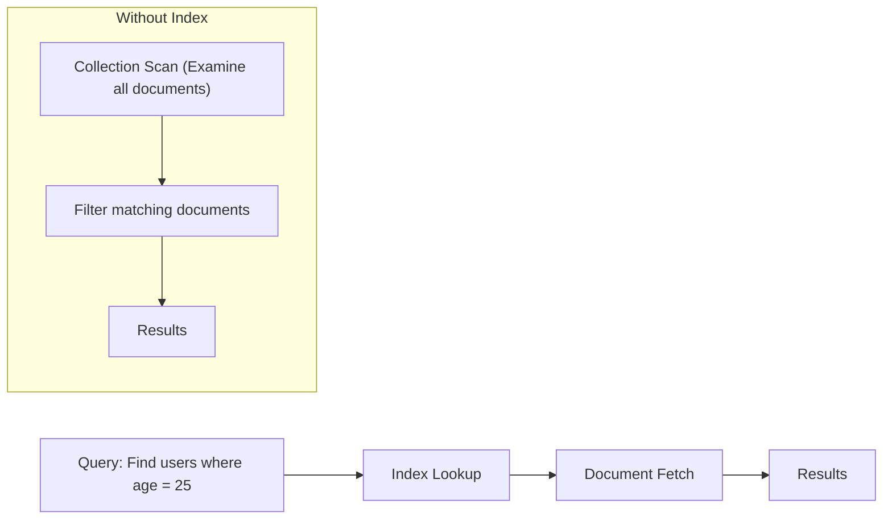

# MongoDB Index Basics

## Introduction

When working with MongoDB databases, you'll eventually reach a point where query performance becomes crucial. This is where **indexes** come into play - they're one of the most powerful tools for improving database performance.

Think of indexes like the index at the back of a book. Rather than flipping through every page to find information on a specific topic, you can check the index first to quickly locate what you're looking for. Similarly, MongoDB indexes provide the database engine with an efficient way to locate documents without scanning every document in a collection.

In this tutorial, we'll explore MongoDB indexes from the ground up, understanding how they work and how to use them effectively.

## What Are MongoDB Indexes?

MongoDB indexes are special data structures that store a small portion of a collection's data in an easy-to-traverse form. They contain ordered references to documents, allowing MongoDB to efficiently locate and retrieve specific documents without having to scan every document in a collection.

Without an index, MongoDB must perform a **collection scan** - examining every document in a collection to find those that match the query statement. As your data grows, these scans become increasingly expensive and time-consuming.

## How Indexes Work in MongoDB

When you create an index in MongoDB, the database maintains an ordered list of values from the indexed fields along with pointers to the original documents.



The default index in MongoDB is the `_id` index, which is created automatically when a collection is created. This ensures each document has a unique identifier.

## Types of MongoDB Indexes

MongoDB supports several types of indexes:

1. **Single Field Index**: Index on a single field of a document
2. **Compound Index**: Index on multiple fields
3. **Multikey Index**: Index on array fields
4. **Geospatial Index**: Index for geospatial coordinate data
5. **Text Index**: Index for text search
6. **Hashed Index**: Index that hashes the values of a field

For this basic tutorial, we'll focus on single field and compound indexes.

## Creating Your First Index

Let's start with a practical example. Imagine we have a collection of users:

```javascript
// Sample user document
{
  _id: ObjectId("5f8d0d55b54764153c1e47bb"),
  username: "john_doe",
  email: "john@example.com",
  age: 28,
  city: "New York",
  active: true,
  joinDate: ISODate("2020-10-15")
}
```

### Single Field Index

If we frequently search for users by their username, creating an index on the `username` field will improve query performance:

```javascript
db.users.createIndex({ username: 1 })
```

The `1` indicates an ascending index. You can use `-1` for a descending index.

The output would be something like:

```
{
  "createdCollectionAutomatically": false,
  "numIndexesBefore": 1,
  "numIndexesAfter": 2,
  "ok": 1
}
```

Now, when we run a query like this:

```javascript
db.users.find({ username: "john_doe" })
```

MongoDB will use the index to quickly locate the document instead of scanning the entire collection.

### Compound Index

If you often search for users by both city and age, a compound index would be more efficient:

```javascript
db.users.createIndex({ city: 1, age: 1 })
```

This creates an index that first sorts by city, then by age within each city. It's useful for queries that filter on both fields, or just the first field in the index.

## Viewing Existing Indexes

To see the indexes in a collection, use:

```javascript
db.users.getIndexes()
```

The output might look like:

```javascript
[
  {
    "v": 2,
    "key": { "_id": 1 },
    "name": "_id_"
  },
  {
    "v": 2,
    "key": { "username": 1 },
    "name": "username_1"
  },
  {
    "v": 2,
    "key": { "city": 1, "age": 1 },
    "name": "city_1_age_1"
  }
]
```

## Understanding Index Performance

Let's see how indexes improve performance. First, let's create a sample collection with many documents:

```javascript
// Create a test collection with 100,000 documents
for (let i = 0; i < 100000; i++) {
  db.performance_test.insertOne({
    user_id: i,
    username: "user_" + i,
    score: Math.floor(Math.random() * 100)
  });
}
```

Now, let's run a query without an index and examine its performance:

```javascript
db.performance_test.find({ score: 50 }).explain("executionStats")
```

This will output detailed statistics about the query execution. Look for `executionStats.totalDocsExamined` - it should be close to 100,000, meaning MongoDB had to scan almost all documents.

Now, let's create an index and run the same query:

```javascript
db.performance_test.createIndex({ score: 1 })
db.performance_test.find({ score: 50 }).explain("executionStats")
```

The `totalDocsExamined` should now be much lower - only examining the documents that actually match the query.

## When to Use Indexes

Indexes significantly improve query performance, but they come with costs:

1. Each index requires additional disk space
2. Indexes must be updated when documents are modified, potentially slowing down write operations
3. Too many indexes can negatively impact performance

Good candidates for indexing:

- Fields frequently used in queries 
- Fields used for sorting
- Fields used in range queries
- Fields frequently used in aggregation operations

## Practical Index Strategies

### Strategy 1: Cover Your Queries

A **covered query** is a query where all the fields in the query are part of an index, and all the fields returned are part of the same index. These queries are extremely efficient since MongoDB can satisfy them using only the index without looking up the actual documents.

```javascript
// Create an index that includes fields we want to query and return
db.products.createIndex({ category: 1, price: 1, name: 1 })

// This query can be covered by the index above
db.products.find(
  { category: "electronics", price: { $gt: 500 } },
  { category: 1, price: 1, name: 1, _id: 0 }
)
```

### Strategy 2: Use Compound Indexes Wisely

When creating compound indexes, consider the order of fields. MongoDB can use an index for queries that contain a prefix of the indexed fields.

For example, an index on `{ a: 1, b: 1, c: 1 }` can support queries on:
- `{ a: 1 }`
- `{ a: 1, b: 1 }`
- `{ a: 1, b: 1, c: 1 }`

But not efficiently on:
- `{ b: 1 }`
- `{ c: 1 }`
- `{ b: 1, c: 1 }`

Generally, you should order the fields in a compound index from:
1. Equality fields (exact match fields)
2. Sort fields
3. Range fields

### Strategy 3: Use the Explain Method

The `explain()` method is your best friend when working with indexes. It shows you how MongoDB executes your queries and whether it's using indexes effectively:

```javascript
db.users.find({ age: { $gt: 25 } }).explain("executionStats")
```

Look for:
- `COLLSCAN` - Collection scan (no index used)
- `IXSCAN` - Index scan (good!)
- `totalDocsExamined` - How many documents MongoDB had to look at
- `executionTimeMillis` - How long the query took

## Removing Indexes

If you no longer need an index, you can remove it:

```javascript
// Remove a specific index
db.users.dropIndex({ username: 1 })

// Remove all indexes except the _id index
db.users.dropIndexes()
```

## Common Index Types for Specific Use Cases

### Text Indexes for Full-Text Search

```javascript
// Create a text index on the "description" field
db.products.createIndex({ description: "text" })

// Search for products containing specific words
db.products.find({ $text: { $search: "wireless headphones" } })
```

### Geospatial Indexes for Location Data

```javascript
// Create a 2dsphere index for GeoJSON data
db.places.createIndex({ location: "2dsphere" })

// Find places near a point
db.places.find({
  location: {
    $near: {
      $geometry: {
        type: "Point",
        coordinates: [-73.9667, 40.78]
      },
      $maxDistance: 5000  // in meters
    }
  }
})
```

## Summary

MongoDB indexes are essential tools for improving database performance. They work by creating ordered lists of values that MongoDB can quickly search through, rather than having to scan every document in a collection. Key points to remember:

- Indexes dramatically improve read performance but slightly affect write performance
- The default `_id` index is created automatically
- Single field indexes speed up queries on one field
- Compound indexes help with queries on multiple fields
- Indexes consume disk space and memory
- Use `explain()` to analyze query performance
- Create indexes for fields frequently used in queries or sorts
- Be strategic about creating indexes - don't create indexes you don't need

## Additional Resources

- [MongoDB Official Documentation on Indexes](https://docs.mongodb.com/manual/indexes/)
- [MongoDB University: Free MongoDB Courses](https://university.mongodb.com/)
- [MongoDB Compass: Visual Tool for Index Management](https://www.mongodb.com/products/compass)

## Exercises

1. Create a collection called `exercise_products` with 1000 documents containing fields for `name`, `category`, `price`, and `inStock`.
2. Run a query to find all products in the "electronics" category with a price less than $100, and measure its performance.
3. Create an appropriate index for this query and run it again. Compare the performance.
4. Create a compound index that would help with sorting products by category and then by price.
5. Use the `explain()` method to verify your index is being used correctly.

Remember that mastering MongoDB indexes takes practice. Start with simple indexes, measure their impact, and gradually build your understanding of more complex indexing strategies.